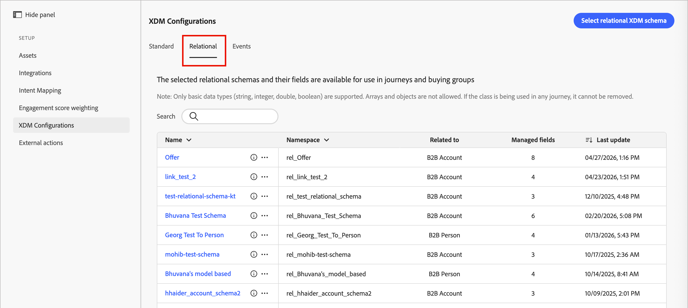
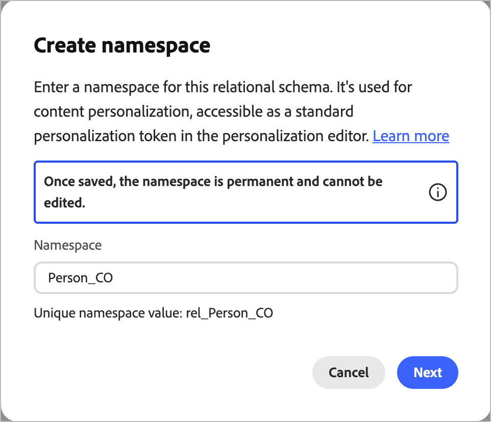
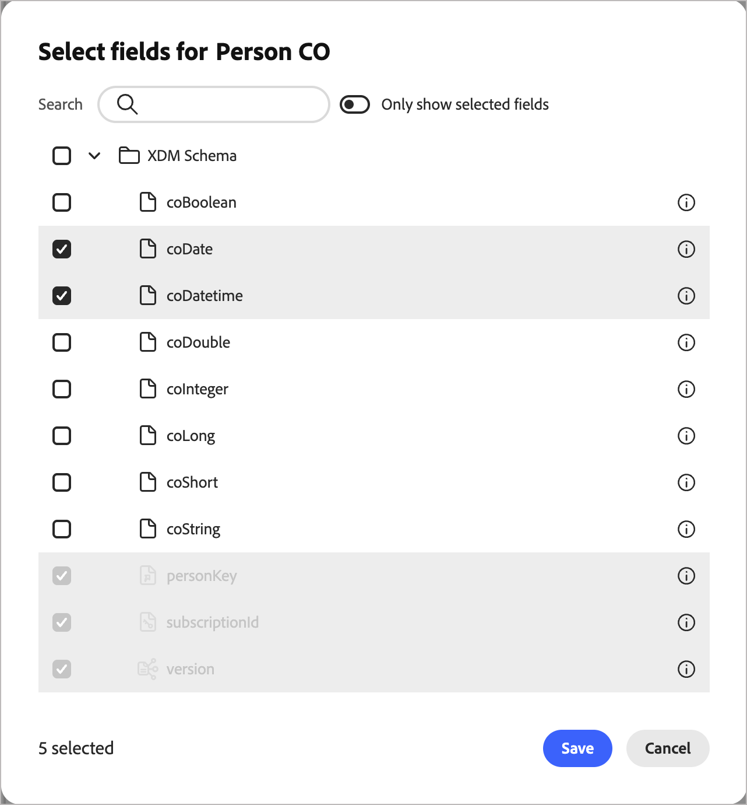

# XDM フィールド管理

エクスペリエンスデータモデル（XDM）フィールドは、[!DNL Journey Optimizer B2B Edition] アプリケーションにデータを提供するスキーマ要素です。 XDM フィールドを、ジャーニーノード、購入グループのフィルターおよび制約として、またメールのパーソナライゼーションや条件付きコンテンツなどのコンテンツ機能に使用します。

スキーマは、標準 XDM クラスに基づいてフィールドを定義します。 標準 XDM クラスには、個人プロファイル、ビジネスアカウント、エクスペリエンスイベントが含まれます。 リレーショナルスキーマは、従来のリレーショナルデータベースと同様に、構造化データをモデル化できるフィールドも定義します。

Adobe Experience Platform（AEP）スキーマには、通常、複雑な階層に多数のフィールドが含まれています。 XDM スキーマツリーのトラバースには時間がかかります。 XDM フィールド管理は、ジャーニー、購入グループ、パーソナライゼーションに関連するフィールドのみを表示することで、フィールド選択を効率化します。  管理者は、これらのフィールドをJourney Optimizer B2B editionで使用できるようにします。読み取り専用または編集可能なフィールドも含まれます。

XDM を理解し、データエンジニアや B2B 顧客データプラットフォーム（CDP）データモデリングの関係者と共同作業する管理者は、次の手順を使用して [!DNL Journey Optimizer B2B Edition] 用の XDM クラスを設定する必要があります。

## XDM クラスへのアクセス

1. 左側のナビゲーションで **[!UICONTROL 管理]**/**[!UICONTROL 設定]** を選択します。

1. 中間パネルの **[!UICONTROL XDM クラス]** をクリックします。

   * 「**[!UICONTROL 標準]**」タブと「**[!UICONTROL リレーショナル]**」タブを使用して新しいフィールドを追加し、Journey Optimizer B2B editionで使用できるようにします。

   * 「**イベント**」タブを使用して、ジャーニーイベントノードに使用する [&#x200B; 特定のAEP エクスペリエンスイベントとその関連フィールドを選択 &#x200B;](./configure-aep-events.md) します。

## フィールドの選択

>[!IMPORTANT]
>
>フィールドの選択は、新しいフィールドを選択するか、不要になったフィールドの選択を解除することで、いつでも更新できます。 このスキーマを使用してジャーニーを公開すると、スキーマ構造がロックされます。 スキーマの削除や名前変更、新しいフィールドの追加、フィールドタイプの変更はサポートされておらず、ジャーニーのエラーが発生する場合があります。

フィールド選択を行う際は、次のガイドラインに従います。

* 新しいフィールドは、スキーマがジャーニーでアクティブに使用された後にのみ追加できます。
* フィールドタイプを削除、名前変更、変更すると、ジャーニー機能の問題が発生する場合があります。 スキーマを操作する場合は注意してください。
* スキーマの名前を変更または削除したり、リレーショナルスキーマのキーを変更したりしないでください。

### 標準クラス

「_[!UICONTROL 標準]_」タブでは、標準クラスの _管理フィールド_ および _更新可能フィールド_ を編集できます。

* 管理されたフィールドは、ジャーニー、購入グループおよびパーソナライゼーション機能に表示されます。
* 更新可能なフィールドは、_アカウントプロファイルを更新_ および _ユーザープロファイルを更新_ ジャーニーノードの制約として機能します。

{width="600" zoomable="yes"}

このリストには、次の 2 つのクラスが含まれています。

* **[!UICONTROL XDM 個人プロファイル]**
* **[!UICONTROL XDM ビジネスアカウント]**

表示されるクラス情報には、次のものが含まれます。

* 管理フィールドの数
* 更新可能なフィールドの数
* 最終更新時間

結合スキーマからフィールドを選択するには、クラス名をクリックして、管理フィールド選択ダイアログを開きます。 または、_詳細メニュー_ （**...**）をクリックします アイコンをクリックし、管理済みフィールドと更新可能フィールドのどちらかを選択します。

{width="550" zoomable="yes"}

>[!NOTE]
>
>フィールドを _更新可能_ にする前に、まず _管理_ する必要があります。 選択する _更新可能なフィールド_ は、ユーザー指定のスキーマに存在する必要があります。 システム定義フィールドを除き、スキーマに必須フィールドを含めることはできません。

#### 管理フィールド

**[!UICONTROL 管理フィールド]** を選択すると、_フィールドの選択_ ダイアログに設定可能なすべてのフィールドが表示されます。

1. 各 XDM クラスに最大 100 個のフィールドを選択します。

   「_[!UICONTROL 検索]_」フィールドを使用して、表示されたリストを名前でフィルタリングします。 **[!UICONTROL 選択したフィールドのみを表示]** スライダーを使用して、現在の選択を確認します。

   {width="450" zoomable="yes"}

1. 「**[!UICONTROL 保存]**」をクリックして、選択を確定します。

#### 更新可能なフィールド

更新可能フィールドを設定し、**[!UICONTROL アカウントプロファイルを更新]** または **[!UICONTROL 人物プロファイルを更新]** ジャーニーアクションを通じて変更できるフィールドを選択します。

更新可能なフィールドを設定する前に、カスタムデータセットに存在する必要があります。 カスタムデータセットワークフローの説明については、[&#x200B; データセットの作成とデータの取り込み &#x200B;](https://experienceleague.adobe.com/ja/docs/journey-optimizer-learn/tutorials/data-management/create-datasets-and-ingest-data#){target="_blank"} および **[!UICONTROL スキーマからデータセットを作成]** オプションの使用を参照してください。 このデータセットは、更新可能なフィールドを分離するために使用されます。 更新可能なすべてのフィールドは、このデータセットに含める必要があります。

>[!IMPORTANT]
>
>更新可能なフィールドのガードレール：
>
>* スキーマ – スキーマでは、B2B ユーザーのプライマリ ID （`b2b.personKey.sourceKey`）を使用する必要があります。 XDM Individual Profile クラスでは、スキーマ内の必須フィールドは、`identityMap`や`personID`などのシステム定義である必要があります。
>* データセット – 既に別の目的で使用されているデータセットを使用しないでください。 ベストプラクティスとして、更新可能なフィールドを保存するための専用のデータセットを作成します。 XDM クラスごとに個別のデータセットを使用します。

個人プロファイル用のデータセットとビジネスアカウント用のデータセットを 1 つずつ作成します。 設定プロセス中に新しいデータセットをそれぞれ選択します。

1. **[!UICONTROL データセット]** については、作成した新しいデータソースを選択します。

1. 選択したデータセットからフィールドを選択します。

   {width="450" zoomable="yes"}

1. 「**[!UICONTROL 保存]**」をクリックして変更を適用します。

### リレーショナルスキーマ

リレーショナルスキーマを使用すると、カスタムデータクラスを作成できます。 複数のデータセットにアクセスできるので、データのニーズに合わせてカスタマイズされたクラスを作成できます。 購入、ライセンス、イベント登録などのビジネスエンティティの関係スキーマを、ジャーニーの意思決定やメールのパーソナライズに使用できます。 1つのスキーマにつき、最大20個のスキーマと最大50個のフィールドを選択できます。

設定されたリレーショナルスキーマとフィールドの使用をサポートする機能は複数あります。

* [コンテンツのパーソナライゼーション](../content/personalization.md#custom-datasets)
* [ジャーニー決定（分割パス）](../journeys/split-merge-paths-nodes.md#custom-data-filtering)
* [購買グループの役割](../buying-groups/buying-groups-role-templates.md#add-the-template-roles) （B2B関係者のみ）

>[!AVAILABILITY]
>
>[&#x200B; リレーショナルスキーマ &#x200B;](https://experienceleague.adobe.com/ja/docs/experience-platform/xdm/schema/relational#)は、[!DNL Journey Optimizer B2B Edition]に対して限定的な可用性リリースとして使用できます。 Data Mirrorおよびリレーショナルスキーマは、ライセンス所有者 [!DNL Journey Optimizer Orchestrated Campaigns] 利用できます。 リレーショナルスキーマは、ライセンスと機能のイネーブルメントに応じて、[!DNL Customer Journey Analytics] ユーザー向けの限定リリースとしても利用できます。 アクセスについては、Adobe担当者にお問い合わせください。

>[!NOTE]
>
>この機能は現在、アカウント関連および人物関連のカスタムオブジェクトのユースケースをサポートしており、今後、標準のオブジェクトのユースケースをさらにサポートする予定です。

スキーマエディターを使用してリレーショナルスキーマを作成できます（左側のナビゲーションで **[!UICONTROL データ管理]**/**[!UICONTROL スキーマ]** に移動します）。

>[!BEGINSHADEBOX]

**スキーマ要件**

[!DNL Journey Optimizer B2B Edition]で使用するスキーマを作成する場合は、次の設定値が必要です。

* 動作：レコード
* セグメント化：有効
* 関係タイプ：多対 1
* 参照スキーマ：[B2B アカウント &#x200B;](https://experienceleague.adobe.com/ja/docs/platform-learn/tutorials/schemas/create-schemas-for-b2b-data)
* 必須フィールド：プライマリキー、外部キー、バージョン記述子
* 関連するデータセット：スキーマに定義およびマッピングされる

>[!ENDSHADEBOX]

[!DNL Journey Optimizer B2B Edition] で使用するリレーショナルスキーマフィールドを選択する手順は次のとおりです。

1. 「**[!UICONTROL リレーショナル]**」タブを選択して、スキーマを表示します。

   {width="600" zoomable="yes"}

1. 「**[!UICONTROL リレーショナル XDM スキーマを選択]**」をクリックします。

   >[!NOTE]
   >
   >このベータ版機能リリースでは、_アカウントおよび人物の多対 1 カスタムオブジェクト_ のみがサポートされています。

1. リレーショナルスキーマを選択して、「**[!UICONTROL 次へ]**」をクリックします。

   {width="500" zoomable="yes"}

1. 名前空間を入力するか、デフォルトの名前空間を使用します。 「**[!UICONTROL 次へ]**」をクリックします。

   名前空間は 1 回だけ設定でき、このアクションを元に戻すことはできません。

   {width="400" zoomable="yes"}

1. リレーショナルスキーマフィールドを確認します。

   _情報_  アイコンをクリックして、フィールドメタデータを表示します。

1. ジャーニーおよびパーソナライゼーション用に有効にするフィールドを選択します。

   プラットフォームは、次の必須フィールドを自動的に選択します。

   * 外部キー
   * プライマリキー
   * バージョン記述子

   「_[!UICONTROL 検索]_」フィールドを使用して、表示されたリストを名前でフィルタリングします。 **[!UICONTROL 選択したフィールドのみを表示]** スライダーを使用して、現在の選択を確認します。

   {width="500" zoomable="yes"}

1. 「**[!UICONTROL 保存]**」をクリックします。
