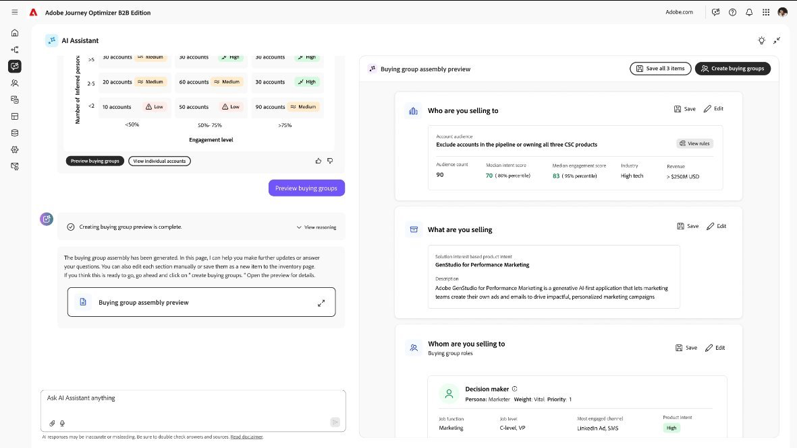

# Audience Agent B2B

[Adobe Experience Platform Agent Orchestrator](https://experienceleague.adobe.com/ja/docs/experience-cloud-ai/experience-cloud-ai/agents/agent-orchestrator)を搭載したAudience Agent B2Bは、Journey Optimizer B2B editionで利用できます。 このエージェントを使用すると、オーディエンスの探索と拡張、購買グループの作成の加速、ジャーニーのアクティブ化のためのシームレスなワークフローの効率性と効果が向上します。

* **_インテント別にターゲットオーディエンスを優先順位付け_**：様々なオーディエンスの製品インテントに基づいてペルソナを推測し、キャンペーン計画を合理化して、オーディエンスの検証にかかる時間を削減します。

* **_AIを活用して購買グループを検出および作成する_**: AI、構造化データ、非構造化データ、統合ファーストパーティデータを使用して、購買グループの発見と作成を合理化します。

{width="700" zoomable="yes"}

>[!PREREQUISITES]
>
>Audience Agent B2Bを使用するには、次のデータ定義とマッピングが必要です： 
>
>* [&#x200B; インテント データ分類/マッピング &#x200B;](../admin/intent-data.md)
>* [XDM フィールド分類/マッピング &#x200B;](#xdm-data-prerequisites)

## Audience Agent B2B機能

| エリア | 機能 | ビジネス価値 |
| ---- | ------------ | -------------- |
| インテント分析 | <li> 特定の製品に対するアカウントの意図の強さ（低、中、高など）を測定します。 <li>製品の関心の傾向を経時的に比較します（過去&#x200B;_n_&#x200B;日間の上位の製品など）。 <li>特定の製品に対する関心を積極的に示しているアカウントを特定する。 <li>アカウントのアクティビティとペルソナのカバー範囲を組み合わせたエンゲージメントパターンを表示します。 | <li>適切なアカウントにタイミングよく注力。 <li>本物の購入シグナルを持つアカウントに優先順位を付けることで、パイプラインの品質を向上させます。 <li>競合他社が行動を起こす前にプロアクティブなエンゲージメントを可能にします。 |
| ペルソナマッピング | <li>製品の意図によって、上位のペルソナを検出し、ランク付けします。 <li>1つまたは複数の製品の購入に関与するペルソナを特定します。 <li>ペルソナを、機能的な役割（_Champion_、_Decision Maker_、_インフルエンサー_&#x200B;など）に位置付けてマッピングします。 <li>特定の人物がチャンピオンと見なされる理由を検証します。 | <li>営業部門は、真の意思決定者やインフルエンサーとエンゲージすることができます。 <li>効果の低いコンタクトへの無駄な労力を減らします。 <li>購買力の動向に合わせてアウトリーチをおこない、成約率を向上。 |
| 購買グループの評価 | <li>購買グループのサイズを評価します（例：_n_&#x200B;人を超えるグループ）。 <li>アカウント全体でペルソナのカバー率を測定します（例：_x_%未満）。 <li>購買グループ内の役割の分布とカバーされていない部分を追跡。 <li>最近購入した顧客が特定されたアカウントをハイライト表示できます。 | <li>取引を停滞させる可能性のあるカバー不足を明らかにする。 <li>完全なロール表現を確保することで、マルチスレッド戦略を強化します。 <li>グループレベルのエンゲージメントインサイトにより、取引の健全性を追跡することを改善します。 |
| 購買グループの作成とアクショナビリティ | <li>観察されたペルソナと役割パターンにもとづいて、役割とペルソナのマッピングをレコメンドします。 <li>指定した製品の購買グループの役割テンプレートを生成します。 <li>特定のペルソナや役割を含めたり除外したりすることで、テンプレートのカスタマイズをサポートします。 <li>購買グループを作成する前に、必要な役割が定義されていることを検証します。 | <li>購買グループのテンプレートが不完全になる手作業やリスクを低減します。 <li>役割のカバー範囲が作成前に検証され、カバーされていないリスクを軽減します。 <li>分析インサイトを即座の実用的な次のステップに変える。 |

## 制限事項

Audience Agent B2Bは、設定されたインテント分類法、XDM フィールドマッピング、エクスペリエンスイベントデータを基盤としています。 機会データが不完全であったり、意図する分類法が存在しないか古かったり、必要なプロファイルやアカウント識別子がマッピングされていなかったりすると、インサイトの信頼性が低下します。 インテント計算の場合、エージェントは次のエクスペリエンスイベントのみを処理します：`directMarketing.emailClicked`、`directMarketing.emailOpened`、`directMarketing.emailUnsubscribed`、および`web.webpagedetails.pageViews`。

## プロンプトの例

次のプロンプトサンプルは、エージェントを使用する方法の一部を示しています。

* トレンドウィンドウを表示：製品ごとのアカウント製品インテントの最新および最新の更新。
* `<product>`の場合、製品の意図とスコアを使用して購買グループをリスト化します。
* `<product>`の場合、ペルソナと役割を商談指標（成約率、メンバーシップ率、カウント）でリストアップします。
* `<industry>`のアカウントの場合、`<product>`の平均アカウントペルソナのカバー範囲は何ですか？
* どのアカウントでも商品の購買意欲は低いものの、まだ商談を開いている（ナーチャリングする価値がある）のでしょうか？
* 今週`<account_name>`の新しいインテントシグナルを追加したアカウントはどれですか？
* `<product>`に関連するペルソナを表示します。
* `<product>`のペルソナマッピングの推奨事項への役割を表示します。
* `<product>`の購買グループテンプレートを作成します。
* `<persona>` ペルソナを使用せずに`<product>`の購買グループテンプレートを作成し、`<role>`の役割を削除します。

## 概念

| 概念 | 説明 |
| ------- | ----------- |
| オーディエンス検出 | 担当者は、舞台裏で、顧客とのエンゲージメントと、顧客が表すペルソナの種類という2つのことに基づいて、ファーストパーティのインテントシグナルを確認します。 分析では、過去18 ヶ月間のアクティビティを振り返り、特に商談成立に至るまでのアカウント内の全員の製品インテントを検出します。 この分析は、エージェントが契約に影響を与える可能性が最も高いペルソナを特定するのに役立ちます。   アカウントが完全な形の商談データを持っていない場合があります。これは問題なく、担当者は引き続きエンゲージメントパターンから製品の意図を純粋に検出できます。 |
| ペルソナ | ペルソナは、アカウントに関与する人物のタイプを表します。 担当者は、役職、機能、年功レベルを確認し、それらの情報を正規化して、さまざまなアカウントをまたいで一貫性を持たせることで、これらの役職と役職を構築します。 これにより、時間のかかるタイトルに埋もれてしまうことなく、意思決定者やインフルエンサー、サポート担当者にリーチしているかどうかをすばやく確認できます。 ペルソナは、興味を示しているオーディエンスを把握するのに役立ちます。 |
| 購買グループの役割のマッピング | ペルソナを役割にマッピングしたら、購買グループに編成します。購買に影響を与えたり、決定したりする可能性が最も高いアカウント内の完全なチームを指します。 各役割（_意思決定者_、_インフルエンサー_、_チャンピオン_&#x200B;など）は、画像の一部を追加するので、契約を推進する委員会を明確に把握できます。  担当者は、特定のペルソナごとに、役職、役職、年功などの設定した属性にもとづいて、特定の製品で最も利用しやすい役割を割り当てます。 また、各役割のカバー率を示すことで、どの役割が適切に代表されているか、またエンゲージメント戦略のどこにギャップがあるかを確認することができます。 |
| 商談データを使用したペルソナの検出 | 誰がエンゲージし、誰が興味を持っているのかを最も正確に把握するために、次の項目に従ってペルソナのランキングと製品の意図にアプローチします。 <ul><li>最適なケースのシナリオ：_商談ステージ_、_商談終了日_、明確な&#x200B;_商談と製品のマッピング_&#x200B;などのデータを提供できる場合、担当者は自信を持って製品ごとのペルソナをランク付けできます。<li>このランキングは、アカウント全体のエンゲージメントと関心を正確に把握するのに役立ちます。 </ul>しかし、担当者は、データが必ずしも完全ではなく、大丈夫であることを知っています。 これには、作業を円滑に進めるためのスマートフォールバックも含まれます。<ul><li>エージェントはアクティビティの量を分析し、時間減衰を使用して最近のアクティビティにより多くの重みを与えます。<li>この重み付けにより、完全な商談データがなくても、エージェントはペルソナを区別し、ランク付けすることができます。 </ul>オポチュニティを製品にリンクする場合、担当者は次のように対応します。<ul><li>_理想的な_: エージェントがマッピングテーブルを作成する際に提供または支援を行います。<li>_使用できない場合_：エージェントはファジーマッチングを使用してドットを接続します。<li>_リンクがまったくありません_：担当者は、クローズ日より前の最近のアクティビティに基づいて製品の意図を推測します。</ul>この階層化されたアプローチにより、データが完璧でない場合でも、担当者は有意義なインサイトを提供できます。 |
| 機会分析 | 担当者は、過去の商談データを検証し、商談の最も強力な予測要因を把握します。具体的には、次の3つの重要な要素を使用します。<ol><li>成約率：特定のペルソナが関与した場合に、成約に至った頻度を示します。 特定のペルソナパターンを持つアカウント（技術評価者や副社長の意思決定者など）のコンバージョン率が高い場合、そのパターンに対する貢献度が高くなります。 この情報は、成約した商談や獲得した商談など、商談の合計数に対する割合です。<li>メンバーシップ率：特定の製品に対してペルソナタイプが機会をまたいで表示される頻度を測定します。 一定のペルソナが案件に継続的に登場している場合は、購入プロセスにおいて重要な役割を果たしていることを示しています。<li>ペルソナの影響度：あるペルソナがその場にいるかどうかだけでなく、そのペルソナのエンゲージメントやアクティビティレベルが成約にどの程度貢献しているのかを定量化します。</ol>これらのシグナルを組み合わせることで、商談データが不完全な場合でも、どのペルソナが購買の成果に最も強い影響を与えるのかを推測することができます。 Adobe Marketo Engageを利用すれば、案件の成功を予測する最も効果の高いペルソナやパターンを継続的に特定し、アカウントの意図、ペルソナマッピング、購買グループのレコメンデーションに活用できます。 |
| 目的 | 誰かがweb ページにアクセスしたり、製品に関連する電子メールリンクをクリックしたりすると、その人が興味を持っていることを示すシグナルであり、これは&#x200B;_インテント_&#x200B;と呼ばれます。  担当者は分類で始まります。これは、基本的に顧客の製品とそれらを説明するキーワードのリストです。 この情報は、担当者がコンテンツやインタラクションの各部分を理解するのに役立ちます。  次に、担当者はその分類法を使用して、訪問者の行動がどのキーワードや製品に関連しているかなど、訪問者の行動にラベルを付けます。  次に、担当者は、訪問したページの数やインタラクションの頻度など、誰かがどの程度エンゲージメントしているかを調べます。 この情報を利用して、特定のキーワード、製品、製品カテゴリーに対する顧客の個々のインテントスコアを計算します。 各インテントスコアを&#x200B;_High_、_Medium_、または&#x200B;_Low_&#x200B;のインテントにグループ化し、関心の強さを示します。 （Low intent: `<=0.2`, Medium intent: `0.2 < score <= 0.6`, High intent: `0.6 < score <= 1`）   最後に、エージェントは同じ会社（アカウント）のすべてのユーザーのインテントスコアを組み合わせて、全体的なアカウントレベルのインテントを表示し、会社が最も関心を持っていると思われる商品やトピックを示します。 |
| 購買グループに影響を与える役割 | 各購買グループは、_意思決定者_、_インフルエンサー_、_チャンピオン_、_エンドユーザー_&#x200B;など、購買決定に異なる役割を果たす役割で構成されます。 それぞれの役割には、さまざまな程度のインパクトがあります。  意思決定者が最も大きな影響力を持ち、通常は予算の承認を管理します。 インフルエンサーが評価とレコメンデーションを決定。 経営陣は社内の意見をまとめ、エンドユーザーは製品の適合性を検証します。  担当者は、これらの役割を表示することで、購買決定を推進しているユーザー、エンゲージメントが最も強いユーザー、およびカバーされていないユーザーを把握するのに役立ちます。 この情報により、この製品にとって最も重要な役割に集中することができます。 |
| ペルソナや役割のカバー | 特定の製品には、通常、購入に影響を与えることが知られている主要な役割とペルソナのセットが存在します（_N_&#x200B;個のペルソナまたは役割）。  担当者は、各アカウントについて、_N_&#x200B;個の役割のうち、そのアカウント内の少なくとも1人が表している数を確認することで、カバー率を計算します。  すべての&#x200B;_N_&#x200B;の役割が存在する場合、アカウントは完全にカバーされています。 一部の役割のみを表す場合、カバレッジは部分的になります。  役割とペルソナのカバー範囲は、重要な意思決定者、インフルエンサー、チャンピオンがすべて含まれているかどうかに基づいて、製品の購買グループがどの程度完成しているかを測定します。 |

## XDM データの前提条件

Audience Agentは、商品に対するファーストパーティの意図を示すアカウントに関するインサイトを提供し、定義されたデータにもとづいてペルソナと役割を計算します。 Audience Agent機能を使用するように、次の前提条件データが設定されていることを確認します。

### XDM フィールドマッピング

<table>
  <tbody>
    <tr>
      <th>XDM フィールド</th>
      <th>エンティティ</th>
      <th>ビジネス定義</th>
      <th>追加詳細</th>
    </tr>
    <tr>
      <td>
        

          b2b.accountKey.sourceKey
        

      </td>
      <td>
        

          プロファイル
        

      </td>
      <td>アカウント識別子。商談、イベント、インテントデータの結合に使用されます</td>
      <td rowspan="2">商談分析  アカウント探索 
         
      </td>
    </tr>
    <tr>
      <td>
        

          b2b.personKey.sourceKey
        

      </td>
      <td>
        

          プロファイル
        

      </td>
      <td>人物ID。イベントデータからプロファイルデータへの結合に使用されます</td>
    </tr>
    <tr>
      <td>
        

          extendedWorkDetails.departments
        

      </td>
      <td>
        

           プロファイル 
        

      </td>
      <td>プロファイル/人物の担当部署</td>
      <td rowspan="5">
        

           
        

        
ペルソナマッピング

      </td>
    </tr>
    <tr class="">
      <td>
        

          extendedWorkDetails.jobTitle
        

      </td>
      <td>
        

           プロファイル 
        

      </td>
      <td>ペルソナ計算で使用されるプロファイル/人物の役職</td>
    </tr>
    <tr>
      <td>
        

          person.name.firstName
        

      </td>
      <td>
        

          プロファイル
        

      </td>
      <td>ユーザーの名前。条件を満たすとUIに名前を表示するためにAudience Agentで使用されます。</td>
    </tr>
    <tr class="">
      <td>
        

          person.name.fullName
        

      </td>
      <td>
        

           プロファイル 
        

      </td>
      <td>ユーザーのフルネーム。条件を満たすとUIに名前を表示するためにAudience Agentで使用されます。</td>
    </tr>
    <tr class="">
      <td>
        

          person.name.lastName
        

      </td>
      <td>
        

           プロファイル 
        

      </td>
      <td>Audience Agentで使用される人物の姓。条件を満たした場合にUIで名前を表示します</td>
    </tr>
    <tr>
      <td>
        

          accountKey.sourceKey
        

      </td>
      <td>
        

           アカウント 
        

      </td>
      <td>アカウント識別子。商談、イベント、インテントデータの結合に使用されます</td>
      <td>商談分析  アカウント探索</td>
    </tr>
    <tr>
      <td>
        

          accountName
        

      </td>
      <td>
        

          アカウント
        

      </td>
      <td>ユーザークエリで提案された条件を満たすと、UIに表示するためにAudience Agentで使用されるアカウントの名前</td>
      <td rowspan="4">
        

           
        

        

           
        

        

           
        

        
アカウント探索

      </td>
    </tr>
    <tr>
      <td>
        

          accountDescription
        

      </td>
      <td>
        

          アカウント
        

      </td>
      <td>UIのユーザークエリに基づいてアカウントにフィルターを適用するためにAudience Agentで使用されるアカウント/会社の説明 </td>
    </tr>
    <tr>
      <td>
        

          accountOrganization.industry
        

      </td>
      <td>
        

           アカウント 
        

      </td>
      <td>UIでのユーザークエリに基づいてアカウントにフィルターを適用するためにAudience Agentで使用されるアカウント/企業の業界 </td>
    </tr>
    <tr>
      <td>
        

          accountBillingAddress.region
        

      </td>
      <td>
        

           アカウント 
        

      </td>
      <td>UIのユーザークエリに基づいてアカウントにフィルターを適用するためにAudience Agentで使用されるアカウント/会社の請求先住所 </td>
    </tr>
    <tr>
      <td>
        

          accountKey.sourceKey
        

      </td>
      <td>
        

          商談
        

      </td>
      <td>アカウント識別子。商談、イベント、インテントデータの結合に使用されます</td>
      <td rowspan="2">
        
商談分析  アカウント探索

      </td>
    </tr>
    <tr>
      <td>
        

          opportunityKey.sourceKey
        

      </td>
      <td>
        

          商談
        

      </td>
      <td>商談識別子。アカウント データの結合に使用されます</td>
    </tr>
    <tr>
      <td>
        

          opportunityName
        

      </td>
      <td>
        

          件の商談
        

      </td>
      <td>Audience Agentで使用される商談の名前 </td>
      <td rowspan="5">
        

           
        

        

           
        

        

           
        

        

           
        

        

           
        

        
商談分析

      </td>
    </tr>
    <tr>
      <td>
        

          isWon
        

      </td>
      <td>
        

          商談
        

      </td>
      <td>商談が獲得されたかどうか（バイナリ）</td>
    </tr>
    <tr>
      <td>
        

          opportunityDescription
        

      </td>
      <td>
        

          商談
        

      </td>
      <td>Audience Agentで使用される商談の説明 </td>
    </tr>
    <tr>
      <td>
        

          opportunityAmount
        

      </td>
      <td>
        

          商談
        

      </td>
      <td>商談に関係する$の金額</td>
    </tr>
    <tr class="">
      <td>
        

          opportunityType
        

      </td>
      <td>
        

          商談
        

      </td>
      <td>機会の種類</td>
    </tr>
    <tr>
      <td>
        

          opportunityStage
        

      </td>
      <td>
        

          件の商談
        

      </td>
      <td>商談のステージ（成約または成約の失注、または中間ステージ） </td>
      <td rowspan="4">
        
商談分析  アカウント探索

      </td>
    </tr>
    <tr>
      <td>
        

          actualCloseDate
        

      </td>
      <td>
        

          商談
        

      </td>
      <td>商談の実際のクローズ日</td>
    </tr>
    <tr>
      <td>
        

          expectedCloseDate
        

      </td>
      <td>
        

          件の商談
        

      </td>
      <td>商談の予定クローズ日</td>
    </tr>
    <tr>
      <td>
        

          extSourceSystemAudit.createdDate
        

      </td>
      <td>
        

          商談
        

      </td>
      <td>この商談の作成日</td>
    </tr>
  </tbody>
</table>

### 分類データ

Audience Agentでは、Journey Optimizer B2B edition内で検出されたファーストパーティのインテントを活用します。

1. インテント計算には、顧客/分類から分類データ（顧客製品および対応するキーワード）が必要です
1. 分類データは、イベントデータのラベル付けに使用されます（アセットのラベル付け）。 このデータは、イベントデータ/アセットのラベル付けにもとづいて、訪問者が関心を持つキーワードや製品に関するインサイトを提供します 
1. ラベル付きアセット（イベントデータ）を訪問者行動（訪問したページ数）と組み合わせて、キーワード、製品、製品カテゴリーレベル、インテント計算で訪問者の意図→判断します
1. 訪問者プロファイルレベルのインテントスコアは、アカウントレベルで集計され、特定のキーワード、製品および製品カテゴリにおけるアカウントの意図を判断します> インテントアカウント集計

インテント分類法[&#128279;](../admin/intent-data.md)の設定に加えて、次のフィールドが必要です。

<table>
  <tbody>
    <tr>
      <th>XDM フィールド</th>
      <th>エンティティ</th>
      <th>ビジネス定義</th>
    </tr>
    <tr>
      <th>
         
      </th>
      <th>
         
      </th>
      <td>顧客プロファイル</td>
    </tr>
    <tr>
      <td>
        

          _acp_system_metadata.primaryIdentity.namespace.code 
          
        

      </td>
      <td>
        

          プロファイル
        

      </td>
      <td>個人（メールまたはb2b_person） IDの識別に役立ちます</td>
    </tr>
    <tr>
      <td>
        

          _acp_system_metadata.primaryIdentity.id
          
        

      </td>
      <td>
        

          プロファイル
        

      </td>
      <td>namespace_id</td>
    </tr>
    <tr>
      <td>
        <ul>
          <li>keyword_id</li>
          <li>keyword_name</li>
          <li>product_id</li>
          <li>product_name</li>
          <li>product_category_id</li>
          <li>product_category_name</li>
        </ul>
      </td>
      <td>
        

           
        

      </td>
      <td>アセット（クリックされた電子メール、訪問したweb ページなどのエクスペリエンスイベント）にラベルを付けるための分類法として使用</td>
    </tr>
    <tr>
      <td>
        

           タイムスタンプ 
        

      </td>
      <td>
        

           エクスペリエンスイベント 
        

      </td>
      <td>バックフィルと増分実行を取得する時間に使用します</td>
    </tr>
    <tr>
      <td>
        

          eventType
        

      </td>
      <td>
        

           エクスペリエンスイベント 
        

      </td>
      <td>エージェントは4つのイベント （directMarketing.emailClicked、directMarketing.emailOpened、directMarketing.emailUnsubscribed、web.webpagedetails.pageViews） のみを処理するため、イベントのタイプを取得します
      </td>
    </tr>
    <tr>
      <td>
        

          directMarketing.mailingName
        

      </td>
      <td>
        

           エクスペリエンスイベント 
        

      </td>
      <td>参照/簿記のみ。キャンペーン名に関する情報</td>
    </tr>
    <tr>
      <td>
        

          directMarketing.mailingKey.sourceID
        

      </td>
      <td>
        

           エクスペリエンスイベント 
        

      </td>
      <td>参照/ブックマークの場合のみ。電子メールのターゲットとなるソース IDに関する情報</td>
    </tr>
    <tr>
      <td>
        

          directMarketing.mailingKey.sourceInstanceID 
          
        

      </td>
      <td>
        

           エクスペリエンスイベント 
        

      </td>
      <td>参照/ブックマークの場合のみ。電子メールのターゲットとなるソースインスタンスの情報</td>
    </tr>
    <tr>
      <td>
        

          directMarketing.mailingKey.sourceKey 
          
        

      </td>
      <td>
        

           エクスペリエンスイベント 
        

      </td>
      <td>Marketo Engage データセンターからメールコンテンツを取得するために使用されます。これは、（SourceID@SourceInstanceID.SourceType）で構成されます。</td>
    </tr>
    <tr>
      <td>
        

          directMarketing.mailingKey.sourceType 
          
        

      </td>
      <td>
        

           エクスペリエンスイベント 
        

      </td>
      <td>参照/簿記のためのみ。ソースのタイプまたはソースの出所に関する情報 </td>
    </tr>
    <tr>
      <td>
        

          web.webPageDetails 
          
        

      </td>
      <td>
        

           エクスペリエンスイベント 
        

      </td>
      <td>Web ページ訪問ソースのオリジンに関する情報</td>
    </tr>
    <tr>
      <td>
        

          web.webPageDetails.name 
          
        

      </td>
      <td>
        

           エクスペリエンスイベント 
        

      </td>
      <td>コンテンツの取得に使用される実際のURL</td>
    </tr>
    <tr>
      <td>
        

          web.webPageDetails.queryParameters
        

      </td>
      <td>
        

           エクスペリエンスイベント 
        

      </td>
      <td>ターゲットコンテンツの取得に使用するURLの追加クエリパラメーター </td>
    </tr>
    <tr>
      <td>
        

          web.webPageDetails.isPersonalizedURL
        

      </td>
      <td>
        

           エクスペリエンスイベント 
        

      </td>
      <td>参照/簿記のみ</td>
    </tr>
    <tr>
      <td>
        

          web.webPageDetails.webPageKey.sourceID 
          
        

      </td>
      <td>
        

           エクスペリエンスイベント 
        

      </td>
      <td>参照/ブックマークの場合のみ。電子メールのターゲットとなるソース IDに関する情報</td>
    </tr>
    <tr>
      <td>
        

          web.webPageDetails.webPageKey.sourceInstanceID 
          
        

      </td>
      <td>
        

           エクスペリエンスイベント 
        

      </td>
      <td>参照/ブックマークの場合のみ。電子メールの対象となったソースインスタンスに関する情報</td>
    </tr>
    <tr class="">
      <td>
        

          web.webPageDetails.webPageKey.sourceKey 
          
        

      </td>
      <td>
         エクスペリエンスイベント 
      </td>
      <td>参照/簿記のみを目的とし、（SourceID@SourceInstanceID.SourceType）で構成されます。</td>
    </tr>
    <tr>
      <td>
        

          web.webPageDetails.webPageKey.sourceType
        

      </td>
      <td>
         エクスペリエンスイベント 
      </td>
      <td>参照/簿記のみ。ソースのタイプまたはソースの出所に関する情報</td>
    </tr>
    <tr>
      <td>
        

          web.webPageDetails.webPageKey.URL
        

      </td>
      <td>
         エクスペリエンスイベント 
      </td>
      <td>web.webPageDetails.nameにURLがない場合に、実際のURLを取得するために使用します。</td>
    </tr>
  </tbody>
</table>
