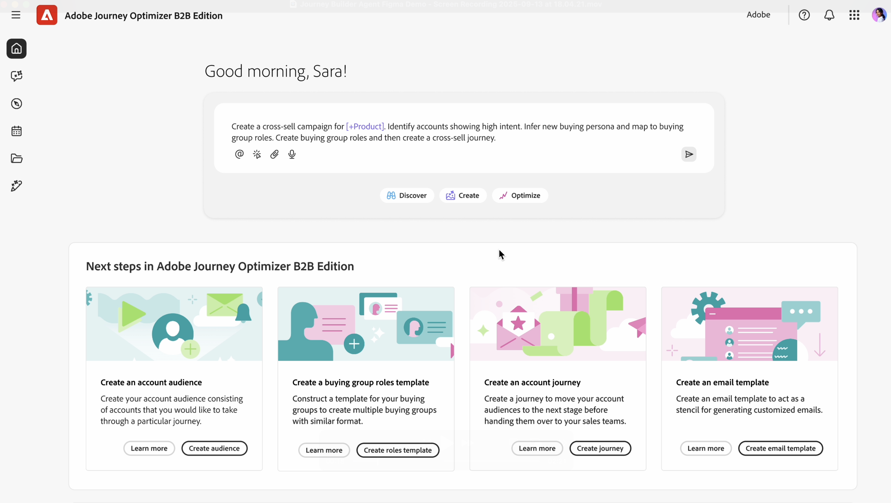

# B2Bジャーニー構築剤

ジャーニービルダーエージェント B2B は、自動化とデータ駆動型の推奨事項を通じて、ジャーニーの設計/作成、実行、最適化を支援する AI エージェントです。 B2B 用ジャーニービルダー Agent は、新しい B2B ジャーニーの作成を自動化し、実行に要する時間を短縮します。

Journey Optimizer B2B editionのJourney Agentは、現在、B2B マーケターが直面している主な課題の 3 つに取り組んでいます。

* ますます複雑になるカスタマージャーニーへの対応（オーディエンス、コンテンツおよびメッセージング、オムニチャネルの複雑さ）
* 予算の引き締まりを踏まえた効率化
* 最適なカスタマージャーニーの構造の把握

Agent Builder ジャーニー B2B Agent を使用すると、ジャーニーを生成および更新できます。

* 作成 – マーケティング目標、製品、エンゲージメント戦略、KPI を、自動化と条件を使用してパーソナライズされたカスタマージャーニーに翻訳する
* レコメンデーション – 過去のマーケティングエンゲージメントやその他の履歴データを活用して、ジャーニーの作成を最適化します
* 最適化 – 予測または実際のパフォーマンスに基づいて、アクティブなジャーニーを分析、調整、最適化します
* 管理 – 重複するジャーニーとメッセージ配信の優先順位付け、管理、調整

## 基本的な使用方法

Journey Agentを使用するには、プロンプトウィンドウに、自然言語を使用して、作成する内容を入力します。

「B2B ジャーニーを作成して、新しいパイプラインを開く可能性が最も高い関与したアカウントのロードショーに意思決定者を招待します。」

提供できる詳細が多いほど、返信は良くなります。 イベントや製品などを説明する既存のマーケティング資料がある場合は、それをプロンプトに貼り付けて、エージェントが目標をよりよく把握できるようにします。

「B2B ジャーニーストラテジストとして行動し、`Solution Name` の初期探索段階で意思決定者やマーケティングのペルソナを育成し惹きつけるマルチステージの顧客アカウントジャーニーを作成します。 匿名訪問者を既知の連絡先に変換し、`domain`.com 上の関連コンテンツとのエンゲージメントを深め、販売アウトリーチのための適切なリードを絞ること `Product Name` 目標としています。 既存のオーディエンスセグメントとコンテンツを活用して、メールや有料メディアなどのチャネルを使用します。 各ステージの明確なトリガー、アクション、目標を使用して、4～6 週間にわたる認識、検討、評価のステージ全体でジャーニーを構築します。 コンバージョン率、エンゲージメントスコア、デモリクエストなどの KPI を含め、出力を構造化されたジャーニーフローとして返します。」

この詳細なプロンプトには、次の情報が表示されます。

* 明確な目的：AI で何をしたいですか？ タスクまたは結果について具体的に説明します。
* コンテキストに富む：関連する背景や制約を提供します。 可能な場合は、例や参照を含めます。
* 構造化形式：箇条書き、番号付き手順、テンプレートを使用します。
* 役割の割り当て：AI の役割を指定します。「データアナリストとして動作…」

エージェントを使用してリファインを繰り返し行います。単純なものから開始し、結果に基づいてプロンプトをリファインします。 フィードバックループにより、結果が時間の経過と共に改善されます。

## テキストファイルやプロンプトからのエンドツーエンド B2B ジャーニーの作成（アカウントまたはユーザーのジャーニー）。

Journey Agentでは、従来のユーザーインターフェイスではなく、対話型エクスペリエンスを通じて、自然言語のテキストプロンプトとメタデータからエンドツーエンドのジャーニーフロー（アカウントジャーニーまたはユーザージャーニー）を生成できます。

エンドツーエンドのジャーニープロンプトの例：

* クロスチャネルジャーニーを作成して、過去 30 日間にコンテンツに関与していないアカウントを育成します。
* 最も重要な購入グループの役割に合わせてパーソナライズされたコンテンツを提供することで、オープンパイプラインを使用せずに、高い意図を示すソリューションをアカウントにクロスセルするジャーニーを作成します。
* B2B ジャーニーを作成して、新しいパイプラインを開く可能性が最も高い関与したアカウントのロードショーに意思決定者を招待します。
* Web サイト上のコンテンツに関与する人々に焦点を当て、私のソリューションを目的としたホワイトスペースアカウントのジャーニーを作成します。

## 複数ステージのジャーニー

B2B ジャーニーデザイナーとして機能して、探索段階の初期に意思決定者やマーケティングのペルソナに通知する複数ステージの顧客アカウントジャーニーを作成できます。
匿名訪問者を既知の連絡先に変換し、関連するコンテンツとのエンゲージメントを深め、販売アウトリーチの対象となる見込み客を絞り込むことを目標としています。

* `Email`、`Paid media`、`Personalized web experiences` などのチャネルを使用して、既存のオーディエンスセグメントとコンテンツを活用します。
* 4～6 週間かけて `awareness`、`consideration`、`evaluation` の各ステージにわたるジャーニーを構築し、各ステージの明確なトリガー、アクション、目標を設定します。
* `conversion rates`、`engagement scores`、`demo requests` などの KPI を含め、構造化されたジャーニーフローとして出力を返します。
