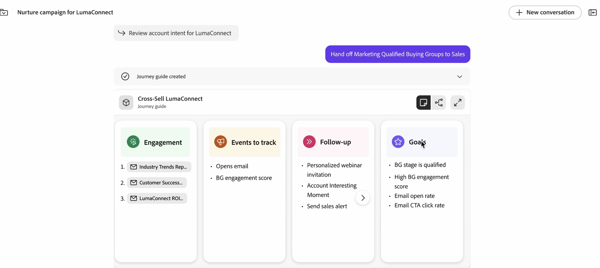

# Journey Agent B2B

Journey Agent B2B は、Adobe Journey Optimizer B2B editionの AI を活用したアシスタントで、自然言語を使用した B2B ジャーニーの設計、実行、最適化およびモニタリングを支援します。 自動化、データに基づくレコメンデーション、リアルタイム観察性を組み合わせることで、カスタマージャーニーの構築と管理に伴う時間と複雑さを軽減します。

Journey Agent B2B は、B2B ジャーニーライフサイクルの異なる側面に焦点を当てた一連の AI スキルを提供します。 現在利用できるスキルは次のとおりです。

* **[ジャーニー構築スキル](#journey-build-skill)** – 自然言語プロンプトからジャーニーを作成、更新、最適化します
* **[ジャーニーの観察性スキル](#journey-observability-skill)** - アクティブなジャーニーを進める中でアカウントやユーザーがどのように動いているかについて質問します

## ジャーニー構築スキル

ジャーニー構築スキルは、マーケティング目標、エンゲージメント戦略、KPI を B2B カスタマージャーニー全体に変換します。 現在、B2B マーケターが直面している 3 つの主な課題に取り組んでいます。

* ますます複雑になるカスタマージャーニーへの対応（オーディエンス、コンテンツとメッセージング、オムニチャネルの複雑さ）
* 予算の引き締まりを踏まえた効率化
* 最適なカスタマージャーニーの構造の把握

マーケターは、このスキルを使用して以下を行えます。

* **作成** - マーケティング目標、製品、エンゲージメント戦略、KPI を、自動化と条件を使用してパーソナライズされたカスタマージャーニーに翻訳します
* **推奨** – 過去のマーケティングエンゲージメントとその他の履歴データを活用して、ジャーニーの作成を最適化します
* **最適化** – 予測または実際のパフォーマンスに基づいて、アクティブなジャーニーを分析、調整、最適化します
* **管理** – 重複するジャーニーとメッセージ配信の優先順位付け、管理、調整します

### 基本的な使用方法

Journey Agentのビルドスキルを使用するには、プロンプトウィンドウに、自然言語を使用して、作成するものを入力します。

「B2B ジャーニーを作成して、新しいパイプラインを開く可能性が最も高い関与したアカウントのロードショーに意思決定者を招待します。」

提供できる詳細が多いほど、返信は良くなります。 イベントや製品などを説明する既存のマーケティング資料がある場合は、それをプロンプトに貼り付けて、エージェントが目標をよりよく把握できるようにします。

「B2B ジャーニーストラテジストとして行動し、`<Solution Name>` の初期探索段階で意思決定者やマーケティングのペルソナを育成し惹きつけるマルチステージの顧客アカウントジャーニーを作成します。 匿名訪問者を既知の連絡先に変換し、`<domain>`.com 上の関連コンテンツとのエンゲージメントを深め、販売アウトリーチのための適切なリードを絞ること `<Product Name>` 目標としています。 既存のオーディエンスセグメントとコンテンツを活用して、メールや有料メディアなどのチャネルを使用します。 各ステージの明確なトリガー、アクション、目標を使用して、4～6 週間にわたる認識、検討、評価のステージ全体でジャーニーを構築します。 コンバージョン率、エンゲージメントスコア、デモリクエストなどの KPI を含め、出力を構造化されたジャーニーフローとして返します。」

この詳細なプロンプトには、次の情報が表示されます。

* **明確な意図**:AI で何をしたいですか？ タスクまたは結果について具体的に説明します。
* **豊富なコンテキスト**：関連する背景や制約を提供します。 可能な場合は、例や参照を含めます。
* **構造化形式**：箇条書き、番号付き手順、テンプレートを使用します。
* **役割の割り当て**:AI の役割を指定します – 「データアナリストとして機能…」

エージェントを使用してリファインを繰り返し行います。単純なものから開始し、結果に基づいてプロンプトをリファインします。 フィードバックループにより、結果が時間の経過と共に改善されます。

### エンドツーエンド B2B ジャーニーの作成

ジャーニービルドスキルでは、従来のユーザーインターフェイスではなく、対話型エクスペリエンスを通じて、自然言語のテキストプロンプトとメタデータからエンドツーエンドのジャーニーフロー（アカウントまたはユーザージャーニー）を生成できます。

エンドツーエンドのジャーニープロンプトの例：

* クロスチャネルジャーニーを作成して、過去 30 日間にコンテンツに関与していないアカウントを育成します。
* 最も重要な購入グループの役割に合わせてパーソナライズされたコンテンツを提供することで、オープンパイプラインを使用せずに、高い意図を示すソリューションをアカウントにクロスセルするジャーニーを作成します。
* B2B ジャーニーを作成して、新しいパイプラインを開く可能性が最も高い関与したアカウントのロードショーに意思決定者を招待します。
* Web サイト上のコンテンツに関与する人々に焦点を当て、私のソリューションを目的としたホワイトスペースアカウントのジャーニーを作成します。

### 複数ステージのジャーニー

B2B ジャーニーデザイナーとして機能して、探索段階の初期に意思決定者やマーケティングのペルソナに通知する複数ステージの顧客アカウントジャーニーを作成できます。
匿名訪問者を既知の連絡先に変換し、関連するコンテンツとのエンゲージメントを深め、販売アウトリーチの対象となる見込み客を絞り込むことを目標としています。

* `Email`、`Paid media`、`Personalized web experiences` などのチャネルを使用して、既存のオーディエンスセグメントとコンテンツを活用します。
* 4～6 週間かけて `awareness`、`consideration`、`evaluation` の各ステージにわたるジャーニーを構築し、各ステージの明確なトリガー、アクション、目標を設定します。
* `conversion rates`、`engagement scores`、`demo requests` などの KPI を含め、構造化されたジャーニーフローとして出力を返します。

## ジャーニーの可観測性スキル

ジャーニーの観察性スキルを使用すると、ジャーニーマップ、ログ、ダッシュボードを詳しく調べなくても、アカウントやユーザーが B2B ジャーニーをどのように進めているかについて、自然言語の質問をすることができます。 ここでは、ジャーニーの進行状況とデータ同期の監視性の 2 つの主な領域について説明します。

Journey Optimizer B2B edition内の次の 2 つの場所でアクセスできます。

* **ジャーニーマップの右パネルアシスタント** - ジャーニーマップからジャーニー固有の質問をします。 ジャーニー名はコンテキストに自動的に挿入されます。

* **フルスクリーンアシスタントページ** – 複雑な質問やクロスアカウントの質問、複数のジャーニーの調査に適した大きめの対話型ビュー。

### アカウントレベルのジャーニーinsight

次のような質問を行うことで、特定のアカウントがジャーニーでどのように流れたのかを追跡します。

* 「アカウント ACME Industries に関する基本情報を教えてください。」
* 「アカウントの Northstar Services が ABM ナーチャリング戦略のジャーニーをどのように進めたかを教えてください。」
* 「アカウント Contoso LLC はいつジャーニーを開始しましたか？」

### スプリット・ノード・パスの理由とカウント

分岐が行われた理由と、各パスに従ったユーザーまたはアカウントの数を理解します。

* 「アカウント QiDemoAccount24 がスプリットノード c764a9 で米国カリフォルニア州の小規模なテクニカルパスに移動したのはなぜですか？」
* 「スプリットノード node-459c7c の各パスの人数を教えてください。」
* 「アカウント 8 のサンノゼの道にいる人々を見せてください。」

エージェントは、分割ロジック、アカウント属性およびアクティビティを調べて、ルーティング決定を説明し、パスごとのリターン数または人物リストを返します。

### 人物レベルのジャーニーの結果

アカウント内またはジャーニー全体にわたる個々の結果を分析します。特に、グループ分析を購入したり、意思決定者と影響者の行動を追跡したりする場合に役立ちます。

* 「Account123 のこの分割ノードの各パスでカウントするユーザーを指定します。」
* 「非表示のスキップパスにユーザーをリストします。」
* 「このアカウントのサンディエゴの場所のパスにいる人を表示します。」

### ジャーニーのライフサイクルとタイミング

ジャーニーまたは特定のアカウントの主要なタイムスタンプを取得します。

* 「このジャーニーはいつ公開されましたか？」
* 「最初のアカウントがこのジャーニーにエントリしたのはいつですか？」
* 「アカウント QiDemoAccount50 は、このジャーニーをいつ開始しましたか？」

### 外部オーディエンスとアクティベーションの表示

LinkedIn などの外部チャネルにプッシュするジャーニーの場合、アクティブ化ステータスを確認できます。

* 「bsmith@acme.comは外部オーディエンスに含まれていますか？」
* 「ObservabilityExtAudience01 を通じて LinkedIn に対してアクティブ化されたすべてのユーザーをリストします。」

### データ同期とパイプラインの監視

観察性スキルでは、データ同期の正常性情報を表示して、アカウントやリードがジャーニーに含まれていない理由のトラブルシューティングに役立てることもできます。

* 外部オーディエンス書き出しジョブの指標とステータス
* バッチセグメント化スケジュールと完了時間
* 購買グループの保守スケジュール
* ジョブマネージャーの状態（完了/失敗）