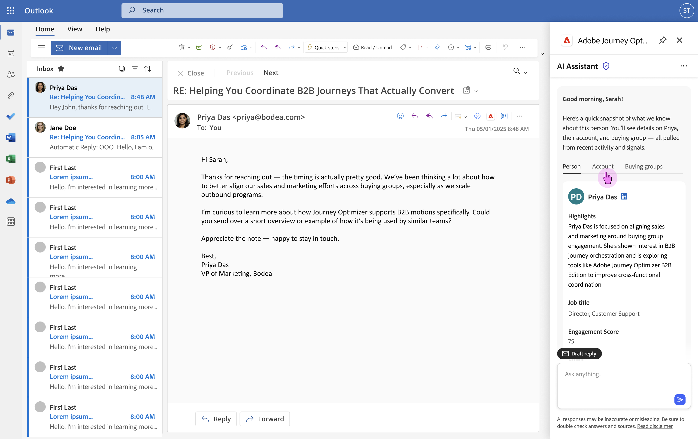
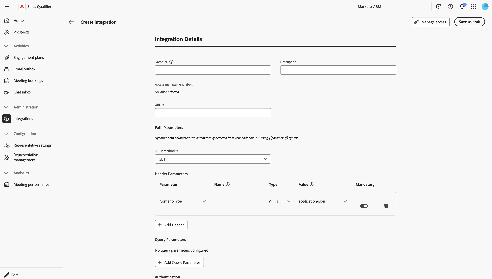
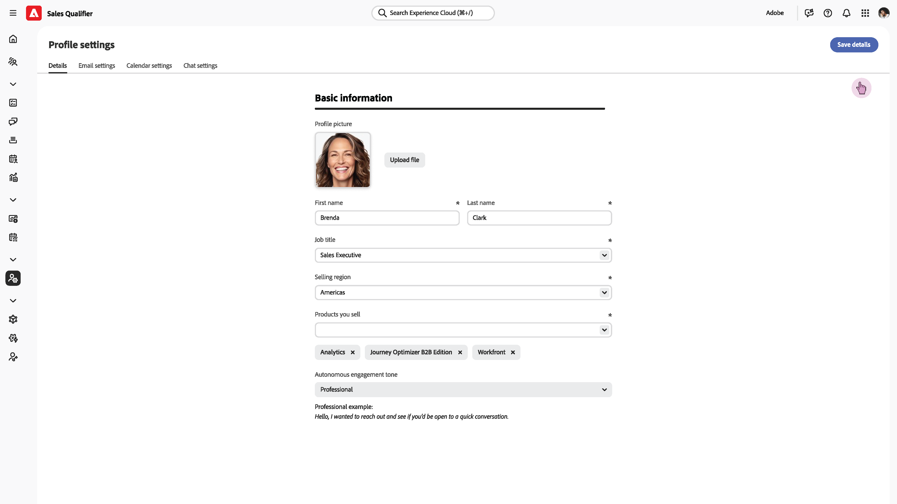

# 販売修飾子

>[!NOTE]
>
>この機能は現在、制限付き可用性であり、すべてのユーザーが利用できるわけではありません。

Sales Qualifierは、Account Qualification Agentを含むAdobe Journey Optimizer B2B editionへのAI駆動のアドオンアプリケーションで、Business Development Representatives （BDR）のワークフローを合理化するように設計されています。 セールスクオリフィケーションは、チャネルをまたいで見込み客のクオリフィケーション、アウトリーチ、バイヤーのエンゲージメントワークフローを自動化します。 B2B企業は、手作業のBDR負荷を軽減し、パイプラインを高速化することで、パイプラインを高速化できます。
ブラウザーとメールのプラグインを使用して、CRMやOutlook内で直接ビジネスインテリジェンスにアクセスできます。

## デモンストレーション動画

次のビデオでは、Sales QualifierとAccount Qualification Agentの簡単なデモを示します。

>[!VIDEO](https://video.tv.adobe.com/v/3476562?captions=jpn)

Sales Qualifierは[!UICONTROL Journey Optimizer B2B edition]に含まれていますが、Experience Platform Experience Cloud内の別のアプリです。

## Account Qualification Agent

Account Qualification Agent（AQA）は、セールスクオリフィケーションの中核です。 AQAはAIを活用してアカウントを読み取り、次のステップに進む準備ができているものを判断します。 調査、メール作成、CRMのアップデートをサポートします。

* **見込み客の調査**

  主要な見込み客情報（役職、最近のエンゲージメント、購買グループのメンバーシップなど）を自動取得および表示して見込み客の調査を実施し、全体像を数秒で提供します。

* **アカウント調査**

  見込客の組織に関する詳細情報を自動的に取得し、表示することで、アカウント調査を実施します。 この情報には、企業の健全性、最近のニュース、戦略的優先事項、最もエンゲージメントの高いメンバーが含まれます。

* **下書きメール**

  見込み顧客とアカウントのインサイトから得たリサーチを統合して、BDRの目標にもとづいて、関連性が高くパーソナライズされた単一のメールコンテンツを生成することで、メールのドラフトを生成します。

* **エンゲージメントプランの電子メール**

  BDRで定義されたアウトリーチケイデンスの各ステップに合わせて、パーソナライズされたエンゲージメントプランの電子メールのドラフトを作成し、シーケンス全体をパーソナライズします。

### 基本的な使用方法

Adobe AI エージェントは&#x200B;_自然言語クエリ_&#x200B;を使用します。つまり、人と話すときと同じ言語をテキストプロンプトで使用します。 質問が詳細であればあるほど、その効果は高まります。

自然言語を使用して、エージェントに次のことを依頼できます。

* `Show me my assigned leads with no engagement yet`
* `Show me all my leads that are not part of any autonomous engagement`
* `Give me a detailed summary on Acme company, including their buying group, recent intent signals, and our past engagement.`

最もアクティブなアカウントとリードを即座に把握し、最も高いインテントを示すことができるため、最も効果の高いアカウントとリードに注力できます。

必要な結果を得るためにプロンプトを改良することで、ジャーニーを繰り返し実行できます。 例：

* 収益コールやレポートなどのコンテキストからフォローアップメールの図面を作成します。 最大120単語。 件名：魅力的で、重要なテーマを取り入れている はじめに：コンテキストソースから直接の引用でフックします。 本文：課題と価値提案につながる CTA：さらなる調査のために、短い電話会議を提案してください。

* このメールの目的は、会話を始めて信頼を築くことです。 コンサルタント的で共感的なトーンの120語に満ちたメールを作成しましょう。 あまりおなじみのあるアプローチやセールスアプローチを避け、「うまくいくことを願っています」、「チェックインするだけです」、「お願いします」というフレーズを使用しないでください。

## 見込み客

このウィンドウには、アクセス権のあるすべてのリードが一覧表示されます。 リードステータスや最後のアクティビティなどを素早く確認できます。

_フィルター_  アイコンをクリックして、表示されているリストをリードステータスでフィルタリングします。

## エンゲージメントプラン

このウィンドウでは、定義済みのエンゲージメントプランに関する詳細が表示されます。

新しいエンゲージメントプランを作成するには、**[!UICONTROL エンゲージメントプランの作成]**&#x200B;をクリックします。

1. _詳細_ ステージで、名前とオプションの説明を入力します。 **[!UICONTROL 保存して続行]**&#x200B;をクリックします。
1. _見込み客を選択_ ステージで、このプランに属するリードを選択します。
1. _ケイデンスの定義_ ステージで、プランのパラメーターを設定します。
1. _プレビュー_&#x200B;段階では、すべてが期待どおりに機能していることを確認してください。

## 電子メールの受信トレイ

電子メール送信パネルには、送信したすべての自動メールが一覧表示されます。

## ミーティング予約

このパネルには、自動処理によって設定されたすべてのミーティングが表示されます。

## チャット受信箱

このパネルには、すべてのチャットスレッドが表示されます。

クライアントとやり取りし、連絡先とスレッドの概要を確認して、スレッドの現在の位置をすばやく把握できます。

## 統合

統合により、セールス修飾子は、CRMやその他のデータソースを活用して、顧客プロファイルを強化し、セールス活動を活用することができます。

* メール受信箱と統合することで、関連性の高い受信メールを追跡し、返信を生成できます。
* SalesforceやMicrosoft、Dynamics、ZoomInfo、BuiltWithなどのCRM データ®読み取って更新します。

### 新しい統合の設定

新しい統合を開始するには、右上の「**[!UICONTROL 統合を作成]**」をクリックします。

統合のURLを定義し、送信するペイロードを設定します。

1. 統合の一意の名前と説明（オプション）を指定します。
1. URL フィールドを統合サイトの統合認証エンドポイントに設定します。
1. 「パスのパラメーター」で、HTTP メソッドを設定します。
1. 「ヘッダーパラメーター」で、送信する必要があるHTTP ヘッダーを設定します。 通常、送信されるJSON オブジェクトであり、コンテンツタイプのヘッダーが必要です。
1. 「クエリパラメータ」で、必要なパラメータを設定します。
1. 「認証」で、統合サイトのログイン情報を設定します。

   * None
   * OAuth 2.0
   * API キー
   * 基本認証

1. **[!UICONTROL ペイロード設定]** セクションでスロットル値とキャッシュ値を設定します。
   * 鉛筆アイコンをクリックします。
   * _ペイロードの貼り付け_ ダイアログで、JSON ペイロードオブジェクトを貼り付けるか入力します。

      * **[!UICONTROL ペイロードを要求]** – 統合サイトに送信するデータを含むJSON オブジェクト。
      * **[!UICONTROL 応答ペイロード]** – 返されるデータ構造。

1. 「**[!UICONTROL 接続をテスト]**」をクリックして、設定が正しいことを確認します。

接続設定が有効な場合は、**[!UICONTROL 下書きとして保存]**&#x200B;をクリックします。

メインの&#x200B;_[!UICONTROL 統合]_ テーブルに戻ったら、統合を選択し、**[!UICONTROL アクティブ化]**&#x200B;をクリックして統合を有効にします。 アクティブにする準備ができていない場合は、**[!UICONTROL ドラフトとして保存]**&#x200B;をクリックします。

#### アクセスの管理

ユーザーへのアクセスと、様々なユーザーグループと共有されるデータの種類を管理できます。

「**[!UICONTROL アクセスを管理]**」をクリックして、_[!UICONTROL アクセスを管理]_ ダイアログを開きます。

このダイアログには、組織に設定されているすべてのラベルが一覧表示されます。 この統合に適用するラベルを選択します。

新しいラベルが必要な場合は、「**[!UICONTROL ラベルを作成]**」をクリックし、ラベル情報を入力します。

* 名前
* わかりやすい名前
* 説明

## 代表設定

代表設定では、個人情報、電子メールとカレンダーの設定、チャットの空き状況など、自分に関する情報を指定します。

### 詳細

「**[!UICONTROL 詳細]**」タブには、自分に関する情報を入力します。

### メールの設定

「**[!UICONTROL メール設定]**」タブで、メール接続を設定します。

メール接続オプションとメール署名設定を表示する

* **[!UICONTROL メール接続]** - **[!UICONTROL Connect]**&#x200B;をクリックし、Microsoft ログイン手順に従います。

* **[!UICONTROL 電子メール署名]** – 自動生成された電子メールで使用される電子メール署名を設定します。

### カレンダー設定

「**[!UICONTROL カレンダー設定]**」タブで、タイムゾーンと空き時間を設定します。

タイムゾーンと可用性オプションを表示する

* **[!UICONTROL カレンダー接続]** - **[!UICONTROL 接続]**&#x200B;をクリックし、Microsoft ログイン手順に従ってカレンダーを統合します。

* **[!UICONTROL 会議確認メール]** – 顧客が自分との会議を確認すると、確認メールが返信として送信されます。 これらの設定を使用して、メールの件名と本文を定義します。

* **[!UICONTROL 環境設定]** - デフォルトの会議の長さと、バックツーバックの会議の間に必要な時間を設定します。

### チャット設定

「**[!UICONTROL チャット設定]**」タブで、タイムゾーンのライブチャットの可用性を設定します。

タイムゾーンとライブチャットの可用性を設定するための

## 代表経営陣

_[!UICONTROL 代表管理]_ パネルには、定義済みの代表者とそのカレンダーステータスが表示されます。

## ミーティングのパフォーマンス

このパネルには、完了したミーティングに関する分析が表示されます。

<!--
 SHPHR-24341 remove section
## Set up the Chrome plugin

The AI Assistant Chrome plugin is available on the [Google Store](https://chromewebstore.google.com/detail/ai-assistant/hancbabllcmckehonngbdkhilocpdfji?authuser=0&hl=en).

When the plugin is installed in Chrome, the Adobe logo appears on the middle right when you are on an integrated site:

* Adobe web applications
* Salesforce
* Outlook
* Microsoft Dynamics and web applications
* Google applications 
-->

## 左側のナビゲーションバーの編集

アプリケーションの左下にある「**[!UICONTROL 編集]**」をクリックして、ナビゲーションに表示されるアイコンを制御します。 また、ドラッグ&amp;ドロップで好きなように並べ替えることもできます。
