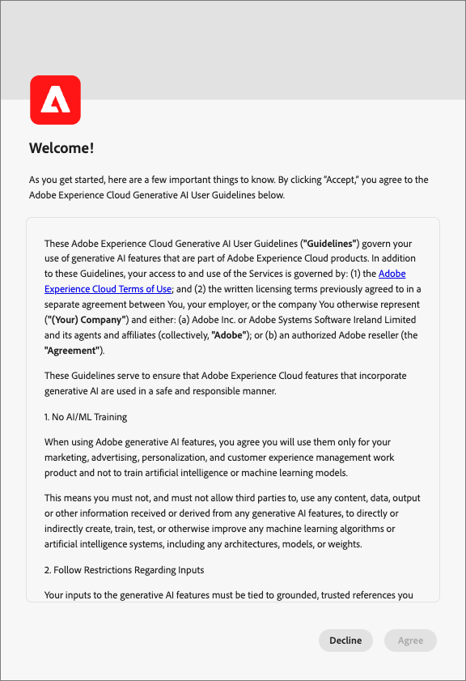
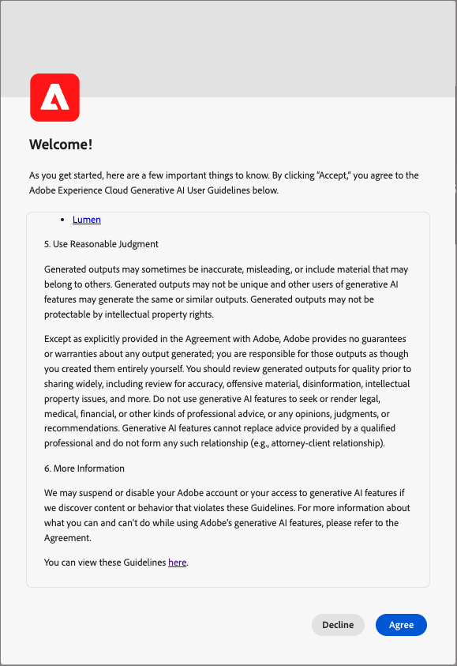

# JOURNEY OPTIMIZER B2B editionのAI アシスタント

JOURNEY OPTIMIZER B2B editionのAI アシスタントは、[Adobe Experience PlatformのAI アシスタント ](https://experienceleague.adobe.com/ja/docs/experience-platform/ai-assistant/home){target="_blank"}と同じテクノロジ基盤から作成されます。 Adobe Journey Optimizer B2B editionなら、対話型エクスペリエンスを利用して、ワークフローを高速化できます。 AI アシスタントを使用すれば、製品の能力に関する理解を深め、問題をトラブルシューティングし、情報を検索して、Journey Optimizer B2B editionの運用に関するインサイトを獲得できます。

>[!IMPORTANT]
>
>Journey Optimizer B2B editionでAI アシスタントを使用するには、[ ユーザーガイドライン ](https://www.adobe.com/legal/licenses-terms/adobe-dx-gen-ai-user-guidelines.html){target="_blank"}への同意が必要です。 この契約書にはパブリックベータ版の契約書も含まれているため、追加のAI アシスタント機能をベータ版の機能で展開する際に使用できます。

+++ユーザー契約書インターフェイスの表示

+++

## JOURNEY OPTIMIZER B2B editionのAI アシスタント機能

送信された質問に対する回答を作成するために、AI アシスタントはデータベースにクエリを実行し、データベースのデータを人間が読みやすい回答に変換します。 この応答は、基礎となるデータを内部的に表現したもので、_**_ナレッジグラフ_**_&#x200B;とも呼ばれます。これは、特定の回答に対する概念、データ、メタデータを含む包括的なwebです。 ナレッジグラフは、クエリが送信されるたびに参照されるサブグラフで構成されます。

* Experience Leagueのドキュメント。
* スキーマ、フィールド、オーディエンス、ジャーニーなどの運用上のアーティファクト。

AI アシスタントのクエリを送信する前に、必要な問い合わせタイプを検討してください。

### 製品知識

製品情報とは、Adobe Experience Leagueに関するJourney Optimizer B2B editionのドキュメントに基づいた概念とトピックを指します。 製品知識に関する質問は、さらに次のサブグループに指定できます。

| 製品知識 | 例 |
| --- | --- |
| ターゲットを絞った学習 | <li>購買グループとは？ <li> 購買グループの役割テンプレートの例を教えてください？ |
| オープン検出 | <li>購買グループを作成する手順？ <li>購買グループの役割テンプレートでカスタムフィールドを使用するにはどうすればよいですか？ |
| トラブルシューティング | <li>ジャーニーの購買グループが作成されなかったのはなぜですか？ <li>ジャーニーでリッスンするエクスペリエンスイベントが見つからないのはなぜですか？ |

### 運用上のインサイト

_運用上のインサイト_&#x200B;とは、AI アシスタントがメタデータオブジェクト（属性、アカウントオーディエンス、データフロー、データセット、宛先、アカウントジャーニー、スキーマ、ソース、購買グループテンプレート、ソリューションの興味）について生成する回答を指します。 それらのインサイトには、カウント、ルックアップ、リネージへの影響などが含まれます。 サンドボックス内のデータは表示されません。

* オーディエンスサイズが最も大きいアカウントオーディエンスとそのサイズは何ですか？
* これまでジャーニーで使用されていないアカウントオーディエンスの数？
* ソリューションの関心&#x200B;_x_&#x200B;を使用するアクティブなジャーニーはどれですか？

次の領域で、AI アシスタントに運用上のインサイトについて質問することができます。

| ドメイン | サポートされているメタデータ | サポートされていないメタデータ |
| --- | --- | --- |
| 属性/フィールド | <li>属性名検索 <li>属性 – スキーマ関係 <li>属性 – データセットの関係 <li>属性 – オーディエンス関係 <li>属性 – 宛先関係 | <li>属性クラス <li>監査 <li>非推奨ステータス <li>ラベル <li>属性に保存された値 |
| アカウントオーディエンス   **_注:_** Journey Optimizer B2B editionのコンテキストでは、AI アシスタントはアカウントオーディエンスに関するオーディエンスの質問にのみ回答できます。 Experience Platformでは、AI アシスタントは個人オーディエンスに関する質問のみに回答できます。 | <li>オーディエンス数 <li>オーディエンスタイプ（ストリーミングまたはバッチ） <li>作成日/変更日 <li>アクティベーションステータス <li>メンバー数 <li>オーディエンスの重複 <li>名前とID検索 | <li>オーディエンスの重複 <li>オーディエンスアクティベーション <li>監査 <li>作成/修正 <li>ラベル <li>メンバーの選定のトレンド |
| データフロー | <li>データフロー数 <li>データフローステータス <li>データフロー – データセットの関係 <li>データフロー – ソース関係 | <li>制作/修正 <li>データフローとバッチの関係 <li>取り込みプロファイル数 |
| データセット | <li>データセット数 <li>プロファイル有効ステータス <li>作成/変更日 <li>データセット – スキーマ関係 <li>データセット – オーディエンスの関係 <li>データセット – 属性関係 <li>データセット – データフローの関係 <li>名前検索 <li>名前とID検索 | <li>監査 <li>作成者 <li>データセット – バッチ関係 <li>データセットの作成/修正 <li>データセットサイズ <li>プロファイル数 <li>行数 <li>値検索 |
| 宛先 | <li>設定済みの宛先数 <li>宛先 – オーディエンスの関係 <li>配信先属性の関係 | <li>アカウント設定 <li>アカウント資格情報 <li>一意のプロファイルがアクティブ化されました |
| ジャーニー（アカウントジャーニー） | <li>カウント <li>名前とID検索 <li>ジャーニーステータス <li>作成日/変更日 | <li>属性 – ジャーニー関係の監査 <li>制作/修正 <li>作成者 |
| スキーマ | <li>スキーマ数 <li>作成/変更日 <li>スキーマ – 属性関係 <li>スキーマ – データセットの関係 <li>スキーマ – オーディエンス関係 <li>プロファイル有効ステータス <li>名前検索 <li>名前とID検索 | <li>監査 <li>制作/修正 <li>作成者 <li>フィールドグループ <li>ID <li>ID 名前空間 <li>ラベル <li>プロファイル数 |
| ソース | <li>アカウント数 <li>アカウントステータス <li>各アカウントのアクティブ/非アクティブなデータフロー <li>Source コネクタ – データフローリレーションシップ <li>Source アカウント – データフローリレーションシップ | <li>アカウント資格情報 <li>アカウント設定データ取り込み指標 <li>プロファイルの数ソース – バッチ関係 |
| 購買グループテンプレート | <li>カウント <li>ステータス <li>ロール <li>名前とID検索 | <li>役割ルール |
| ソリューションへの関心 | <li>カウント <li>ステータス <li>ソリューションへの関心 – 購買グループテンプレートの関係 <li>名前とID検索 | <li>ソリューションへの関心 – 購買グループの関係 |

{style="table-layout:fixed"}

運用上のインサイトに関する質問の場合、回答がUIの現在の状態を反映しない場合があります。 これらの質問を裏付けるデータは、24時間ごとに更新されます。 例えば、日中にReal-Time CDPで行った変更は、夜間にデータストアと同期され、朝にユーザーからの質問に対応できるようになります。 サンドボックスにログインして、オブジェクトに関連する特定のデータについて問い合わせます。

### 機能の範囲

現在、AI アシスタントの範囲は次のとおりです。

* **製品情報**: AI アシスタントは、Real-Time Customer Data PlatformとAdobe Journey Optimizer B2B editionに関する製品情報に関する質問に答えることができます。

* **運用インサイト**：属性、アカウントオーディエンス、データフロー、データセット、宛先、アカウントジャーニー、スキーマ、ソース、購買グループテンプレート、ソリューションの関心など、データオブジェクトの運用インサイトについて、AI アシスタントに質問することができます。

### プライバシー、セキュリティ、ガバナンス

JOURNEY OPTIMIZER B2B editionのAI アシスタントは、プライバシー、セキュリティ、ガバナンスを最前線に据えて構築されています。 AI アシスタントに期待される、顧客の信頼に焦点を当てた機能について詳しくは、次の情報を確認してください。

* 現在、AI アシスタントは、トレーニング目的であっても個人データを使用していません。

* AI アシスタントは、人物、アカウント、機会、購買グループなどの顧客データを認識していません。

* AI アシスタントを利用するには、明示的な許可が必要です。

   * 管理者は、[権限UI](https://experienceleague.adobe.com/en/docs/experience-platform/access-control/abac/permissions-ui/permissions){target="_blank"}と[Admin Console](https://experienceleague.adobe.com/en/docs/experience-platform/access-control/ui/browse){target="_blank"}を使用して権限を設定できます。

   * 権限は詳細で、サンドボックス管理者は、様々な質問カテゴリ（AI アシスタントによる製品知識ベースの質問や運用上のインサイトに関する質問）に対して質問できるユーザーを設定できます。

* 30日間のリテンションポリシーにより、AI アシスタントとのやり取りの履歴を確認できます。

* Ai アシスタントは、ユーザープロンプトへの回答において、サンドボックス固有のデータとAdobeの公開ドキュメントをもとにしています。 データはサンドボックス間で共有されません。

* AI アシスタントに入力したプロンプトは、他の顧客には共有されません。

### よくある質問

次に、Journey Optimizer B2B editionのAI アシスタントに関するよくある質問への回答を示します。

**AI アシスタントの情報はリアルタイムで提供されますか？**

AI アシスタントの回答で提示されるデータは、毎日更新されます。 このサイクルは、応答に含まれるデータが、応答の時点でユーザーインターフェイスに表示されるデータよりも24時間古くなることを意味します。

**AI アシスタントの機能は何ですか？**

AI アシスタントは、Adobeの製品知識の質問に対応し、業務上の成果物に関する運用上のインサイトに関連する質問に答えることができます。

**AI アシスタントは顧客データに関する情報を提供できますか？**

いいえ、できません。 AI アシスタントは顧客データにアクセスできないため、AI アシスタントによる調査や使用はされません。

**私の個人情報は、AI アシスタントのトレーニングデータで使用されていますか？**

AI アシスタントは、トレーニングのために個人情報を使用することはありません。 お客様に関する個人情報（お客様の名前または連絡先情報を含む）またはその他の関係者をAI アシスタントに提供しないでください。

## 次の手順

AI アシスタントの概要を理解したら、ワークフロー中にAI アシスタントを有効にして使用します。 詳しくは、次のドキュメントを参照してください。

* [AI アシスタントへのアクセスを有効にする](./enable-ai-assistant-access.md)
* [質問ガイダンス](./question-guidance.md)
* [AI アシスタントを使用](./use-ai-assistant.md)
