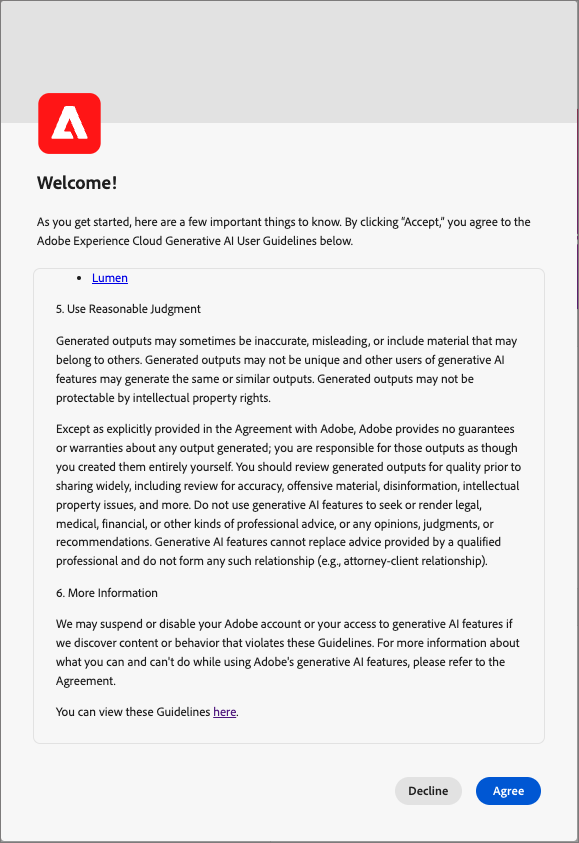

# Journey Optimizer B2B editionの AI アシスタント

Journey Optimizerの AI アシスタント B2B editionは、同じテクノロジ基盤である [Adobe Experience Platformの AI アシスタント ](https://experienceleague.adobe.com/ja/docs/experience-platform/ai-assistant/home) から作成されています。 これは、Adobe Journey Optimizer B2B editionでワークフローを高速化するために使用できる対話型エクスペリエンスです。 AI アシスタントを使用すると、製品の機能をより深く理解したり、問題をトラブルシューティングしたり、情報を検索してJourney Optimizer B2B editionの運用に関するインサイトを見つけたりできます。

>[!IMPORTANT]
>
>Journey Optimizer B2B editionで AI アシスタントを使用するには、[ ユーザーガイドライン ](https://www.adobe.com/legal/licenses-terms/adobe-dx-gen-ai-user-guidelines.html) への同意が必要です。 この契約にはパブリックベータ版の契約も含まれているため、ベータ版の容量で展開する際に追加の AI アシスタント機能を使用できます。

+++ユーザー契約インターフェイスの表示

+++

## Journey Optimizer B2B editionの AI アシスタント機能

送信された質問に対する回答を作成するために、AI アシスタントはデータベースにクエリを実行し、データベースのデータを人間が読み取れる回答に変換します。 この応答は、基になるデータの内部表現であり、_**_ナレッジグラフ_**_ とも呼ばれます。これは、特定の回答に関する概念、データ、メタデータの包括的な Web です。 ナレッジグラフは、クエリが送信されるたびに参照されるサブグラフで構成されます。

* Experience Leagueのドキュメント。
* 運用上のアーティファクト（スキーマ、フィールド、オーディエンス、ジャーニーなど）。

AI アシスタントのクエリを送信する前に、必要な問い合わせのタイプを検討します。

### 製品に関する知識

製品知識とは、Adobe Experience League に関するJourney Optimizer B2B editionのドキュメントに基づく概念とトピックを指します。 製品ナレッジの質問は、次のサブグループにさらに指定できます。

| 製品知識 | 例 |
| --- | --- |
| 尖った学習 | <li>購入グループとは何ですか？ <li> 購買グループの役割テンプレートの例を表示しますか？ |
| 検出を開く | <li>購買グループを作成する手順は？ <li>購入グループの役割テンプレートでカスタムフィールドを使用するにはどうすればよいですか？ |
| トラブルシューティング | <li>作成したジャーニーのグループを購入しなかったのはなぜですか？ <li>ジャーニーでリッスンするエクスペリエンスイベントが見つからないのはなぜですか？ |

### 運用インサイト

_オペレーショナルインサイト_ とは、メタデータオブジェクト（属性、アカウントオーディエンス、データフロー、データセット、宛先、アカウントジャーニー、スキーマ、ソース、購入グループテンプレート、ソリューションの関心）に関して AI Assistant が生成する回答を指します。 これらのインサイトには、カウント、ルックアップ、系列の影響が含まれます。 サンドボックス内のデータは参照されません。

* どのアカウントオーディエンス最大のオーディエンスサイズを持ち、そのサイズはどれくらいですか?
* ジャーニーで一度も使用したことのないアカウントオーディエンスの数。
* ソリューションの関心 _x_ を使用するアクティブなジャーニーは何ですか？

次のドメインで、運用に関するインサイトについて AI アシスタントに質問できます。

| ドメイン | サポートされるメタデータ | サポートされていないメタデータ |
| --- | --- | --- |
| 属性/フィールド | <li>属性名の検索 <li>属性 – スキーマの関係 <li>属性 – データセットの関係 <li>属性 – オーディエンスの関係 <li>属性 – 宛先の関係 | <li>属性クラス <li>監査 <li>非推奨ステータス <li>ラベル <li>属性に格納された値 |
| アカウントオーディエンス   **_メモ：_**AJO B2B AI Assistant は、アカウントオーディエンスのオーディエンスの質問にのみ回答できますが、Experience Platform AI Assistant は、人物オーディエンスの質問にのみ回答できます | <li>オーディエンス数 <li>オーディエンスタイプ（ストリーミングまたはバッチ） <li>作成日/変更日 <li>アクティベーションステータス <li>メンバー数 <li>オーディエンスを複製 <li>名前と ID 検索 | <li>オーディエンスの重複 <li>Audience Activation <li>監査 <li>作成/変更 <li>ラベル <li>会員選定の動き |
| データフロー | <li>データフロー数 <li>データフローステータス <li>データフロー – データセットの関係 <li>データフロー – ソースの関係 | <li>作成/変更 <li>データフローバッチ関係 <li>プロファイル数の取り込み |
| データセット | <li>データセット数 <li>プロファイル有効化ステータス <li>作成日/変更日 <li>データセット – スキーマの関係 <li>データセット – オーディエンスの関係 <li>データセット - 属性の関係 <li>データセット - データフローの関係 <li>名前検索 <li>名前と ID 検索 | <li>監査 <li>作成者 <li>データセット – バッチ関係 <li>データセットの作成/変更 <li>データセットサイズ <li>プロファイル数 <li>行数 <li>値検索 |
| 宛先 | <li>設定済みの宛先数 <li>出力先 - オーディエンス関係 <li>出力先属性の関係 | <li>アカウントのセットアップ <li>アカウントの資格情報 <li>アクティブ化された一意のプロファイル |
| ジャーニー (アカウントジャーニー) | <li>カウント <li>名前と ID 検索 <li>ジャーニーステータス <li>作成日/変更日 | <li>属性 – ジャーニー関係監査 <li>作成/変更 <li>作成者 |
| スキーマ | <li>スキーマ数 <li>作成日/変更日 <li>スキーマ – 属性関係 <li>スキーマ - データセット関係 <li>スキーマ - オーディエンス関係 <li>プロファイル有効化ステータス <li>名前検索 <li>名前と ID 検索 | <li>監査 <li>作成/変更 <li>作成者 <li>フィールドグループ <li>ID <li>ID 名前空間 <li>ラベル <li>プロファイル数 |
| ソース | <li>アカウント数 <li>アカウントステータス <li>各アカウントのアクティブ/非アクティブなデータフロー <li>Source コネクタ – データフローの関係 <li>Source アカウント – データフローの関係 | <li>アカウント資格情報 <li>アカウントの設定データ取り込み指標 <li>profilesSource の数 – バッチ関係 |
| 購買グループ テンプレート | <li>カウント <li>ステータス <li>ロール <li>名前と ID 検索 | <li>役割ルール |
| ソリューションの関心 | <li>カウント <li>ステータス <li>ソリューションへの関心 - 購入グループテンプレート関係 <li>名前 と ID の検索 | <li>ソリューションの関心：購入グループの関係 |

{style="table-layout:fixed"}

オペレーショナルインサイトの質問については、回答が現在の UI の状態を反映していない場合があります。 これらの質問を裏付けるデータは、24 時間ごとに 1 回更新されます。 例えば、Real-Time CDPで日中に行った変更内容は、夜間にデータストアに同期され、午前中にユーザーからの質問に使用できるようになります。 サンドボックスにログインして、オブジェクトに関連する特定のデータを照会します。

### 機能範囲

現在、AI アシスタントの範囲は次のとおりです。

* [ 製品ナレッジ ](https://experienceleague.adobe.com/en/docs/experience-platform/ai-assistant/home#product-knowledge):AI アシスタントは、Real-Time Customer Data PlatformおよびAdobe Journey Optimizer B2B editionの製品ナレッジに関する質問に回答できます。

* [ 運用に関するインサイト ](https://experienceleague.adobe.com/en/docs/experience-platform/ai-assistant/home#operational-insights)：属性、アカウントオーディエンス、データフロー、データセット、宛先、アカウントジャーニー、スキーマ、ソース、購入グループテンプレート、ソリューションの関心など、データオブジェクトの運用に関するインサイトについて、AI Assistant に質問することができます。

### プライバシー、セキュリティ、ガバナンス

Journey Optimizer B2B editionの AI アシスタントは、プライバシー、セキュリティ、ガバナンスを最前線で考慮して構築されています。 以下の情報を確認して、AI アシスタントに期待できる顧客の信頼に焦点を当てた機能について学びます。

* 現在、AI アシスタントは、トレーニング目的であっても、個人データを使用していません。

* AI アシスタントは、人物、アカウント、機会、購入グループなどの顧客データを認識しません。

* AI アシスタントとやり取りするには、明示的な権限が必要です。

   * 管理者は、[権限UI](https://experienceleague.adobe.com/en/docs/experience-platform/access-control/abac/permissions-ui/permissions)および [Admin Console](https://experienceleague.adobe.com/en/docs/experience-platform/access-control/ui/browse) を使用して権限を設定できます。

   * 権限はきめ細かく、サンドボックス管理者は、さまざまな質問カテゴリ(AI Assistantを使用した製品ナレッジベースの質問または運用上の洞察に関する質問)を行うことができるユーザーを構成できます。

* AI Assistant との以前のやり取りのログを 30 日間の保持ポリシーで表示できます。

* AI アシスタントは、ユーザープロンプトに答える際に、サンドボックス固有のデータと公開Adobe ドキュメントに基づいています。 データは、サンドボックス間で共有されません。

* AI アシスタントに指定したプロンプトは、他の顧客とは共有されません。

### よくある質問

以下は、Journey Optimizer B2B editionの AI アシスタントに関するよくある質問への回答のリストです。

**AI アシスタントの情報はリアルタイムで提供されますか？**

AI アシスタントの応答で表示されるデータは、毎日更新されます。 このサイクルは、応答に含まれるデータが、応答時にユーザーインターフェイスに表示されるデータよりも最大 24 時間古くなる可能性があることを意味します。

**AI アシスタントの機能は何ですか？**

AI アシスタントは、Adobeの製品ナレッジクエリに対応し、運用上のアーティファクトの運用上のインサイトに関連する質問に答えることができます。

**AI アシスタントは顧客データに関する情報を提供できますか？**

いいえ、できません。 AI アシスタントは顧客データにアクセスできないため、AI アシスタントでは参照または使用されません。

**私の個人情報はAIアシスタントのトレーニングデータで使用されますか?**

AIアシスタントは、個人情報をトレーニング目的に利用することはありません。 AI アシスタントには、ご自身に関する個人情報（氏名、連絡先情報を含む）やその他の関係者に関する情報を提供しないでください。

## 次の手順

AI アシスタントの一般的な理解については、ワークフロー中に AI アシスタントを有効にして使用する手順に進んでください。 詳しくは、次のドキュメントを参照してください。

* [AI アシスタント アクセスを有効にする](./enable-ai-assistant-access.md)
* [質問ガイダンス](./question-guidance.md)
* [AI アシスタントを使用](./use-ai-assistant.md)
