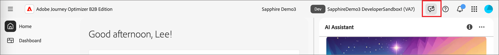

# AI アシスタントへのアクセスを有効にする

>[!IMPORTANT]
>
>権限UIで、AI アシスタントへのアクセスを取得するための追加の法的条件に最初に同意する必要があることを通知するメッセージが表示された場合は、Adobe アカウントチームに連絡してガイダンスを入手してください。

次のパラメーターは、Journey Optimizer B2B editionのAI アシスタントへのアクセスを管理します。

* **アプリケーションにアクセス：** Adobe Journey Optimizer B2B editionのAI アシスタントにアクセスできます。

* **権限：** [権限UI](https://experienceleague.adobe.com/en/docs/experience-platform/access-control/abac/permissions-ui/permissions){target="_blank"}を使用して、組織内のAI アシスタントへのアクセス権を付与または取り消します。 AI アシスタントを使用するには、特定のユーザーが&#x200B;_[!UICONTROL AI アシスタントを有効にする]_&#x200B;および&#x200B;_[!UICONTROL 操作インサイトを表示]_&#x200B;権限で設定された役割に属している必要があります。

管理者は、次のことができます。

* 特定の役割に&#x200B;**[!UICONTROL AI アシスタントを有効にする]**&#x200B;権限を追加し、その役割にユーザーを追加します。 この権限は、組織内のユーザーにAI アシスタントへのアクセス権を提供します。

* 特定の役割に&#x200B;**[!UICONTROL 運用上のインサイトの表示]**&#x200B;権限を追加し、その役割にユーザーを追加します。 この権限により、ユーザーはAI アシスタントの運用インサイト機能を使用できます。

{width="800" zoomable="yes"}

権限UIを使用して、Journey Optimizer B2B editionでAI アシスタントを使用する権限を付与します。 Experience Platformおよびその他のExperience Cloud アプリケーションでのAI アシスタントへのアクセスについて詳しくは、[Adobe Experience Platform ドキュメント &#x200B;](https://experienceleague.adobe.com/en/docs/experience-platform/ai-assistant/access){target="_blank"}を参照してください。

ユーザーが必要な権限を持っている場合は、使用しているアプリケーションの上部ヘッダーにある「_AI Assistant_」アイコンを選択して、AI Assistantにアクセスできます。

{width="800" zoomable="yes"}

## AI アシスタントのアクセスの概要ビデオ

組織とユーザーに対するAI アシスタントへのアクセスを設定する方法については、次のビデオをご覧ください。

>[!VIDEO](https://video.tv.adobe.com/v/3436470/?learn=on)

## 次の手順

ユーザーがAI アシスタントにアクセスできる場合、タスクの実行中に機能を使用できます。 次のドキュメントを参照してください。

* [質問ガイダンス](./question-guidance.md)
* [AI アシスタントを使用](./use-ai-assistant.md)
