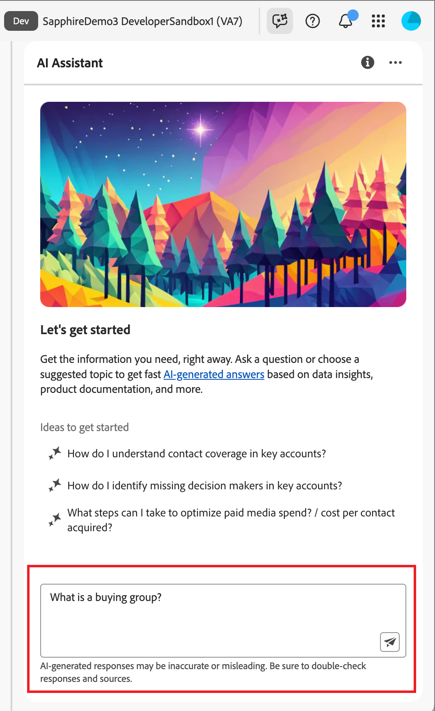
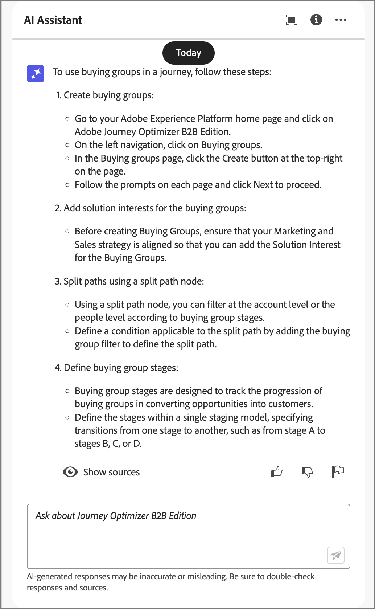
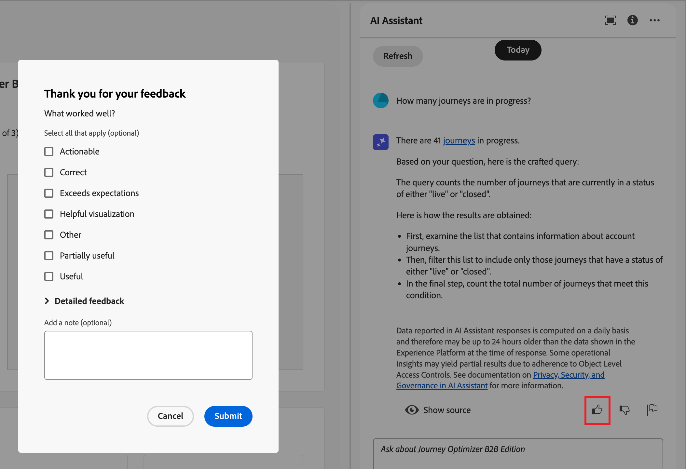
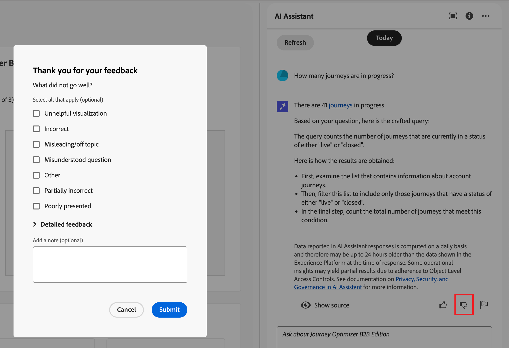
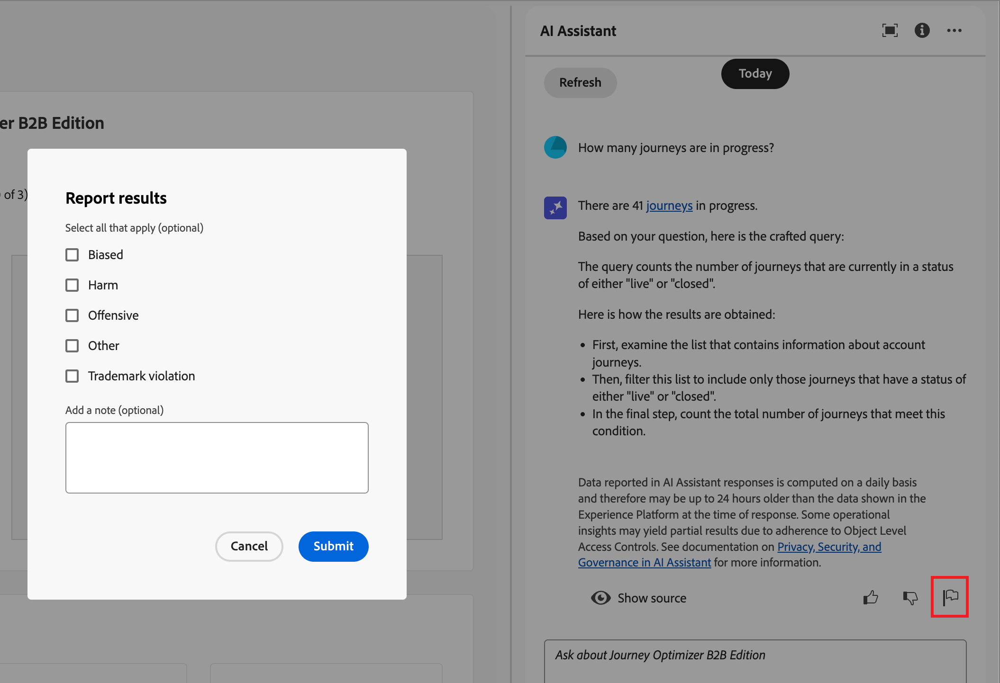

# Journey Optimizer B2B editionのAI アシスタントを活用して

Journey Optimizer B2B editionのAI アシスタントは、製品コンセプトを理解し、製品の機能をすばやく操作して学習し、自社のビジネス環境に関する運用上のインサイトを得るためのユーザーインターフェイス機能です。 Adobe Adobe Experience Cloudの各製品でも利用できます。

>[!IMPORTANT]
>
>AI アシスタントを使用するには、Adobe Experience Cloud生成AI ユーザーガイドラインに関する契約書が必要です。 この契約書と使用ガイドラインについて詳しくは、[Adobe Experience Cloud生成AI ユーザーガイドライン ](https://www.adobe.com/legal/licenses-terms/adobe-dx-gen-ai-user-guidelines.html)を参照してください。

AI アシスタントにアクセスするには、ヘッダーのアイコンをクリックします。 右側のパネルにAI アシスタントが表示されます。

{width="420"}

AI アシスタントインターフェイスが表示され、すぐに利用を開始するための情報が提供されます。 _アイデアで提供されるオプションを使用して、次のような質問やコマンドに答えることができます。_

* どのジャーニーが公開されたか？
* 作成されたソリューションの関心？
* Journey Optimizer B2B editionの主な利点を教えてください。

Adobe Journey Optimizer B2B editionでは、AI アシスタントは次のユースケースをサポートしています。

## 製品知識に関する質問

製品情報に関する質問では、Journey Optimizer B2B editionのコンセプトとハウツー情報について説明します。 製品知識に関する質問の例には、次のようなものがあります。

* SMS プロバイダーのアカウントを設定するにはどうすればよいですか？
* ジャーニーでメールを送信するにはどうすればよいですか？
* メールコンテンツをパーソナライズするにはどうすればよいですか？

製品に質問するには、パネルの下部にあるフィールドに製品を入力し、Enter キーを押します。 例えば、ジャーニーで購買グループの使用方法を学習する必要がある場合。 この場合、_ジャーニーで購買グループを使用するにはどうすればよいですか？_&#x200B;と入力します 質問を送信すると、AI アシスタントはナレッジベースに質問し、数秒で回答を収集します。

{width="420"}

+++回答の例を見る

{width="420"}

+++

## 運用上のインサイトに関する質問

運用インサイトの質問では、組織のサンドボックス内のジャーニーオブジェクトについて質問します。 アカウントオーディエンス、アカウントジャーニー、ソリューションへの興味、購買グループテンプレートなど、運用上のアーティファクトに関する質問をすることができます。 運用上のインサイトの質問やプロンプトの例には、次のようなものがあります。

* Adobe Journey Optimizer B2B editionには何件のライブジャーニーがありますか？
* スケジュールされたすべてのジャーニーのリストを提示してください。
* 過去7日間に作成されたジャーニーの数？

AI アシスタントが運用上のインサイトに関する質問に十分な回答を提供できるように、アクティブなサンドボックスに入っている必要があります。

>[!NOTE]
>
>AI アシスタントの運用上のインサイトに関する質問でサポートされているAdobe Journey Optimizer B2B edition オブジェクトは、[運用上のインサイト ドメイン テーブル ](./ai-assistant-overview.md#operational-insights)に記載されています。 現在のサンドボックスのデータにのみアクセスできます。

運用上のインサイトに関する質問をするには、パネルの下部にあるフィールドに入力し、Enter キーを押します。 例えば、サンドボックスのオーディエンスについて知りたい場合。 この場合、_オーディエンスの数は？_&#x200B;と入力します。  AI アシスタントは、サンドボックス内のオーディエンスの数と、そのオーディエンスが回答をどのように計算したかの説明を提供します。 次の応答の例では、AI アシスタントがUIのオーディエンスにアクセスするためのリンクを提供し、オーディエンス数を特定するために実行した手順の概要を示します。

{width="420"}

最初の質問に従って、アーティファクトのリスト（_サイズ別の上位5つをリスト_&#x200B;など）を求めることができます。 AI アシスタントは、クエリの上位5つの項目と、対応するIDを含むテーブルを返します。 _ダウンロード_ （）アイコンをクリックして、テーブルをCSV ファイルとしてダウンロードします。

ライブジャーニーのリストに対する{width="420"}

AI アシスタントでテーブル全体を表示するには、_最大化_ （）アイコンをクリックします。 拡張されたテーブルビューで、**[!UICONTROL CSVをダウンロード]**&#x200B;をクリックして、情報をCSV ファイルとして保存します。

ライブジャーニーのリストに対する{width="600" zoomable="yes"}

## 応答を確認

AI アシスタントには、回答の検証や検証に使用できるツールが含まれています。

### 製品知識のソース

製品の質問に対する回答を受け取ったら、**[!UICONTROL ソースを表示]**&#x200B;を選択して、AI アシスタントの回答の生成に使用された製品ナレッジソースの引用を表示します。

AI アシスタントは、最初の応答を裏付けるドキュメントへのリンクを提供します。 また、応答に脚注を追加して、リンクされたドキュメントソースを参照する回答の特定の部分を示します。

{width="420"}

### 運用上のインサイトのソース

運用上のインサイトに関する質問の応答を受け取ったら、**[!UICONTROL ソースを表示]**&#x200B;をクリックし、**[!UICONTROL ソースクエリを表示]**&#x200B;を選択します。

AI アシスタントが提供するSQL クエリを使用して、運用上のインサイトに関する質問に関連する各応答を検証できます。 運用上のインサイトに関する質問でクエリを実行すると、AI アシスタントは、回答の計算に要したプロセスの検証に使用できるSQL クエリを提供します。 このソースクエリは検証目的でのみ使用され、クエリサービスではサポートされていません。

{width="550" zoomable="yes"}

## フィードバックの提供

_親指を上げる_ （）または&#x200B;_親指を下げる_ （）アイコンを使用して、応答の有用性と品質を評価します。 ご自身の経験に合わせて簡単なアンケートフォームに記入し、**[!UICONTROL 送信]**&#x200B;をクリックしてください。 提供された情報は、AI アシスタントの改善に使用されます。

応答に問題があることに気付いた場合は、_フラグ_ （）アイコンをクリックします。 フォームを使用して問題を説明し、**[!UICONTROL 送信]**&#x200B;をクリックして問題を報告します。

{width="420"}

+++フォームの表示

>[!BEGINTABS]

>[!TAB  サムアップ ]

{width="600" zoomable="yes"}

>[!TAB 親指を下げる]

{width="600" zoomable="yes"}

>[!TAB フラグ]

{width="600" zoomable="yes"}

>[!ENDTABS]

+++
