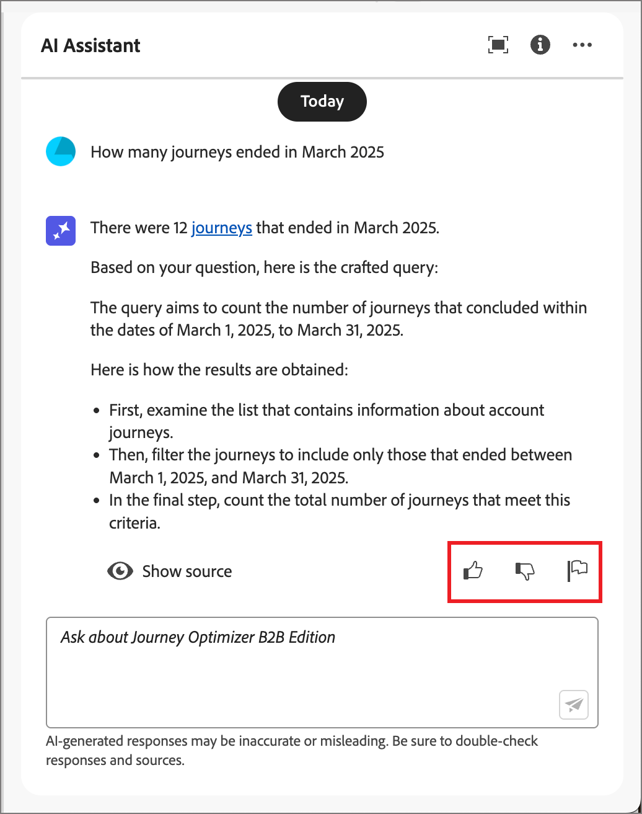

# Journey Optimizer B2B editionでの AI アシスタントの使用

Journey Optimizer B2B editionで AI アシスタントを使用すると、商品のコンセプトを理解し、商品の機能をすばやくナビゲートして学び、お使いの環境の運用に関するインサイトを得ることができます。 また、Adobe Experience Cloud全体の複数の製品でも使用できます。

>[!IMPORTANT]
>
>AI アシスタントを使用するには、Adobe Experience Cloud ジェネレーティブ AI ユーザーガイドラインの契約が必要です。 この契約および使用ガイドラインについて詳しくは、[Adobe Experience Cloud ジェネレーティブ AI ユーザーガイドライン ](https://www.adobe.com/legal/licenses-terms/adobe-dx-gen-ai-user-guidelines.html) を参照してください。

AI アシスタントにアクセスするには、ヘッダーのアイコンをクリックします。 AI アシスタントが右側のパネルに開きます。

{width="420"}

AI アシスタントのインターフェイスが表示され、すぐに開始するための情報が表示されます。 「_アイデアを使って使い始める_ で提供されているオプションを使用して、次のような質問やコマンドに回答できます。

* どのジャーニーが公開されましたか？
* 作成されたソリューションの関心
* Journey Optimizer B2B editionの主なメリットを教えてください。

Adobe Journey Optimizer B2B editionでは、AI アシスタントは次のユースケースをサポートします。

## 製品に関する知識の質問

製品ナレッジの質問は、Journey Optimizer B2B editionの概念とハウツー情報に関するものです。 製品に関する知識に関する質問の例を次に示します。

* SMS プロバイダーアカウントの設定方法
* ジャーニーでメールを送信するにはどうすればよいですか？
* メールコンテンツをパーソナライズするにはどうすればよいですか？

製品に関する質問を行うには、パネルの下部にあるフィールドに製品を入力し、Enter キーを押します。 例えば、ジャーニーで購入グループの使用方法を学ぶ必要がある場合です。 この場合、_ジャーニーで購入グループを使用するにはどうすればよいですか？_ 質問を送信すると、AI アシスタントはナレッジ ベースに問い合わせ、数秒で回答をコンパイルします。

{width="420"}

+++回答の例を表示

{width="420"}

+++

## 運用上のインサイトに関する質問

オペレーショナルインサイトの質問は、組織のサンドボックス内のジャーニーオブジェクトに関するものです。 アカウントオーディエンス、アカウントジャーニー、ソリューションの関心、購入グループテンプレートなど、運用上のアーティファクトに関する質問をすることができます。 オペレーショナルインサイトの質問またはプロンプトの例を次に示します。

* Adobe Journey Optimizer B2B editionには、ライブジャーニーがいくつありますか？
* スケジュールされたすべてのジャーニーのリストを提示してください。
* 過去 7 日間に作成されたジャーニーの数

AI アシスタントが運用インサイトに関する質問に十分な回答を提供するには、アクティブなサンドボックスにいる必要があります。

>[!NOTE]
>
>AI アシスタントのオペレーショナルインサイト質問でサポートされる唯一のAdobe Journey Optimizer B2B edition オブジェクトは、[ オペレーショナルインサイトドメインテーブル ](./ai-assistant-overview.md#operational-insights) に一覧表示されます。 現在アクセスしているサンドボックスのデータにのみアクセスできます。

運用インサイトに関する質問をするには、パネルの下部にあるフィールドに質問を入力し、Enter キーを押します。 例えば、サンドボックスのオーディエンスについて知りたい場合などです。 この場合、「オーディエンスの数は _と入力します。_。  AI アシスタントは、サンドボックス内のオーディエンスの数と、それによって回答がどのように計算されたかを説明します。 次の応答例では、AI アシスタントには、UI でオーディエンスにアクセスするためのリンクと、オーディエンス数の識別に要した手順の概要が示されています。

{width="420"}

最初の問い合わせに従うには、「サイズで上位 5 件をリスト _などのアーティファクトのリストを要求し_ す。 AI アシスタントは、クエリ内の上位 5 つの項目とそれに対応する ID を含むテーブルを返します。 _ダウンロード_ （）アイコンをクリックして、テーブルを CSV ファイルとしてダウンロードします。

{width="420"}

AI アシスタントでテーブル全体を表示するには、_最大化_ （） アイコンをクリックします。 展開されたテーブル表示で、「**[!UICONTROL CSV をダウンロード]**」をクリックして、情報を CSV ファイルとして保存します。

{width="600" zoomable="yes"}

## 応答の検証

AI アシスタントには、応答を検証および検証するために使用できるツールが含まれています。

### 製品ナレッジソース

製品に関する質問への回答を受け取ったら、「**[!UICONTROL ソースを表示]**」を選択して、AI アシスタントの回答の生成に使用される製品ナレッジソースの引用を表示します。

AI アシスタントには、初期応答を裏付けるドキュメントへのリンクが用意されています。 また、応答に脚注を追加して、リンクされたドキュメントソースを参照する回答の特定の部分を示します。

{width="420"}

### オペレーショナルインサイトソース

オペレーショナルインサイトに関する質問への回答を受け取ったら、「**[!UICONTROL ソースを表示]**」をクリックし、「**[!UICONTROL ソースクエリを表示]**」を選択します。

AI Assistant が提供する SQL クエリを使用して、運用インサイトの質問に関連する各応答を検証できます。 運用上のインサイトに関する質問で問い合わせられた場合、AI アシスタントは SQL クエリを提供し、回答の計算に要したプロセスを検証するために使用できます。 このソースクエリは検証目的でのみ使用され、クエリサービスではサポートされていません。

{width="550" zoomable="yes"}

## フィードバックの提供

応答の有用性と品質を評価するには、_サムアップ_ （）アイコンまたは _サムダウン_ （）アイコンを使用します。 経験に応じて簡単な調査フォームに入力し、「**[!UICONTROL 送信]**」をクリックします。 入力した情報は、AI アシスタントの改善に使用されます。

応答内に問題のあることに気付いた場合は、「_フラグ_」（）アイコンをクリックします。 フォームを使用して問題を説明し、「**[!UICONTROL 送信]**」をクリックして問題を報告します。

{width="420"}

+++フォームを表示

>[!BEGINTABS]

>[!TAB  親指を上げる ]

{width="600" zoomable="yes"}

>[!TAB  親指を下へ ]

{width="600" zoomable="yes"}

>[!TAB フラグ]

{width="600" zoomable="yes"}

>[!ENDTABS]

+++
