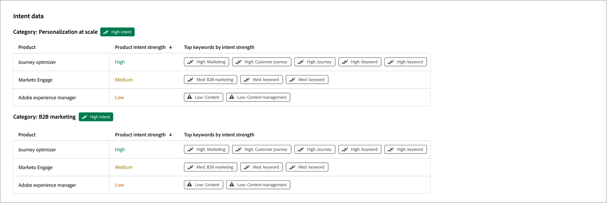

# インテントスコア {#intent-scores}

インテントスコアは、キーワード、製品、製品のカテゴリーに、ある人物やアカウントがどの程度関心を持っているのかを測定します。 Adobe Journey Optimizer B2B editionは、マシンラーニングを利用してスコアを計算し、手作業によるルールや固定小数点法ではなく、意味の類似性を測定します。 各スコアは0から1に正規化され、スコアが高いほどインテントが強いことを示します。

コンテンツの関連性は約12時間ごとに更新され、インテントスコアは毎日再計算されます。 スコアは、キーワードから商品、人物からアカウントまでを集計します。 インテントスコアは、[ インテリジェントダッシュボード ](../dashboards/intelligent-dashboard.md)、および[ アカウントの詳細](../accounts/account-details.md)、[_購買グループの詳細_ ページ ](../buying-groups/buying-group-details.md)、および[人物の詳細](../accounts/person-details.md) ページ全体に表示されます。

{width="700" zoomable="yes"}

以下のセクションでは、インテントスコアリングの背後にあるコアコンセプト、スコアを最新の状態に保つ継続的なプロセス、各スコアの背後にある計算ロジック、設定できる設定について説明します。

## コアコンセプト {#core-concepts}

インテント検出とは、オーディエンスのエンゲージメントが製品やキーワードとどの程度一致しているかを測定します。次に、その類似性を、そのオーディエンスがどの程度エンゲージメントしているのかを測定します。 このモデルは3つのエンティティで構成されています。

| エンティティ | 説明 |
|--------|--------------|
| 顧客 | 電子メールの開封、web ページへの訪問、時間の経過に伴うエンゲージメントなど、コンテンツを利用している個人。 |
| コンテンツ | オーディエンスがエンゲージメントするメールやweb ページ。 ウェビナーやキャンペーンなど、その他の形式は時間の経過とともに追加されます。 |
| 分類 | 測定したい興味を表す、キーワード、製品、製品カテゴリの構造。 |

### デフォルトの分類と更新 {#taxonomy}

分類法、意図を測定するキーワード、製品、カテゴリーは、設定なしで使用できます。

分類マッピングは、_[!UICONTROL インテント マッピング]_ ページでいつでも確認および更新できます。 分類の設定プロセスについては、[ インテントデータ ](../admin/intent-data.md)を参照してください。

### コンテンツの適切さ {#content-relevance}

Journey Optimizer B2B editionでは、コンテンツと分類法を意味の数学的表現に変換し、類似性モデルを使用してデータの整合性を測定します。 キーワードや商品と一致するコンテンツは、関連性スコアが高くなります。 無関係なコンテンツはスコアが低くなります。

類似性モデルは一般的な言語で事前トレーニングされているため、開始するために顧客固有のトレーニングは必要ありません。

## スコアリングプロセス {#scoring-process}

継続的なプロセスにより、生のエンゲージメントを完了したインテントスコアに変換します。 各ステージは、前のステージで生み出された内容に基づいています。

{width="700"}

### エンゲージメント獲得 {#engagement-capture}

個人が有する有意義なあらゆる顧客接点は、その発生時に把握され、関連するコンテンツにリンクされます。

* ページへの訪問、メールの開封数やクリック数、フォーム送信など、類似のアクティビティをエンゲージメントイベントとして記録できます。
* また、コンテンツの一意の要素を書き出し、次の段階で分析できるようにします。
* **更新ケイデンス** – 継続的（エンゲージメントが発生した場合）。

### コンテンツ抽出 {#content-extraction}

コンテンツをスコア付けして関連性を評価する前に、Journey Optimizer B2B editionはテキストを抽出して読み取ります。

* 基礎となるテキストが、web ページであろうと電子メールであろうと、新しいコンテンツごとに抽出されます。
* フォーム入力などの一部のアクティビティタイプでは、既に独自の記述的なコンテンツが含まれており、このステップはスキップされます。
* 壊れたリンクや削除されたリンクなど、取得できないコンテンツは、今後ログに記録され、除外されます。
* **更新ケイデンス** – 新しいコンテンツが検出されたときに更新します。

### 関連性スコアリング {#relevance-scoring}

あらゆるアセットは、誰が関与したかに関係なく、自身の分類基準に照らして測定されます。

* 類似性モデルを活用して、電子メールやweb ページを分析し、キーワード、商品、カテゴリーと比較します。
* この結果、そのアセットの関連スコアは、関連するキーワードや商品ごとに0から1の間になります。
* **更新の頻度** - 12時間ごと。

### 日々のインテント計算 {#daily-intent-calculation}

エンゲージメントとコンテンツの関連性を組み合わせることで、キーワードや商品ごとに、1日あたりのインテントスコアを算出できます。

* 各アクティビティタイプには、設定可能な重み付けがあります。 たとえば、フォーム送信は、ページビューよりもはるかに多くカウントされます。
* 最近の活動は過去の活動よりも重要なので、誰かが今週やったことを1か月前にやったことよりもスコアが高くなっています。
* 信頼度は、配信数だけでなく、エンゲージメントの一貫性を反映します。
* **更新の頻度** – 毎日。

### スコア配信 {#score-delivery}

日次スコアは集計され、インテントレベルを受け取り、ダッシュボードに配信されます。

* 各スコアには、高、Medium、低のインテントレベルでタグ付けされます。
* スコアと適切なアカウントのリンクにより、営業部門とマーケティング部門は、個人レベルとアカウントレベルの両方で意図を把握できます。
* インテントレベルが変更されたユーザーのみが更新されるため、ダッシュボードには最新の有意義な変化が反映されます。
* **更新の頻度** – 毎日。

## スコア計算ロジック {#score-calculation-logic}

この計算は5つのレイヤーで構成され、それぞれ生の関連性データとエンゲージメントデータにさらにコンテキストを追加します。

### コンテンツとトピックの関連性 {#relevance-to-topic}

キーワード、製品、カテゴリーを意味するコンテンツのあらゆる要素とトピックは、その意味の数学的表現に翻訳されます。 トピックと類似した意味を持つコンテンツは、この表現でより近くに配置されます。 関連性とは、意味における親近感の尺度であり、正確な単語の一致ではありません。

### 日々のエンゲージメントの重み付け {#engagement-weighting}

特定の日のエンゲージメントスコアとは、エンゲージメントしたあらゆる要素の関連性を加重平均したものです。 価値の高い施策は売上につながる。

>[!BEGINSHADEBOX &quot;例&quot;]

1日で3つのコンテンツに取り組む。 ページビューの重みは1で、フォーム送信の重みは5です。

1回のフォーム送信はページビューの5倍にもなるため、合計3つのアイテムを操作したとしても、1日のスコアに大きく影響します。

そのトピックの1日のスコアは、0～1 スケールで約0.70です。

>[!ENDSHADEBOX]

### 最新減衰 {#recency-decay}

個人のスコアは、過去数日間の活動のブレンドを反映し、最近の活動は過去の活動よりもはるかに重み付けされています。 約1週間後、古いアクティビティの影響は最小限に抑えられるため、常に現在の関心を反映します。 実際には、今日の訪問は昨日の訪問を上回り、10日前の訪問を上回っています。

### スコアの正規化とインテントレベル {#normalization-intent-levels}

調整された各スコアは、インスタンス内の他のユーザーに対して0～1の一貫性のあるスケールで配置され、インテントレベルに分類されます。

| 最終スコア | 意図レベル |
|-------------|--------------|
| 0.6以上 | 高 |
| 0.2～0.6 | 中 |
| 0.2未満 | 低 |

### スコア集計 {#score-aggregation}

個々のスコアが集計されるため、最も詳細なレベルだけでなく、決定にとって重要なレベルで意図をレビューすることができます。

* **キーワードから商品** - キーワードレベルの集計で計算されたスコアは、1つの検索語だけでなく、商品への関心を示します。
* **人物からアカウントへ** - アカウントスコアは、すべての人物のスコアを集計するため、購買グループ全体で意図が示されている場合に確認できます。

{width="500"}

製品レベルのビューを使用して、個々のキーワードがトレンドではなく、全体的にどの製品が関心を高めているのかを確認できます。 アカウントレベルのビューを使用して、購買グループ全体が、単一のエンゲージメントした人物に反応するのではなく、関心が高まっているタイミングを確認できます。

## 設定の可能性 {#configurable-settings}

スコアリングロジックのほとんどは、信頼性の高い、比較可能な結果を長期的に維持できるように修正されています。 製品管理者は、要件に合わせて2つの設定をカスタマイズできます。

* **アクティビティの重み付け** - インテントスコアに大きな影響を与えるには、デモリクエストや価格ページ訪問など、価値の高いアクティビティの重み付けを増やします。 アクティビティを完全に除外するには、その重みをゼロに設定します。これは、意図に貢献しない購読解除などのアクションに役立ちます。 インテント計算のアクティビティの重み付けでは、[ エンゲージメントスコア ](../buying-groups/engagement-scores.md)も駆動するのと同じ重み付けモデルを使用します。 アクティビティの重みを変更するには、[_エンゲージメントスコアの重み付けを設定_](../admin/engagement-score-weighting.md)&#x200B;するを参照してください。

* **分類マッピング** - スコアリングに基づくキーワード、製品、およびカテゴリを使用できます。 _[!UICONTROL インテント マッピング]_ ページでいつでも確認して更新できます。 設定プロセスについては、[_インテントデータ_](../admin/intent-data.md)&#x200B;を参照してください。

コンテンツの関連性、アクティビティの減衰、および&#x200B;_高_、_Medium_、_低_&#x200B;のしきい値など、他のすべては、スコアが一貫性を維持し、時間の経過とともに比較可能になるように修正されます。

## スコア原則 {#scoring-principles}

インテントスコアを確認し、それに基づいて行動する際には、次の原則を念頭に置いてください。

### モデル駆動型スコアリング {#model-driven}

維持するポイントの割り当てやキーワードルールはありません。 このモデルは、コンテンツと分類基準から直接関連性を学習するため、継続的な設定をおこなうことなく、コンテンツライブラリの拡大や変更に合わせてスコアリングの一貫性を維持できます。

### 相対スコアリング {#relative-scoring}

スコアは、個人またはアカウントが現在の連絡先の中でランク付けされている場所を反映し、システムは現在の母集団に基づいて毎日スコアを再計算します。 固定のユニバーサル番号ではなく、独自のインスタンス内の人物とアカウントを比較するためにスコアを使用します。 スコアは、ある企業から別の企業に直接比較されるわけではありません。

### データの鮮度 {#data-freshness}

新しいコンテンツが表示されると、コンテンツの関連性は約12時間ごとに更新されます。 インテントスコアは1日に1回再計算されるため、ダッシュボードには毎朝、前日のアクティビティが反映されます。
