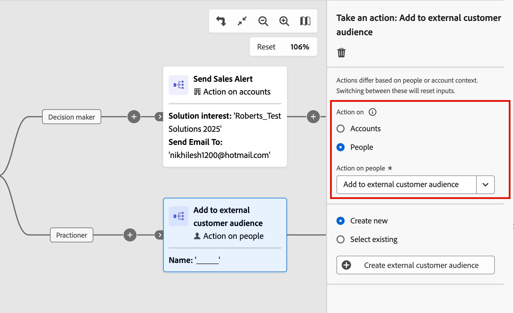
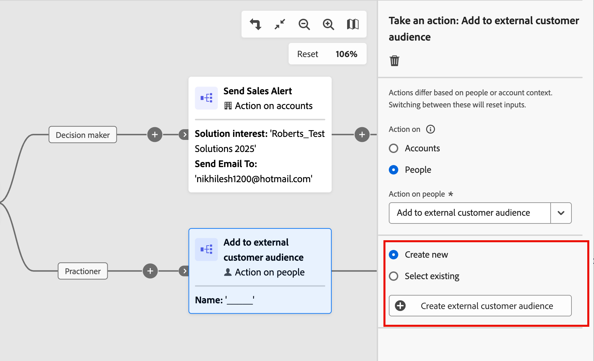
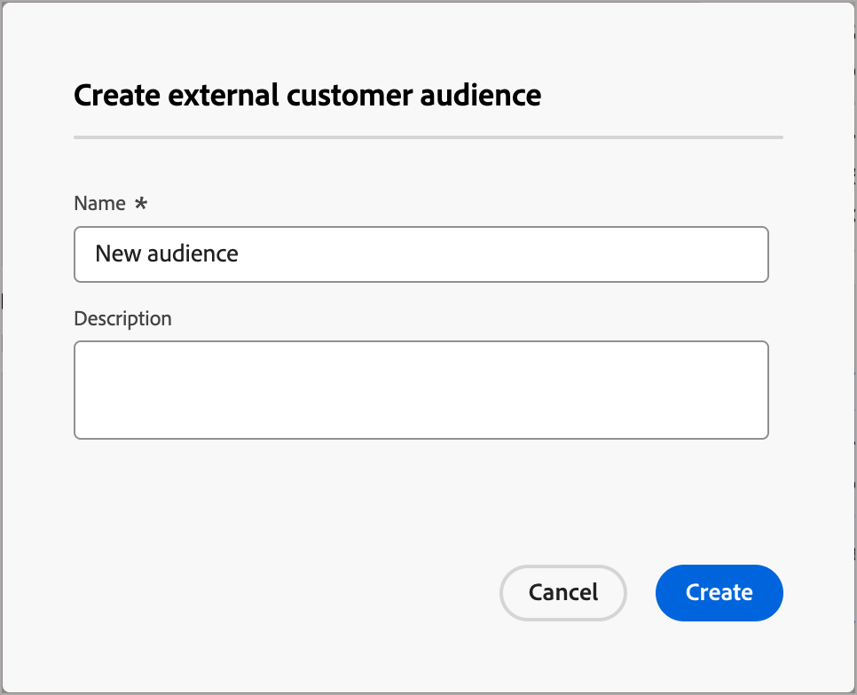
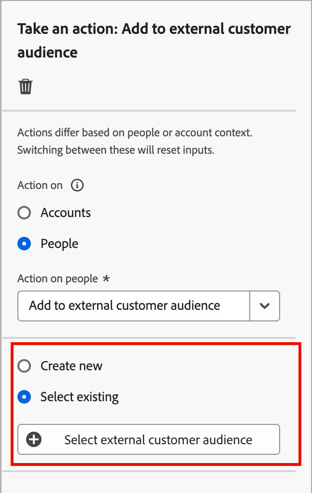
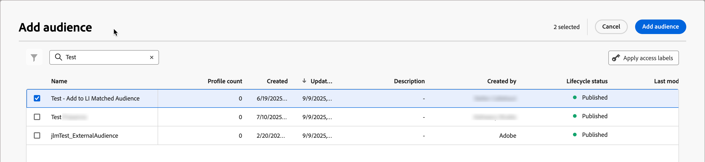
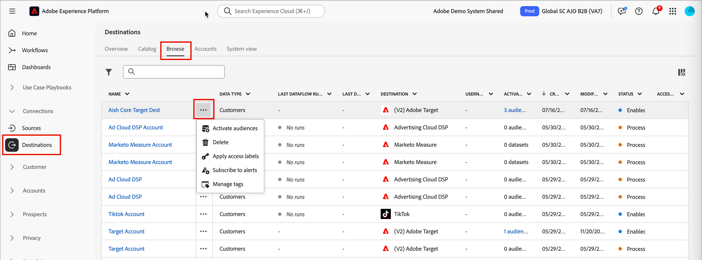
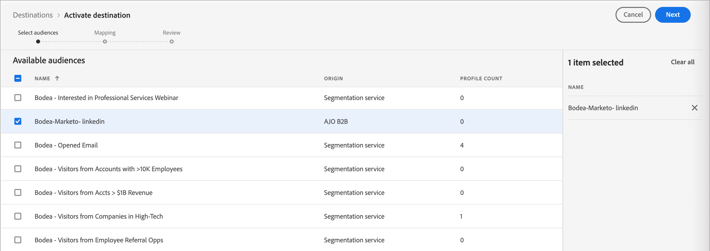
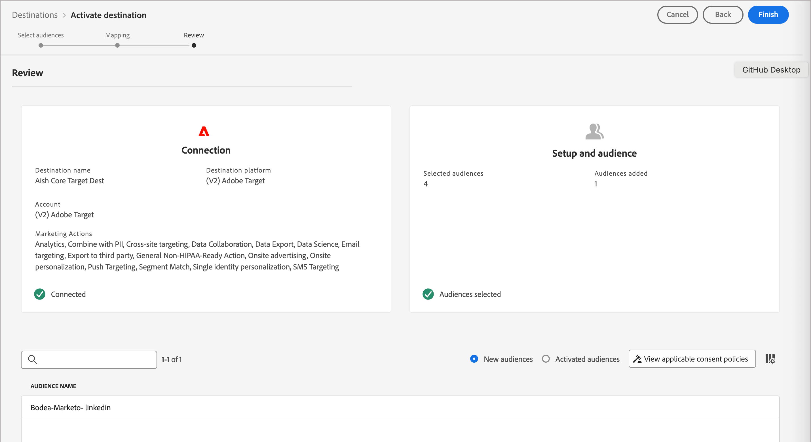

# [!DNL Adobe Target]人の外部オーディエンス

アカウントジャーニーを通じて、[!DNL Adobe Target]の外部オーディエンスのエクスペリエンスをアクティブ化およびパーソナライズできます。 この統合を使用して、高度でカスタマイズされたパーソナライゼーションを実現し、エンゲージメントを高め、[!DNL Target]と[!DNL Journey Optimizer B2B Edition]の間でプラットフォーム間の一貫性を維持します。 この一貫性により、B2B バイヤージャーニー全体を通じて、購買グループのweb チャネルを調整し、パーソナライズできます。

Adobe Targetを通じて外部オーディエンスをアクティブ化するには、次の2つの手順を実行します。

1. ジャーニーから[外部顧客オーディエンスに追加](#add-to-customer-external-audience-from-a-journey)。
2. [外部オーディエンス &#x200B;](#activate-the-external-audience-to-target-as-a-destination)を[!DNL Target]の宛先としてExperience Platformでアクティブ化します。

## ジャーニーから顧客外部オーディエンスに追加

ジャーニーで、[&#x200B; アクションを追加&#x200B;_アクションを実行_ ノード &#x200B;](../journeys/action-nodes.md)して、_[!UICONTROL 外部顧客オーディエンスに追加]_ アクションを実行します。 通常、アクションは、イベントや以前のアクションなど、何らかのトリガーの結果として発生させたいものです。 ジャーニーは、個人プロファイルを持つ適格なアカウントがノードに到達したときにアクションを実行します。

>[!NOTE]
>
>人物プロファイルを持つ適格なアカウントが、公開されたジャーニーで&#x200B;_外部カスタマーオーディエンスに追加_ ノードに到達すると、それらのプロファイルが外部オーディエンスに入力されるまでに最大48時間かかる場合があります。

1. ジャーニーキャンバスで「_アクションを実行_」ノードを選択した状態で、「_[!UICONTROL アクション：]_ **[!UICONTROL 人]**」オプションを選択します。

1. _[!UICONTROL 人物に対するアクション]_&#x200B;の場合、**[!UICONTROL 外部顧客オーディエンスに追加]**&#x200B;を選択します。

   {width="550" zoomable="yes"}

1. 右側のノードプロパティから、外部オーディエンスを設定します。

   * 既に1つ以上の外部オーディエンスが作成されている場合は、**[!UICONTROL 既存の]**&#x200B;を選択し、[使用するオーディエンスを選択します](#choose-an-external-audience)。

   * ノードに使用するオーディエンス [&#128279;](#create-an-external-audience)を作成する場合は、**[!UICONTROL 新規作成]**&#x200B;を選択します。

### 外部オーディエンスの作成

1. ノードプロパティで「**[!UICONTROL 新しい]**&#x200B;を作成」オプションを選択したら、「**[!UICONTROL 外部顧客オーディエンスを作成]**」をクリックします。

   {width="400"}

1. ダイアログで、新しいオーディエンスの&#x200B;**[!UICONTROL 名前]** （必須）と&#x200B;**[!UICONTROL 説明]** （オプション）を入力します。

   {width="400"}

1. 「**[!UICONTROL 作成]**」をクリックします。

   新しいオーディエンスが作成され、確認メッセージが表示されます。 その後、ノードアクションの既存のオーディエンスとして使用できます。

### 外部オーディエンスの選択

1. ノードプロパティで「**[!UICONTROL 既存の]**&#x200B;を選択」オプションを選択したら、「**[!UICONTROL 外部顧客オーディエンスを選択]**」をクリックします。

   {width="300"}

1. _[!UICONTROL オーディエンスを追加]_ ダイアログで、使用するオーディエンスを選択します。

   「_検索_」フィールドにテキストを入力すると、オーディエンス名に一致する項目の表示をフィルタリングできます。

   {width="700" zoomable="yes"}

1. 「**[!UICONTROL オーディエンスを追加]**」をクリックします。

## 外部オーディエンスをTargetの宛先としてアクティブ化する

外部オーディエンスをAdobe Targetにアクティベートするには、[!DNL Adobe Target]を[!DNL Real-time Customer Data Platform (RTCDP)]の宛先として設定している必要があります。 この設定について詳しくは、[RTCDPのドキュメント &#x200B;](https://experienceleague.adobe.com/ja/docs/platform-learn/tutorials/destinations/target/configure-the-target-destination){target="_blank"}を参照してください。

>[!IMPORTANT]
>
>ジャーニーを通じてアクティベーションを使用するには、RTCDPの実装でメールアドレスをIDとして使用する必要があります。

アクティブ化プロセスでは、[!DNL Adobe Target]を外部オーディエンスまたは外部宛先として追加する必要があります。 まず、オーディエンスビルダーで[!DNL Target] オーディエンスを構築します。 また、プレースホルダーオーディエンスを作成し、外部オーディエンス機能を追加することもできます。

>[!BEGINSHADEBOX]

この手順では、割り当てられたユーザーロールに対する次の権限が必要です。

* **[!UICONTROL Experience Platform]** - _[!UICONTROL 宛先]_ リソース：`Activate Destinations`、`Manage and Activate Dataset Destination`、および`View Destination`
* **[!DNL Target]** - `Approver`

>[!ENDSHADEBOX]

1. Experience Platformで、左側のナビゲーションで&#x200B;**[!UICONTROL Connections]** > **[!UICONTROL Destinations]**&#x200B;に移動します。

1. 「**[!UICONTROL 参照]**」タブを選択します。

1. セグメントのアクティベーションに使用する宛先接続を見つけ、名前の横にある&#x200B;_詳細メニュー_ （**...**）アイコンをクリックし、**[!UICONTROL オーディエンスのアクティベーション]**&#x200B;を選択します。

   _[!UICONTROL 検索]_ フィールドにテキストを入力して、一致する一致の表示先を名前でフィルタリングします。

   {width="800" zoomable="yes"}

1. _[!UICONTROL 使用可能なオーディエンス]_&#x200B;のリストで、外部オーディエンスを選択し、**[!UICONTROL 次へ]**&#x200B;をクリックします。

   {width="700" zoomable="yes"}

1. 宛先への追加のフィールドマッピングを実行し（オプション）、**[!UICONTROL 次へ]**&#x200B;をクリックします。

1. 新しいオーディエンスパラメーターを確認し、**[!UICONTROL 終了]**&#x200B;をクリックします。

   {width="700" zoomable="yes"}

アクティブ化すると、[Adobe Target オーディエンス &#x200B;](https://experienceleague.adobe.com/en/docs/target/using/audiences/create-audiences/audiences#use-list){target="_blank"}のオーディエンスが表示され、Adobe Target アクティビティで使用できます。
