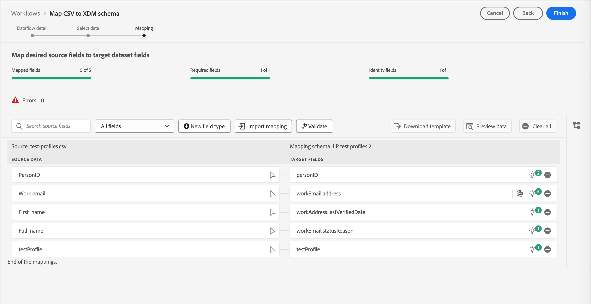

# プロファイルのテスト {#test-profiles}

Journey Optimizer B2B editionでランディングページのコンテンツ [&#128279;](../content/landing-pages-create-publish.md#test-landing-page)をプレビューおよびテストするには、テストプロファイルが必要です。 スキーマの作成、データセットの作成、CSV ファイルのアップロードを行うことで、一連のテストプロファイルを定義できます。

<!--
>[!NOTE]
>
>[!DNL Journey Optimizer B2B Edition] allows testing different variants of your content by previewing it and sending proofs using sample input data uploaded from a CSV or JSON file, or added manually. 
-->

テストプロファイルの作成は、[!DNL Adobe Experience Platform]での通常のプロファイルの作成に似ています。 詳しくは、[リアルタイム顧客プロファイルのドキュメント](https://experienceleague.adobe.com/docs/experience-platform/profile/home.html?lang=ja){target="_blank"}を参照してください。


## スキーマの作成 {#create-schema}

プロファイルを作成するには、まず[!DNL Journey Optimizer B2B Edition]でスキーマを作成する必要があります。

1. 左側のナビゲーションで「**[!UICONTROL データ管理]**」を展開し、**[!UICONTROL スキーマ]**」を選択し、右上の「**[!UICONTROL スキーマを作成]**」をクリックします。

   {width="800" zoomable="yes"}

1. スキーマ作成オプションとして「**[!UICONTROL 標準]**」を選択します。

1. **[!UICONTROL Manual]**&#x200B;などのスキーマタイプを選択し、**[!UICONTROL Select]**&#x200B;をクリックします。

   {width="500"}

1. スキーマタイプ（例：**[!UICONTROL 個人プロファイル]**）を選択し、「**[!UICONTROL 次へ]**」をクリックします。

   {width="700" zoomable="yes"}

1. スキーマの名前（必須）と説明（オプション）を入力し、**[!UICONTROL 終了]**&#x200B;をクリックします。

   {width="700" zoomable="yes"}

   スキーマ構造が表示され、左側に&#x200B;_[!UICONTROL コンポジション]_ パネルが表示されます。

1. **[!UICONTROL フィールドグループ]** セクションで、**[!UICONTROL 追加]**&#x200B;をクリックし、適切なフィールドグループを選択します。

   検索ツールを使用して、**[!UICONTROL プロファイルテストの詳細]** フィールドグループを見つけて選択します。

   {width="700" zoomable="yes"}

   完了したら、**[!UICONTROL フィールドグループを追加]**&#x200B;をクリックすると、フィールドグループのリストがスキーマの概要画面に表示されます。

   この手順を繰り返して、テストプロファイルに使用する追加のフィールドグループ（**[!UICONTROL 人連絡先の詳細]**&#x200B;や&#x200B;**[!UICONTROL 作業連絡先の詳細]**&#x200B;など）を追加します。

1. フィールドのリストで、プライマリ ID として定義するフィールドをクリックします。

1. 右の&#x200B;_[!UICONTROL フィールドのプロパティ]_&#x200B;ペインで、「**[!UICONTROL ID]**」オプションと「**[!UICONTROL メイン ID]**」オプションをオンにし、名前空間を選択します。

   メールアドレスをプライマリ ID にする場合は、「**[!UICONTROL メール]**」名前空間を選択します。

   {width="700" zoomable="yes"}

   「**[!UICONTROL 適用]**」をクリックします。

1. スキーマを選択し、**[!UICONTROL スキーマのプロパティ]**&#x200B;ペインで「**[!UICONTROL プロファイル]**」オプションを有効にします。

   {width="700" zoomable="yes"}

1. 「**[!UICONTROL 保存]**」をクリックします。

スキーマ作成について詳しくは、[XDM ドキュメント &#x200B;](https://experienceleague.adobe.com/docs/experience-platform/xdm/ui/resources/schemas.html?lang=ja#prerequisites){target="_blank"}を参照してください。

>[!IMPORTANT]
>
>テストプロファイル取り込み用のデータセットを作成または置き換える場合は、スキーマに目的の名前空間のプライマリ ID フィールド （`/personID`）に正しいID記述子が適用されていることを確認します。 ID記述子が見つからないか、誤って設定されている場合、取り込みプロセスが正常に完了しても、このデータセットに取り込まれたプロファイルがテストプロファイル （`testProfile = true`）としてフラグ付けされない場合があります。
>
>取り込み後にテストプロファイルが正しくフラグ付けされない場合：
>
>1. データセットに関連付けられているスキーマを確認します。
>1. プライマリ ID フィールドに、名前空間に適したID記述子が含まれていることを確認します。
>1. 記述子が見つからない場合は、スキーマを更新してID記述子を追加し、データを再取得します。

## データセットの作成 {#create-dataset}

スキーマを作成したら、プロファイルの読み込みに使用するデータセットを作成します。 データセットの作成について詳しくは、[&#x200B; カタログサービスのドキュメント &#x200B;](https://experienceleague.adobe.com/docs/experience-platform/catalog/datasets/user-guide.html?lang=ja#getting-started){target="_blank"}を参照してください。

1. 左側のナビゲーションの&#x200B;_[!UICONTROL データ管理]_&#x200B;で、**[!UICONTROL データセット]**&#x200B;を選択します。

1. 右上の「**[!UICONTROL データセットを作成]**」をクリックします。

   {width="800" zoomable="yes"}

1. 「**[!UICONTROL スキーマからデータセットを作成]**」を選択します。

   {width="500"}

1. 以前に作成したスキーマを選択し、**[!UICONTROL 次へ]**&#x200B;をクリックします。

1. 名前を選択し、**[!UICONTROL 終了]**&#x200B;をクリックします。

   {width="700" zoomable="yes"}

1. 右側のパネルで、**[!UICONTROL プロファイル]** オプションを有効にします。

## CSV ファイルを使用したテストプロファイルの作成 {#create-test-profiles-csv}

[!DNL Adobe Experience Platform]では、異なるプロファイルフィールドを含むCSV ファイルをデータセットにアップロードすることで、プロファイルを作成できます。 これが最も簡単なメソッドです。

1. スプレッドシートソフトウェアを使用してシンプルなCSV ファイルを作成します。

1. 必要な各フィールドごとに 1 列ずつ追加します。

   プライマリ ID フィールド （`personID`など）と`testProfile` フィールドが`true`に設定されていることを確認してください。

1. プロファイルごとに1行を追加し、各フィールドの値を追加します。

   {width="600" zoomable="yes"}

1. スプレッドシートをcsv ファイルとして保存し、カンマが区切り文字として使用されるようにします。

1. [!DNL Adobe Experience Platform]で、**[!UICONTROL ワークフロー]**&#x200B;に移動します。

1. **[!UICONTROL CSVをXDM スキーマにマッピング]**&#x200B;を選択し、**[!UICONTROL 起動]**&#x200B;をクリックします。

   {width="800" zoomable="yes"}

1. 読み込みに使用するデータセットを選択し、**[!UICONTROL 次へ]**&#x200B;をクリックします。

   {width="700" zoomable="yes"}

1. 「**[!UICONTROL ファイルを選択]**」をクリックしてCSV ファイルを選択するか、システムからファイルをドラッグ&amp;ドロップします。

   ファイルのアップロードが完了したら、**[!UICONTROL 次へ]**&#x200B;をクリックします。

   {width="700" zoomable="yes"}

1. ソース CSV フィールドをスキーマフィールドにマッピングし、「**[!UICONTROL 終了]**」をクリックします。

   {width="700" zoomable="yes"}

   データの読み込みが開始します。 ステータスが&#x200B;_処理中_&#x200B;から&#x200B;_成功_&#x200B;に移動します。

1. 右上の「**[!UICONTROL データセットをプレビュー]**」をクリックし、データセットに追加されたテストプロファイルが正しいことを確認します。

   {width="700" zoomable="yes"}

   その後、テストプロファイルを使用して、ランディングページのコンテンツを[&#x200B; テストできます](../content/landing-pages-create-publish.md#test-landing-page)。

>[!NOTE]
>
>CSV データの読み込みについて詳しくは、[&#x200B; データ取り込みドキュメント &#x200B;](https://experienceleague.adobe.com/docs/experience-platform/ingestion/tutorials/map-a-csv-file.html?lang=ja#tutorials){target="_blank"}を参照してください。

<!--
## Create test profiles using API calls {#create-test-profiles-api}

You can also create test profiles via API calls. Learn more in [[!DNL Adobe Experience Platform] documentation](https://experienceleague.adobe.com/docs/experience-platform/profile/home.html){target="_blank"}.

You must use a Profile schema that contains the **[!UICONTROL Profile test details]** field group. The `testProfile` flag is part of this field group.
When creating a profile, make sure you pass the value: `testProfile = true`.

You can also update an existing profile to change its `testProfile` flag to `true`.

Here is an example of an API call to create a test profile:

```bash
curl -X POST \
'https://dcs.adobedc.net/collection/xxxxxxxxxxxxxx' \
-H 'Cache-Control: no-cache' \
-H 'Content-Type: application/json' \
-H 'Postman-Token: xxxxx' \
-H 'cache-control: no-cache' \
-H 'x-api-key: xxxxx' \
-H 'x-gw-ims-org-id: xxxxx' \
-d '{
"header": {
"msgType": "xdmEntityCreate",
"msgId": "xxxxx",
"msgVersion": "xxxxx",
"xactionid":"xxxxx",
"datasetId": "xxxxx",
"imsOrgId": "xxxxx",
"source": {
"name": "Postman"
},
"schemaRef": {
"id": "https://example.adobe.com/mobile/schemas/xxxxx",
"contentType": "application/vnd.adobe.xed-full+json;version=1"
}
},
"body": {
"xdmMeta": {
"schemaRef": {
"contentType": "application/vnd.adobe.xed-full+json;version=1"
}
},
"xdmEntity": {
"_id": "xxxxx",
"_mobile":{
"ECID": "xxxxx"
},
"testProfile":true
}
}
}'
```
-->
