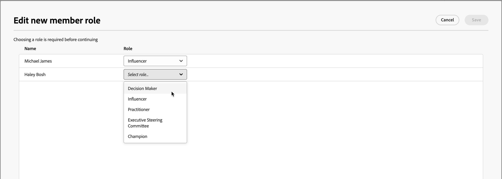

# 購買グループの詳細

Journey Optimizer B2B editionのどこからでも購入グループ名をクリックすると、購入グループの詳細が表示されます。 この概要では、生成 AI の概要など、購入グループに関する有用な情報を提供します。 アカウントに関連付けられた連絡先に対して実行できる [ アクション ](#buying-group-actions) もあります。

{width="800" zoomable="yes"}

「**[!UICONTROL 概要]**」タブを使用してアカウントに関する情報を確認し、「**[!UICONTROL メンバー]**」タブを使用して購入グループメンバーのリストにアクセスします。

## 「概要」タブ

「概要」タブは、次の 3 つの主要セクションで構成されます。

### 購買グループの概要

{zoomable="yes"}

購買グループ要約セクションには、次の購買グループ情報が含まれます。

* 購買グループ名
* アカウント名（名前をクリックすると [ アカウントの詳細 ](../accounts/account-details.md) が開きます）
* 購買グループのメンバー数
* エンゲージメントスコア
* 完全性スコア
* 現在の購買グループのステージ
* 役割テンプレート （名前をクリックして [ 役割テンプレート ](buying-groups-role-templates.md#access-and-browse-role-templates) を開きます）
* 最終変更日/更新日
* 購入グループの生成 AI の概要

### アカウントの概要

{zoomable="yes"}

「アカウントの概要」セクションには、次のアカウント情報が含まれます。

* アカウント名（名前をクリックしてアカウントの詳細を開きます）
* アカウント内のユーザー数
* 業界
* 進行中の商談
* アカウントが現在使用されている最新の 3 つのアカウントジャーニー（名前をクリックするとジャーニーの詳細が開きます）
* アカウントの生成 AI 概要

### インテントデータ

Journey Optimizer B2B editionでは、インテント検出モデルが、購入グループメンバーのアクティビティに基づいて、十分な信頼性を持つ関心のあるソリューション/製品を予測します。 グループメンバーを購入する意図は、製品に興味を持つ確率として解釈することができます。

{{intent-data-note}}

{width="700" zoomable="yes"}

* インテントのレベル
* インテントシグナルのタイプ – キーワード、製品、ソリューション

### 購買グループのメンバー

{width="800" zoomable="yes"}

「_[!UICONTROL 購買グループ・メンバー]_」セクションには、購買グループ・メンバーを強調表示する 2 つの行が表示されます。

* **[!UICONTROL 意思決定者]** – 人物エンゲージメントスコアに基づく上位 3 人の意思決定者
* **[!UICONTROL 上位のエンゲージメントメンバー]** – 人物エンゲージメントスコアに基づいた、他の上位のエンゲージメントメンバー

各メンバーカードには、次の詳細が含まれます。

* 名前
* 職位
* 役割
* リードエンゲージメントスコア

「**[!UICONTROL 詳細の表示]**」をクリックして、次のメンバー情報にアクセスします。

* 生成 AI の概要
* 最新の注目のアクション
* 最新のアクティビティ （2）
* リードがメンバーであるその他の購入グループ （直近に追加された購入グループに基づいて 3 つの購入グループに制限）。
* メールアドレス
* 電話番号

{width="600" zoomable="yes"}

## 「メンバー」タブ

「**[!UICONTROL メンバー]**」タブを選択して、すべての購買グループ・メンバーのリストを表示します。 各メンバーリストには、名前、役割、役職、メールアドレス、電話番号、ソースが含まれます。

{width="700" zoomable="yes"}

「_メンバー_」タブから実行できるアクションは複数あります。

### 新しいメンバーの割り当て

アカウントには 1 つ以上の購入グループを関連付けることができます。通常、購入グループメンバーはアカウントの連絡先のサブセットです。 関連するアカウントから購入グループに手動で連絡先を追加できます。

1. 右上の **[!UICONTROL 新規メンバーを割り当て]** をクリックします。

1. _[!UICONTROL メンバーの割当て]_ ダイアログで、購買グループに追加するアカウント・リードを選択し、「**[!UICONTROL 次へ]**」をクリックします。

   {width="700" zoomable="yes"}

1. _[!UICONTROL 新しいメンバーの役割を編集]_ ダイアログで、新しい各メンバーに割り当てる役割を選択します。

   {width="700" zoomable="yes"}

1. 「**[!UICONTROL 保存]**」をクリックします。

### メンバーの削除

選択した 1 人以上（一度に最大 50 人）のメンバーを購買グループから削除できます。

1. 削除するメンバーのチェックボックスを選択します。

1. 下部の選択バーで、[**[!UICONTROL メンバーを削除]**] をクリックします。

   {width="700" zoomable="yes"}

1. 確認ダイアログで、「**[!UICONTROL 削除]**」をクリックします。

### ロールを編集

購買グループの選択した 1 人以上のメンバー（一度に 50 人まで）の役割を変更できます。

1. 役割を変更するメンバーのチェックボックスを選択します。

1. 下部の選択バーで、「**[!UICONTROL 役割を編集]**」をクリックします。

   {width="700" zoomable="yes"}

1. _[!UICONTROL メンバーの役割を編集]_ ダイアログで、各メンバーに割り当てる役割を選択します。

   {width="700" zoomable="yes"}

1. 「**[!UICONTROL 保存]**」をクリックします。

### メールを送信

マーケター承認済みのメールを、購入グループの 1 人以上の選択されたメンバー（一度に最大 50 人）に送信できます。 使用可能なメールのリストは、接続されたMarketo Engage インスタンスからの承認済みメールに制限されます。

1. メールを受信するメンバーのチェックボックスを選択します。

1. 右上または下部の選択バーで、「**[!UICONTROL メールを送信]**」をクリックします。

   {width="700" zoomable="yes"}

1. _[!UICONTROL メールを送信]_ ダイアログで、「Marketo Engage Workspace」を選択し、送信するメールのチェックボックスをオンにします。

   {width="700" zoomable="yes"}

1. 「**[!UICONTROL 送信]**」をクリックします。
