# 購買グループの詳細

Journey Optimizer B2B editionの任意の場所から購買グループ名をクリックすると、購買グループの詳細が表示されます。 この概要では、生成AIの概要など、購買グループに関する有用な情報を提供します。 アカウントに関連付けられた連絡先に対して実行できる[ アクション ](#buying-group-actions)もあります。

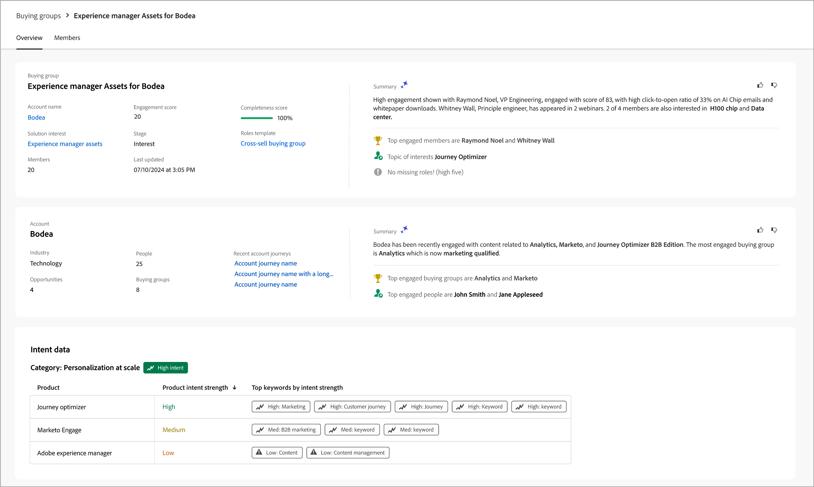{width="800" zoomable="yes"}

アカウントに関する情報を確認するには「**[!UICONTROL 概要]**」タブを使用し、購買グループのメンバーのリストにアクセスするには「**[!UICONTROL メンバー]**」タブを使用します。

## 「概要」タブ

「概要」タブは、次の3つの主要セクションで構成されています。

### 購買グループの要約

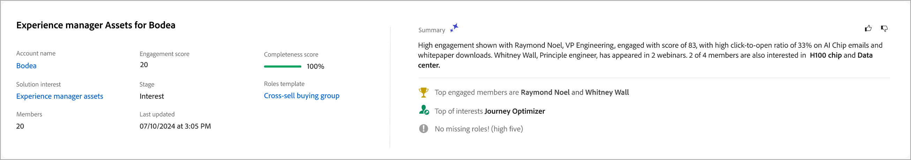{zoomable="yes"}

「購買グループの概要」セクションには、次の購買グループ情報が含まれます。

* 購買グループ名
* アカウント名（名前をクリックして[ アカウントの詳細](../accounts/account-details.md)を開きます）
* 購買グループのメンバー数
* エンゲージメントスコア
* 完全性スコア
* 現在の購買グループステージ
* 役割テンプレート （名前をクリックして[役割テンプレート ](buying-groups-role-templates.md#access-and-browse-role-templates)を開きます）
* 最終更新日/更新日
* 購買グループの生成AI概要

### アカウントの概要

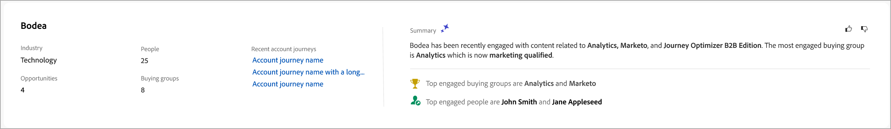{zoomable="yes"}

アカウントの概要セクションには、次のアカウント情報が含まれます。

* アカウント名（名前をクリックしてアカウントの詳細を開きます）
* アカウント内の人数
* 業界
* オープンな機会
* アカウントが現在使用されている最新の3つのアカウントジャーニー（名前をクリックしてジャーニーの詳細を開く）
* アカウントの生成AI概要

### インテントデータ

Journey Optimizer B2B editionでは、インテント検出モデルにより、購買グループメンバーのアクティビティにもとづいて、十分な信頼性で関心のあるソリューションや製品を予測できます。 購買グループのメンバーの意図は、製品に興味を持つ可能性と解釈できます。

{{intent-data-note}}

{width="700" zoomable="yes"}

* 意図のレベル
* インテントシグナルの種類 – キーワード、製品、ソリューション

### 購買グループのメンバー

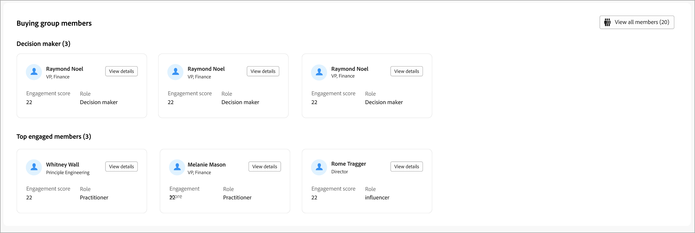{width="800" zoomable="yes"}

_[!UICONTROL 購買グループメンバー]_ セクションには、購買グループメンバーを強調表示する2つの行が表示されます。

* **[!UICONTROL 意思決定者]** – 人物のエンゲージメントスコアに基づく上位3人の意思決定者
* **[!UICONTROL 最もエンゲージメントの高いメンバー]** – 人物のエンゲージメントスコアに基づくその他の最もエンゲージメントの高いメンバー

各メンバーカードには、次の詳細が記載されています。

* 名前
* 職位
* 役割
* リードエンゲージメントスコア

「**[!UICONTROL 詳細を表示]**」をクリックして、次のメンバー情報にアクセスします。

* 生成AIによる要約
* 最新の注目のアクション
* 最近の活動（2）
* リードがメンバーであるその他の購買グループ（直近に追加された購買グループに基づいて3つの購買グループに限定）。
* メールアドレス
* 電話番号

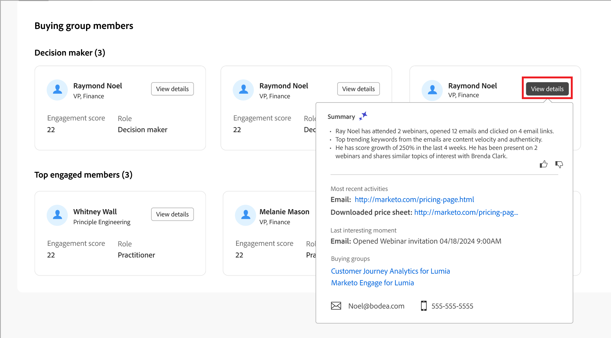{width="600" zoomable="yes"}

## 「メンバー」タブ

「**[!UICONTROL メンバー]**」タブを選択して、すべての購買グループメンバーのリストを表示します。 各メンバーリストには、名前、役割、役職、メールアドレス、電話番号、ソースが含まれます。

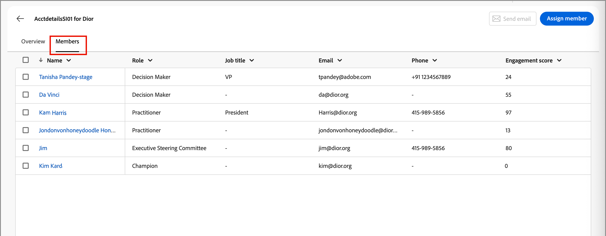{width="700" zoomable="yes"}

「_メンバー_」タブから実行できるアクションは複数あります。

### 新しいメンバーの割り当て

アカウントには1つ以上の購買グループを関連付けることができます。購買グループメンバーは、通常、アカウントの連絡先のサブセットです。 関連するアカウントの任意の連絡先を購買グループに手動で追加できます。

1. 右上の「**[!UICONTROL 新しいメンバーを割り当て]**」をクリックします。

1. _[!UICONTROL メンバーを割り当て]_ ダイアログで、購買グループに追加するアカウントリードを選択し、**[!UICONTROL 次へ]**&#x200B;をクリックします。

   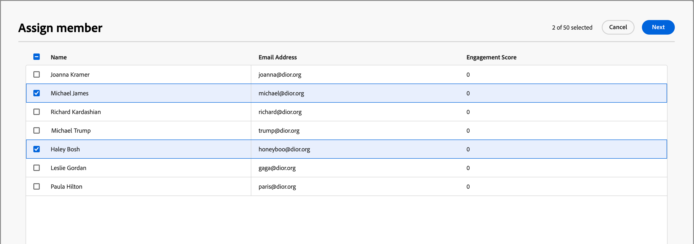{width="700" zoomable="yes"}

1. _[!UICONTROL 新しいメンバーの役割を編集]_ ダイアログで、新しいメンバーのそれぞれに割り当てる役割を選択します。

   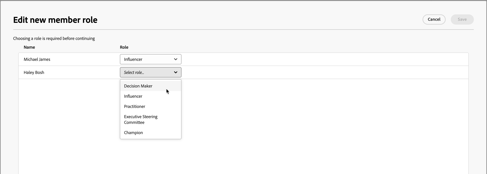{width="700" zoomable="yes"}

1. 「**[!UICONTROL 保存]**」をクリックします。

### メンバーの削除

選択した1人以上のメンバー（一度に50人まで）を購買グループから削除できます。

1. 削除するメンバーのチェックボックスをオンにします。

1. 下部の選択バーで、**[!UICONTROL メンバーの削除]**&#x200B;をクリックします。

   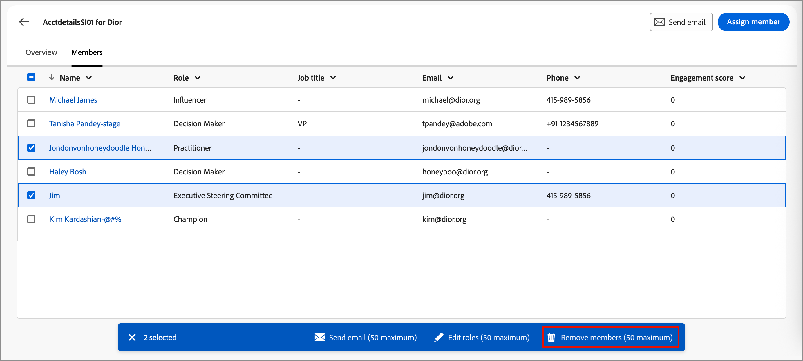{width="700" zoomable="yes"}

1. 確認ダイアログで、**[!UICONTROL 削除]**&#x200B;をクリックします。

### ロールを編集

購買グループの1人または複数の選択したメンバー（一度に最大50人）の役割を変更できます。

1. 役割を変更するメンバーのチェックボックスをオンにします。

1. 下部の選択バーで、**[!UICONTROL 役割を編集]**&#x200B;をクリックします。

   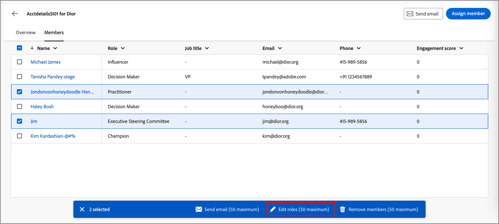{width="700" zoomable="yes"}

1. _[!UICONTROL メンバーの役割を編集]_ ダイアログで、各メンバーに割り当てる役割を選択します。

   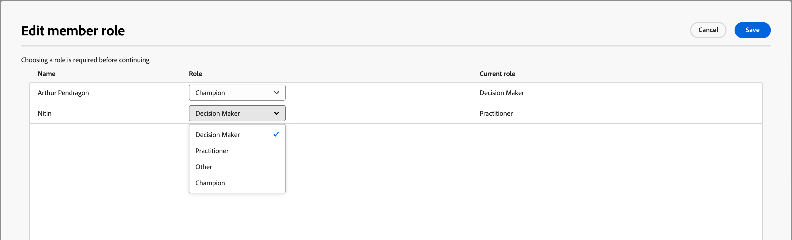{width="700" zoomable="yes"}

1. 「**[!UICONTROL 保存]**」をクリックします。

### メールを送信

マーケター承認済みのメールを、購買グループの1人または複数の選択したメンバー（1回に最大50人）に送信できます。 利用可能なメールのリストは、接続されたMarketo Engage インスタンスからの承認済みメールに限定されます。

1. メールを受信するメンバーのチェックボックスをオンにします。

1. 右上または下部の選択バーで、**[!UICONTROL メールを送信]**&#x200B;をクリックします。

   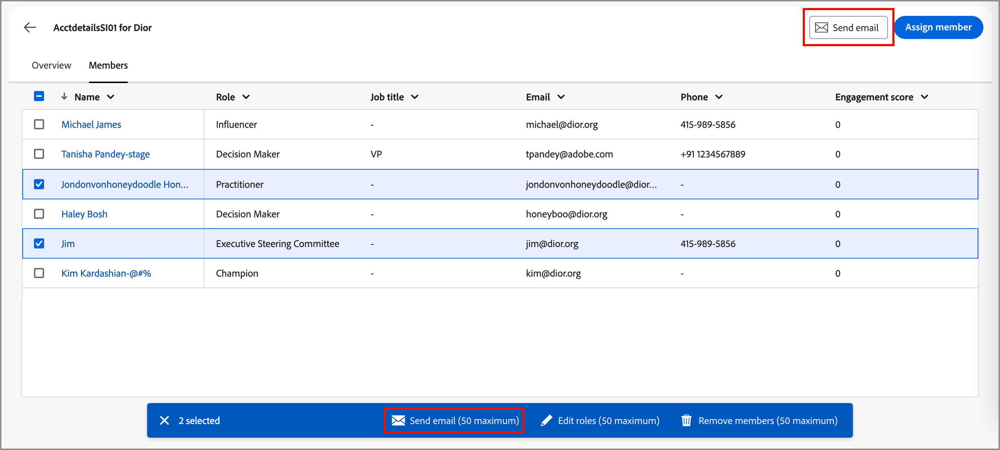{width="700" zoomable="yes"}

1. _[!UICONTROL メールを送信]_ ダイアログで、Marketo Engage ワークスペースを選択し、送信するメールのチェックボックスをオンにします。

   {width="700" zoomable="yes"}

1. 「**[!UICONTROL 送信]**」をクリックします。
