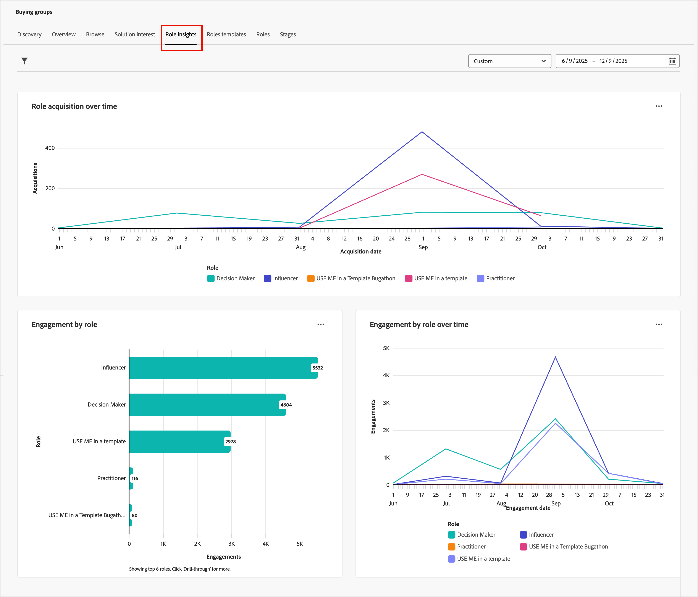

# 役割インサイトダッシュボード

役割インサイトダッシュボードでは、購買グループの役割が時間の経過とともにどのように進化し、エンゲージするかを可視化できます。 マーケターは、役割の獲得トレンド、エンゲージメントパターン、購買グループ内のさまざまな役割における、最近のキャンペーンがエンゲージメントをどのように促進しているのかを把握できます。

このダッシュボードにアクセスするには、左側のナビゲーションで「**[!UICONTROL アカウント]**」を展開し、**[!UICONTROL 購買グループ]**」を選択します。 「**[!UICONTROL 役割インサイト]**」タブを選択します。

{width="800" zoomable="yes"}

ダッシュボードには、次の3つのビューがあります。

| 表示 | 説明 |
| ---- | ----------- |
| [!UICONTROL 時間の経過に伴う役割の獲得] | 購買グループに追加されたメンバーの数を時系列で可視化し、役割ごとにセグメント化し、月別にグループ化します。 |
| [!UICONTROL 役割別エンゲージメント &#x200B;] | 購買グループの役割ごとに、合計エンゲージメントアクティビティ数（メール開封、クリック、フォーム送信など）を表示します。 |
| [!UICONTROL 役割別エンゲージメントの推移] | 購買グループのエンゲージメント活動を長期的に追跡し、役割別の毎月のエンゲージメント傾向を示します。 |

## データのフィルタリング

左上の&#x200B;_フィルター_ （）アイコンをクリックして、次のいずれかの属性を使用して、表示されたデータをフィルタリングします。

* **[!UICONTROL 役割]** – 選択した1つ以上の購買グループの役割でデータをフィルタリングします。
* **[!UICONTROL ソリューションの関心]** – 特定の製品ラインまたは製品に焦点を当てるために、選択した1つ以上のソリューションの関心によってデータをフィルタリングします。
* **[!UICONTROL 日付範囲]** - データを特定の期間（デフォルトは過去1年）に制限します。

役割インサイトの{width="400"}

各属性について、データのフィルタリングに使用する値を選択し、**[!UICONTROL 適用]**&#x200B;をクリックします。

## [!UICONTROL 時間の経過に伴う役割の獲得]

マーケティング部門と営業部門が新しい人材を獲得し、エンゲージメントを促進して、データを拡充することで、購買グループの新しいメンバーが適格になります。 このレポートでは、そうした取り組みが、新規適格な購買グループのメンバーにどのように変換されるのか、役割ごとに分けて示しています。 誰かが購買グループに追加されるたびに、レポートはその追加を対応する役割の下に記録します。

{width="600" zoomable="yes"}

グラフの各行は役割を表します。 ライン上のプロット ポイントにカーソルを合わせると、次のような詳細が表示されます。

* 取得日
* 取得数

詳細な情報を表示するには、右上の「**...**」メニューアイコンをクリックします。

## [!UICONTROL 役割別エンゲージメント &#x200B;]

このレポートは、選択した期間における購買グループの役割ごとに、合計エンゲージメントアクティビティ数を要約します。 このレポートは、マーケティング施策に対する各役割のエンゲージメントを可視化するために使用できます。

{width="500" zoomable="yes"}

グラフの各バーは役割を表します。 バーにカーソルを合わせると、表示されるカウントの詳細が表示されます。次の項目が表示されます。

* 役割名
* エンゲージメント数

詳細な情報を表示するには、右上の「**...**」メニューアイコンをクリックします。

## [!UICONTROL 役割別エンゲージメントの推移]

このレポートでは、購買グループのアクティビティを長期的に追跡し、最近のキャンペーンがさまざまな役割をまたいで、どのようにエンゲージメントを促進しているのかを把握できます。 この情報は、マーケティング戦略の最適化や特定の役割のターゲティングをより効果的に行うために使用できます。

{width="500" zoomable="yes"}

グラフの各行は役割を表します。 ライン上のプロット ポイントにカーソルを合わせると、次のような詳細が表示されます。

* 日付
* エンゲージメント数

詳細な情報を表示するには、右上の「**...**」メニューアイコンをクリックします。

## データの活用

データにエンゲージするには、_詳細_ （**...**）を使用します 各グラフの右上にメニューがあります。

### [!UICONTROL &#x200B; ドリルスルー]

_[!UICONTROL 役割ごとのエンゲージメント]_&#x200B;で、役割とソリューションの関心別のエンゲージメントの詳細な分析を行うには、**[!UICONTROL ドリルスルー]**&#x200B;を選択します。

ダッシュボードに適用されたグローバルフィルターは引き継がれます。 左上の&#x200B;_フィルター_ （）アイコンをクリックして、[&#x200B; ドリルスルー表示の属性フィルター](#filter-the-data)を変更します。

### [!UICONTROL 詳細を表示]

詳細データとインサイトを表示するには、**[!UICONTROL 詳細を表示]**&#x200B;を選択します。

表示されるポップアップには、データの分類を示すグラフと表が含まれます。

<!-- To download the data, click **[!UICONTROL Download CSV]** at the top right of the data table. -->
