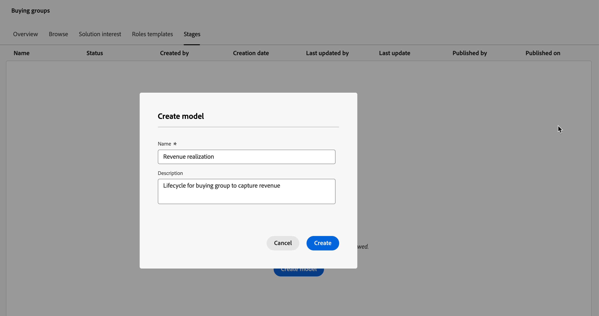
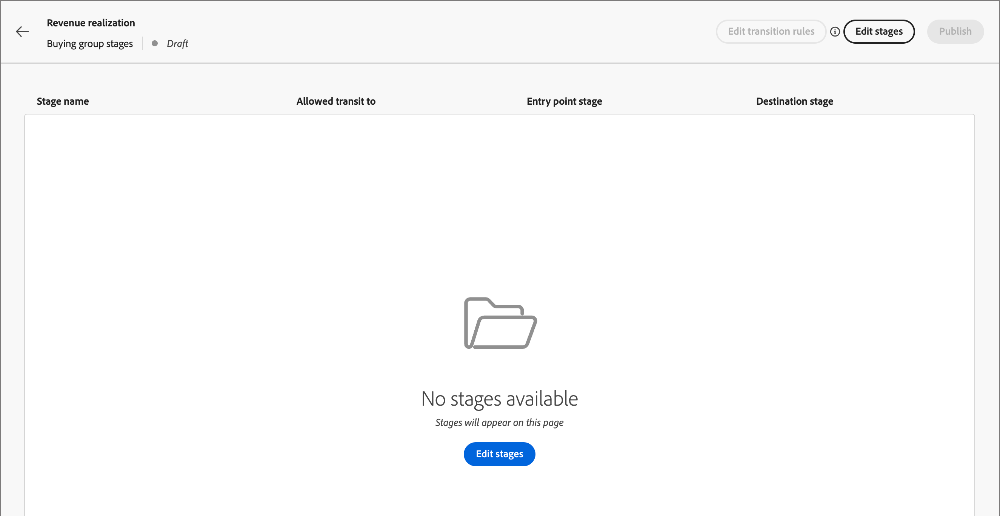
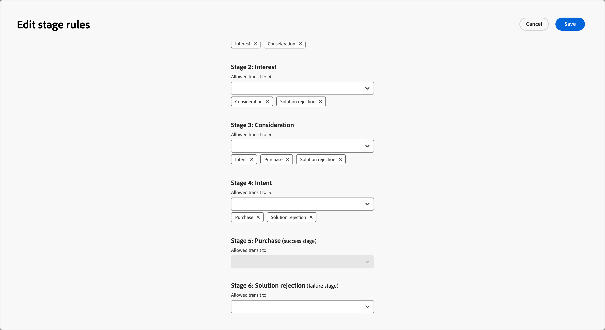
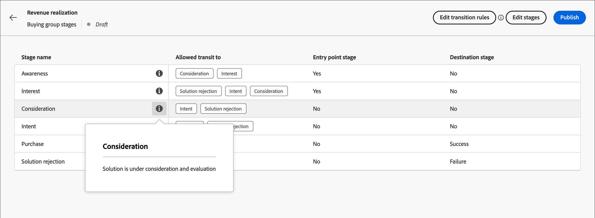
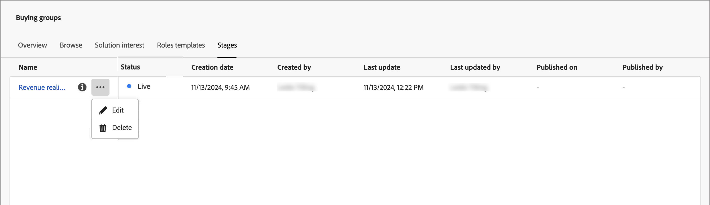
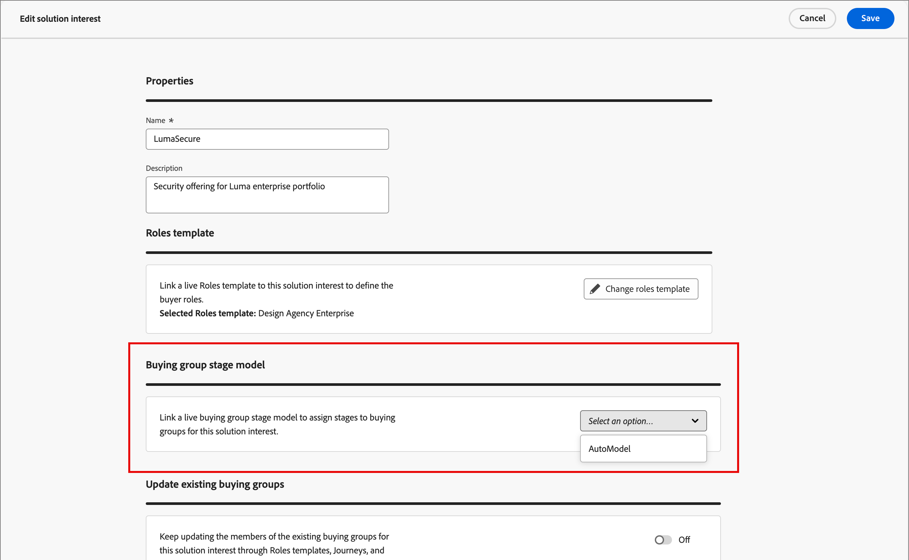
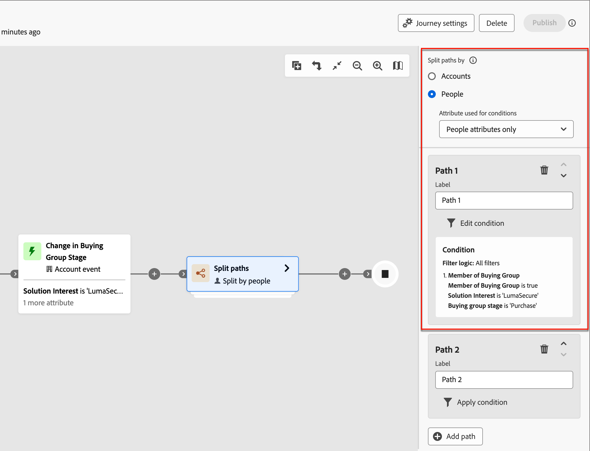

# 購買グループステージ

購買グループのステージは、商談を顧客にコンバージョンする過程における購買グループの進捗状況を追跡するように設計されています。 この機能を使用して、購買グループの進捗状況を追跡し、購買グループメンバーに対する次善のアクションを特定します。

単一のステージングモデル内のステージを定義し、複数のステージとそれらの間の移行フローを定義します。 ライフサイクルにエントリするために、1つ以上のステージが指定されます。 このモデルでは非線形の進行も可能で、ステージ Aからステージ B、C、Dなど、あるステージから別のステージへの移行を指定できます。購入や署名済みの契約など、1つのステージを成功ステージとして指定する必要があります。 別の段階を失敗段階として指定することは、別の段階（別のベンダーから競合製品を購入した場合など）はオプションです。 [ インテリジェントダッシュボード ](../dashboards/intelligent-dashboard.md)を通じてこれらのステージを監視し、購買グループがセールスオポチュニティを完了するか、オポチュニティを顧客にコンバージョンする方法を示します。

{width="800" zoomable="yes"}

{width="30"} [概要ビデオを視聴](#overview-video)

## 購買グループのステージモデルを定義

購買グループのステージモデルは、次の方法で作成および設定できます。

* ライフサイクル段階の追加
* トランジションフローの定義
* 入口と目的地の段階の指定

1つのモデルのみがサポートされているため、Journey Optimizer B2B editionで作成して公開する前に、マーケティング部門と営業部門の間で連携して、自社に最適なモデルを計画することが重要です。<!-- Initially, only one stage model can be created, but future releases will support multiple stage models, allowing users to select which model to use in a journey. -->

購買グループのステージモデルを作成すると、自動的に&#x200B;_ドラフト_ ステータスになり、削除または名前の変更はできません。 ステージを定義し、ステージ間の移行フローを設定すると、このステータスのままになります。 モデルが公開済み（_ライブ_）状態の場合、変更できません。

### モデルの作成

1. 左側のナビゲーションで、**[!UICONTROL アカウント]** > **[!UICONTROL 購買グループ]**&#x200B;に移動します。

1. 購買グループ ページで、「**[!UICONTROL 段階]**」タブを選択します。

   {width="800" zoomable="yes"}

   この&#x200B;_[!UICONTROL ステージ]_ タブは、モデルを作成するまで&#x200B;_空_&#x200B;の状態です。

1. ページの中央にある「**[!UICONTROL モデルを作成]**」をクリックします。

1. ダイアログで、モデルの&#x200B;**[!UICONTROL Name]** （必須）と&#x200B;**[!UICONTROL Description]** （オプション）を入力します。

   {width="700" zoomable="yes"}

   このダイアログで「_[!UICONTROL キャンセル]_」をクリックすると、_空_&#x200B;状態の&#x200B;_[!UICONTROL ステージ]_ タブに戻ります。

1. 「**[!UICONTROL 作成]**」をクリックします。

### ステージの定義

モデルを作成すると、ワークスペースが開き、モデルのステージを作成するように求められます。

1. **[!UICONTROL ステージを編集]**&#x200B;をクリックします。

   {width="700" zoomable="yes"}

1. 最初のステージを定義するには、**[!UICONTROL Name]** （必須）と&#x200B;**[!UICONTROL Description]** （オプション）を入力します。

   {width="700" zoomable="yes"}

   ステージは特定の順序で追加する必要はありませんが、モデルの詳細ページにステージがどのように表示されるかは決定します。 トランジションルールを定義する際に、エントリステージとステージ間のフローを指定します。

1. 「**[!UICONTROL ステージを追加]**」をクリックし、ステップ 2を繰り返して別のステージを定義します。

   モデルに必要なステージが完成するまでこのステップを繰り返します。

   モデルに対して定義された{width="700" zoomable="yes"}

1. 定義したステージに満足したら、**[!UICONTROL 保存]**&#x200B;をクリックします。

   >[!IMPORTANT]
   >
   >**購買グループのステージを保存した後、削除できません。** ただし、モデルが&#x200B;_ドラフト_ ステータスのままである限り、どのステージでも名前と説明を変更できます。

### ワークフローと移行ルールの設定

ステージを保存すると、モデルワークスペースに戻ります。 _[!UICONTROL 許可されている]_&#x200B;への移行の列が空です。これは、モデルステージの移行ルールがまだ定義されていないことを示します。

{width="700" zoomable="yes"}

移行ルールは、購買グループがあるステージから別のステージにどのように移動できるかを決定します。 たとえば、エントリーステージからミドルステージに移行したり、ミドルステージから他のさまざまなステージに移行したりできます。 エントリーステージとは、購買グループが空白の状態から開始できる最初のステージのことです。このステージは、成功段階と失敗段階に分類されます。

1. 右上の「**[!UICONTROL 移行ルールを編集]**」をクリックします。

   このアクションは、_[!UICONTROL ステージルールを編集]_ ダイアログを開き、フローのロジックを定義します。

   オプションを設定する際には、フローでロジックエラーが発生するのを防ぐためのガードレールとメッセージが組み込まれています。 「_[!UICONTROL キャンセル]_」をクリックしてダイアログを閉じ、変更なしで&#x200B;_[!UICONTROL ステージ]_ タブページに戻ることができます。

1. _[!UICONTROL ステージを選択]_ セクションで、フローの開始ステージと終了ステージを指定します。

   * **[!UICONTROL エントリポイントステージ]** （必須） – 購買グループの商談に1つ以上のエントリステージを指定します。

   * **[!UICONTROL 成功ステージ]** （必須） – 購入グループの商談が成功したことを示すステージを指定します（宛先）。

   * **[!UICONTROL 失敗ステージ]** （オプション） – 購買グループの商談が失敗のポイント （宛先）に達したことを示す1つ以上のステージを指定します。

   {width="700" zoomable="yes"}

1. 配信先ではないステージごとに、フローの次に来る1つ以上のステージ（トランジション）を定義します。

   宛先でないステージはすべて、少なくとも1つの&#x200B;**[!UICONTROL 許可された]**&#x200B;へのトランジット ステージを選択している必要があります。 それ以外の場合、モデルロジックは無効であり、アカウントはその段階で&#x200B;_スタック_&#x200B;になり、成功または失敗に進む方法はありません。

   {width="700" zoomable="yes"}

   オプションで、失敗ステージからの移行を指定できます。 例えば、_応答なし_&#x200B;という名前のステージを失敗ステージとして指定できます。 ただし、休眠中のアカウントが再アクティブ化されたケースを特定する可能性のあるトランジションとして、_Resurgence_&#x200B;という名前のステージも指定します。

1. 「**[!UICONTROL 保存]**」をクリックします。

   モデルの詳細ページに戻ると、ステージは、許可されたトランジション、宛先およびエントリのプロパティを含むテーブルに一覧表示されます。

| 列 | 説明 |
| ------ | ---------- |
| **[!UICONTROL ステージ名]** | ステージの名前。 情報アイコンをクリックして、ステージの説明を表示します。 |
| **[!UICONTROL 様が]**&#x200B;への転送を許可しました | モデル内の&#x200B;_移動先_ アクションに有効なステージを一覧表示します。 |
| **[!UICONTROL エントリポイントステージ]** | ステージがエントリポイントステージとして有効かどうかを示します（[!UICONTROL はい]または[!UICONTROL いいえ]）。 |
| **[!UICONTROL 宛先]** | ステージが宛先ステージ （[!UICONTROL 成功]または[!UICONTROL 失敗]）として指定されているかどうかを示します。 |

{width="700" zoomable="yes"}

## ドラフトモデルの編集

購買グループのステージモデルが&#x200B;_ドラフト_&#x200B;状態である限り、ステージとトランジションルールを編集できます。

_ドラフトモデルを表示するには&#x200B;:_

1. 左側のナビゲーションで、**[!UICONTROL アカウント]** > **[!UICONTROL 購買グループ]**&#x200B;に移動します。

1. _購買グループ_ ページで、「**[!UICONTROL 段階]**」タブを選択します。

1. モデル名をクリックして、モデルの詳細を開きます。

### モデルのステージの変更

1. **[!UICONTROL ステージを編集]**&#x200B;をクリックします。

   _[!UICONTROL ステージを編集]_ ダイアログで、新しいステージを追加したり、既存のステージの名前と説明を変更したりできます。

   * 必要に応じて、任意のステージの&#x200B;**[!UICONTROL 名前]**&#x200B;または&#x200B;**[!UICONTROL 説明]**&#x200B;を変更します。

   * 一番下までスクロールし、**[!UICONTROL ステージを追加]**&#x200B;をクリックして、必要に応じてモデルの新しいステージを定義します。

1. 定義したステージに満足したら、**[!UICONTROL 保存]**&#x200B;をクリックします。

   「_[!UICONTROL キャンセル]_」をクリックしてダイアログを閉じ、変更を加えずにモデルの詳細ページに戻ることもできます。

### モデルのトランジションルールの編集

1. 「**[!UICONTROL 移行ルールを編集]**」をクリックします。

1. _ステージルールを編集_ ダイアログで、必要に応じてフローオプションを変更します。

   これらのオプションとそのモデル フローへの影響について詳しくは、[ ワークフローと移行ルールの設定](#configure-the-workflow-and-transition-rules)を参照してください。

1. 定義されている移行ルールに問題がなければ、**[!UICONTROL 保存]**&#x200B;をクリックします。

   「_[!UICONTROL キャンセル]_」をクリックしてダイアログを閉じ、変更を加えずにモデルの詳細ページに戻ることもできます。

## 購買グループのステージモデルの公開

検証エラーがない場合は、モデルを公開できます。 公開されると、_ライブ_&#x200B;状態に変更され、アカウントジャーニーの購買グループのステージを進めるために使用できます。

>[!IMPORTANT]
>
>**モデルが公開された後、更新または削除できません。** モデルを公開する前に、その内容が正しいことを確認してください。

1. 定義されたステージとトランジションを注意深く確認します。

   修正が必要な場合は、モデルのステージを編集します。

1. 「**[!UICONTROL 公開]**」をクリックします。

1. 確認ダイアログで、**[!UICONTROL 公開]**&#x200B;をクリックします。

   モデルの詳細ページに戻ると、モデルは&#x200B;_[!UICONTROL Live]_&#x200B;として指定されます。 左上の&#x200B;_戻る_&#x200B;矢印をクリックして、_[!UICONTROL ステージ]_ タブページに戻ります。

{width="700" zoomable="yes"}
<!--
 list these later when the Published columns are working correctly

Columns - Name, Status, Created by, Created date, Last updated by, Last update, Published by, Published on.
Name - Name of the stage model, hyperlinked. Clicking on it will navigate to the stage inventory page. 
Info icon beside the name - display the description on click.
Status - Live, Draft. If a draft stage model is Published, then its status is updated to Live. 
-->

## 購買グループのステージモデルの削除

購買グループステージモデルは、ドラフト状態または公開済みの状態の場合に削除できます。 公開済み（ライブ）の場合は、ソリューションに対する関心に関連付けられていない場合にのみ削除できます。

1. 左側のナビゲーションで、**[!UICONTROL アカウント]** > **[!UICONTROL 購買グループ]**&#x200B;に移動します。

1. _購買グループ_ ページで、「**[!UICONTROL 段階]**」タブを選択します。

1. _詳細_ メニューアイコン （**...**）をクリックします ステージのモデル名の横にある「**[!UICONTROL 削除]**」を選択します。

   {width="700"}

1. ダイアログで、**[!UICONTROL 削除]**&#x200B;をクリックして確認します。

## アカウントジャーニーでのモデルの使用

購買段階のモデルが&#x200B;_ライブ_&#x200B;状態（公開済み）の場合、そのモデルを、購買グループの進行を追跡するために使用するソリューションの関心に追加します。 アカウントジャーニーには、アカウントを指定したステージに移行するアクションを含め、アカウントがジャーニーをどのように移動するかを決定するイベントとして、ステージの移行を追加することができます。

### ソリューション興味の関連付け

購買グループのステージモデルを関連付ける既存のソリューションの関心ごとに、ソリューションの関心の詳細を開き、モデルを追加します。 ソリューションの関心を[作成](./solution-interests.md#create-a-solution-interest)するときに、モデルをプロパティに追加することもできます。

1. 「_[!UICONTROL ソリューションへの関心]_」タブを選択します。

1. 次のいずれかの方法を使用してソリューションの関心を開き、編集するソリューションの関心のプロパティを開きます。

   * ソリューションの関心の名前をクリックします。
   * 省略記号（**...**）をクリックします その横にある「**[!UICONTROL 編集]**」を選択します。

   {width="500" zoomable="no"}

1. 購買グループステージの進行を使用するには、**[!UICONTROL 購買グループステージモデル]**&#x200B;を選択します（オプション）。

   {width="700" zoomable="yes"}

1. 必要に応じて、**[!UICONTROL 既存の購買グループを更新]**&#x200B;設定を変更します。

   このオプションを有効にすると、ソリューションの関心と組み合わされたすべての既存の購買グループが、24時間の同期サイクルを通じて更新されます。

1. 「**[!UICONTROL 保存]**」をクリックします。

### パスを分割

[ スプリットパスノード ](../journeys/journey-nodes.md#split-paths)を使用すると、購買グループの段階に応じて、アカウントレベルまたは人物レベルでフィルタリングできます。 例えば、購買グループメンバーによってパスを分割する際に、パス条件として購買グループステージを追加します。

>[!BEGINTABS]

>[!TAB  アカウントレベル ]

1. エディターでアカウントジャーニーを開きます。

1. パスのプラス（**+**）アイコンをクリックし、「**[!UICONTROL パスを分割]**」を選択します。

   {width="300"}

1. 右側のノードプロパティで、分割に「**[!UICONTROL アカウント]**」を選択します。

1. _[!UICONTROL パス 1]_&#x200B;に適用できる条件を定義するには、「**[!UICONTROL 条件を適用]**」をクリックします。

   {width="500"}

1. 条件エディターで、購買グループフィルターを追加して、分割パスを定義します。

   * 左側では、下部の&#x200B;**[!UICONTROL 特殊フィルター]**&#x200B;を展開し、**[!UICONTROL 購入グループ]**&#x200B;属性をフィルターワークスペースにドラッグします。

   * **[!UICONTROL ソリューションの関心]**&#x200B;を、購買グループのステージモデルに関連付けられたものに設定します。

   * **[!UICONTROL 制約を追加]**&#x200B;をクリックし、**[!UICONTROL 購買グループステージ]**&#x200B;を選択します。

     {width="700" zoomable="yes"}

   * 「**[!UICONTROL 完了]**」をクリックします。

   分割パスは、右側のノードプロパティで定義されます。

   {width="600" zoomable="yes"}

1. 引き続き、分割ノードの他のパスを定義し、ジャーニーを保存します。

>[!TAB 人物レベル ]

1. エディターでアカウントジャーニーを開きます。

1. パスのプラス（**+**）アイコンをクリックし、「**[!UICONTROL パスを分割]**」を選択します。

   {width="300"}

1. 右側のノードプロパティで、分割に&#x200B;**[!UICONTROL 人物]**&#x200B;を選択します。

   条件&#x200B;]_に使用される_[!UICONTROL &#x200B;属性のデフォルトは、**[!UICONTROL 人属性のみ]**&#x200B;のままにします。

1. _[!UICONTROL パス 1]_&#x200B;に適用できる条件を定義するには、「**[!UICONTROL 条件を適用]**」をクリックします。

   {width="500"}

1. 条件エディターで、購買グループフィルターを追加して、分割パスを定義します。

   * 左側では、下部の&#x200B;**[!UICONTROL 特殊フィルター]**&#x200B;を展開し、**[!UICONTROL 購買グループのメンバー]**&#x200B;属性をフィルターワークスペースにドラッグします。

   * **[!UICONTROL ソリューションの関心]**&#x200B;を、購買グループのステージモデルに関連付けられたものに設定します。

   * **[!UICONTROL 制約を追加]**&#x200B;をクリックし、**[!UICONTROL 購買グループステージ]**&#x200B;を選択します。

     {width="700" zoomable="yes"}

   * 「**[!UICONTROL 完了]**」をクリックします。

   分割パスは、右側のノードプロパティで定義されます。

   {width="600" zoomable="yes"}

1. 引き続き、分割ノードの他のパスを定義し、ジャーニーを保存します。

>[!ENDTABS]

### 購買グループステージのアカウントアクションの更新

[ アカウントアクションノード ](../journeys/journey-nodes.md#add-an-account-action)を使用して、購買グループのステージを更新できます。 このノードの定義には、ソリューションへの関心の選択と購買グループの新しいステージの定義が含まれます。

>[!NOTE]
>
>新しいステージが（モデルで定義されているように）有効なトランジションでない場合、アクションはアカウントに適用されません。

1. エディターでアカウントジャーニーを開きます。

1. パスのプラス（**+**）アイコンをクリックし、**[!UICONTROL アクションを実行]**&#x200B;を選択します。

   {width="400"}

1. 右側のノードプロパティで、アクションに「**[!UICONTROL アカウント]**」を選択します。

1. 購買グループステージを更新するアクションを定義します。

   * **[!UICONTROL アカウントに対するアクション]**&#x200B;で、**[!UICONTROL 購買グループステージの更新]**&#x200B;を選択します。

   * **[!UICONTROL ソリューションの関心を選択]**&#x200B;するには、購買グループのステージモデルに関連付けられているものを選択します。

   * **[!UICONTROL 新しいステージ]**&#x200B;で、アカウントを移行するステージを選択します。

   アクションは、右側のノードプロパティで定義されます。

   {width="600" zoomable="yes"}

1. 引き続き他の変更を加え、ジャーニーを保存します。

### アカウントイベント

購買グループのステージ変更を適用して、アカウントをジャーニーの次のステップに進めます。 このノードを定義するには、ソリューションの関心と、イベントのトリガーを満たす追加の制約を選択する必要があります。

1. エディターでアカウントジャーニーを開きます。

1. パスのプラス（**+**）アイコンをクリックし、**[!UICONTROL イベントをリッスン]**&#x200B;を選択します。

   {width="400"}

1. 右側のノードプロパティで、イベントタイプに「**[!UICONTROL アカウント]**」を選択します。

1. **[!UICONTROL アカウントの選択イベント]**&#x200B;で、**[!UICONTROL 購入グループステージの変更]**&#x200B;を選択します。

1. 「**[!UICONTROL イベントを編集]**」をクリックし、イベントの詳細を定義します。

   * **[!UICONTROL ソリューションの関心]**&#x200B;の場合、購買グループの段階モデルに関連付けられているソリューションの関心の条件を一致させます。

   * **[!UICONTROL 制約を追加]**&#x200B;をクリックし、イベントのトリガーに使用する購買グループのステージ変更を選択します。

     {width="700" zoomable="yes"}

   * 「**[!UICONTROL 完了]**」をクリックします。

   イベントは、右側のノードプロパティで定義されます。

   {width="700" zoomable="yes"}

1. 引き続き他の変更を加え、ジャーニーを保存します。

## 概要動画

>[!VIDEO](https://video.tv.adobe.com/v/3448634/?learn=on)
