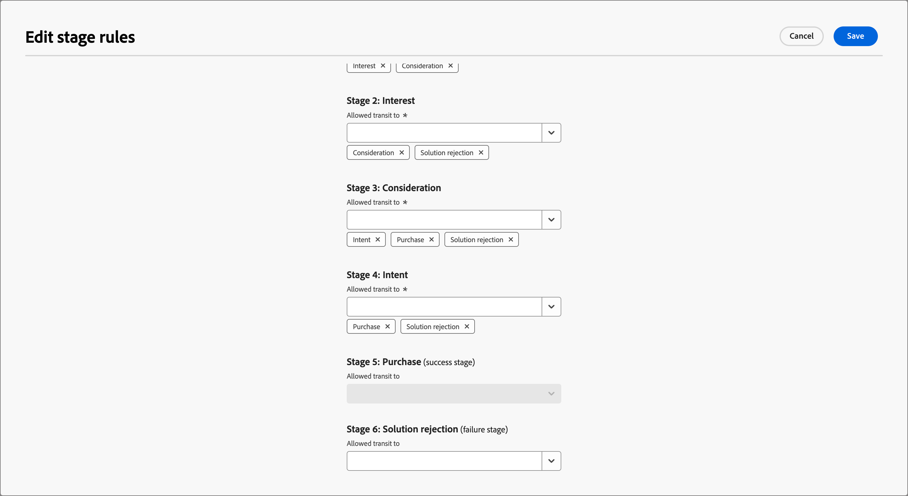

# 購買グループステージ

購入グループステージは、商談を顧客に変換する際の購入グループの進行状況を追跡するように設計されています。 この機能を使用して、購入グループの進行状況を追跡し、購入グループメンバーに次に最適なアクションを特定します。

単一のステージングモデル内でステージを定義し、複数のステージとそれらの間の移行フローを定義します。 ライフサイクルにエントリする 1 つ以上のステージが指定されています。 また、このモデルでは、ステージ A からステージ B、ステージ C、ステージ D など、あるステージから別のステージへのトランジションを指定できる非線形の進行も可能です。購入や署名済みの契約など、1 つのステージを成功ステージと指定する必要があります。 別のステージを、契約の却下や別のベンダーからの競合ソリューションの購入など、失敗ステージとして指定することはオプションです。 これは、購入グループの進捗を示す [ インテリジェントダッシュボード ](../dashboards/intelligent-dashboard.md) を使用して、販売機会の完了や、機会から顧客への変換を行うことで達成されます。

{width="800" zoomable="yes"}

{width="30"}[ ビデオの概要をご覧ください ](#overview-video)

## 購入グループステージモデルの定義

購入グループステージモデルは、次の方法で作成および設定します。

* ライフサイクルステージの追加
* トランジションフローの定義
* 入口ステージと宛先ステージの指定

サポートされているモデルは 1 つだけなので、Journey Optimizer B2B editionで作成して公開する前に、マーケティングチームとセールスチームで作業して、組織に最適なモデルを計画することが重要です。<!-- Initially, only one stage model can be created, but future releases will support multiple stage models, allowing users to select which model to use in a journey. -->

購入グループステージモデルを作成すると、そのモデルは自動的に _ドラフト_ ステータスになり、削除または名前を変更できません。 ステージを定義し、ステージ間のトランジションフローを設定しても、ステータスは変わりません。 モデルのステータスが公開済み（_ライブ_）の場合は、変更できません。

### モデルの作成

1. 左側のナビゲーションで **[!UICONTROL アカウント]**/**[!UICONTROL 購入グループ]** に移動します。

1. 購入グループページで、「**[!UICONTROL ステージ]**」タブを選択します。

   {width="800" zoomable="yes"}

   この _[!UICONTROL ステージ]_ タブは、モデルを作成するまで _空_ 状態になります。

1. ページの中央にある「**[!UICONTROL モデルを作成]**」をクリックします。

1. ダイアログで、モデルの **[!UICONTROL 名前]** （必須）と **[!UICONTROL 説明]** （オプション）を入力します。

   {width="700" zoomable="yes"}。

   このダイアログで「_[!UICONTROL キャンセル]_」をクリックすると、_[!UICONTROL 空_ 状態の _ステージ]_ タブに戻ります。

1. 「**[!UICONTROL 作成]**」をクリックします。

### ステージの定義

モデルを作成すると、ワークスペースで開き、モデルのステージを作成するよう求められます。

1. **[!UICONTROL ステージを編集]** をクリックします。

   {width="700" zoomable="yes"}

1. **[!UICONTROL 名前]** （必須）と **[!UICONTROL 説明]** （オプション）を入力して、最初のステージを定義します。

   {width="700" zoomable="yes"}

   ステージは特定の順序で追加する必要はありませんが、モデルの詳細ページでのステージのリスト方法は決定されます。 移行ルールを定義する際に、入口ステージとステージ間のフローを指定します。

1. **[!UICONTROL ステージを追加]** をクリックし、手順 2 を繰り返して別のステージを定義します。

   モデルに必要なステージが揃うまでこの手順を繰り返します。

   {width="700" zoomable="yes"}

1. 定義したステージの設定が完了したら、「**[!UICONTROL 保存]**」をクリックします。

   >[!IMPORTANT]
   >
   >**購入グループステージを保存した後は、削除できません。** ただし、モデルが _ドラフト_ ステータスである限り、任意のステージの名前と説明を変更できます。

### ワークフローとトランジションルールの設定

ステージを保存すると、モデルワークスペースに戻ります。 _[!UICONTROL 許可されている転送先]_ 列が空です。これは、モデルステージのトランジションルールがまだ定義されていないことを示します。

{width="700" zoomable="yes"}

トランジションルールは、購入グループがあるステージから別のステージにどのように移動できるかを決定します。 例えば、入口ステージから中間ステージに、そして中間ステージから他の様々なステージに移動することができます。 入口ステージは、購入グループが空白の状態から入ることができる初期ステージで、宛先ステージは成功ステージと失敗ステージに分類されます。

1. 右上の **[!UICONTROL トランジションルールを編集]** をクリックします。

   このアクションにより、_[!UICONTROL ステージルールを編集]_ ダイアログが開きます。このダイアログで、フローのロジックを定義します。

   オプションを設定する際に、フローでロジックエラーが発生するのを防ぐのに役立つ、組み込みのガードレールとメッセージがいくつかあります。 「_[!UICONTROL キャンセル]_」をクリックしてダイアログを閉じ、変更せずに _[!UICONTROL ステージ]_ タブページに戻ることができます。

1. _[!UICONTROL ステージの選択]_ セクションで、フローの開始ステージと終了ステージを指定します：

   * **[!UICONTROL エントリポイントステージ]** （必須） – 購買グループ商談の 1 つ以上のエントリステージを指定します。

   * **[!UICONTROL 成功ステージ]** （必須） – 購入グループのオポチュニティが成功したことを示すステージを指定します（宛先）。

   * **[!UICONTROL 失敗ステージ]** （オプション） – 購買グループの商談が失敗点（宛先）に到達したことを示す 1 つ以上のステージを指定します。

   {width="700" zoomable="yes"}

1. 宛先以外の各ステージに対して、フロー（トランジション）内で次に来る 1 つ以上のステージを定義します。

   すべての宛先以外のステージで、少なくとも 1 つの **[!UICONTROL トランジットを許可する]** ステージを選択する必要があります。 そうしないと、モデルロジックが有効にならず、成功や失敗に進む方法がないまま、その段階でアカウントが _停止_ する可能性があります。

   {width="700" zoomable="yes"}

   オプションで、失敗ステージからのトランジションを指定できます。 例えば、「_応答なし_ という名前のステージを失敗ステージとして指定するとします。 ただし、休眠状態のアカウントが再アクティブ化されるケースを特定するための移行可能性として、_復活_ という名前のステージを指定します。

1. 「**[!UICONTROL 保存]**」をクリックします。

   モデルの詳細ページに戻ると、許可されたトランジション、宛先プロパティ、エントリプロパティが含まれたテーブルにステージが一覧表示されます。

| 列 | 説明 |
| ------ | ---------- |
| **[!UICONTROL ステージ名]** | ステージの名前。 情報アイコンをクリックして、ステージの説明を表示します。 |
| **[!UICONTROL 次へのトランジットを許可]** | モデル内の _移動先_ アクションに有効なステージを一覧表示します。 |
| **[!UICONTROL エントリポイントステージ]** | ステージがエントリポイントステージとして有効かどうかを示します（[!UICONTROL &#x200B; はい &#x200B;] または [!UICONTROL &#x200B; いいえ &#x200B;]）。 |
| **[!UICONTROL 宛先]** | ステージが宛先ステージとして指定されているかどうかを示します（[!UICONTROL &#x200B; 成功 &#x200B;] または [!UICONTROL &#x200B; 失敗 &#x200B;]）。 |

{width="700" zoomable="yes"}

## ドラフトモデルの編集

購入グループステージモデルが _ドラフト_ 状態のままである限り、ステージとトランジションルールを編集できます。

_ドラフトモデルを表示するには：:_

1. 左側のナビゲーションで **[!UICONTROL アカウント]**/**[!UICONTROL 購入グループ]** に移動します。

1. _購入グループ_ ページで、「**[!UICONTROL ステージ]**」タブを選択します。

1. モデル名をクリックして、モデルの詳細を開きます。

### モデルのステージを変更します

1. **[!UICONTROL ステージを編集]** をクリックします。

   _[!UICONTROL ステージを編集]_ ダイアログでは、新しいステージを追加したり、既存のステージの名前と説明を変更したりできます。

   * 必要に応じて、任意のステージの **[!UICONTROL 名前]** または **[!UICONTROL 説明]** を変更します。

   * 下部までスクロールし、「**[!UICONTROL ステージを追加]**」をクリックして、必要に応じてモデルの新しいステージを定義します。

1. 定義したステージの設定が完了したら、「**[!UICONTROL 保存]**」をクリックします。

   「_[!UICONTROL キャンセル]_」をクリックしてダイアログを閉じ、変更せずにモデルの詳細ページに戻ることもできます。

### モデルのトランジションルールの編集

1. **[!UICONTROL トランジションルールを編集]** をクリックします。

1. _ステージルールを編集_ ダイアログで、必要に応じてフローオプションを変更します。

   これらのオプションとモデルフローへの影響について詳しくは、[ ワークフローとトランジションルールの設定 ](#configure-the-workflow-and-transition-rules) を参照してください。

1. 定義したトランジションルールの設定が完了したら、「**[!UICONTROL 保存]**」をクリックします。

   「_[!UICONTROL キャンセル]_」をクリックしてダイアログを閉じ、変更せずにモデルの詳細ページに戻ることもできます。

## 購入グループステージモデルを公開します

検証エラーがない場合は、モデルを公開できます。 公開されると _ライブ_ 状態に変わり、アカウントジャーニーで購入グループステージを進行させるために使用できます。

>[!IMPORTANT]
>
>**モデルを公開した後に、更新または削除することはできません。** モデルを公開する前に、現在の内容が正しいことを確認してください。

1. 定義されたステージとトランジションを慎重に確認します。

   リビジョンが必要な場合は、モデルステージを編集します。

1. 「**[!UICONTROL 公開]**」をクリックします。

1. 確認ダイアログで、「**[!UICONTROL 公開]**」をクリックします。

   モデルの詳細ページに戻ると、モデルは _[!UICONTROL ライブ]_ と指定されます。 左上の _戻る_ 矢印をクリックして、「_[!UICONTROL ステージ]_」タブページに戻ります。

{width="700" zoomable="yes"}
<!-- list these later when the Published columns are working correctly

Columns - Name, Status, Created by, Created date, Last updated by, Last update, Published by, Published on.
Name - Name of the stage model, hyperlinked. Clicking on it will navigate to the stage inventory page. 
Info icon beside the name - display the description on click.
Status - Live, Draft. If a draft stage model is Published, then its status is updated to Live. -->

## 購買グループ ステージ モデルを削除します

購入グループステージモデルは、ドラフト状態または公開済み状態の場合に削除できます。 公開（ライブ）されている場合は、ソリューションの関心に関連付けられていない場合にのみ削除できます。

1. 左側のナビゲーションで **[!UICONTROL アカウント]**/**[!UICONTROL 購入グループ]** に移動します。

1. _購入グループ_ ページで、「**[!UICONTROL ステージ]**」タブを選択します。

1. ステージモデル名の横にある _その他_ メニューアイコン（**...**）をクリックし、**[!UICONTROL 削除]** を選択します。

   {width="700"}

1. ダイアログで、「**[!UICONTROL 削除]**」をクリックして確定します。

## アカウントジャーニーでのモデルの使用

購入ステージモデルが _ライブ_ ステータス（公開済み）の場合、購入グループの進行状況の追跡に使用したいソリューションの関心にモデルを追加します。 アカウントジャーニーには、指定のステージにアカウントを移行するアクションを含め、ジャーニー内でのアカウントの移動を決定するイベントとしてステージ移行を追加できます。

### ソリューションの関心の関連付け

購入グループステージモデルを関連付ける既存のソリューションの関心ごとに、ソリューションの関心の詳細を開き、モデルを追加します。 [ ソリューションの関心事を作成 ](./solution-interests.md#create-a-solution-interest) する際に、プロパティにモデルを追加することもできます。

1. _[!UICONTROL ソリューションの関心]_ タブを選択します。

1. 次のいずれかの方法を使用してソリューションの対象を開き、編集するソリューションの対象のプロパティを開きます。

   * ソリューションの対象者名をクリックします。
   * その横にある省略記号（**...**）をクリックし、「**[!UICONTROL 編集]**」を選択します。

   {width="500" zoomable="no"}

1. **[!UICONTROL 購入グループステージモデル]** を選択して、購入グループステージの進行を使用します（オプション）。

   {width="700" zoomable="yes"}

1. 必要に応じて、「**[!UICONTROL 既存の購買グループの更新]** 設定を変更します。

   このオプションを有効にすると、ソリューションの関心とペアになっているすべての既存の購入グループが、24 時間同期サイクルを通じて更新されます。

1. 「**[!UICONTROL 保存]**」をクリックします。

### パスを分割

[ 分割パスノード ](../journeys/journey-nodes.md#split-paths) を使用すると、購入グループステージに応じて、アカウントレベルまたは人物レベルでフィルタリングできます。 例えば、購入グループメンバーによってパスを分割する際のパス条件として、購入グループステージを追加します。

>[!BEGINTABS]

>[!TAB  アカウントレベル ]

1. エディターでアカウントジャーニーを開きます。

1. パスのプラス（**+**）アイコンをクリックし、「**[!UICONTROL パスを分割]**」を選択します。

   {width="300"}

1. 右側のノードプロパティで、分割の **[!UICONTROL アカウント]** を選択します。

1. _[!UICONTROL パス 1]_ に適用できる条件を定義するには、「**[!UICONTROL 条件を適用]**」をクリックします。

   {width="500"}

1. 条件エディターで、購入グループフィルターを追加して、分割パスを定義します。

   * 左側で、下部にある **[!UICONTROL 特殊フィルター]** を展開し、**[!UICONTROL 購入グループあり]** 属性をフィルターワークスペースにドラッグします。

   * **[!UICONTROL ソリューションの関心]** を、購入グループステージモデルに関連付けられているものに設定します。

   * **[!UICONTROL 制約を追加]** をクリックし、**[!UICONTROL 購入グループステージ]** を選択します。

     {width="700" zoomable="yes"}

   * 「**[!UICONTROL 完了]**」をクリックします。

   分割パスは、右側のノードプロパティで定義します。

   {width="600" zoomable="yes"}

1. 続けて、分割ノードに他のパスを定義し、ジャーニーを保存します。

>[!TAB  人物レベル ]

1. エディターでアカウントジャーニーを開きます。

1. パスのプラス（**+**）アイコンをクリックし、「**[!UICONTROL パスを分割]**」を選択します。

   {width="300"}

1. 右側のノードプロパティで、分割の **[!UICONTROL 人物]** を選択します。

   _[!UICONTROL 条件用に使用する属性]_ のデフォルトは **[!UICONTROL 人物属性のみ]** のままにします。

1. _[!UICONTROL パス 1]_ に適用できる条件を定義するには、「**[!UICONTROL 条件を適用]**」をクリックします。

   {width="500"}

1. 条件エディターで、購入グループフィルターを追加して、分割パスを定義します。

   * 左側で、下部にある **[!UICONTROL 特別なフィルター]** を展開し、**[!UICONTROL 購入グループのメンバー]** 属性をフィルターワークスペースにドラッグします。

   * **[!UICONTROL ソリューションの関心]** を、購入グループステージモデルに関連付けられているものに設定します。

   * **[!UICONTROL 制約を追加]** をクリックし、**[!UICONTROL 購入グループステージ]** を選択します。

     {width="700" zoomable="yes"}

   * 「**[!UICONTROL 完了]**」をクリックします。

   分割パスは、右側のノードプロパティで定義します。

   {width="600" zoomable="yes"}

1. 続けて、分割ノードに他のパスを定義し、ジャーニーを保存します。

>[!ENDTABS]

### 購買グループ ステージ アカウントの更新アクション

[ アカウントのアクションノード ](../journeys/journey-nodes.md#add-an-account-action) を使用して、購入グループステージを更新できます。 このノードを定義するには、ソリューションの関心を選択し、購入グループの新しいステージを定義する必要があります。

>[!NOTE]
>
>新しいステージが（モデルで定義された）有効なトランジションでない場合、アクションはアカウントに適用されません。

1. エディターでアカウントジャーニーを開きます。

1. パスのプラス（**+**）アイコンをクリックし、「**[!UICONTROL アクションを実行]**」を選択します。

   {width="400"}

1. 右側のノードプロパティで、アクションとして **[!UICONTROL アカウント]** を選択します。

1. 購買グループ ステージを更新するアクションを定義します。

   * **[!UICONTROL アカウントに対するアクション]** については、**[!UICONTROL 購入グループステージを更新]** を選択します。

   * **[!UICONTROL ソリューションの関心を選択]** については、購入グループステージモデルに関連付けられているものを選択します。

   * 「**[!UICONTROL 新しいステージ]**」で、アカウントを移行するステージを選択します。

   アクションは、右側のノードプロパティで定義されます。

   {width="600" zoomable="yes"}

1. 引き続き他の変更を行い、ジャーニーを保存します。

### アカウントイベント

購入グループステージ変更の発生を使用して、アカウントをジャーニーの次のステップに進めます。 このノードを定義するには、イベントのトリガーを満たすために、ソリューションの対象と追加の制約を選択する必要があります。

1. エディターでアカウントジャーニーを開きます。

1. パスのプラス（**+**）アイコンをクリックし、「**[!UICONTROL イベントをリッスン]**」を選択します。

   {width="400"}

1. 右側のノードプロパティで、イベントタイプとして **[!UICONTROL アカウント]** を選択します。

1. **[!UICONTROL アカウントの選択イベント]** については、「**[!UICONTROL 購買グループ・ステージの変更]**」を選択します。

1. 「**[!UICONTROL イベントを編集]**」をクリックして、イベントの詳細を定義します。

   * **[!UICONTROL ソリューションの興味]** については、購入グループステージモデルに関連付けられているソリューションの興味の条件を一致させます。

   * 「**[!UICONTROL 制約を追加]**」をクリックし、イベントのトリガーに使用する購入グループステージ変更を選択します。

     {width="700" zoomable="yes"}

   * 「**[!UICONTROL 完了]**」をクリックします。

   イベントは、右側のノードプロパティで定義されます。

   {width="700" zoomable="yes"}

1. 引き続き他の変更を行い、ジャーニーを保存します。

## 概要ビデオ

>[!VIDEO](https://video.tv.adobe.com/v/3448634/?learn=on)
