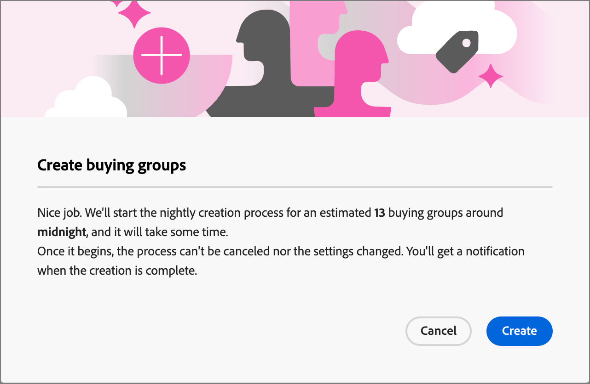

# 購買グループの作成

購買グループを作成すると、[ ソリューションの関心](./solution-interests.md)を通じてアカウントジャーニーで使用できるようになります。

1. 左側のナビゲーションで、**[!UICONTROL 購買グループ]**&#x200B;をクリックします。

1. _[!UICONTROL 購買グループ]_ ページで、ページの右上にある「**[!UICONTROL 購買グループを作成]**」をクリックします。

   {width="700" zoomable="yes"}

1. 各ページのプロンプトに従い、**[!UICONTROL 次へ]**&#x200B;をクリックして続行します。

{width="30"} [ ハウツー動画を見る](#how-to-video)

## ガイダンスページ

最初のページでは、購買グループの作成に必要な前提条件やコンポーネントに関するガイダンスを提供します。 必要なコンポーネントが配置されていることがわかっている場合は、**[!UICONTROL 次へ]**&#x200B;をクリックします。

## コンポーネント

1. 使用する各コンポーネントを選択します。

   * **[!UICONTROL ソリューションの関心]** - リストからソリューションの関心を選択します。

   * **[!UICONTROL アカウントオーディエンス]** – 「#」をクリックし、リストからアカウントオーディエンスを選択します。

   _[!UICONTROL プロパティ]_&#x200B;の下で、購買グループの名前は、&lt; アカウント名>の&lt; ソリューションの関心名>として自動的に生成（読み取り専用）されます。

   {width="700" zoomable="yes"}

1. ソリューションの関心とアカウントオーディエンスを選択したら、**[!UICONTROL 作成]**&#x200B;をクリックします。

## 確認

確認ダイアログには、購買グループのプロセスの概要と、完了までの推定時間が表示されます。 プロセスを確認して起動するには、**[!UICONTROL 作成]**&#x200B;をクリックします。

{width="400" zoomable="yes"}

## 購買グループ作成ジョブ

作成ジョブは、アカウントオーディエンスの新しいアカウントごとに購買グループを自動的に作成します。 「_[!UICONTROL ソリューションの関心]_」タブに移動すると、各ソリューションの関心に対して作成された作成ジョブの数が表示されます。 作成ジョブのリストを表示するには、**[!UICONTROL 購買グループ作成ジョブ]**&#x200B;列の番号をクリックします。

{width="700" zoomable="yes"}

<!--
 Other buying group activities:

Member of buying group.
Assign a member of the buying group.
Remove a member of the buying group. 
-->

## チュートリアルビデオ

>[!VIDEO](https://video.tv.adobe.com/v/3433081/?learn=on)
