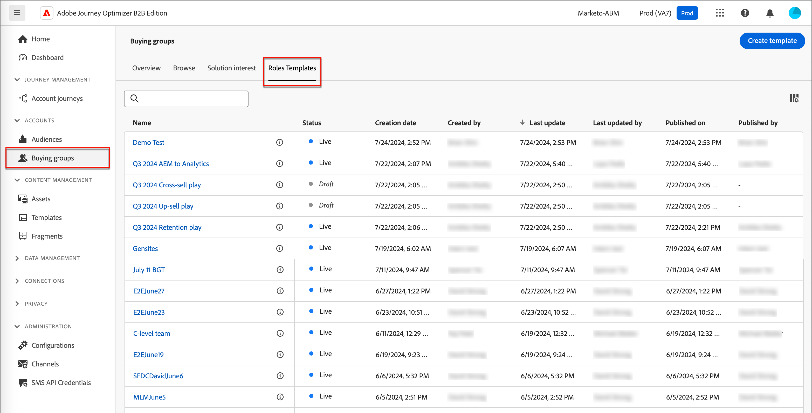
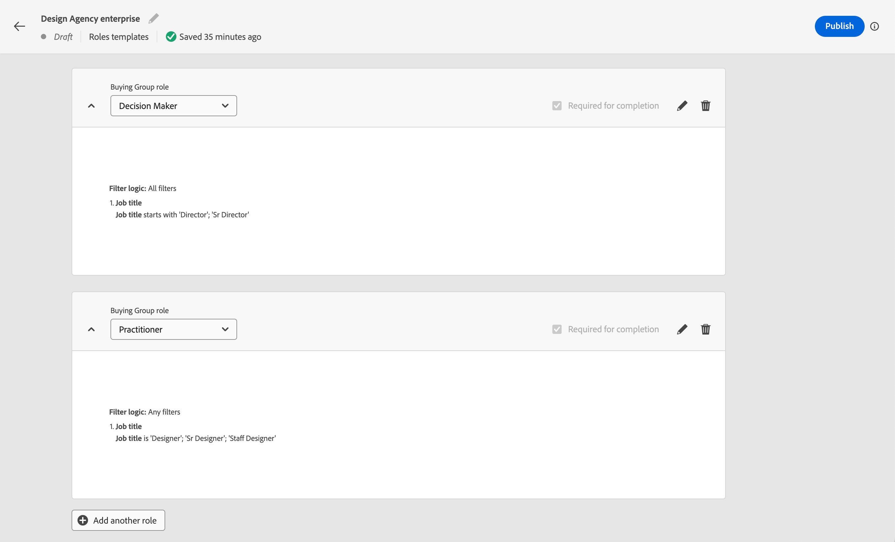

# 購買グループの役割テンプレート

B2B 市場では、購入の決定は通常、複数の個人によって行われます。 これらの個人は、組織内での役割に応じて意思決定プロセスに参加します。 各製品オファーのタイプまたはアカウントのユースケースに従って、役割の定義のグループを含む購入グループ役割テンプレートを作成します。

{width="30"} [概要ビデオを視聴](#overview-video)

## 役割テンプレートへのアクセスと参照

1. 左側のナビゲーションで「**[!UICONTROL 購入グループ]**」をクリックします。

1. _[!UICONTROL 購入グループ]_ ページで、「**[!UICONTROL 役割テンプレート]**」タブを選択します。

   {width="800" zoomable="yes"}

   このタブには、既存のすべての役割テンプレートの在庫リストが表示され、次の情報が列形式で表示されます。

   * [!UICONTROL 名前]
   * [!UICONTROL ステータス]
   * [!UICONTROL 作成日]
   * [!UICONTROL 作成者]
   * [!UICONTROL  最終更新日 ]
   * [!UICONTROL 最終更新者]
   * [!UICONTROL 公開日]
   * [!UICONTROL 公開者]

   このリストは、デフォルトで _[!UICONTROL 最終更新]_ 順に並べ替えられます。 すべての役割テンプレートのステータスは、`Draft` または `Live` です。

1. リストを名前でフィルタリングするには、リストの上部にある検索フィールドを使用します。

   名前の最初の数文字を入力して、表示されるリストを一致する項目に減らします。

   {width="700" zoomable="yes"}

## 役割テンプレートの作成

1. 「_[!UICONTROL 役割テンプレート]_」タブで、右上隅にある **[!UICONTROL テンプレートを作成]** をクリックします。

1. ダイアログで、テンプレートに一意の **[!UICONTROL 名前]** （必須）と **[!UICONTROL 説明]** （オプション）を入力します。

   {width="400"}

1. 「**[!UICONTROL 作成]**」をクリックします。

### テンプレートの役割の追加

テンプレートを作成すると、ワークスペースで開き、役割を追加するよう求められます。 デフォルトでは、最初の役割カードが表示されます。

テンプレートに対して定義する各役割では、一連のフィルター（_条件_ を使用して、役割に割り当てるメンバーを決定します。 次のフィルタータイプを使用して、役割の条件を定義します。

| タイプ | 条件 |
| ---- | --------- |
| 顧客属性 | <li>メールアドレス <li>メール無効 <li>メール中断済み <li>FAX 番号 <li>名 <li>推測される都道府県 / 地域 <li>役職 <li>姓 <li>ミドルネーム <li>携帯電話番号 <li>人物エンゲージメントスコア <li>電話番号 <li>郵便番号 <li>ステート <li>登録解除 <li>登録解除の理由 |
| 特殊フィルター | <li>リストのメンバー <li>プログラムのメンバー |
| インテントデータ | カテゴリインテント <li>製品インテント <li>キーワードインテント  [ インテントデータについて説明します ](../admin/intent-data.md)。 |

1. 最初の役割カードに対して、役割のプロパティを定義します。

   * リストから **[!UICONTROL 購入グループの役割]** を選択します。

     デフォルトの役割には、`Decision Maker`、`Influencer`、`Practitioner`、`Executive Steering Committee`、`Champion` および `Other` の 6 つがあります。 リストには、[ 役割 _リストで定義されているカスタムの役割_ も含まれ ](./default-custom-roles.md#custom-roles) います。

     {width="700" zoomable="yes"}

   * エンゲージメントスコアの計算に使用される役割の **[!UICONTROL 重み付け]** を設定します。

     各オプションの値は、スコア計算のパーセンテージ（[!UICONTROL  簡易 ] = 20、[!UICONTROL  軽度 ] = 40、[!UICONTROL  標準 ] = 60、[!UICONTROL  重要 ] = 80、[!UICONTROL  重要 ] = 100）に変換されます。

     例えば、重要、重要、標準を使用する役割を含む役割テンプレートは、100/240、80/240、60/240 に変換されます。

   * **[!UICONTROL 自動割り当ての条件を追加]** – 条件に一致する購買グループにメンバーを自動割り当てするための条件を追加する場合は、このチェックボックスを選択します。 チェックボックスが選択されていない場合、条件の追加は不要です。

   * **[!UICONTROL 完全性スコアの場合は必須]** – 完全性スコアの計算要件とする役割の場合は、このチェックボックスを選択します。

1. 「**[!UICONTROL 条件を追加]**」をクリックして、役割の条件付きルールを定義します。

   * _[!UICONTROL 条件]_ ダイアログで、**[!UICONTROL Person 属性]** のリストを展開し、役割に一致させるために使用する属性を見つけます。 右にドラッグして、フィルタースペースにドロップします。

     {width="700" zoomable="yes"}

     >[!NOTE]
     >
     >Experience Platformのアカウントオーディエンススキーマで定義されたカスタム人物フィールドがある場合、これらのフィールドを条件の人物属性として使用することもできます。

   * 属性を使用して、1 つ以上の値を使用してマッチングフィルターを作成します。

     次の例では、ジョブタイトル属性を使用して、意思決定者の一致を識別します。 `Director` または `Sr Director` で始まるタイトルの値が、条件で true と評価される場合。

     {width="700" zoomable="yes"}

   * 必要に応じて、別の属性と条件を追加し、役割との一致の条件をさらに絞り込みます。

   * 「**[!UICONTROL 完了]**」をクリックします。

1. テンプレートに含める追加の役割ごとに、「**[!UICONTROL 別の役割を追加]**」をクリックし、手順 1 と 2 を繰り返して役割を定義します。

   {width="700" zoomable="yes"}

>[!BEGINSHADEBOX  「Marketo Engage リストのメンバーシップ」 ]

Marketo Engageでは、_スマートキャンペーン_ プログラムのメンバーシップを確認して、リードが重複したメールを受け取ったり、複数のメールストリームに同時にメンバーとなったりしないようにします。 Journey Optimizer B2B では、ロールテンプレートの条件としてMarketo Engage リストメンバーシップを確認すると、購入グループメンバーシップとジャーニーアクティビティの重複をなくすことができます。

リスト メンバシップをロール条件として使用するには、[**[!UICONTROL 特殊フィルタ]**] を展開し、[**[!UICONTROL リストのメンバ]**] 条件をフィルタ スペースにドラッグします。 次に、フィルター定義を完了して、1 つ以上のMarketo Engage リストのメンバーシップを評価します。

{width="700" zoomable="yes"}

>[!ENDSHADEBOX]

変更内容は「_ドラフト_ ステータスで自動保存されます。 役割テンプレートを公開する準備が整っていない場合は、ページ上部の左（戻る）矢印をクリックして _[!UICONTROL 役割テンプレート]_ リストに戻ります。

### 役割テンプレートの公開

テンプレートを使用する準備が整ったら、右上の **[!UICONTROL 公開]** をクリックします。

テンプレートを公開すると、ステータスが _ライブ_ ステータスに設定され、ソリューションの関心に関連付けることができます。 役割テンプレートを公開するには、定義済みの役割が少なくとも 1 つ必要です。

## 下書き役割テンプレートの編集

役割テンプレートが _ドラフト_ 状態の場合、定義済みの役割の編集を続行できます。 加えた変更は、自動的に保存されます。

購入グループの役割、重み付け、自動割り当て、完了度スコアの要件など、役割カードのヘッダーの設定を変更します。

{width="600"}

### 役割の条件の変更

いずれかの役割の条件/フィルタリングロジックを変更するには、役割カードの右上にある _編集_ （）アイコンをクリックします。 このアクションにより、_[!UICONTROL 条件]_ ワークスペースが開き、既存のフィルターの変更、フィルターの追加や削除、フィルターロジックの変更をおこなうことができます。

### 役割カードの削除

テンプレートから役割を削除する場合は、役割カードの _削除_ （）アイコンをクリックします。

### 役割の優先度の設定

テンプレート内のロールの順序を変更できます。これにより、リードをロールに割り当てる優先度が決まります。 各役割カードの右側に **[!UICONTROL 優先度]** コントローラが表示されます。 右側の _上_ または _下_ 矢印をクリックして、役割カードを優先して上下に移動します。

{width="700"}

## 役割テンプレートの削除

役割テンプレートが _ドラフト_ ステータスの場合、削除できます。

1. リストから役割テンプレートを選択して開きます。

1. 右上の **[!UICONTROL 削除]** をクリックします。

   {width="700"}

1. ダイアログで、「**[!UICONTROL 削除]**」をクリックして確定します。

## 概要ビデオ

>[!VIDEO](https://video.tv.adobe.com/v/3433079/?learn=on)
