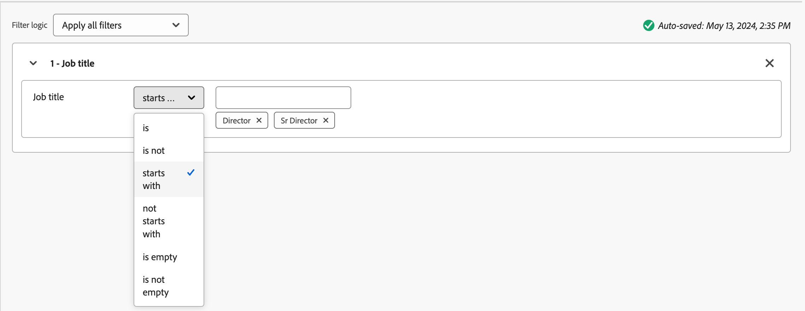

# 購買グループの役割テンプレート

B2B市場では、通常、複数の個人が購買決定を行います。 これらのメンバーは、組織内での役割に応じて、意思決定プロセスに参加します。 製品オファーのタイプやアカウントのユースケースごとに、役割の定義のグループを含む購買グループの役割テンプレートを作成できます。

{width="30"} [概要ビデオを視聴](#overview-video)

## 役割テンプレートへのアクセスと参照

1. 左側のナビゲーションで、**[!UICONTROL 購買グループ]**&#x200B;をクリックします。

1. _[!UICONTROL 購買グループ]_ ページで、「**[!UICONTROL 役割テンプレート]**」タブを選択します。

   {width="800" zoomable="yes"}

   このタブには、既存のすべてのロールテンプレートのインベントリのリストが表示され、次の情報が列形式で表示されます。

   * [!UICONTROL 名前]
   * [!UICONTROL ステータス]
   * [!UICONTROL 作成日]
   * [!UICONTROL 作成者]
   * [!UICONTROL 最終更新]
   * [!UICONTROL 最終更新者]
   * [!UICONTROL 公開日]
   * [!UICONTROL 公開者]

   リストは、デフォルトで&#x200B;_[!UICONTROL 前回の更新]_&#x200B;で並べ替えられます。 すべての役割テンプレートのステータスは`Draft`または`Live`です。

1. リストを名前でフィルタリングするには、リストの上部にある検索フィールドを使用します。

   名前の最初の数文字を入力して、表示されるリストを一致する項目に減らします。

   {width="700" zoomable="yes"}

## 役割テンプレートの作成

1. _[!UICONTROL 役割テンプレート]_ タブで、右上隅の「**[!UICONTROL テンプレートを作成]**」をクリックします。

1. ダイアログで、テンプレートの一意の&#x200B;**[!UICONTROL 名前]** （必須）と&#x200B;**[!UICONTROL 説明]** （オプション）を入力します。

   {width="400"}

1. 「**[!UICONTROL 作成]**」をクリックします。

### テンプレートの役割の追加

テンプレートを作成すると、ワークスペースが開き、役割を追加するように求められます。 最初の役割カードはデフォルトで表示されます。

テンプレート用に定義する各役割では、一連のフィルター、つまり&#x200B;_条件_&#x200B;を使用して、役割に割り当てられたメンバーを決定します。 次のフィルタータイプを使用して、役割の条件を定義します。

| タイプ | 条件 |
| ---- | --------- |
| [!UICONTROL 人物の属性] | [人物プロファイル ](../admin/field-mapping.md#xdm-business-person-attributes)の属性（以下を含む）: <li>市町村 <li>国 <li>メールアドレス <li>メール無効 <li>メール中断済み <li>名 <li>推測される都道府県 / 地域 <li>役職 <li>姓 <li>携帯電話番号 <li>人物エンゲージメントスコア <li>電話番号 <li>郵便番号 <li>状態 |
| [!UICONTROL  カスタムオブジェクト ] >に`<custom object>`があります | [!BADGE Beta]{type=Informative tooltip="Betaの機能"} アカウントにリレーショナルスキーマレコードがないか、またはリレーショナルスキーマレコードがありません。 また、[XDM リレーショナルスキーマ ](../admin/xdm-field-management.md#relational-schemas)で設定されているように、選択したカスタムオブジェクトの条件に対して評価することもできます。 |
| 特殊なフィルター | <li>リストのメンバー（非推奨） <li>プログラムのメンバー（非推奨） |
| インテントデータ | <li>カテゴリの意図 <li>製品インテント <li>キーワードインテント   （[_インテントデータ_](../admin/intent-data.md)&#x200B;を参照） |

1. 最初の役割カードに対して、役割のプロパティを定義します。

   * リストから&#x200B;**[!UICONTROL 購買グループの役割]**&#x200B;を選択します。

     既定の役割は6つあります：`Decision Maker`、`Influencer`、`Practitioner`、`Executive Steering Committee`、`Champion`、および`Other`。 リストには、_役割_ リスト ](./default-custom-roles.md#custom-roles)で定義されている[ カスタム役割も含まれます。

     {width="700" zoomable="yes"}

   * エンゲージメントスコアの計算に使用する役割の&#x200B;**[!UICONTROL 重み付け]**&#x200B;を設定します。

     各オプションの値は、スコア計算の割合に変換されます：[!UICONTROL Trivial] = 20、[!UICONTROL Minor] = 40、[!UICONTROL Normal] = 60、[!UICONTROL Important] = 80、[!UICONTROL Vital] = 100。

     例えば、Vital、Important、Normalを使用する役割を持つロールテンプレートは、100/240、80/240、60/240に変換されます。

   * **[!UICONTROL 自動割り当て条件を追加]** – 条件に一致する購買グループにメンバーを自動割り当て条件を追加するには、このチェックボックスを選択します。 チェックボックスが選択されていない場合は、条件を追加する必要はありません。

   * **[!UICONTROL 完全性スコアに必須]** – 完全性スコアを計算するための要件にする場合は、役割のこのチェックボックスを選択します。

1. 「**[!UICONTROL 条件を追加]**」をクリックし、役割の条件付きルールを定義します。

   * _[!UICONTROL 条件]_ ダイアログで、**[!UICONTROL 人物属性]**&#x200B;のリストを展開し、役割に一致させるために使用する属性を見つけます。 右にドラッグして、フィルタースペースにドロップします。

     {width="700" zoomable="yes"}

     >[!NOTE]
     >
     >Experience Platformの法人向け人物スキーマでカスタム人物フィールドを定義している場合、これらのフィールドは、条件で人物属性として使用することもできます。

     属性を使用して、1つ以上の値を使用して一致するフィルターを作成します。

     次の例では、「役職」属性を使用して、意思決定者の一致を識別します。 `Director`または`Sr Director`で始まるタイトルの値は、条件に対してtrueと評価されます。

     {width="700" zoomable="yes"}

   * XDM リレーショナルスキーマ ](../admin/xdm-field-management.md#relational-schemas)で定義された人物[に関連するカスタムオブジェクトが設定されている場合は、**[!UICONTROL カスタムオブジェクト]**&#x200B;のリストを展開して、役割の条件でそれらを使用します。

     {width="700" zoomable="yes"}

   * 必要に応じて、別の属性/オブジェクトと条件を追加し、役割に一致する条件をさらに絞り込みます。

   * 「**[!UICONTROL 完了]**」をクリックします。

1. テンプレートに含める追加の役割ごとに、**[!UICONTROL 別の役割を追加]**&#x200B;をクリックし、手順1と2を繰り返して役割を定義します。

   複数の役割が定義された{width="700" zoomable="yes"}

   変更は、_ドラフト_&#x200B;のステータスで自動保存されます。 役割テンプレートを公開する準備ができていない場合は、ページ上部の左（後ろ）矢印をクリックして、_[!UICONTROL 役割テンプレート]_ リストに戻ります。

>[!BEGINSHADEBOX &quot;Marketo Engage リスト メンバーシップ&quot;]

Marketo Engageでは、_スマートキャンペーン_&#x200B;がプログラムのメンバーシップをチェックして、リードが重複するメールを受信せず、同時に複数のメールストリームのメンバーでないことを確認します。 Journey Optimizer B2Bでは、ロールテンプレートの条件としてMarketo Engage リストメンバーシップを確認して、購買グループメンバーシップとジャーニーアクティビティの重複を排除するのに役立ちます。

リストのメンバーシップを役割の条件として使用するには、**[!UICONTROL 特殊フィルター]**&#x200B;を展開し、**[!UICONTROL リストのメンバー]**&#x200B;条件をフィルタースペースにドラッグします。 次に、フィルター定義を入力して、1つ以上のMarketo Engage リストのメンバーシップを評価します。

Marketo Engage リスト メンバーシップの{width="700" zoomable="yes"}
 

>[!NOTE]
>
>**機能の非推奨化**  
>
>Journey Optimizer B2B editionの[簡素化されたアーキテクチャ ](../simplified-architecture.md)では、Marketo Engage インスタンスのリストまたはプログラムメンバーシップに基づくフィルタリングはサポートされていません。

>[!ENDSHADEBOX]

### 完全性スコア設定の変更

デフォルトでは、役割の完全性は、役割に割り当てられた1人のメンバーとして定義されます。 購買グループの完全性をセールスの準備状況または成功<!-- journey decisioning coming later-->の指標として使用する場合は、これらの設定を使用して、商談をクローズするために必要な役割ごとのメンバー数とスコアを調整できます。

例えば、ソリューション _X_&#x200B;の契約をクローズするには、組織内の複数のマーケティングチームがソリューションを使用するため、複数のマーケティング意思決定者を特定してエンゲージする必要があります。 この場合、少なくとも2人のマーケティング意思決定者を必要とすることで、しきい値を増やして&#x200B;_完了_&#x200B;購買グループを計算します。

完全性のスコアリングと計算について詳しくは、[完全性スコア](./completeness-scores.md)を参照してください。

1. 役割テンプレートページの右上にある「**[!UICONTROL 完全性スコア設定]**」をクリックします。

   {width="700" zoomable="yes"}

1. ダイアログで、必要に応じて、定義された各役割の&#x200B;**[!UICONTROL メンバーが必要な]**&#x200B;値を変更します。

   値を入力するか、**&amp;plus;**&#x200B;または&#x200B;**−**&#x200B;をクリックして、値を増減できます。

   {width="450"}

1. 「**[!UICONTROL 保存]**」をクリックします。

### 役割テンプレートの公開

テンプレートを使用する準備ができたら、右上の「**[!UICONTROL 公開]**」をクリックします。

テンプレートを公開すると、ステータスが&#x200B;_Live_ ステータスに設定され、ソリューションの関心と関連付けて利用できるようになります。 ロールテンプレートを公開するには、少なくとも1つの定義された役割が必要です。

## ドラフト役割テンプレートの編集

役割テンプレートが&#x200B;_ドラフト_&#x200B;状態の場合、定義された役割を引き続き編集できます。 変更はすべて自動的に保存されます。

購買グループの役割、重み付け、自動割り当て、完全性スコアリング要件など、ロールカードのヘッダーの設定のいずれかを変更します。

{width="600"}

### 役割の条件の変更

いずれかの役割の条件/フィルタリングロジックを変更するには、役割カードの右上にある&#x200B;_編集_ （）アイコンをクリックします。 このアクションを実行すると、_[!UICONTROL 条件]_ ワークスペースが開き、既存のフィルターを変更したり、フィルターを追加または削除したり、フィルターロジックを変更したりできます。

### 役割カードの削除

テンプレートから役割を削除する場合は、役割カードの&#x200B;_削除_ （）アイコンをクリックします。

### 役割の優先度の設定

テンプレート内の役割を並べ替えて、役割にリードを割り当てる優先順位を決定できます。 各役割カードの右側に&#x200B;**[!UICONTROL 優先度]** コントローラが表示されます。 右側の&#x200B;_上_&#x200B;または&#x200B;_下_&#x200B;矢印をクリックして、ロールカードを優先度の高い順または低い順に移動します。

{width="700"}

## 役割テンプレートの削除

役割テンプレートが&#x200B;_ドラフト_ ステータスの場合は、削除できます。

1. リストから役割テンプレートを選択して開きます。

1. 右上の「**[!UICONTROL 削除]**」をクリックします。

   {width="700"}

1. ダイアログで、**[!UICONTROL 削除]**&#x200B;をクリックして確認します。

## 概要動画

>[!VIDEO](https://video.tv.adobe.com/v/3433079/?learn=on)
