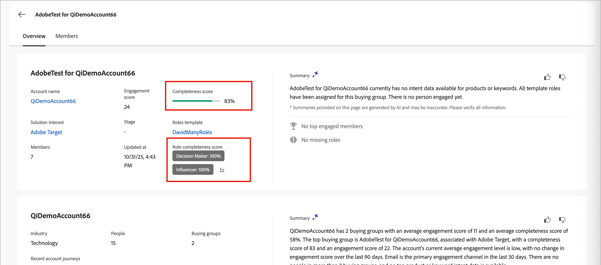

# 完全性スコア {#completeness-scores}

>[!CONTEXTUALHELP]
>id="ajo-b2b_buying_group_completeness_score"
>title="完全性スコア"
>abstract="完全性スコアは、購買グループのメンバーシップが営業対応可能な購買グループにどの程度適合しているかを反映しています。"

完全性スコアとは、定義された役割をまたいで、購買グループに必要なメンバーがどの程度割り当てられているかを示す割合です。 これらのスコアは、役割テンプレートで設定した役割メンバーのしきい値と、購買グループの各役割に割り当てられた実際のメンバー数に基づいています。 結果として得られるスコアは、マーケターがセールス部門の準備状況を評価し、購買グループの構成のギャップを特定するのに役立ちます。 購買グループのメンバーシップが変更されると、スコア計算が自動的に実行されます。

{width="800" zoomable="yes"}

完全性スコアには2種類あります。

* **購買グループの完全性スコア** – 購買グループの完全性スコアは0%から100%の間の割合で、役割レベルの完全性の計算に基づいて購買グループの全体的な完全性を表します。

  購買グループの完全性スコアは、[購買グループの詳細](./buying-group-details.md) ページに表示されます。 このスコアにより、購買グループがセールス活動に必要な関係者を配置しているかどうかが一目で把握できます。

* **役割の完全性スコア** – 役割の完全性スコアは、その役割に割り当てられたメンバーの数に基づいて、購買グループ内の個々の役割に対する割合です。

  役割を編集して完全性の設定を調整すると、各役割の役割の完全性スコアが購買グループの詳細ページに表示されます。 これらのスコアは、営業活動のしきい値に達するために、追加のメンバーが必要な特定の役割を特定するのに役立ちます。

  詳細ページには、最初の2つの役割の完全性スコアと、追加の役割に対するn_+リンクが表示されます。 リンクをクリックして、追加の役割の完全性スコアを表示します。

完全性スコアは、購買グループのメンバーシップの現状を反映し、メンバーが追加または削除されると自動的に更新されます。 表示されたスコアは全体のパーセンテージとして表示されます（例えば、66.67%のスコアは67%として表示されます）。

## 営業準備状況の評価

Adobe Journey Optimizer B2B editionは、実際の意思決定プロセスに即した購買グループを作成できるツールをマーケターに提供します。 組織のセールス手法を反映したカスタマイズ可能な役割メンバーのしきい値を使用して、包括的な購買グループを定義できます。 各役割に対して最小および最大のメンバー要件を設定することで、営業対応の購買グループを構成する要素に関する明確な基準を確立できます。

購買グループの完全性スコアは、グループの商談確度を正確に測定します。 たとえば、特定のソリューションに関するオポチュニティを完成させるには、少なくとも2人の意思決定者、1人のインフルエンサー、少なくとも1人の実務担当者が必要になる場合があります。 完全性スコア計算では、これらの役割固有の各要件を考慮し、購買グループ全体の準備状況を把握できます。

## ジャーニーの効果を測定

購買グループの完全性は、ジャーニーの効果に関する主要業績評価指標（KPI）として機能します。 特定のジャーニーの目標は、購買グループの完成度を一定の割合で向上させることや、販売可能なアラートをトリガーする前に最小限の基準を達成することです。

大規模な企業では、1つの役割につき1人を特定することもあります。 しかし、その個人が販売のための適切な連絡先ではないかもしれませんし、重要な役割で複数の連絡先が必要な場合もあります。 たとえば、大規模な組織では、複数の部門や事業部門に分散した、IT （情報技術）意思決定者が複数いることがあります。 ひとつの意思決定者を特定するだけでは、大規模なセールスを実現するには不十分です。

現在の購買グループの完全性を分析した後、役割テンプレートの各役割に対して必要な数の連絡先を調整できます。 こうした調整により、実際のパターンや売上の結果にもとづいて、購買グループの戦略を調整できます。

<!-- ## Analyze audiences for journey optimization

Marketers can view the starting buying group completeness score of target account audiences to find the best performance indicators for a solution. This visibility enables marketers to:

* Determine if they need to adjust the completeness score requirements for each role to make journeys more effective.
* Identify which buying groups are closest to sales-ready status and prioritize them for acceleration campaigns.
* Segment buying groups by completeness score ranges and create tailored nurture strategies for different maturity levels.

>[!BEGINSHADEBOX]

The buying group completeness score is available to use for filtering in [journey split-path-by-account nodes](../journeys/split-merge-paths-nodes.md#account-path-filters) and for audience segmentation. Role completeness can be used to create personalized content that addresses specific gaps in buying group composition.

>[!ENDSHADEBOX] -->

## 役割の完全性の計算 {#role-completeness-calculation}

>[!CONTEXTUALHELP]
>id="ajo-b2b_buying_group_role_completeness_calculation"
>title="役割の完全性の計算"
>abstract="役割の完全性スコアは、役割に割り当てられたメンバーの数に基づいてパーセンテージで計算されます。"

Journey Optimizer B2B editionは、各購買グループの役割に対する完全性スコアをパーセントで計算します。 このスコアは、役割に割り当てられたメンバーの数に基づきます。一方、[完了にロールテンプレート ](./buying-groups-role-templates.md#change-the-completeness-score-settings)で必要な数です。

役割の完全性の計算は、ゼロから指定されたしきい値（メンバーが必要）までの間の線形パーセンテージです。

* 割り当てられたメンバーの数が&#x200B;**zero**&#x200B;の場合、役割の完全性は&#x200B;**0%**&#x200B;です。
* 割り当てられたメンバーの数が&#x200B;**しきい値**&#x200B;以上の場合、役割の完全性は&#x200B;**100%**&#x200B;です。
* 割り当てられたメンバーの数が1からしきい値&#x200B;**までの**&#x200B;の場合、完全性は比例して計算されます。

### 役割の完全性の式

役割の完全性の割合は、次の式を使用して計算されます。

```text
Role Completeness % = ((Assigned Members - Threshold) / (Threshold)) × 100
```

ここで：

* `Assigned Members` =役割の現在のメンバー数
* `Threshold` =役割テンプレートで設定されたメンバーの必要な値

### 役割の完全性の例

次の例は、異なるしきい値設定を使用した役割の完全性の計算を示しています。

| 役割 | 必要なメンバー | 担当者メンバー | 計算 | 役割の完全性 |
|------|------------------|------------------|-------------|-------------------|
| 意思決定者 | 3 | 0 | None | 0% |
|  |  | 1 | 1/3 × 100 | 33% |
|  |  | 2 | 2/3 × 100 | 66% |
|  |  | 3 | しきい値 | 100% |
|  |  | 4 | しきい値を超える | 100% |
| インフルエンサー | 5 | 0 | None | 0% |
|  |   | 1 | 1/5 × 100 | 20% |
|  |   | 2 | 2/5 × 100 | 40% |
|  |   | 3 | 3/5 × 100 | 60% |
|  |   | 4 | 4/5 × 100 | 80% |
|  |   | 5 | しきい値 | 100% |
|  |   | 6 | しきい値を超える | 100% |

## 購買グループの完全性の計算 {#buying-group-completeness-calculation}

購買グループの完全性スコアは、個々の役割の完全性スコアを集計します。 この計算により、定義されたあらゆる役割をまたいで、購買グループの準備状況を包括的に把握できます。

### 購買グループの完全性の式

購買グループの完全性の割合は、次の式を使用して計算されます。

```text
Buying Group Completeness % = Σ(Role Completeness %) / Number of defined roles
```

ここで：

* `Role Completeness %` =個人の役割の完全性の割合（0 ～ 100%）
* `Σ` =購買グループ内のすべての役割の合計

<!--

## Use completeness scores in journeys

Use buying group completeness scores and role-level completeness scores to optimize your account journeys and personalize engagement strategies.

### Split paths by completeness

Use completeness thresholds in [journey split-path-by-account nodes](../journeys/split-merge-paths-nodes.md#account-path-filters) to route buying groups through different journey paths based on their readiness. For example:

* **High completeness path** (≥70%) - Buying groups that are nearly sales-ready can be routed to sales teams or receive call-to-action campaigns
* **Medium completeness path** (40-69%) - Buying groups in active development receive nurture campaigns focused on filling specific role gaps
* **Low completeness path** (<40%) - Newly formed buying groups receive awareness and education content to build initial engagement

### Trigger actions based on completeness milestones

Set up journey events that trigger specific actions when buying groups reach completeness milestones. FOr example:

* Alert sales teams when a buying group reaches 70% completeness.
* Send a _stakeholder alignment_ campaign when completeness increases by 20% or more within a defined timeframe.
* Trigger an automated assessment when a buying group stalls at the same completeness level for an extended period.

By leveraging completeness scores throughout the journey, you create more targeted, efficient campaigns that align with the actual composition and maturity of your buying groups.

-->
