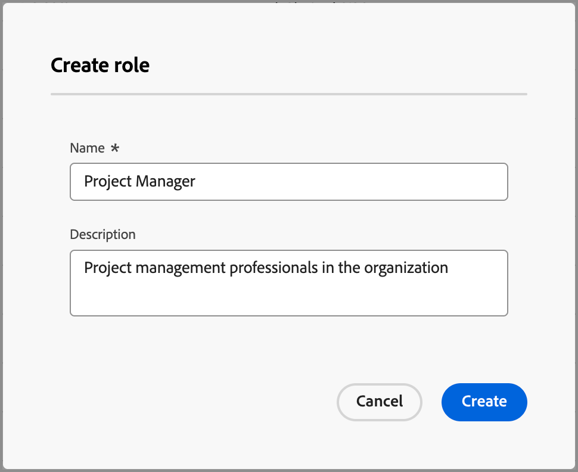

# デフォルトおよびカスタムの役割

Journey Optimizer B2B editionには、購買グループのロールテンプレートで使用されるデフォルトの役割セットが含まれています。 しかし、多くの企業では、ビジネス目標や戦略に応じて定義できる、カスタムの役割を必要としています。 _[!UICONTROL 役割]_ リストを使用して、購買グループをサポートする独自の役割の定義を作成できます。

## 役割へのアクセス

1. 左側のナビゲーションで、**[!UICONTROL 購買グループ]**&#x200B;をクリックします。

1. _[!UICONTROL 購買グループ]_ ページで、「**[!UICONTROL 役割]**」タブを選択します。

   {width="700" zoomable="yes"}

   このタブには、既存のすべての役割のインベントリリストが表示され、次の情報が列形式で表示されます。

   * [!UICONTROL Name] - ロール名。
   * [!UICONTROL  タイプ ] – すべての役割のタイプは`Default`または`Custom`です。
   * [!UICONTROL 作成日] - カスタムの役割の場合、役割が作成された日時。
   * [!UICONTROL 作成者] - カスタムの役割の場合、その役割を作成したユーザー。
   * [!UICONTROL 最終更新日：] - カスタム役割の場合、役割が最後に更新された日時。
   * [!UICONTROL 更新者] - カスタム役割の場合、役割を最後に更新したユーザー。

   リストの上部にデフォルトの役割が表示されます。

   * 意思決定者
   * インフルエンサー
   * 実務担当者
   * 運営委員会
   * チャンピオン
   * その他

   >[!NOTE]
   >
   >デフォルトの役割を変更または削除することはできません。 デフォルトの役割とカスタム役割を含め、最大20個の役割に制限があります。

## カスタムの役割の作成

1. _[!UICONTROL 役割]_ タブで、右上隅の「**[!UICONTROL 役割を作成]**」をクリックします。

1. ダイアログで、役割の一意の&#x200B;**[!UICONTROL 名前]** （必須）と&#x200B;**[!UICONTROL 説明]** （オプション）を入力します。

   {width="400"}

1. 「**[!UICONTROL 作成]**」をクリックします。

## カスタム役割の管理

_[!UICONTROL 役割]_ タブでカスタム役割を管理できます。これには、役割の名前と説明の編集と、役割リストからの役割の削除が含まれます。 _詳細_ メニューアイコン （**...**）をクリックします ステージのモデル名の横にある「**[!UICONTROL 編集]**」または「**[!UICONTROL 削除]**」を選択します。

{width="600"}
