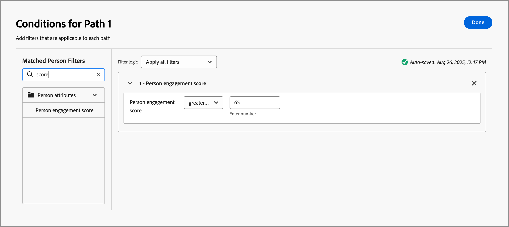
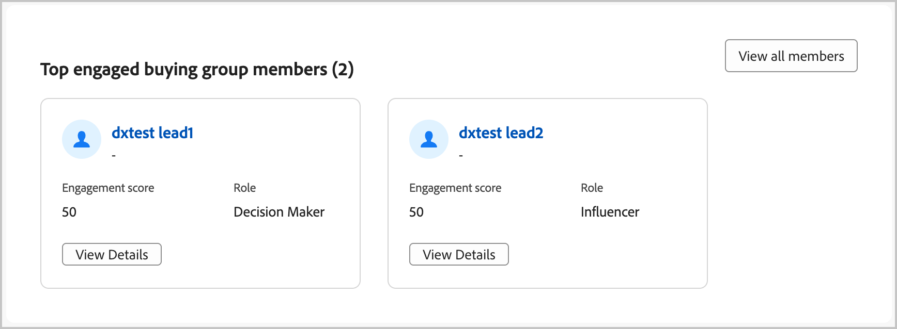
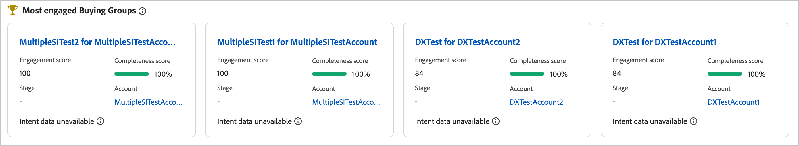
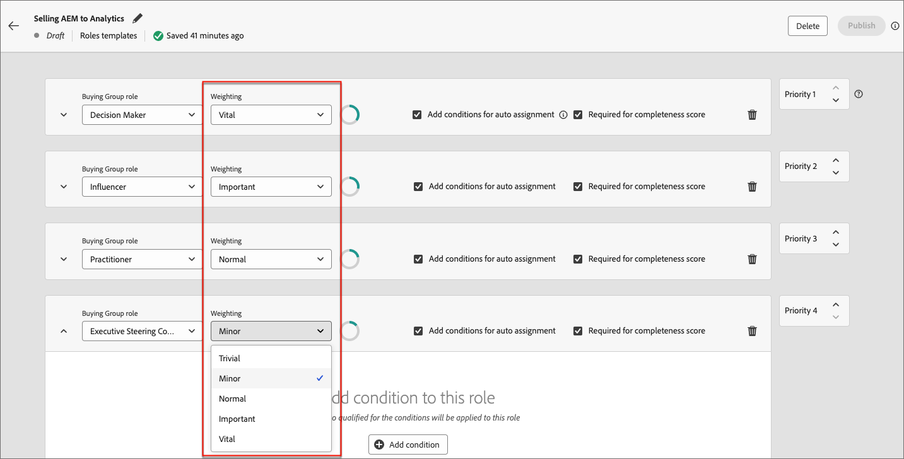

# エンゲージメントスコア {#engagement-scores}

>[!CONTEXTUALHELP]
>id="ajo-b2b_buying_group_engagement_score"
>title="エンゲージメントスコア"
>abstract="エンゲージメントスコアは、購買グループメンバーのエンゲージメントレベルを決定します。"

エンゲージメントスコアは、購買グループのメンバーのエンゲージメントのレベルを示す数値です。 これらのスコアは、購買グループメンバーの活動、加重アクション、および加重された役割に基づいています。 結果のスコアはテナント（インスタンス）内で正規化され、一貫性のある比較を可能にし、実用的なインサイトを可能にします。 スコアの計算は、購買グループを作成するとすぐに開始されます。 Journey Optimizer B2B edition データハブシステムは、毎日スコアを計算し、取り込みサービスを使用してマルチレベルマーケティング（MLM） MySQL システムにアップロードします。

エンゲージメントスコアには、次の2種類があります。

* **購買グループのエンゲージメントスコア** – 購買グループのエンゲージメントスコアは、0から100までの間の正規化されたスコアであり、人物レベルで計算されたエンゲージメントスコアに基づいています。

  購買グループのエンゲージメントスコアは、[購買グループの詳細](./buying-group-details.md) ページに表示されます。 また、インテリジェントダッシュボードで最もエンゲージメントの高い購買グループを表示することもできます。

  {width="700" zoomable="yes"}

* **人物エンゲージメントスコア** – 人物エンゲージメントスコアは、個々の購買グループメンバーのアクティビティに基づいています。

  購買グループの各メンバーに対する人物エンゲージメントスコアは、購買グループの詳細ページ [_[!UICONTROL &#x200B; メンバー&#x200B;]_&#x200B;タブ &#x200B;](./buying-group-details.md#buying-group-members)に表示されます。 これらのスコアは、最もエンゲージメントの高いメンバーや重複する連絡先情報を含むページやダッシュボードにも表示されます。

  {width="550" zoomable="yes"}

>[!BEGINSHADEBOX]

人物エンゲージメントスコアは、[&#x200B; ロールテンプレート &#x200B;](./buying-groups-role-templates.md#add-the-template-roles)および[&#x200B; ジャーニースプリットパスによる人物ノード &#x200B;](../journeys/split-merge-paths-nodes.md#people-path-filters)でのフィルタリングに使用できる属性です。

{width="550" zoomable="yes"}

>[!ENDSHADEBOX]

過去30日間に購買グループのメンバーが実行したエンゲージメント加重活動を使用して、スコアを計算します。 30日間のウィンドウでは、アクティビティの発生回数が期限切れになり、スコアが下に移動する可能性があります（スコア減衰）。 表示されるスコアは丸められます（例えば、スコア 75.89999は76と表示されます）。

## エンゲージメントスコアリングに使用されるアクティビティ

購買グループのスコアリングは&#x200B;_トリガーベース_&#x200B;ではありません。 購買グループのすべてのメンバーのアクティビティを評価し、スコアを再計算する日々のプロセスです。 アクティビティでは、_重み付け_&#x200B;を使用して、アクティブな重み付けモデルに従って購買グループのスコアリングを通知します。これにより、各アクティビティの重み付け方法が決定されます。

各アクティビティの 1 日あたりのフリークエンシーキャップは 20 です。 購買グループのメンバーが1日に20回以上同じアクティビティを実行した場合、アクティビティのカウントは20に制限されます。

| アクティビティ名 | 説明 | エンゲージメントタイプ | 1 日あたりの最大頻度数 | 既定のモデル アクティビティの重み付け |
|---------------|-------------|-----------------|---------------------------|-------------------------------|
| イベントに出席 | メンバーがイベントに出席しました | イベント | 20 | 60 |
| 電子メールクリック数 | メンバーがメール内のリンクをクリックします | メール | 20 | 30 |
| 電子メール開封済み | メンバーがメールを開きます | メール | 20 | 30 |
| フォームに入力 | メンバーが web ページ上のフォームに入力して送信します | Web | 20 | 40 |
| 注目のアクション | メンバーに注目のアクションがあります | キュレート | 20 | 60 |
| リンククリック数 | メンバーが web ページ上のリンクをクリックします | Web | 20 | 40 |
| ページビュー | Web ページを表示するメンバー | Web | 20 | 40 |
| イベントに登録 | イベントに登録されたメンバー | イベント | 20 | 60 |

<!--
 old list

| Activity name | Description | Engagement type | Max daily frequency count | Activity weight |
| --- | --- | --- | --- | --- |
| [!UICONTROL Visit Webpage]| A member visits a web page | Web | 20 | 40 |
| [!UICONTROL Fill Out Form]| A member fills and submits a form on a web page | Web | 20 | 40 |
| [!UICONTROL Click Link] | A member clicks a link on a web page | Web | 20 | 40 |
| [!UICONTROL Open Email] | A member opens an email | Email | 20 | 30 |
| [!UICONTROL Click Email] | A member clicks a link in an email | Email | 20 | 30 |
| [!UICONTROL Open Sales Email] | A member opens a sales email | Email | 20 | 30 |
| [!UICONTROL Click Sales Email] | A member clicks a link in a sales email | Email | 20 | 30 |
| [!UICONTROL Interesting Moment] | A member has an interesting moment | Curated | 20 | 60 |
| [!UICONTROL Tap Push Notification] | A member receives a push notification | Mobile | 20 | 30 |
| [!UICONTROL Mobile App Activity] | A member performs an activity on a mobile app | Mobile | 20 | 30 |
| [!UICONTROL Mobile App Session] | A member is active on a mobile app session | Mobile | 20 | 30 |
| [!UICONTROL Fill Out Facebook Lead Ads Form] | A member fills and submits a Lead Ads form on a Facebook page | Social | 20 | 30 |
| [!UICONTROL Click RTP Call to Action] | A member clicks a personalized call to action | Web | 20 | 60 |
| [!UICONTROL View In-App Message] | A member views an in-app message | Mobile | 20 | 30 |
| [!UICONTROL Tap In-App Message] | A member taps an in-app message | Mobile | 20 | 30 |
| [!UICONTROL Subscribe SMS] | A member subscribes to SMS communications | SMS | 20 | 90 |
| [!UICONTROL Reply to Sales Email] | A member replies to a sales email | Email | 20 | 30 |
| [!UICONTROL Engaged with a Dialogue] | A member engages with a Dynamic Chat dialogue | Chat | 20 | 90 |
| [!UICONTROL Interacted with Document in Dialogue] | A member interacts with a document in a Dynamic Chat dialogue | Chat | 20 | 90 |
| [!UICONTROL Scheduled Meeting in Dialogue] | A member schedules an appointment in a Dynamic Chat dialogue | Chat | 20 | 90 |
| [!UICONTROL Reached Dialogue Goal] | A member reaches a goal in a Dynamic Chat dialogue |  |20 | 90 |
| [!UICONTROL Responded to a poll in webinar] | A member responds to a poll in a webinar event | Chat | 20 | 90 |
| [!UICONTROL Call to action clicked in webinar] | A member clicks a call-to-action link in a webinar event | Call | 20 | 30 |
| [!UICONTROL Asset downloads in webinar] | A member downloads a file/asset in a webinar event | Event | 20 | 60 |
| [!UICONTROL Asks questions in webinar] | A member asks questions in a webinar event | Event | 20 | 60 |
| [!UICONTROL Has attended event] | A member attended an event | Event | 20 | 60 |
| [!UICONTROL Engaged with an Agent in Dialogue] | A member engages with an agent in a Dynamic Chat dialogue | Chat | 20 | 90 |
| [!UICONTROL Clicked Link in Chat in Dialogue] | A member clicks a link in a Dynamic Chat dialogue | Chat | 20 | 90 |
| [!UICONTROL Engaged with a Conversational Flow] | A member engages with a Dynamic Chat conversational flow | Chat | 20 | 90 |
| [!UICONTROL Scheduled Meeting in Conversational Flow] | A member schedules an appointment in a Dynamic Chat conversational flow | Chat | 20 | 90 |
| [!UICONTROL Reached Conversational Flow Goal] | A member reaches a goal in a Dynamic Chat conversational flow | Chat | 20 | 90 |
| [!UICONTROL Interacted with Document in Conversational Flow] | A member interacts with a document in a Dynamic Chat conversational flow | Chat | 20 | 90 |
| [!UICONTROL Engaged with an Agent in Conversational Flow] | A member engages with an Agent in a Dynamic Chat conversational flow | Chat | 20 | 90 |
| [!UICONTROL Clicked Link in Chat in Conversational Flow] | A member clicks a link in a Dynamic Chat conversational flow | Chat | 20 | 90 |
| [!UICONTROL Click Link in SMS V2] | A member clicks a link in an SMS message | SMS | 20 | 90 |
-->

>[!NOTE]
>
>エンゲージメントスコアアクティビティは、個人のMarketo Engage アクティビティログに記録されます。 このログには、接続されているMarketo Engage インスタンスからアクセスできます。 詳しくは、Marketo Engage ドキュメントの「[&#x200B; ユーザーのアクティビティログを探す](https://experienceleague.adobe.com/ja/docs/marketo/using/product-docs/core-marketo-concepts/smart-lists-and-static-lists/managing-people-in-smart-lists/locate-the-activity-log-for-a-person){target="_blank"}」を参照してください。

## 役割テンプレートの重み付け {#engagement-score-weighting}

>[!CONTEXTUALHELP]
>id="ajo-b2b_buying_group_engagement_score_weighting"
>title="エンゲージメントスコアの役割別重み付け"
>abstract="役割別重み付けを使用して、エンゲージメントスコアの計算をカスタマイズします。"

ユーザーは、[役割テンプレート &#x200B;](./buying-groups-role-templates.md)の各役割に&#x200B;_重み付け_&#x200B;を割り当てて、役割に異なる重みを割り当てることができます。

{width="700" zoomable="yes"}

各重み付けレベルは値に変換され、エンゲージメントスコアの計算に使用されます。

* [!UICONTROL 全く重要でない] = 20
* [!UICONTROL 重要ではない] = 40
* [!UICONTROL 標準] = 60
* [!UICONTROL 重要] = 80
* [!UICONTROL 非常に重要] = 100

_[!UICONTROL 非常に重要]_、_[!UICONTROL 重要]_、_[!UICONTROL 標準]_&#x200B;として重み付けされた 3 つの役割を持つ役割テンプレートは、次の重み付けパーセンテージに変換されます。

| 役割 | 重み付け | システム値 | 値の計算 | 割合 |
|-------------- |--------- |------------- |------------------ |---------- |
|               |          |              |                   |           |
| 意思決定者 | 非常に重要 | 100 | 100/240 | 41.67％ |
| インフルエンサー | 重要 | 80 | 80/240 | 33.33％ |
| 実務担当者 | 標準 | 60 | 60/240 | 25％ |
|               | 合計 | 240 |                   |           |

## スコア計算の例

次の例は、エンゲージメントスコアの計算を示しています。 概要が記載された役割の重み付け率、購買グループメンバーごとに実施されたインバウンドアクティビティの数、イベントが発生するたびに日当たり20個の上限を使用します。

| 役割 | メンバー | アクティビティタイプ | 昨日のカウント | 今日のカウント | 計算 | 合計スコア |
|-------------- |--------- |-------------|-----------------|-------------|------|-----------|
|               |          |             |                 |             |      |           |
| 意思決定者 | Adam | 訪問済み web サイト | 37 | 15 | 20 + 15 | 35 |
|               |          | クリック済みメール | 1 | 1 | 1 + 1 | 2 |
|               |          |             |                 |             |      |           |
|               | Mark | 訪問済み web サイト | 5 | 3 | 5 + 3 | 8 |
|               |          | クリック済みメール | 1 | 1 | 1 + 1 | 2 |
|               |          | ダウンロード済みパブリッシャー | 3 | 2 | 3 + 2 | 5 |
| **意思決定者の合計スコア** |         |             |                 |             |      | **52** |
|               |          |             |                 |             |      |           |
| インフルエンサー | John | 訪問済み web サイト | 19 | 9 | 19 + 9 | 28 |
| **インフルエンサーの合計スコア** |         |             |                 |             |      | **28** |
|               |          |             |                 |             |      |           |
| 実務担当者 | Bob | クリック済みメール | 1 | 1 | 1 + 1 | 2 |
|               |          |             |                 |             |      |           |
|               | Paul | クリック済みメール | 1 | 1 | 1 + 1 | 2 |
|               |          |             |                 |             |      |           |
|               | Calvin | クリック済みメール | 1 | 1 | 1 + 1 | 2 |
|               |          | 訪問済み web サイト | 1 | 7 | 1 + 7 | 8 |
|               |          | ダウンロード済みパブリッシャー | 1 | 2 | 1 + 2 | 3 |
| **実務担当者の合計スコア** |         |             |                 |             |      | **17** |

最終的なエンゲージメントスコアは、各役割スコアの重み付けを適用して計算されます。

| 役割 | 役割の合計スコア | 役割の重み付け ％ | スコア X の重み付け ％ |
|-------------- |---------------- |------------- |---------------- |
| 意思決定者 | 52 | 41.67％ | 21.67 |
| 影響者 | 28 | 33.33％ | 9.33 |
| 実務担当者 | 17 | 25％ | 4.25 |
| **最終的なエンゲージメントスコア** |                |             | **35.25** |

## スコアリングロジック

計算例で説明した計算ロジックに加えて、システム内で、インスタンス内のすべての人物、購買グループ、アカウントにわたって発生するスコアの非常に複雑な正規化があります。 購買グループのエンゲージメントスコアは、次の順序付きロジックに従って、人物のエンゲージメントスコアに依存します。

### 人物エンゲージメントスコア計算ロジック

1. web サイト訪問、メールクリック、ウェビナーへの参加など、関連する重み付けおよび日割り当てを持つ&#x200B;_エンゲージメント重み付けされたすべての_ アクティビティタイプを特定します。

1. 現在30日間にハードコーディングされている、アクティビティの振り返りウィンドウ内で実行されたすべての人物&#x200B;_エンゲージメント重み付け_ アクションを特定します。

1. 手順1で特定されたすべての&#x200B;_エンゲージメント重み付けされた_ アクティビティタイプの重みづけを使用して、アクティビティタイプの重みづけを正規化します。ルックバックウィンドウ内で発生しなかったものを無視します。

   この手順では、_Min-Max Normalization_&#x200B;を活用し、大部分を活用しないテナントのアクティビティ タイプの重みの人工的な希薄化を大幅に減らします。

1. 個人およびアクティビティタイプごとに1日の割り当てフィルタリングを適用します。

   このステップでは、スコアを歪める低い値/大量のアクティビティを回避することで、非常に大きな異常値を持つことを軽減します。

1. アクティビティタイプごとの日々のアクティビティを合計し、関連する重みを掛け、ルックバックウィンドウのすべての日の結果を合計して、生の人物のエンゲージメントスコアを計算します。

1. 可能性のある外れ値を減らすことによって分散を安定させるには、_電力変換_ （平方根）変換を使用します。

   この変換は、歪みを減らし、データのパターンをより直線的にするのに役立ちます。

1. スコアが0 ～ 100の範囲の全体を活用するように、追加の&#x200B;_スケール正規化_&#x200B;変換を適用します。

### 購買グループのエンゲージメントスコア計算ロジック

1. 役割テンプレートで設定された重みに従って、各購買グループのメンバーに役割ごとに正規化された重みを適用します。

1. 各購買グループの役割の重みを正規化します。

   この正規化により、購買グループがすべての役割を使用しない場合に、役割の重みが不必要に希釈されるのを防ぐことができます。

1. すべての購買グループメンバーの人物エンゲージメントスコアを、人物の役割に正規化された役割の重みを掛けて集計し、それらを追加します。

1. _Power Transformation_ （平方根）変換を適用して、特に非常に大規模な購買グループの場合、起こりうる外れ値を減らすことで分散を安定させます。

1. スコアが0 ～ 100の範囲の全体を活用するように、追加の&#x200B;_スケール正規化_&#x200B;変換を適用します。
