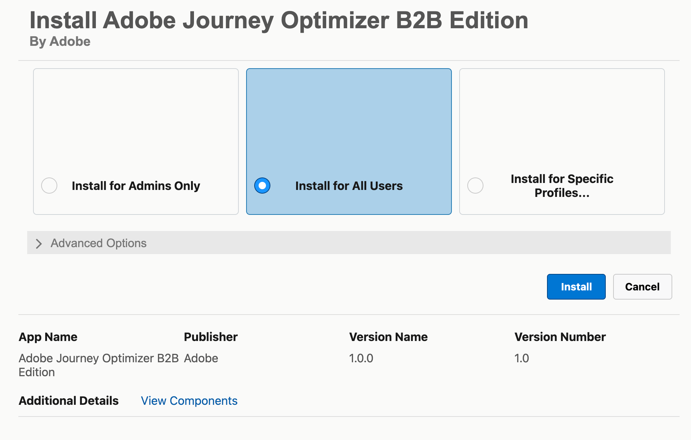
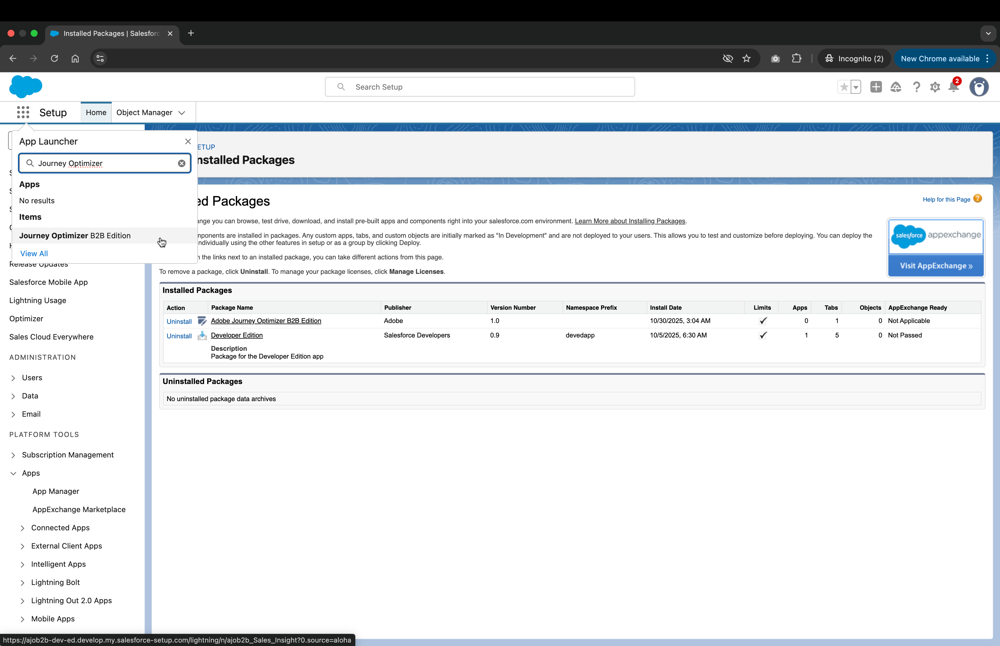
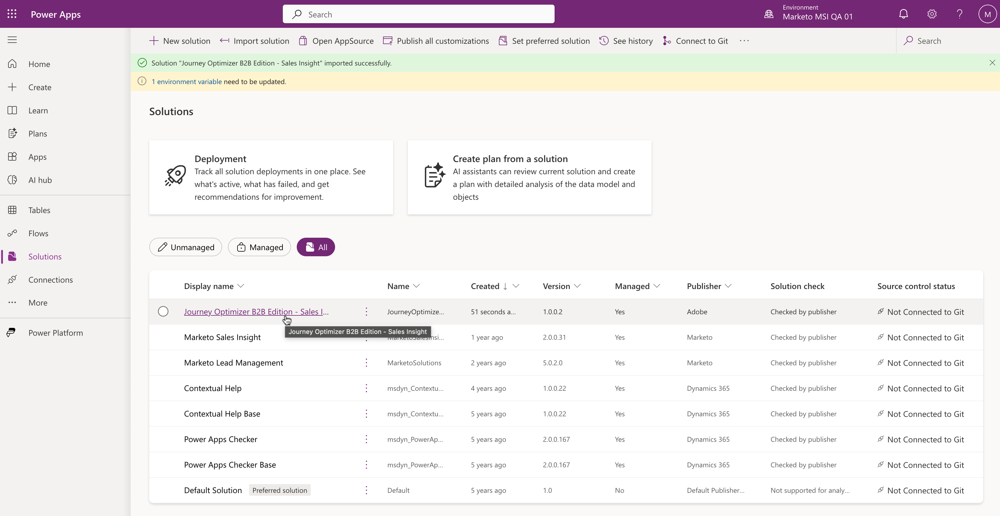

# CRM 内インサイト

[!DNL In-CRM Insights]は、SalesforceとMicrosoft Dynamics 365に統合されたweb ベースのアプリケーションで、CRM内で[!DNL Journey Optimizer B2B Edition]個の購買グループに直接アクセスできます。 営業データソースをつなぎ合わせることで、エンゲージメントを高め、売上を伸ばす機会を容易に特定することができます。

## インストール

インストールプロセスには次のものが含まれます。

* ユーザー権限とグループの設定
* ソフトウェアパッケージのインストール
* CRMからログインする

### 権限の設定

ソフトウェアをインストールするユーザーには、Salesforce パッケージをインストールするための権限が必要です。

アプリケーションにアクセスするには、ユーザーが&#x200B;**Sales Insights:View Sales Insights**&#x200B;権限を持つ役割のメンバーシップを持っている必要があります。

ユーザーを[!DNL In-CRM Insights]のみに制限する場合：

1. [&#x200B; カスタム役割](https://experienceleague.adobe.com/ja/docs/journey-optimizer-b2b/user/accounts/buying-groups/default-custom-roles#create-a-custom-role)を作成し、**セールスインサイト：セールスインサイトの表示**&#x200B;権限を割り当てます。
1. 新しい[&#x200B; ユーザーグループ &#x200B;](https://experienceleague.adobe.com/ja/docs/journey-optimizer-b2b/user/admin/user-management#create-user-group)を作成します。
1. グループにExperience Platform製品プロファイルを追加します。

### パッケージのインストール

In-CRM Insights パッケージをインストールするには、SalesforceまたはMicrosoft Dynamicsの手順に従います。

#### Salesforce

1. [In-CRM Insights インストーラーパッケージ &#x200B;](https://experience.adobe.com/solutions/OneAdobe-sales-workflow-optimizer-sales-insight-ui/install/sales-insight?crm=salesforce)をダウンロードします。
1. ログイン後、パッケージのインストールページにリダイレクトされます。
1. 「**[!UICONTROL すべてのユーザーにインストール]**」オプションを選択し、**[!UICONTROL インストール]**&#x200B;をクリックします。

   {width=500}

1. ダイアログでサードパーティのアクセスを承認し、**[!UICONTROL 続行]**&#x200B;をクリックします。
1. インストールが完了したら、**[!UICONTROL 完了]**&#x200B;をクリックします。

   **インストール済みパッケージ** ページに表示され、**Journey Optimizer B2B edition**&#x200B;がアプリランチャーに表示されるようになりました。

   {width=800 zoomable="yes"}

#### MS Dynamics

1. [In-CRM Insights インストーラーパッケージ &#x200B;](https://experience.adobe.com/solutions/OneAdobe-sales-workflow-optimizer-sales-insight-ui/install/sales-insight?crm=dynamics)をダウンロードします。
1. [Power Apps ポータル &#x200B;](https://make.powerapps.com/){target=_blank}に移動します。
1. ログイン後、パッケージの環境を選択し、左側のメニューから&#x200B;**[!UICONTROL Solutions]**&#x200B;に移動します。
1. 「**[!UICONTROL ソリューションの読み込み]**」をクリックします。
1. インストーラーパッケージを参照してアップロードし、**[!UICONTROL 次へ]**&#x200B;をクリックします。
1. パッケージの詳細を確認し、**[!UICONTROL 次へ]**&#x200B;をクリックします。
1. _環境変数_&#x200B;で、値が`prod`に設定されていることを確認し（値を変更しないでください）、**[!UICONTROL 読み込み]**&#x200B;をクリックします。
1. インストールが完了すると、左側のナビゲーションバーに&#x200B;**[!UICONTROL Journey Optimizer B2B edition]** > **[!UICONTROL 購買グループ]**&#x200B;が表示されます。

   Microsoft Dynamicsで{width=800 zoomable="yes"}

## 購買グループの表示

画面の指示に従って、Adobe アカウントにログインします。 購買グループが読み込まれ、表示できます。

購買グループを選択した後、[&#x200B; グループの詳細](https://experienceleague.adobe.com/ja/docs/journey-optimizer-b2b/user/accounts/sales-experience/buying-group-details#)を参照できます。 これは、Journey Optimizer B2B editionに表示されるデータとインサイトと同じですが、データは[!DNL In-CRM Insights]を通じて読み取り専用です。
