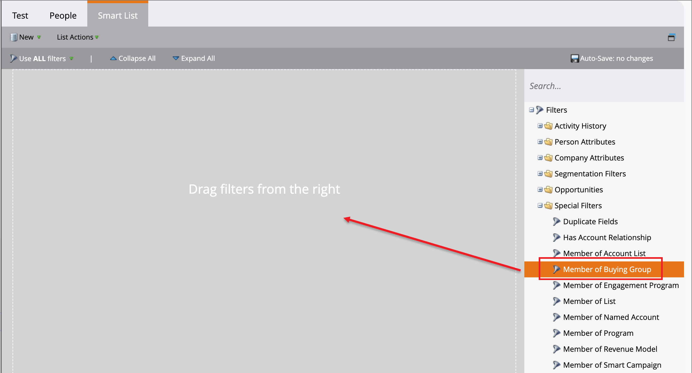
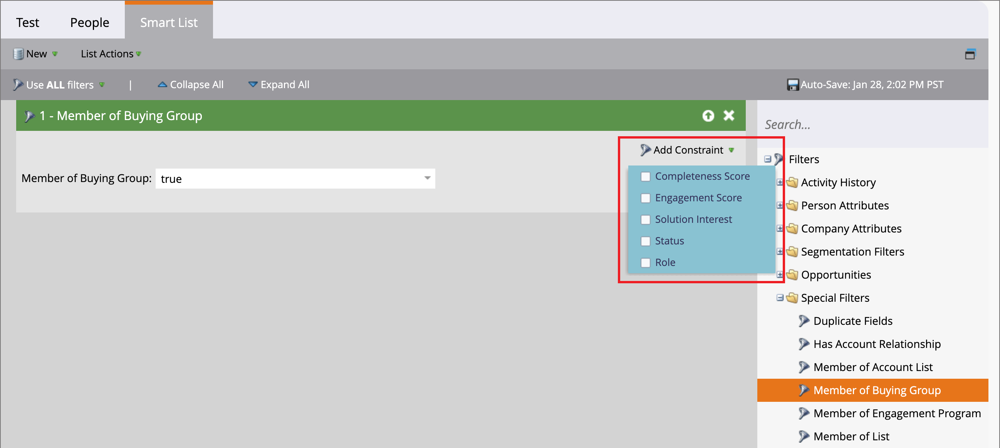
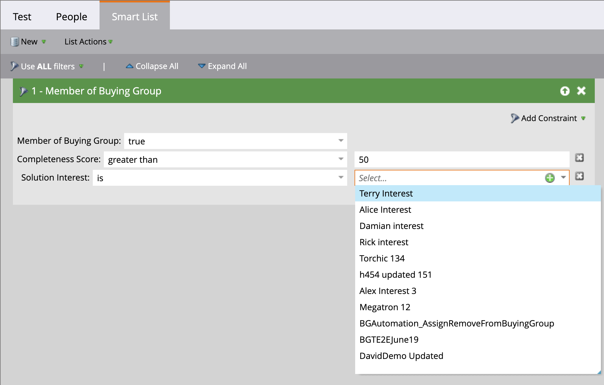
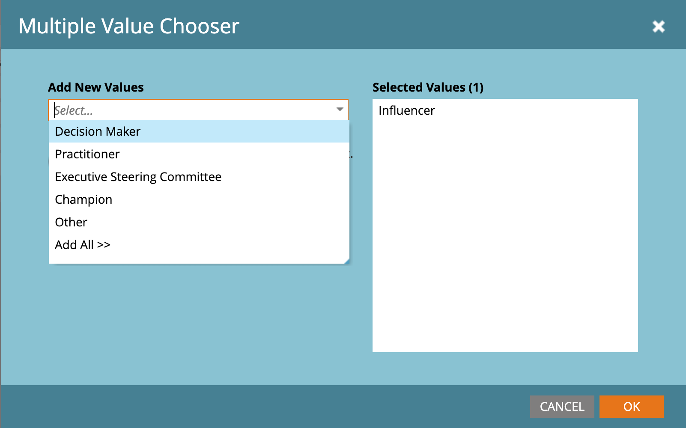

# Marketo Engage の購買グループフィルター

>[!IMPORTANT]
>
>**機能の非推奨化**  
>
>Journey Optimizer B2B Editionでは、購買グループフィルターは、接続されたMarketo Engage インスタンスで使用できなくなりました。  
>
>別の方法として、ソリューションの関心ごとに静的リストを作成し、ジャーニーノードから[Marketo リストに追加&#x200B;_アクション_&#x200B;を使用できます](../journeys/action-nodes.md#marketo-engage-actions)。 このアクションは、購買グループのメンバーを、接続されたMarketo Engage インスタンスの特定の静的リストに追加します。 次に、ソリューションの関心に焦点を当てた静的リストをスマートリストフィルターに使用します。

マーケターは、Journey Optimizer B2B Editionの購買グループに属する人を対象に、Marketo Engageで施策を抑制することができます。 また、購買グループに関連するリードに関する情報を利用して、Marketo Engageのリードスコアリングワークフローに情報を提供することもできます。 例：

* 「このリードは購買グループの一部ですか？」
* 購買グループは完成し、エンゲージしていますか？

これらの条件がtrueの場合は、リードのスコアを上げることができます。 そうでない場合は、マーケティングクオリファイドリード（MQL）としてマークしないこともできます。

Journey Optimizer B2B Editionに接続されているMarketo Engage インスタンスでは、スマートリストの&#x200B;_[!UICONTROL 購買グループのメンバー]_ フィルターを使用して、キャンペーン戦略に従ってこれらのリードを識別できます。

1. Marketo Engage[&#128279;](https://experienceleague.adobe.com/ja/docs/marketo/using/product-docs/core-marketo-concepts/smart-lists-and-static-lists/creating-a-smart-list/create-a-smart-list){target="_blank"}でスマートリストを作成した後、「**[!UICONTROL スマートリスト]**」タブを選択してフィルターエディターを開きます。

1. 右側のフィルターリストで、リストを下にスクロールし、**[!UICONTROL 特殊フィルター]** フォルダーを展開します。

1. 購買グループの&#x200B;**[!UICONTROL メンバー]** フィルターをクリックし、フィルター定義領域にドラッグします。

   {width="700" zoomable="yes"}

1. 購買グループの&#x200B;_[!UICONTROL メンバー]_ オプションを&#x200B;**[!UICONTROL true]**&#x200B;または&#x200B;**[!UICONTROL false]**&#x200B;に設定します。

   この制約は、定義に必要です。

1. （オプション）スマートリストのリードの識別方法に応じて、購買グループに関連するその他の制約をフィルターに追加します。

   * フィルターカードの右上にある「**[!UICONTROL 制約を追加]**」をクリックします。

     {width="700" zoomable="yes"}

   * 追加する制約（_完全性スコア_&#x200B;または&#x200B;_ソリューションの関心_&#x200B;など）を選択します。

   * 一致に使用する評価を設定します。

     スコアには、完全一致、または入力した数値の上または下の範囲を使用できます。

     購買グループから削除されたメンバーを除外するには、_[!UICONTROL 削除済み]_&#x200B;制約を`false`に設定します。 また、この制約を`true`に設定することで、削除されたメンバーをスマートリストに明示的に含めることができます。

     Journey Optimizer B2B Editionで定義されたソリューションの関心など、個別の項目の場合は、リストに1つ以上の項目を選択できます。

     {width="600" zoomable="yes"}

     最初のものを選択し、もう一度セレクターをクリックして、_[!UICONTROL 複数値選択]_ ダイアログを開きます。

     {width="500" zoomable="yes"}

     残りの項目のいずれかを右に移動し、制約に使用する項目のリストがある場合は、**[!UICONTROL OK]**&#x200B;をクリックします。

   * これらのアクションを繰り返して、必要な数の制約を追加します。

   {width="600" zoomable="yes"}
