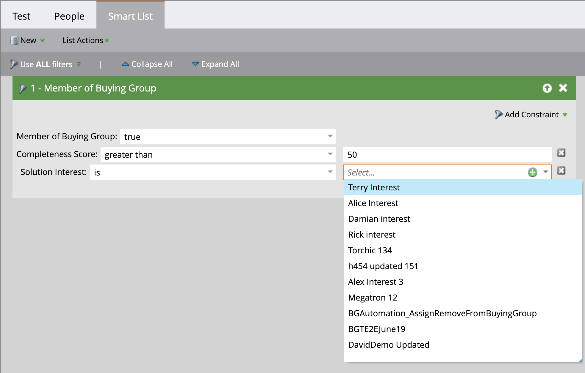

# Market Engage の購買グループフィルター

マーケターの場合、Journey Optimizer B2B editionの購買グループに属するユーザーのMarketo Engageのキャンペーンを抑制することができます。 また、購買グループに関連付けられた引合に関する情報を使用して、Marketo Engageの引合スコアリング・ワークフローに通知することもできます。 例：

* これは購買グループのリード部分ですか？
* 購買グループは完了し、関与していますか？

これらの条件が当てはまる場合は、より高いスコアのリードを選択することができます。 そうでない場合は、マーケティング認定リード（MQL）としてマークしないことを選択できます。

Journey Optimizer B2B editionに接続されたMarketo Engageインスタンスでは、スマートリストで _[!UICONTROL 購入グループのメンバー]_ フィルターを使用し、キャンペーン戦略に従ってこれらのリードを特定することができます。

1. [Marketo Engageでスマート・リストを作成 ](https://experienceleague.adobe.com/en/docs/marketo/using/product-docs/core-marketo-concepts/smart-lists-and-static-lists/creating-a-smart-list/create-a-smart-list){target="_blank"} した後、「**[!UICONTROL スマート・リスト]**」タブを選択してフィルタ・エディタを開きます。

1. 右側のフィルターリストで、リストを下にスクロールして「**[!UICONTROL 特殊フィルター]**」フォルダーを展開します。

1. **[!UICONTROL 購入グループのメンバー]** フィルターをクリックして、フィルター定義領域にドラッグします。

   {width="700" zoomable="yes"}

1. _[!UICONTROL 購入グループのメンバー]_ オプションを **[!UICONTROL true]** または **[!UICONTROL false]** に設定します。

   この制約は定義に必須です。

1. （任意）スマートリストのリードを識別する方法に従って、その他の購入グループ関連の制約をフィルターに追加します。

   * フィルターカードの右上にある **[!UICONTROL 制約を追加]** をクリックします。

     {width="700" zoomable="yes"}

   * _完全性スコア_ または _ソリューションの関心_ など、追加する制約を選択します。

   * 一致に使用する評価を設定します。 スコアには、完全一致または入力した数値の上または下の範囲を使用できます。

     Journey Optimizer B2B editionで定義されたソリューションの関心など、個別の項目の場合は、リストに 1 つ以上の項目を選択できます。

     {width="600" zoomable="yes"}

     最初のセレクターを選択し、もう一度セレクターをクリックすると、_[!UICONTROL 複数値選択]_ ダイアログが開きます。

     {width="500" zoomable="yes"}

     拘束に使用する項目のリストが表示されたら、残りの項目のいずれかを右に移動して [**[!UICONTROL OK]**] をクリックします。

   * これらの操作を繰り返して、必要な数の拘束を追加します。

   {width="600" zoomable="yes"}
