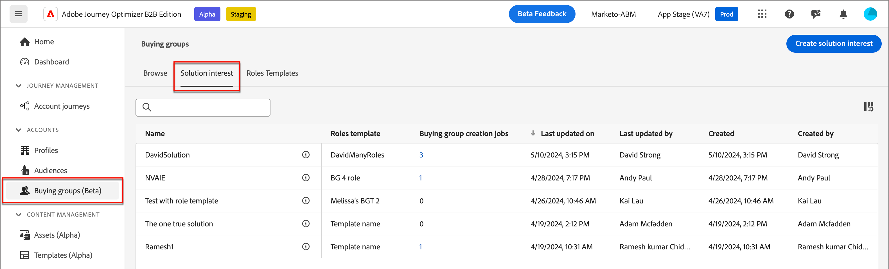
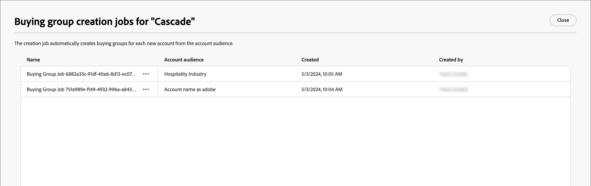
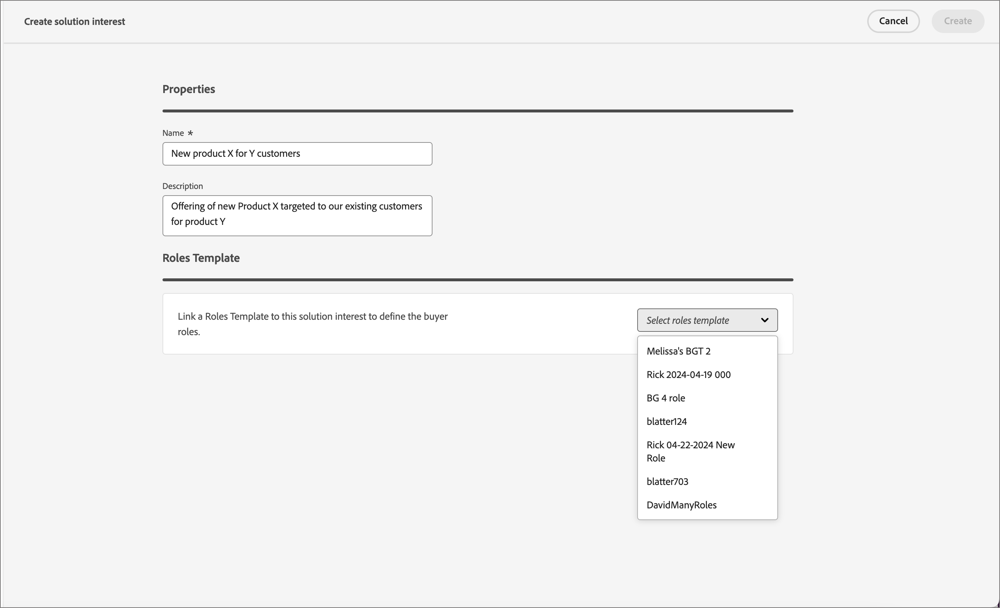

# ソリューションに対する関心

購買グループを作成する前に、何を販売し、誰をターゲットにするかを把握する必要があります。 マーケティング戦略とセールス戦略を連携し、購買グループにソリューションの関心を高める必要があります。

{width="30"} [概要ビデオを視聴](#overview-video)

## ソリューションの関心へのアクセスと参照

1. 左側のナビゲーションで、**[!UICONTROL 購買グループ]**&#x200B;をクリックします。

1. _[!UICONTROL 購買グループ]_ ページで、「**[!UICONTROL ソリューションへの関心]**」タブを選択します。

   このタブには、既存のすべてのソリューションの関心のインベントリ リストが表示されます。 次の情報が列形式で表示されます。_[!UICONTROL 名前]_、_[!UICONTROL 役割テンプレート]_、_[!UICONTROL 購買グループ作成ジョブ]_、_[!UICONTROL 購買グループの更新]_、_[!UICONTROL 作成日]_、_[!UICONTROL 作成者]_、_[!UICONTROL 最終更新]_、最終更新者&#x200B;_[!UICONTROL 、]_、

   リストは、デフォルトで&#x200B;_[!UICONTROL Last update]_&#x200B;列で並べ替えられます。 ヘッダーの列タイトルをクリックして、降順と昇順を切り替えます。

   リストの上部にある&#x200B;_検索_&#x200B;ツールにテキストを入力して、表示されるリストを名前でフィルタリングします。

   {width="700" zoomable="yes"}

## 購買グループのジョブの表示と削除

_[!UICONTROL ソリューションの関心]_ タブの&#x200B;**[!UICONTROL 購入グループ作成ジョブ]**&#x200B;列には、各ソリューションの関心に対して作成されたジョブの数が表示されます。 番号をクリックして、ソリューションの関心に対して作成されたジョブのリストを表示するダイアログを開きます。

{width="700" zoomable="yes"}

省略記号（。..）をクリックして、購買グループのジョブを削除できます ジョブ名の横にある&#x200B;**[!UICONTROL 削除]**&#x200B;を選択します。

## ソリューションへの関心の向上

ソリューションの関心を作成する前に、ターゲットにする役割を定義するライブ（公開）役割テンプレートが必要です。 役割テンプレートの作成と役割テンプレートの公開について詳しくは、[購買グループの役割テンプレート &#x200B;](./buying-groups-role-templates.md)を参照してください。

1. 「_[!UICONTROL ソリューションの関心]_」タブで、右上の「**[!UICONTROL ソリューションの関心を作成]**」をクリックします。

1. 一意の&#x200B;**[!UICONTROL 名前]** （必須）と&#x200B;**[!UICONTROL 説明]** （オプション）を入力します。

1. **[!UICONTROL 役割テンプレート]**&#x200B;を選択します（必須）。

   「**[!UICONTROL 役割テンプレートを選択]**」をクリックし、ダイアログのリストからライブ役割テンプレートを選択します。 1つのソリューションの関心に関連付けることができるライブ役割テンプレートは1つだけです。 「**[!UICONTROL 保存]**」をクリックして、選択した役割テンプレートが表示されている&#x200B;_[!UICONTROL ソリューションの関心を作成]_ ページに戻ります。

   {width="700" zoomable="yes"}

1. 購買グループステージの進行を使用するには、**[!UICONTROL 購買グループステージモデル]**&#x200B;を選択します（オプション）。

   アカウントの進行を追跡するための購買グループのステージの使用について詳しくは、[購買グループのステージ &#x200B;](./buying-group-stages.md)を参照してください。

1. **[!UICONTROL 既存の購買グループを更新]**&#x200B;設定を有効にします（オプション）。

   このオプションを有効にすると、ソリューションの関心と組み合わされたすべての既存の購買グループが、日次の同期サイクルを通じて更新されます。

1. 右上隅にある「**[!UICONTROL 作成]**」をクリックします。

   新しいソリューションの関心は、_[!UICONTROL ソリューションの関心]_ リストに表示されます。

## ソリューションへの関心の編集

ソリューションの関心に応じて、いつでも名前と説明を変更できます。 ソリューションの関心と役割テンプレートのペアリングに基づく購買グループの依存関係により、役割テンプレートを変更できません。 この場合、別の役割テンプレートを使用して、新しいソリューションの関心を作成する必要があります。

1. 「_[!UICONTROL ソリューションの関心]_」タブで、次のいずれかの方法を使用して、編集するソリューションの関心のプロパティを開きます。

   * ソリューションの関心の名前をクリックします。
   * 省略記号（**...**）をクリックします その横にある「**[!UICONTROL 編集]**」を選択します。

   {width="500" zoomable="no"}

1. 必要に応じて、ソリューションの興味関心の設定を更新します。

   * **[!UICONTROL 名前]**&#x200B;と&#x200B;**[!UICONTROL 説明]**&#x200B;を更新します。

   * 購買グループステージの進行を追跡するために使用される&#x200B;**[!UICONTROL 購買グループステージモデル]**&#x200B;を選択します。

     購買グループのステージを使用して、セールスに対するジャーニーの進行を追跡する方法について詳しくは、[購買グループのステージ &#x200B;](./buying-group-stages.md)を参照してください。

   * **[!UICONTROL 既存の購買グループの更新]**&#x200B;設定を変更します。

     このオプションを有効にすると、ソリューションの関心と組み合わされたすべての既存の購買グループが、日次の同期サイクルを通じて更新されます。

1. 「**[!UICONTROL 保存]**」をクリックします。

## ソリューションの関心の削除

購買グループのジョブまたはアカウントジャーニーで現在使用されているソリューションの関心は削除できません。 また、削除されたソリューションの関心は取得できません。

1. 「_[!UICONTROL ソリューションへの関心]_」タブで、省略記号（**...**）をクリックします ソリューションの関心の横にある&#x200B;**[!UICONTROL 削除]**&#x200B;を選択します。

   このアクションを実行すると、確認ダイアログが開きます。

   ソリューションの関心が現在アカウントジャーニーまたは購買グループのジョブで使用されている場合、アクションは削除できないというアラートになります。 削除を中止する&#x200B;**[!UICONTROL OK]**&#x200B;をクリックします。

1. 「**[!UICONTROL 削除]**」をクリックして削除を確認するか、「_[!UICONTROL キャンセル]_」をクリックしてプロセスを中止できます。

## 概要動画

>[!VIDEO](https://video.tv.adobe.com/v/3450114/?captions=jpn&learn=on)
