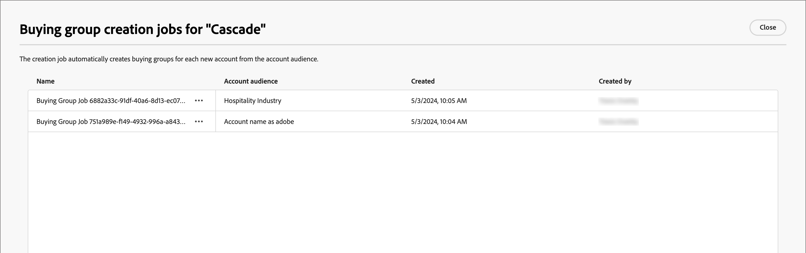

# ソリューションに対する関心

購買グループを作成する前に、自分が何を販売し、誰をターゲットにするかを把握しておく必要があります。 購入グループに対するソリューションの関心を高められるように、マーケティングとセールスの戦略を調整する必要があります。

{width="30"} [概要ビデオを視聴](#overview-video)

## ソリューションの関心へのアクセスと参照

1. 左側のナビゲーションで「**[!UICONTROL 購入グループ]**」をクリックします。

1. _[!UICONTROL 購入グループ]_ ページで、「**[!UICONTROL ソリューションの関心]**」タブを選択します。

   タブには、既存のソリューションに関心があるすべてのインベントリリストが表示されます。 _[!UICONTROL 名前]_、_[!UICONTROL 役割テンプレート]_、_[!UICONTROL 購入グループ作成ジョブ]_、_[!UICONTROL 購入グループの更新]_、_[!UICONTROL 作成日]_、_[!UICONTROL 作成者]_、_[!UICONTROL 最終更新]_、_[!UICONTROL 最終更新者]_ の情報が列形式で表示されます。

   このリストは、デフォルトで _[!UICONTROL 最終更新]_ 列で並べ替えられます。 ヘッダーの列タイトルをクリックして、降順と昇順の並べ替えを切り替えます。

   リストの上部にある _検索_ ツールにテキストを入力して、表示されるリストを名前でフィルタリングします。

   {width="700" zoomable="yes"}

## 購買グループ ジョブの表示と削除

_[!UICONTROL ソリューションの関心]_ タブの **[!UICONTROL 購入グループ作成ジョブ]** 列には、ソリューションの関心ごとに作成されたジョブの数が表示されます。 番号をクリックすると、ダイアログが開き、ソリューションの対象として作成されたジョブのリストが表示されます。

{width="700" zoomable="yes"}

購入グループジョブを削除するには、ジョブ名の横の省略記号（...）をクリックし、「**[!UICONTROL 削除]**」を選択します。

## ソリューションへの関心の作成

ソリューションの関心を作成する前に、ターゲットにする役割を定義するライブ（公開済み）の役割テンプレートが必要です。 役割テンプレートの作成と役割テンプレートの公開について詳しくは、[ グループ役割テンプレートの購入 ](./buying-groups-role-templates.md) を参照してください。

1. _[!UICONTROL ソリューションの関心]_ タブで、右上の **[!UICONTROL ソリューションの関心を作成]** をクリックします。

1. 一意の **[!UICONTROL 名前]** （必須）と **[!UICONTROL 説明]** （オプション）を入力します。

1. **[!UICONTROL 役割テンプレート]** を選択します（必須）。

   **[!UICONTROL ロールテンプレートを選択]** をクリックし、ダイアログのリストからライブロールテンプレートを選択します。 ソリューションの関心に関連付けることができるライブの役割テンプレートは 1 つだけです。 「**[!UICONTROL 保存]**」をクリックして _[!UICONTROL ソリューションの関心を作成]_ ページに戻ると、選択したロールテンプレートが表示されます。

   {width="700" zoomable="yes"}

1. **[!UICONTROL 購入グループステージモデル]** を選択して、購入グループステージの進行を使用します（オプション）。

   アカウントの進行状況を追跡するための購入グループステージの使用について詳しくは、[ 購入グループステージ ](./buying-group-stages.md) を参照してください。

1. 「**[!UICONTROL 既存の購買グループの更新]**」設定を有効にします（オプション）。

   このオプションを有効にすると、ソリューションの関心とペアになっているすべての既存の購入グループが、7 日間の同期サイクルを通じて更新されます。

1. 右上隅にある「**[!UICONTROL 作成]**」をクリックします。

   新しいソリューションの関心が _[!UICONTROL ソリューションの関心]_ リストに表示されます。

## ソリューションの関心の編集

ソリューションに関心がある場合は、いつでも名前と説明を変更できます。 ソリューションの興味と役割テンプレートの組み合わせに基づく購買グループの依存関係のため、役割テンプレートを変更できません。 この場合、別の役割テンプレートを使用して、新しいソリューションの関心を作成する必要があります。

1. _[!UICONTROL ソリューションの関心]_ タブから、次のいずれかの方法を使用して、編集するソリューションの関心のプロパティを開きます。

   * ソリューションの対象者名をクリックします。
   * その横にある省略記号（**...**）をクリックし、「**[!UICONTROL 編集]**」を選択します。

   {width="500" zoomable="no"}

1. ソリューションの関心事の設定に対して、必要な更新を行います。

   * **[!UICONTROL 名前]** と **[!UICONTROL 説明]** を更新します。

   * 購入グループステージの進行を追跡するために使用される **[!UICONTROL 購入グループステージモデル]** を選択します。

     購入グループステージを使用して販売に対するジャーニーの進行状況を追跡する方法について詳しくは、[ 購入グループステージ ](./buying-group-stages.md) を参照してください。

   * **[!UICONTROL 既存の購買グループの更新]** 設定を変更します。

     このオプションを有効にすると、ソリューションの関心とペアになっているすべての既存の購入グループが、7 日間の同期サイクルを通じて更新されます。

1. 「**[!UICONTROL 保存]**」をクリックします。

## ソリューションの関心の削除

購入グループジョブまたはアカウントジャーニーで現在使用中のソリューションの関心は、削除できません。 また、削除されたソリューションの関心は取得できません。

1. 「_[!UICONTROL ソリューションの関心]_」タブで、ソリューションの関心の横にある省略記号（**...**）をクリックし、「**[!UICONTROL 削除]**」を選択します。

   この操作を実行すると、確認ダイアログが開きます。

   ソリューションの関心が現在、アカウントジャーニーまたは購入グループジョブで使用されている場合、そのアクションは、削除できないことを示すアラートを生成します。 「**[!UICONTROL OK]**」をクリックすると、削除が中止されます。

1. 「**[!UICONTROL 削除]**」をクリックして削除を確定するか、「_[!UICONTROL キャンセル]_」をクリックしてプロセスを中止します。

## 概要ビデオ

>[!VIDEO](https://video.tv.adobe.com/v/3433080/?learn=on)
