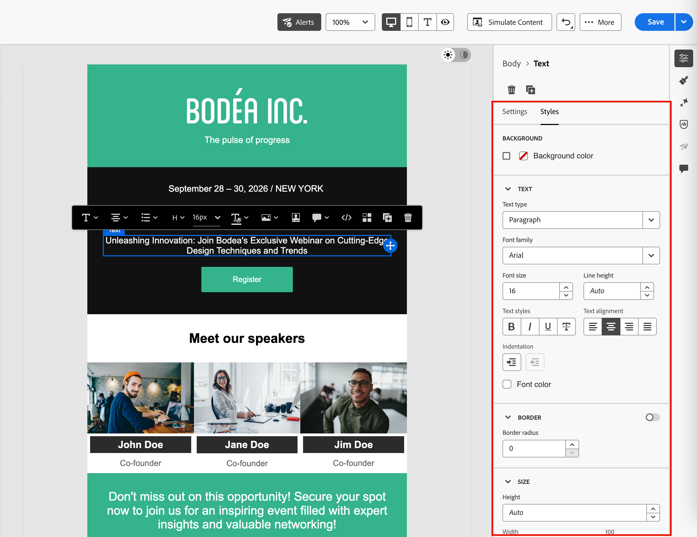
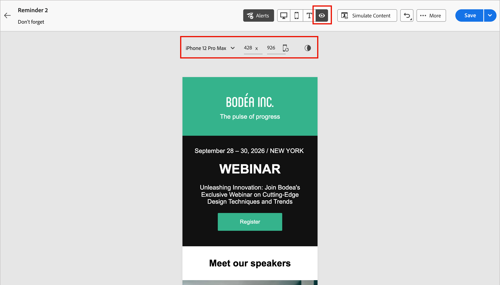

# アクセシブルなコンテンツのデザイン {#accessible-content}

[欧州アクセシビリティ法](https://eur-lex.europa.eu/legal-content/EN/TXT/?uri=CELEX%3A32019L0882){target="_blank"}は、加盟国間で異なる国のルールによって生じる障壁を排除することで、アクセス可能な製品およびサービスの内部市場を強化することを目的とした指令です。

この規制では、メール、ニュースレター、PDF、ダウンロード可能なコンテンツを含むすべてのデジタル通信にアクセス可能である必要があると規定されています。 したがって、受信者向けのコンテンツを作成する際は、アクセス可能なフォントや読み取り可能な形式の使用、画像用の代替テキストの提供など、特定のガイドラインに従う必要があります。

[!DNL Journey Optimizer B2B Edition] デザインツールを使用すると、マーケターは&#x200B;**_メール_**&#x200B;と&#x200B;**_ランディングページ_**&#x200B;の両方のコンテンツを作成できます。 これらのツールを使用して、Web コンテンツアクセシビリティガイドライン（WCAG） 2.1 レベル AAに基づいて、この指示に準拠します。

次の節では、[!DNL Journey Optimizer B2B Edition]でアクセス可能なコンテンツを設計するためのベストプラクティスの概要を説明します。 この情報は、すべての受信者がアクセスできるコンテンツを設計することに重点を置いています。これにより、障害のあるユーザーがメールメッセージやランディングページを読み、理解し、操作できるようになります。
 
## テキストの読みやすさの確保 {#text-readability}

**[!UICONTROL テキスト]** コンポーネントの「**[!UICONTROL スタイル]**」タブを活用して、適切なカラーコントラストやシンプルなフォントを使用するなど、テキストが読みやすいようにします。 テキストコンポーネントのスタイル設定について詳しくは、[_コンテンツコンポーネント_](content-components.md#text)&#x200B;を参照してください

フォント、サイズ、およびカラーオプションを表示する{width="700" zoomable="yes"}

フォントとテキストについては、次のガイドラインに従います。

### フォント選択

* Arial、Verdana、Tahoma、Helvetica、Open Sansなどのサンセリフフォントを使用します。
* 本文コンテンツには、セリフ体、筆記体、装飾体のフォントを回避します。
* 一貫性とフォールバックのために、限定的なフォントセットに固定します（例：`font-family: Arial, Helvetica, sans-serif;`）。

### フォントサイズ

* 本文のフォントサイズは 16 px 以上を確保します。
* 見出しに適切な階層を使用します。

### カラーコントラスト

* テキストと背景の間のコントラスト比を 4.5:1 以上に維持します。
* 大きなテキスト（24 px 以上または太字 18 px）の場合は、3:1 以上のコントラストを確保します。
* 白い背景では、ライトグレーまたはパステルのテキストは回避します。
* 意味を伝えるのに色だけに依存するのではなく、下線やアイコンなどを使用します。

### テキストアクセシビリティ

* 画像内のテキストは回避します。
* 本文では大文字を使用しないでください。
* レイアウトを崩すことなく、テキストを最大200%まで拡大できることを確認します。

## 視覚的なアクセシビリティの確保 {#visual-accessibility}

コンテンツに視覚的にアクセスできるようにするには、次のベストプラクティスに従ってください。

* 重要な情報に対しては色のみのインジケーターの使用は回避します。
* テキストラベルまたはアイコンを使用して、明確さを確保します。
* ボタンが大きく、適切な間隔が空いていることを確保して、モバイルおよびレスポンシブレイアウト向けにデザインを最適化します。
* デバイスや画面サイズをまたいで定期的にテストすることで、アクセシビリティを維持します。

[!DNL Journey Optimizer B2B Edition]では、ビジュアルデザインスペース **[!UICONTROL スタイル]** ペインのスタイルパラメーターと属性を使用して、コンテンツ内の様々な要素のサイズと間隔をさらに調整できます。

例えば、背景を更新したり、余白、パディング、整列を変更して、コンテンツの視覚的なアクセシビリティを向上させることができます。

{width="700" zoomable="yes"}

[!DNL Journey Optimizer B2B Edition]のビジュアルデザインツールを使用すると、様々なデバイスと画面サイズに合わせてデザインをプレビューし、最適化できます。 いつでも、**[!UICONTROL ライブビューに切り替える]**&#x200B;して、様々なデバイスサイズでコンテンツがどのようにレンダリングされるかを確認できます。

デスクトップ、タブレット、モバイルのプレビューオプションを表示する{width="700" zoomable="yes"}

>[!CAUTION]
>
>ライブビューは、様々なデバイスサイズをまたいでレンダリングがどのように表示される可能性があるかを比較するのにデザインされた汎用プレビューです。 最終的なレンダリングは、受信者のメールクライアントまたはweb ブラウザーによって異なる場合があります。

## 画像用の代替テキストの使用 {#alt-text}

**[!UICONTROL 画像]**&#x200B;コンポーネントを使用して、画像用の代替テキストを指定します。 画像コンポーネント設定について詳しくは、[_コンテンツコンポーネント_](content-components.md#image)&#x200B;を参照してください

{width="700" zoomable="yes"}

デジタル製品の効果的な代替テキストを作成するには、次のガイドラインに従います。

* 画像の目的を簡潔に文脈に沿って説明します。
* 「画像の画像」などの冗長なフレーズは避けます。 装飾的な画像には空のalt テキストを使用します。
* 意味のあるアイコンには分かりやすいラベルを付け、複雑な画像には簡潔な代替テキストと、別の場所でより長い説明を使用します。

## 読み取り可能な形式の使用 {#readable-format}

ビジュアルデザイン分野では、関連する[構造](structure-components.md)と[ コンテンツ ](content-components.md) コンポーネントを使用して、すべての人がアクセスできる明確かつ論理的で簡潔な方法でコンテンツを整理します。 構造的継承のベストプラクティスを使用して、**[!UICONTROL スタイル]** ペインでオプションを設定します。

{width="700" zoomable="yes"}

* 適切な見出し、段落、リスト、テーブルを含む、構造化されたセマンティック HTML を使用します。
* コンテンツが左から右、上から下の論理的なフローに従っていることを確認します。
* 明確で簡潔な言語を使用します。
* PDF とインフォグラフィックには代替形式を用意します。
* テキストのサイズ変更とリフローを許可し、すべての形式で適切なカラーコントラストを使用してタイポグラフィを読み取れるようにします。

## コンテンツの読みやすさの確保 {#readability}

読み取り可能にするには、明確で、適切に構造化され、視覚、認知、読み取りに困難がある人物や支援テクノロジーを使用している人物を含む全員が使用できるコンテンツにする必要があります。 アクセス可能なコンテンツを作成する際に考慮すべき点を以下に示します。

* 文章は20語以内に収めましょう。
* 直接的で要点を押さえたコピーを編集します。
* 能動態を使用して、文の構造をよりシンプルに保持します。
* 一部の人が理解していないようなスラングや専門用語、地域用語は避けましょう。

コンテンツの読みやすさを評価するには、Microsoft Wordで人気の[ フレッシュ読みやすさテスト ](https://support.microsoft.com/ja-jp/office/get-your-document-s-readability-and-level-statistics-85b4969e-e80a-4777-8dd3-f7fc3c8b3fd2){target="_blank"}を使用します。 コンテンツの読みやすさを0～100のスケールで計算します。

## コンテンツのテスト {#test}

コンテンツのアクセシビリティを検証するには、[!DNL Journey Optimizer B2B Edition]が提供するテスト機能を使用できます。 これらは、コンテンツが完全にアクセス可能かどうかを確認するのに特別に設計されたものではありませんが、第 1 レベルの検証を提供できます。

* テストプロファイルを使用してコンテンツをプレビューします。

* Litmusを活用した[ メールのレンダリング ](email-test-rendering.md) オプションを使用して、主要な電子メールクライアント（Apple Mail、Gmail、Outlook）でデザインをシミュレートし、テキスト、色、画像がコンテンツにアクセス可能かどうかを確認します。

* 実際のオーディエンスに送信する前に、コンテンツのレンダリングをテストする本配信前確認を送信します。

{width="800" zoomable="yes"}

より一貫性のある方法でコンテンツに確実にアクセスできるかどうかを確認するには、次のような外部ツールを使用します。

* コントラストとコンプライアンスを評価する [WebAim コントラストチェッカー](https://webaim.org/resources/contrastchecker/){target="_blank"}および [WAVE web アクセシビリティ評価ツール](https://wave.webaim.org/){target="_blank"}。

* 視覚障害のあるユーザーの視点からメールを体験するスクリーンリーダー（例：[NVDA](https://www.nvaccess.org/download/){target="_blank"}、iPhone の [VoiceOver](https://support.apple.com/ja-jp/guide/iphone/iph3e2e415f/ios){target="_blank"}）などの支援テクノロジー。

## ダークモードの使用 {#dark-mode}

ダークモードは、光に敏感なユーザーや視覚障害のあるユーザーの視覚的なアクセシビリティを強化し、視聴エクスペリエンスを向上させます。

{width="700" zoomable="yes"}

ダークモードのデザインでは、透明なPNG画像またはSVG画像を使用し、適切なメタタグとCSSを設定します。 ダークモードがサポートされていない場合は、アクセスできるフォールバックスタイル設定を指定します。 最後に、すべてのコンテンツとUI要素を明るいモードと暗いモードの両方でテストします。

電子メールデザイン領域で&#x200B;_ダークモード_&#x200B;を使用する方法について詳しくは、[_電子メールコンテンツのダークモード_](./email-dark-mode.md)&#x200B;を参照してください。

## アクセシビリティに対する特定の属性の使用 {#attributes}

HTMLの属性は、支援テクノロジーがコンテンツの構造、言語、関係性を解釈するのに役立ちます。 次の節では、言語とテキストの方向、レイアウトとデータに使用する表、およびスクリーンリーダーがユーザーに通知するリンクテキストについて説明します。

### 言語属性 {#language}

デザインを作成する際は、コンテンツ本体に `lang`（言語）属性と `dir`（テキスト方向）属性を含めます。 これらの属性は、スクリーンリーダーなどの支援テクノロジーで、コンテンツを適切に解釈および表示するのに役立ちます。

* `lang` 属性は、支援テクノロジーに対するメールの言語を示し、単語が正しく発音されるようにします。

  +++例

  英語の例：

  ```
  <body lang="en">
  ```

  フランス語の例：

  ```
  <body lang="fr">
  ```

  +++

* `dir` 属性は、テキストの方向を指定します。 英語やフランス語を含むほとんどの言語は左から右（ltr）に読みますが、アラビア語やヘブライ語などの言語は右から左（rtl）に読みます。

  +++例

  英語の例（左から右）：

  ```html
  <body lang="en" dir="ltr">
  ```

  アラビア語の例（右から左）：

  ```html
  <body lang="ar" dir="rtl">
  ```

  +++

スクリーンリーダーは、正しい発音ルールを適用するために`lang`属性に依存しています。 テキストの方向により、左から右、または右から左の言語に対して、コンテンツが自然に流れるようになります。 これらの属性がないと、ユーザーは読み取り順序に混乱したり、発音が間違ったりする場合があります。 その結果、メール本文は常に適切な `lang` 属性と `dir` 属性で囲むようにします。

>[!TIP]
>
>メールに複数の言語が含まれている場合は、各部分が正しく読まれるように、特定のセクション（`<table>` ブロックや`<td>` ブロックなど）に適切な言語属性を割り当てます。

### テーブル {#tables}

HTML コンテンツでは、多くの場合、レイアウトにテーブルが使用されます。 デフォルトでは、スクリーンリーダーはすべての `<table>` をデータテーブルとして処理し、行、列、構造を読み上げます。 この構造は、表が書式設定にのみ使用される場合に混乱することがあります。

レイアウトテーブルに `role="presentation"`（または `role="none"`）を追加して、支援テクノロジーが構造をスキップし、実際のコンテンツにのみ焦点を当てられるようにします。

+++例 - レイアウトテーブル（`role="presentation"` を使用する場合）

```html
<table role="presentation" border="0" cellpadding="0" cellspacing="0" width="100%"> 
  <tr> 
    <td align="center"> 
      <h1>Hello World</h1> 
      <p>Welcome to this newsletter</p> 
    </td> 
  </tr> 
</table>
```

スクリーンリーダーは次のように読みます。
「こんにちは世界。 ニュースレターへようこそ。」 *（行、列、テーブルに関する読み上げはされません）*

+++

+++例 - データテーブル（`role="presentation"` を使用しない場合）

```html
<table border="1" cellpadding="5" cellspacing="0"> 
  <tr> 
    <th scope="col">Name</th> 
    <th scope="col">Score</th> 
  </tr> 
  <tr> 
    <td>Alice</td> 
    <td>95</td> 
  </tr> 
  <tr> 
    <td>Bob</td> 
    <td>88</td> 
  </tr> 
</table> 
```

スクリーンリーダーは次のように読みます。
「2列と3行のテーブル。」

「名前、Alice。 スコア、95。」

「名前、Bob。 スコア、88。」

+++

>[!TIP]
>
>`role="presentation"` は、レイアウトテーブルにのみ使用します。 データテーブルの場合、スクリーンリーダーがヘッダーと関係を正しく読み上げることができるように、セマンティック `<table>` 構造を保持します。

### リンクとボタンのテキスト {#links}

スクリーンリーダーは、リンクのテキストを使用してリンクを読み上げます。 リンクにラベルが&#x200B;_ここをクリック_&#x200B;または&#x200B;_詳細を読む_&#x200B;の場合、支援テクノロジーのユーザーはリンク先を知りません。 アクセシビリティを確保するには、ターゲットやアクションを明確に示す説明テキストが必要です。

デザインツールを使用して、コンテンツにリンクを追加し、ラベルを編集して、識別しやすく（表示しやすく）、説明的に（目的を明確に）表示します。 _ここ_&#x200B;や&#x200B;_詳細_&#x200B;などの曖昧なラベルは使用しないでください。

{width="700" zoomable="yes"}

+++例 - 良いリンク（説明的）： 

```
<p>Learn more in the  
<a href="https://adobe.com/release-notes">August release notes</a>. 
</p>
```

スクリーンリーダーは次のように読みます。
「リンク、8月のリリースノート」

+++

+++例 - 悪いリンク（説明的ではない）

```
<p>Learn more about our new features.  
  <a href="https://adobe.com/release-notes">Click here</a>. 
</p>
```

スクリーンリーダーは次のように読みます。
「リンク、ここをクリック」 *（読み取り順序からコンテキストが提供されない）*

+++

## キーボードナビゲーションとフォーカスサポートの提供 {#keyboard}

ランディングページでは、キーボードナビゲーションとフォーカスサポートを提供することで、マウスを使用できないユーザーがコンテンツにアクセスして操作できるようにします。 また、すべてのユーザーに明確で一貫性のある情報移動方法を提供することで、全体的なユーザビリティも向上します。

* キーボード操作とフォーカス
   * すべてのインタラクティブ要素（ボタン、チェックボックス、リンクなど）に`tabindex="0"`が含まれていることを確認し、これらの要素が自然なタブの順序に含まれます。
   * タブキーと矢印キー（↑ ↓ ← →）を使用してナビゲーションを許可します。これにより、フォーカスされた要素が明確にハイライトされます。
* カスタムフォーカススタイル
   * 実用的な要素にフォーカスさせるには、明確で識別可能なスタイルを適用します。
     +++例（CSS）

     ```
     [tabindex="0"] : focus { 
     outline: 2px solid #00AEEF;  /* Cyan border */ 
     background-color: #20CEFF;   /* Optional background */ 
     }
     ```

     +++

   * 以下のようなフォーカスインジケーターがWCAG 2.2のフォーカスアピアランス基準を満たしていることを確認します。
      * 最小領域：2 CSS ピクセルの太さのアウトライン。
      * コントラスト比：コントラスト比：フォーカス状態と非フォーカス状態の 3:1 以上。

* キーボードアクティブ化サポート
   * チェックボックスとボタンが Enter キーと Space キーに応答することを確認します。
   * キーボードのみを使用して操作を検証します。
      * Enter キーまたは Space キーを押すと、チェックボックスが切り替わります。
      * Enter キーまたはSpace キーを押してボタンをトリガーします。
