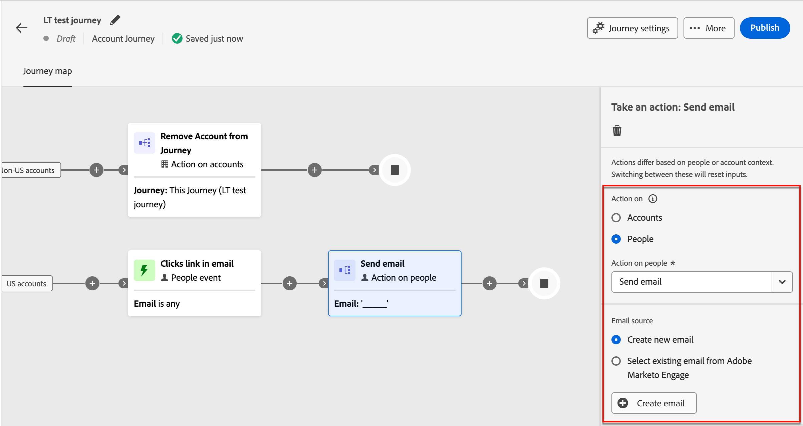
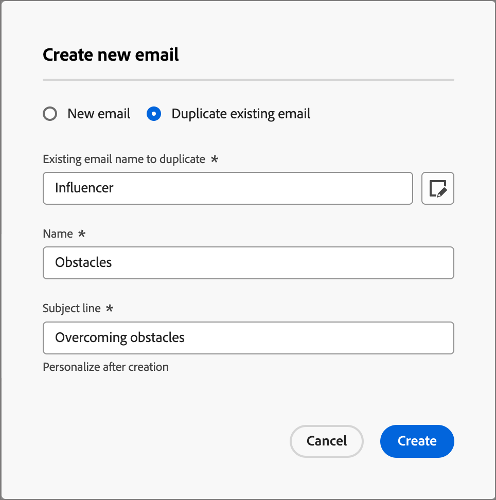
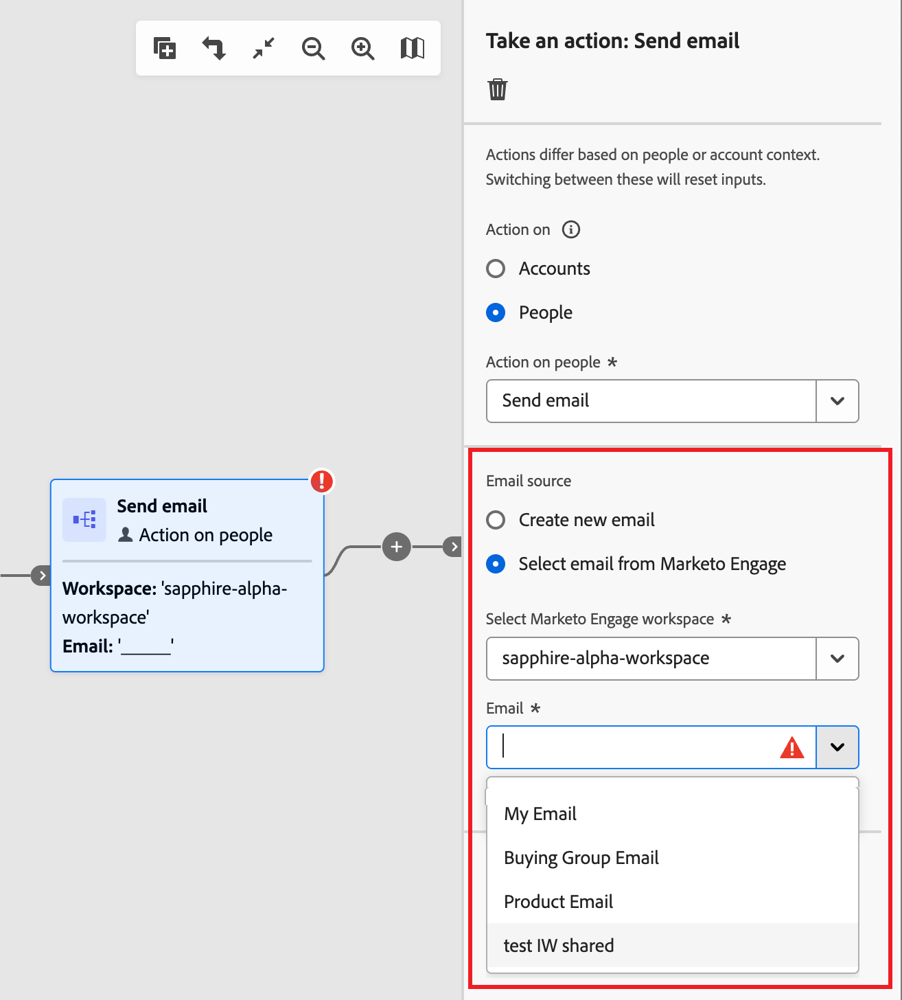

# ジャーニーへのメールの追加

Adobe Journey Optimizer B2B editionを使用すると、アカウントジャーニーを通じてメールメッセージを顧客に送信できます。 メールデザインスペースで、メッセージの作成、パーソナライズ、プレビューを選択できます。 または、接続されたMarketo Engage インスタンスで既に定義されているメールを送信することもできます。

>[!NOTE]
>
>初めてメールを送信する場合は、Adobe Marketo Engage内でメールチャネルが設定されていることを確認してください。 詳しくは、[ トラッキングとメール配信のプロトコル ](../start/email-protocols.md) を参照してください。

## ジャーニーへのメールアクションノードの追加

「[ アクションを実行 _[!UICONTROL 」ノードを追加]_ して以下の操作を実行する ](../journeys/action-nodes.md) ときに、ジャーニーにメール配信を設定できます。

1. _[!UICONTROL アクションオン]_ ターゲットで、「**[!UICONTROL ユーザー]**」を選択します。

1. _[!UICONTROL ユーザーに対するアクション]_ については、「**[!UICONTROL メールを送信]**」を選択します。

1. 「_[!UICONTROL メールソース]_」で、送信するメールのソースを選択します。

   {width="700" zoomable="yes"}

   * **[!UICONTROL 新しいメールを作成]** を選択して、Journey Optimizer B2B editionでネイティブにメールを作成します。

     このオプションを使用すると、Journey Optimizer B2B editionでメールコンテンツをネイティブに管理できます。 **[!UICONTROL メールを作成]** をクリックして、_新しいメールを作成_ ダイアログを開きます。 新しいメールコンテンツアセットを作成したり、既存のメールコンテンツアセットを複製したりできます。

     +++新規メール

     空のキャンバスまたはメールテンプレートを使用してメールを作成する場合は、「_[!UICONTROL 新規メール]_」オプションを使用します。

      1. ダイアログで、「**[!UICONTROL 新規メール]**」を選択します。

      1. メールの一意の **[!UICONTROL 名前]** と **[!UICONTROL 件名]** を入力します。

         {width="400"}

      1. 「**[!UICONTROL 作成]**」をクリックします。

         メールコンテンツページの _[!UICONTROL メールのプロパティ]_ セクションで、_[!UICONTROL 送信者メール]_ および _[!UICONTROL 返信先アドレス]_ フィールドが既に設定されています。 「_[!UICONTROL 送信者名]_」フィールドと「_[!UICONTROL 説明]_ （オプション）」フィールドの値を入力できます。

      1. 「**[!UICONTROL メールを編集]**」をクリックして、メール [ 設定 ](#define-the-email-settings) を定義し、[ コンテンツ ](./email-authoring.md) をデザインします。

     +++

     +++既存のメールを複製

     現在のジャーニーまたは別のジャーニーの既存のメールを使用してメールを作成する場合は、「_[!UICONTROL 既存のメールを複製]_」オプションを使用します。 ジャーニーノードの目的に応じて、複製したメールを変更できます。

      1. _[!UICONTROL 新規メールを作成]_ ダイアログで、「**[!UICONTROL 既存のメールを複製]**」を選択します。

      1. 「**[!UICONTROL 複製する既存のメール]**」については、「_選択_」アイコン（）をクリックし、複製してジャーニーノードに使用するメールを選択します。

         検索フィールドにメール名と一致するテキスト文字列を入力することで、メールのリストをフィルタリングできます。

         {width="600" zoomable="yes"}

         複製するメールのチェックボックスを選択し、「**[!UICONTROL 選択]**」をクリックします。

      1. メールの一意の **[!UICONTROL 名前]** と **[!UICONTROL 件名]** を入力します。

         {width="400"}

      1. 「**[!UICONTROL 作成]**」をクリックします。

         メールコンテンツページの _[!UICONTROL メールのプロパティ]_ セクションで、_[!UICONTROL 送信者メール]_ および _[!UICONTROL 返信先アドレス]_ フィールドが既に設定されています。 「_[!UICONTROL 送信者名]_」フィールドと「_[!UICONTROL 説明]_ （オプション）」フィールドの値を入力できます。

      1. 必要に応じて、「**[!UICONTROL メールを編集]**」をクリックして、メール [ 設定 ](#define-the-email-settings) および [ コンテンツ ](./email-authoring.md) を変更します。

     +++

   * **[!UICONTROL Adobe Marketo Engageからメールを選択]** を選択すると、Marketo Engageで作成済みのメールの 1 つを使用して、ジャーニーの一部として送信できます。

     接続された Market Engage インスタンスで複数のワークスペースを使用できる場合は、ワークスペースを選択します。 次に、ジャーニーノードに送信する承認済みメールを選択します。

     {width="500" zoomable="yes"}

     このオプションを使用すると、ノードが設定され、メールコンテンツをジャーニーでさらに定義する必要がなくなります。

## メール設定の定義

**[!UICONTROL 概要]** パネルで _詳細_ タブを選択した状態で、下までスクロールしてメール設定を表示し定義します。

{width="700" zoomable="yes"}

| オプション | 説明 |
| ------ | ----------- |
| [!UICONTROL &#x200B; 送信者名 &#x200B;] | E メールヘッダーで使用される送信者名。 受信者に表示する送信者の名前を入力します。 _パーソナライズ_ アイコン（）をクリックして、フィールドのパーソナライゼーショントークンを使用します。 |
| [!UICONTROL &#x200B; 送信元メール &#x200B;] | E メールヘッダーで使用される送信者のアドレス。 デフォルト値は [ メールチャネル配信設定 ](../admin/configure-channels-emails.md#delivery-settings) から入力されます。 _パーソナライズ_ アイコン（）をクリックして、フィールドのパーソナライゼーショントークンを使用します。 |
| [!UICONTROL &#x200B; 返信先アドレス &#x200B;] | E メールヘッダーで使用される送信者のアドレス。 デフォルト値は [ メールチャネル配信設定 ](../admin/configure-channels-emails.md#delivery-settings) （[!UICONTROL &#x200B; ラベルから &#x200B;]）から入力されます。 受信者が返信機能を使用している場合に入力するメールアドレスを入力します（送信者のアドレスと異なる場合も同じ場合もあります）。 _パーソナライズ_ アイコン（）をクリックして、フィールドのパーソナライゼーショントークンを使用します。 |
| [!UICONTROL &#x200B; 件名 &#x200B;] | E メールの件名フィールドに表示されるテキスト。 デフォルト値は、「_[!UICONTROL 新しいメールを作成]_ ダイアログで入力したテキストから入力されます。 必要に応じて、テキストを変更できます。 _パーソナライズ_ アイコン（）をクリックして、フィールドのパーソナライゼーショントークンを使用します。<!-- Click the AI Assistant button ( {width="30" zoomable="no"} ) to generate the subject line based on the current email content.--> |
| [!UICONTROL &#x200B; ブランディングドメイン &#x200B;] | システムで複数の [ ブランディングドメイン ](../admin/configure-channels-emails.md#branding-domains) を定義している場合は、メールの送信に使用するブランディングドメインを選択します。 会社全体ではなくブランドから送信されているように見えるメールを送信するには、特定のブランディングドメインを使用します。 ブランドとの信頼を構築し、メールエクスペリエンスをパーソナライズし、開封率と応答率を向上させます。 |
| [!UICONTROL &#x200B; 専用 IP] | 複数の専用 IP アドレスを定義している場合は、メールの送信に使用する専用 IP アドレスを選択します。 プログラムに特定の専用 IP を使用すると、配信品質をより詳細に追跡および監視し、配信指標の変更にすばやく対応できます。 接続されたMarketo Engage インスタンスの専用 IP の追加について詳しくは、[Marketo Engageのドキュメント ](https://experienceleague.adobe.com/en/docs/marketo/using/product-docs/email-marketing/deliverability/use-your-dedicated-ip-addresses-to-send-emails){target="_blank"} を参照してください。 |
| [!UICONTROL &#x200B; 運用上のメール &#x200B;] | メールを操作可能として指定する場合は、チェックボックスを選択します。 運用中のメールは、オプトアウト/購読解除リストおよび通信の制限から除外されます。 受信者がメールメッセージを迷惑メールと見なさない商用メッセージ （SPAM）の場合にのみ、このオプションを選択します。 |
| [!UICONTROL Web ページとしてビューを含める &#x200B;] | チェックボックスを選択して、メールメッセージコンテンツから生成される web ページへのリンクを含めます。 メールメッセージは web ページよりも機能が制限されるので、JavaScript、拡張 CSS およびフォームで役立ちます。 リンクの生成に使用するテキストは、[ メールチャネル配信の設定 ](../admin/configure-channels-emails.md#delivery-settings) （[!UICONTROL web ページのHTMLとして表示 &#x200B;] および [!UICONTROL web ページテキストとして表示 &#x200B;]）で設定します。 |
| [!UICONTROL &#x200B; 開封トラッキングを無効にする &#x200B;] | メールの開封アクティビティを追跡しない場合は、チェックボックスを選択します。 機能を無効にした場合、一意のユーザーがメールを開いた場合にのみ、メールの開封アクティビティ数が増分されます。 メール本文コンテンツをデザインする際に [ メールコンテンツリンクのトラッキングを管理 ](./email-authoring.md#content-authoring---link-tracking) できます。 |
| [!UICONTROL &#x200B; プリヘッダー &#x200B;] | プリヘッダーを含めるチェックボックスを選択します。 プリヘッダーは、一部のメールクライアントの件名の後に表示される短い概要テキストです。 通常は、メールの短い概要を提供し、通常は 1 文です。 フィールドに概要テキストを入力し <!-- , or click the AI Assistant button ( {width="30" zoomable="no"} ) to generate summary text based on the current email content --> す。 |
| [!UICONTROL CC アドレスとして使用されるフィールド &#x200B;] | 使用可能な場合は、`Email` タイプを使用して、Marketo Engageで設定された最大 25 の「リード」フィールドまたは「会社」フィールドを選択します。 |

## アラートの確認

メールメッセージコンテンツをデザインする際、重要な設定が見つからない場合は、インターフェイス（ページの右上）にアラートが表示されます。 このボタンが表示されない場合は、検出された問題はありません。

{width="600" zoomable="yes"}

次の 2 種類のアラートを検出できます。

* 推奨事項やベストプラクティスを参照する **_警告_**。例えば、次のようなものがあります。

   * `The opt-out link is not present in the email body`：メール本文に購読解除リンクを追加することがベストプラクティスです。

     >[!NOTE]
     >
     >マーケティングスタイルの電子メールメッセージには、オプトアウトリンクを含める必要があります。これはトランザクションメッセージには必要ありません。

   * `Text version of HTML is empty`：メール本文のテキストバージョンを必ず定義してください。このバージョンは、HTML コンテンツを表示できない場合に使用されます。

   * `Empty link is present in email body`: メール内のすべてのリンクが正しいことを確認してください。

   * `Email size has exceeded the limit of 100KB`：最適な配信をおこなうには、メールのサイズが 100 KB を超えないようにしてください。

* **_エラー_** 解決されない限り、ジャーニー/キャンペーンのテストやアクティブ化はできません。例えば、次のエラーなどです。

   * `From name is empty`: メール _送信元_ フィールド （必須）が定義されていません。

   * `The subject line is missing`: E メールの件名（必須）が定義されていません。

   * `The email version of the message is empty`: メールの内容が定義されていません。
