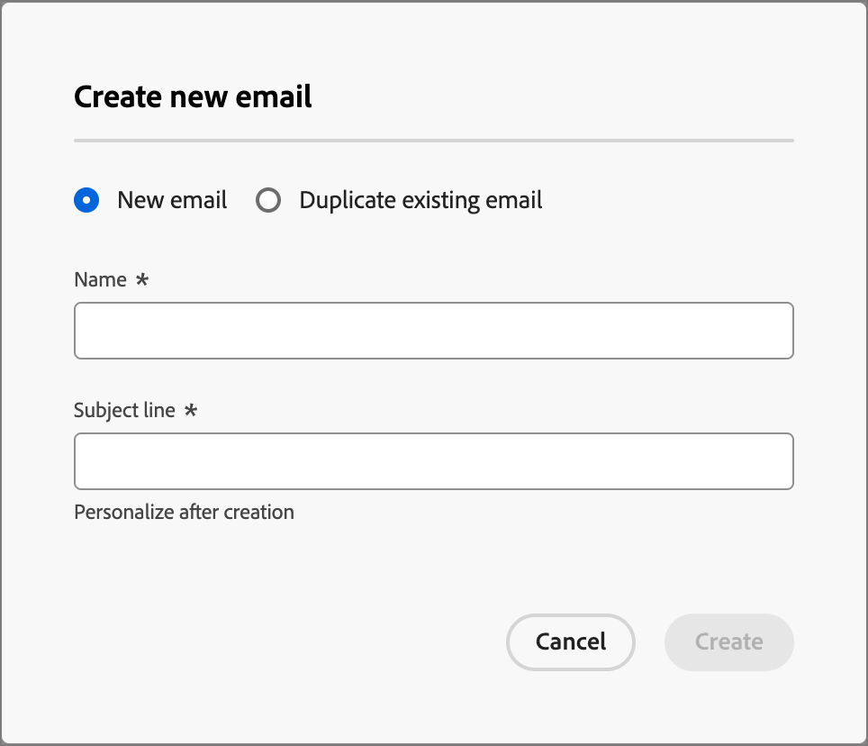
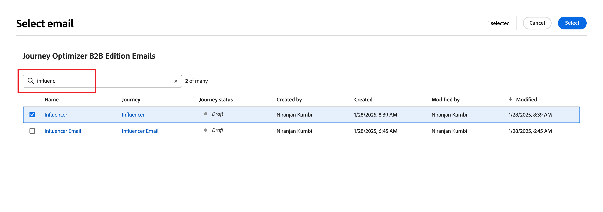
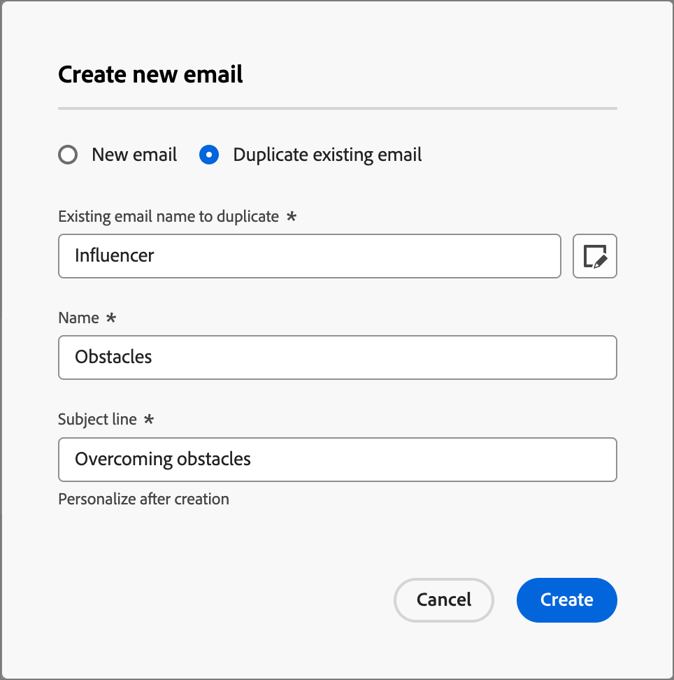
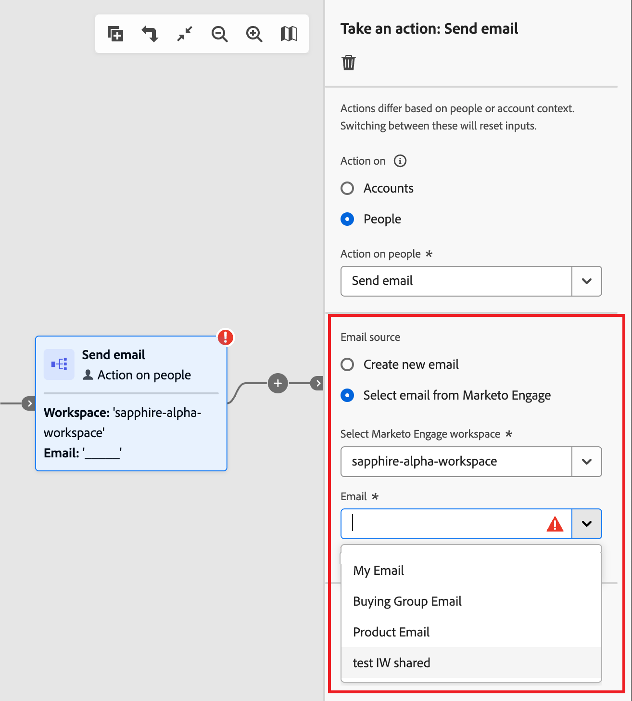
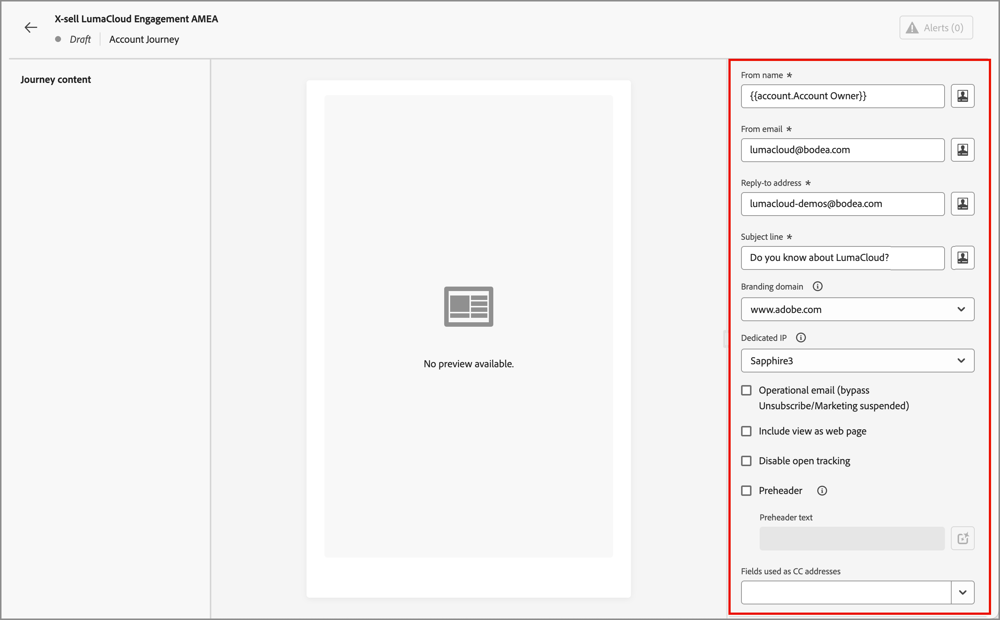
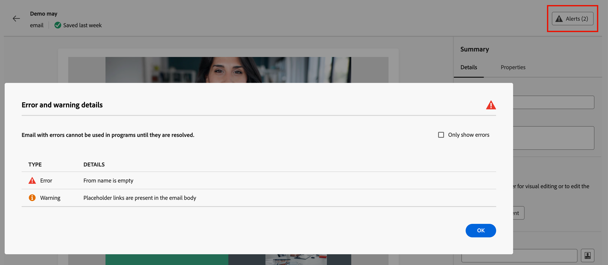

# ジャーニーにメールを追加

Adobe Journey Optimizer B2B editionを使用して、アカウントジャーニーを通じて顧客にメールメッセージを送信します。 メールデザイン分野では、メッセージの作成、パーソナライズ、プレビューを選択できます。 または、接続済みのMarketo Engage インスタンスで既に定義されているメールを送信することもできます。

>[!NOTE]
>
>初めてメールを送信する場合は、Adobe Marketo Engage内からメールチャネルが設定されていることを確認します。 詳しくは、[&#x200B; トラッキングとメール配信のプロトコル &#x200B;](../start/email-protocols.md)を参照してください。
>
>配信時にメールの同意設定がどのように評価されるかについて詳しくは、[同意設定](./channels-consent-preferences.md)を参照してください。

## ジャーニーへのメールアクションノードの追加

ジャーニーでメール配信を設定するには、_[!UICONTROL アクションを実行]_ ノード [&#128279;](../journeys/action-nodes.md)を追加し、次の操作を行います。

1. ターゲット _の_ アクションで、**[!UICONTROL 人物]**&#x200B;を選択します。

1. ユーザー&#x200B;_に対する_ アクションの場合は、**[!UICONTROL メールを送信]**&#x200B;を選択します。

1. _[!UICONTROL 電子メールソース]_&#x200B;で、送信する電子メールの送信方法を選択します。

   {width="700" zoomable="yes"}

   * Journey Optimizer B2B editionで電子メールをネイティブに作成するには、**[!UICONTROL 新しい電子メールを作成]**&#x200B;を選択します。

     このオプションを使用すると、Journey Optimizer B2B editionで電子メールコンテンツをネイティブに管理できます。 「**[!UICONTROL メールを作成]**」をクリックして、_メールを新規作成_ ダイアログを開きます。 新しいメールコンテンツアセットを作成するか、既存のメールコンテンツアセットを複製できます。

     +++新規メール

     空のキャンバスまたは電子メールテンプレートを使用して電子メールを作成する場合は、_[!UICONTROL 新しい電子メール]_ オプションを使用します。

      1. ダイアログで、**[!UICONTROL 新しい電子メール]**&#x200B;を選択します。

      1. 電子メール用に一意の&#x200B;**[!UICONTROL 名前]**&#x200B;と&#x200B;**[!UICONTROL 件名]**&#x200B;を入力します。

         {width="400"}

      1. 「**[!UICONTROL 作成]**」をクリックします。

         メールコンテンツページの&#x200B;_[!UICONTROL 電子メールプロパティ]_ セクションでは、_[!UICONTROL 電子メールから]_&#x200B;および&#x200B;_[!UICONTROL 住所への返信]_ フィールドが既に設定されています。 _[!UICONTROL 差出人名]_&#x200B;および&#x200B;_[!UICONTROL 説明]_ （オプション）フィールドに値を入力できます。

      1. 「**[!UICONTROL メールを編集]**」をクリックして、メール [設定](#define-the-email-settings)を定義し、[&#x200B; コンテンツ &#x200B;](./email-authoring.md)をデザインします。

     +++

     +++既存のメールを複製

     現在のジャーニーまたは別のジャーニーの既存のメールを使用してメールを作成する場合は、_[!UICONTROL 既存のメールを複製]_ オプションを使用します。 ジャーニーノードの目的に応じて、重複したメールに変更を加えることができます。

      1. _[!UICONTROL 新しい電子メールを作成]_ ダイアログで、**[!UICONTROL 既存の電子メールを複製]**&#x200B;を選択します。

      1. **[!UICONTROL 既存の電子メールを複製]**&#x200B;するには、_選択_ アイコン （）をクリックし、複製してジャーニーノードに使用する電子メールを選択します。

         検索フィールドにメール名と一致するテキスト文字列を入力することで、メールのリストをフィルタリングできます。

         {width="600" zoomable="yes"}

         複製する電子メールのチェックボックスを選択し、**[!UICONTROL 選択]**&#x200B;をクリックします。

      1. 電子メール用に一意の&#x200B;**[!UICONTROL 名前]**&#x200B;と&#x200B;**[!UICONTROL 件名]**&#x200B;を入力します。

         {width="400"}

      1. 「**[!UICONTROL 作成]**」をクリックします。

         メールコンテンツページの&#x200B;_[!UICONTROL 電子メールプロパティ]_ セクションでは、_[!UICONTROL 電子メールから]_&#x200B;および&#x200B;_[!UICONTROL 住所への返信]_ フィールドが既に設定されています。 _[!UICONTROL 差出人名]_&#x200B;および&#x200B;_[!UICONTROL 説明]_ （オプション）フィールドに値を入力できます。

      1. 必要に応じて、**[!UICONTROL 電子メールを編集]**&#x200B;をクリックして、電子メール [設定](#define-the-email-settings)と[&#x200B; コンテンツ &#x200B;](./email-authoring.md)を変更します。

     +++

   * **[!UICONTROL Adobe Marketo Engageからメールを選択]**&#x200B;して、Marketo Engageで事前作成済みのメールのいずれかを使用し、ジャーニーの一部として送信します。

     接続されたMarket Engage インスタンスで使用可能なワークスペースが複数ある場合は、ワークスペースを選択します。 次に、ジャーニーノードに送信する承認済みメールを選択します。

     {width="500" zoomable="yes"}

     このオプションを使用すると、ノードが設定され、メールコンテンツはジャーニーでさらに定義する必要がありません。

## メール設定の定義

右側の&#x200B;_概要_ パネルで「**[!UICONTROL 詳細]**」タブを選択した状態で、一番下までスクロールして電子メール設定を表示および定義します。

{width="700" zoomable="yes"}

| オプション | 説明 |
| ------ | ----------- |
| [!UICONTROL 送信者名] | メールヘッダーで使用される送信者名。 受信者に表示する送信者の名前を入力します。 _パーソナライズ_ アイコン（）をクリックして、フィールドでパーソナライゼーショントークンを使用します。 |
| [!UICONTROL 電子メールから] | メールヘッダーで使用される送信者アドレス。 デフォルト値は、[&#x200B; メールチャネル配信設定](../admin/configure-channels-emails.md#delivery-settings)から入力されます。 _パーソナライズ_ アイコン（）をクリックして、フィールドでパーソナライゼーショントークンを使用します。 |
| [!UICONTROL 返信先アドレス &#x200B;] | メールヘッダーで使用される送信者アドレス。 デフォルト値は、[&#x200B; メールチャネル配信設定](../admin/configure-channels-emails.md#delivery-settings) （[!UICONTROL &#x200B; ラベルから]）から入力されます。 受信者が返信機能を使用する場合に入力する電子メールアドレスを入力します（送信者アドレスと異なるか、同じである可能性があります）。 _パーソナライズ_ アイコン（）をクリックして、フィールドでパーソナライゼーショントークンを使用します。 |
| [!UICONTROL 件名] | メールの件名フィールドに表示されるテキスト。 デフォルト値は、_[!UICONTROL 新規電子メールを作成]_ ダイアログで入力したテキストから入力されます。 必要に応じてテキストを変更できます。 _パーソナライズ_ アイコン （）をクリックして、フィールドでパーソナライゼーション トークンを使用します。<!-- Click the AI Assistant button ( {width="30" zoomable="no"} ) to generate the subject line based on the current email content.--> |
| [!UICONTROL &#x200B; ブランディングドメイン &#x200B;] | システムで複数の[&#x200B; ブランドドメイン &#x200B;](../admin/configure-channels-emails.md#branding-domains)が定義されている場合は、メールの送信に使用するブランドドメインを選択します。 特定のブランドドメインを使用し、企業全体ではなく自社から配信されたと思われるメールを送信します。 これにより、企業との信頼関係を構築し、メール体験をパーソナライズして、開封率と応答率を向上させることができます。 |
| [!UICONTROL 専用IP] | 複数の専用IP アドレスが定義されている場合は、メールの送信に使用する専用IP アドレスを選択します。 プログラムに特定の専用IPを使用すると、配信品質をより詳細に追跡および監視し、配信指標の変更に迅速に対応できます。 接続されたMarketo Engage インスタンス用の専用IPの追加について詳しくは、[Marketo Engage ドキュメント &#x200B;](https://experienceleague.adobe.com/ja/docs/marketo/using/product-docs/email-marketing/deliverability/use-your-dedicated-ip-addresses-to-send-emails){target="_blank"}を参照してください。 |
| [!UICONTROL 運用電子メール &#x200B;] | 電子メールを運用中に指定する場合は、チェックボックスをオンにします。 運用メールは、オプトアウト/登録解除リスト、およびコミュニケーション制限から除外されます。 受信者が電子メールメッセージを迷惑メール（SPAM）と見なせない場合にのみ、このオプションを選択します。 |
| [!UICONTROL Web ページとしてビューを含める] | チェックボックスを選択して、メールメッセージのコンテンツから生成されるweb ページへのリンクを含めます。 メールメッセージの機能は、web ページよりも限定的であるため、JavaScript、拡張CSS、フォームで役立ちます。 リンクの生成に使用するテキストは、[電子メールチャネル配信設定](../admin/configure-channels-emails.md#delivery-settings) （[!UICONTROL web ページとして表示HTML]、および[!UICONTROL web ページとして表示]）で設定されています。 |
| [!UICONTROL 開封トラッキングを無効にする] | 電子メールの開封状況を追跡しない場合は、チェックボックスをオンにします。 この機能を無効にすると、電子メールの開封数は、一意のユーザーが電子メールを開いたときにのみ増加します。 メール本文コンテンツをデザインする際に、[&#x200B; メールコンテンツリンクトラッキングを管理](./email-authoring.md#content-authoring---link-tracking)できます。 |
| [!UICONTROL &#x200B; プリヘッダー] | プリヘッダーを含めるには、このチェックボックスをオンにします。 プリヘッダーは、一部のメールクライアントで件名の後に表示される短い要約テキストです。 通常は、メールの短い要約を提供し、通常は1文です。 フィールド <!-- , or click the AI Assistant button ( {width="30" zoomable="no"} ) to generate summary text based on the current email content -->に概要テキストを入力します。 |
| [!UICONTROL CC アドレスとして使用されるフィールド &#x200B;] | 使用可能な場合は、`Email`型を使用してMarketo Engageで設定されているリードまたは会社のフィールドを25個まで選択します。 |

## アラートの確認

メールメッセージのコンテンツをデザインする際に、キー設定が見つからない場合は、インターフェイス（ページの右上）にアラートが表示されます。 このボタンが表示されない場合、検出された問題はありません。

{width="600" zoomable="yes"}

2種類のアラートを検出できます。

* 推奨事項とベストプラクティスに関する&#x200B;**_警告_**&#x200B;は、次のとおりです。

   * `The opt-out link is not present in the email body`：購読解除リンクをメール本文に追加することはベストプラクティスです。

     >[!NOTE]
     >
     >マーケティングスタイルのメールメッセージには、オプトアウトリンクを含める必要がありますが、これはトランザクションメッセージには必要ありません。

   * `Text version of HTML is empty`: HTML コンテンツを表示できない場合に使用するメール本文のテキスト版を定義することを忘れないでください。

   * `Empty link is present in email body`：電子メール内のすべてのリンクが正しいことを確認してください。

   * `Email size has exceeded the limit of 100KB`：最適な配信を行うには、電子メールのサイズが100 KBを超えないようにしてください。

* 解決されない限り、ジャーニー/キャンペーンのテストまたはアクティブ化を妨げる&#x200B;**_エラー_**&#x200B;が発生します。例えば、次のようになります。

   * `From name is empty`：電子メール _送信者_ フィールド （必須）が定義されていません。

   * `The subject line is missing`：電子メールの件名（必須）が定義されていません。

   * `The email version of the message is empty`：電子メール コンテンツが定義されていません。
