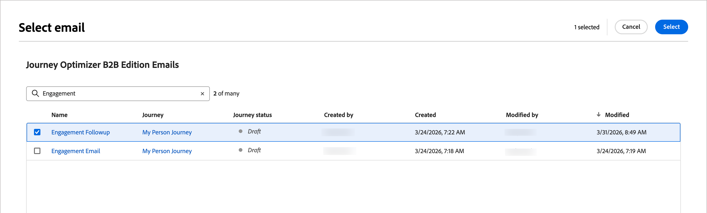

# ジャーニーにメールを追加

Adobe Journey Optimizer B2B editionを使用して、アカウントジャーニーを通じて顧客にメールメッセージを送信します。 メールデザイン分野では、メッセージの作成、パーソナライズ、プレビューを選択できます。 電子メールがジャーニーでライブになった後、[電子メールパフォーマンスレポート &#x200B;](../dashboards/email-performance-dashboard.md)で、送信、配信、エンゲージメントを監視します。

>[!NOTE]
>
>初めてメールを送信する場合は、メールチャネルが設定されていることを確認します。 詳しくは、[&#x200B; トラッキングとメール配信のプロトコル &#x200B;](../start/email-protocols.md)を参照してください。
>
>配信時にメールの同意設定がどのように評価されるかについて詳しくは、[同意設定](./channels-consent-preferences.md)を参照してください。

## メール送信アクションノードの追加 {#send-email-node}

ジャーニーでメール配信を設定するには、_[!UICONTROL アクションを実行]_ ノード [&#128279;](../journeys/action-nodes.md)を追加し、次の操作を行います。

1. _（アカウントジャーニーのみ）_ _ターゲットの_ アクションで、**[!UICONTROL 人物]**&#x200B;を選択します。

1. アクションの場合は、**[!UICONTROL 電子メールを送信]**&#x200B;を選択します。

1. 「**[!UICONTROL メールを作成]**」をクリックします。

   {width="500"}

1. _新しい電子メールを作成_ ダイアログで、新しい電子メールコンテンツアセットを作成するか、既存の電子メールコンテンツアセットを複製するかを選択します。

   * 空のキャンバスまたは電子メールテンプレートを使用して電子メールを作成する場合は、**[!UICONTROL 新しい電子メール]** オプションを選択します。

     {width="400"}

     * 電子メール用に一意の&#x200B;**[!UICONTROL 名前]**&#x200B;と&#x200B;**[!UICONTROL 件名]**&#x200B;を入力します。

     * 「**[!UICONTROL 作成]**」をクリックします。

   * 現在のジャーニーまたは別のジャーニーの既存のメールを使用してメールを作成する場合は、「**[!UICONTROL 既存のメールを複製]**」オプションを選択します。

     ジャーニーノードの目的に応じて、重複したメールに変更を加えることができます。

     * **[!UICONTROL 既存の電子メールを複製]**&#x200B;するには、_選択_ アイコン （）をクリックし、複製してジャーニーノードに使用する電子メールを選択します。

       検索フィールドにメール名と一致するテキスト文字列を入力することで、メールのリストをフィルタリングできます。 複製する電子メールのチェックボックスを選択し、**[!UICONTROL 選択]**&#x200B;をクリックします。

       {width="600" zoomable="yes"}

     * 電子メール用に一意の&#x200B;**[!UICONTROL 名前]**&#x200B;と&#x200B;**[!UICONTROL 件名]**&#x200B;を入力します。

       {width="400"}

     * 「**[!UICONTROL 作成]**」をクリックします。

1. 「**[!UICONTROL メールを編集]**」をクリックして、メール [設定](#email-settings)と[&#x200B; コンテンツ &#x200B;](./email-authoring.md)を定義します。

   {width="500"}

## メール設定の定義 {#email-settings}

右側の&#x200B;_概要_ パネルで「**[!UICONTROL 詳細]**」タブを選択した状態で、一番下までスクロールして電子メール設定を表示および定義します。

{width="700" zoomable="yes"}

| オプション | 説明 |
| ------ | ----------- |
| [!UICONTROL 送信者名] | メールヘッダーで使用される送信者名。 受信者に表示する送信者の名前を入力します。 _パーソナライズ_ アイコン（）をクリックして、フィールドでパーソナライゼーショントークンを使用します。 |
| [!UICONTROL 電子メールから] | メールヘッダーで使用される送信者アドレス。 デフォルト値は、[&#x200B; メールチャネル配信設定](../admin/configure-channels-emails.md#delivery-settings)から入力されます。 _パーソナライズ_ アイコン（）をクリックして、フィールドでパーソナライゼーショントークンを使用します。 |
| [!UICONTROL 返信先アドレス &#x200B;] | メールヘッダーで使用される送信者アドレス。 デフォルト値は、[&#x200B; メールチャネル配信設定](../admin/configure-channels-emails.md#delivery-settings) （[!UICONTROL &#x200B; ラベルから]）から入力されます。 受信者が返信機能を使用する場合に入力する電子メールアドレスを入力します（送信者アドレスと異なるか、同じである可能性があります）。 _パーソナライズ_ アイコン（）をクリックして、フィールドでパーソナライゼーショントークンを使用します。 |
| [!UICONTROL 件名] | メールの件名フィールドに表示されるテキスト。 デフォルト値は、_[!UICONTROL 新規電子メールを作成]_ ダイアログで入力したテキストから入力されます。 必要に応じてテキストを変更できます。 _パーソナライズ_ アイコン （）をクリックして、フィールドでパーソナライゼーション トークンを使用します。<!-- Click the AI Assistant button ( {width="30" zoomable="no"} ) to generate the subject line based on the current email content.--> |
| [!UICONTROL &#x200B; ブランディングドメイン &#x200B;] | システムで複数の[&#x200B; ブランドドメイン &#x200B;](../admin/configure-channels-emails.md#branding-domains)が定義されている場合は、メールの送信に使用するブランドドメインを選択します。 特定のブランドドメインを使用し、企業全体ではなく自社から配信されたと思われるメールを送信します。 これにより、企業との信頼関係を構築し、メール体験をパーソナライズして、開封率と応答率を向上させることができます。 |
| [!UICONTROL 運用電子メール &#x200B;] | 電子メールを運用中に指定する場合は、チェックボックスをオンにします。 運用メールは、オプトアウト/登録解除リスト、およびコミュニケーション制限から除外されます。 受信者が電子メールメッセージを迷惑メール（SPAM）と見なせない場合にのみ、このオプションを選択します。 |
| [!UICONTROL Web ページとしてビューを含める] | チェックボックスを選択して、メールメッセージのコンテンツから生成されるweb ページへのリンクを含めます。 メールメッセージの機能は、web ページよりも限定的であるため、JavaScript、拡張CSS、フォームで役立ちます。 リンクの生成に使用するテキストは、[電子メールチャネル配信設定](../admin/configure-channels-emails.md#delivery-settings) （[!UICONTROL web ページとして表示HTML]、および[!UICONTROL web ページとして表示]）で設定されています。 |
| [!UICONTROL 開封トラッキングを無効にする] | 電子メールの開封状況を追跡しない場合は、チェックボックスをオンにします。 この機能を無効にすると、電子メールの開封数は、一意のユーザーが電子メールを開いたときにのみ増加します。 メール本文コンテンツをデザインする際に、[&#x200B; メールコンテンツリンクトラッキングを管理](./email-authoring.md#edit-linked-url-tracking)できます。 |
| [!UICONTROL &#x200B; プリヘッダー] | プリヘッダーを含めるには、このチェックボックスをオンにします。 プリヘッダーは、一部のメールクライアントで件名の後に表示される短い要約テキストです。 通常は、メールの短い要約を提供し、通常は1文です。 フィールド <!-- , or click the AI Assistant button ( {width="30" zoomable="no"} ) to generate summary text based on the current email content -->に概要テキストを入力します。 |

<!-- 
Removed, but may reappear elsewhere
| [!UICONTROL Dedicated IP] | If you have more than one dedicated IP addresses defined, select a dedicated IP address to use for sending the email. When you use a specific dedicated IP for your programs, you can track and monitor deliverability more closely and respond quickly to any changes in your delivery metrics. For more information about adding a dedicated IP for the connected Marketo Engage instance, refer to the [Marketo Engage documentation](https://experienceleague.adobe.com/en/docs/marketo/using/product-docs/email-marketing/deliverability/use-your-dedicated-ip-addresses-to-send-emails){target="_blank"}.|
| [!UICONTROL Fields used as CC addresses] | If available, select up to 25 Lead or Company fields that are set up in Marketo Engage using the `Email` type.  |
-->

## アラートの確認 {#check-alerts}

メールの設定とコンテンツを定義すると、キー設定が見つからない場合にアラートがインターフェイス（ページの右上）に表示されます。 このボタンが表示されない場合、検出された問題はありません。

{width="600" zoomable="yes"}

アラートには、次の2種類があります。

* 推奨事項とベストプラクティスに関する&#x200B;**_警告_**&#x200B;は、次のとおりです。

  * `The opt-out link is not present in the email body`：購読解除リンクをメール本文に追加することはベストプラクティスです。

    >[!NOTE]
    >
    >マーケティングスタイルのメールメッセージには、オプトアウトリンクを含める必要がありますが、これはトランザクションメッセージには必要ありません。

  * `Text version of HTML is empty`: HTML コンテンツを表示できない場合に使用するメール本文のテキストバージョンを定義します。

  * `Empty link is present in email body`：電子メール内のすべてのリンクが正しいことを確認してください。

  * `Email size has exceeded the limit of 100KB`：最適な配信を行うには、電子メールのサイズが100 KBを超えないようにしてください。

* 解決されない限り、ジャーニー/キャンペーンのテストまたはアクティブ化を妨げる&#x200B;**_エラー_**&#x200B;が発生します。例えば、次のようになります。

  * `From name is empty`：電子メール _送信者_ フィールド （必須）が定義されていません。

  * `The subject line is missing`：電子メールの件名（必須）が定義されていません。

  * `The email version of the message is empty`：電子メール コンテンツが定義されていません。
