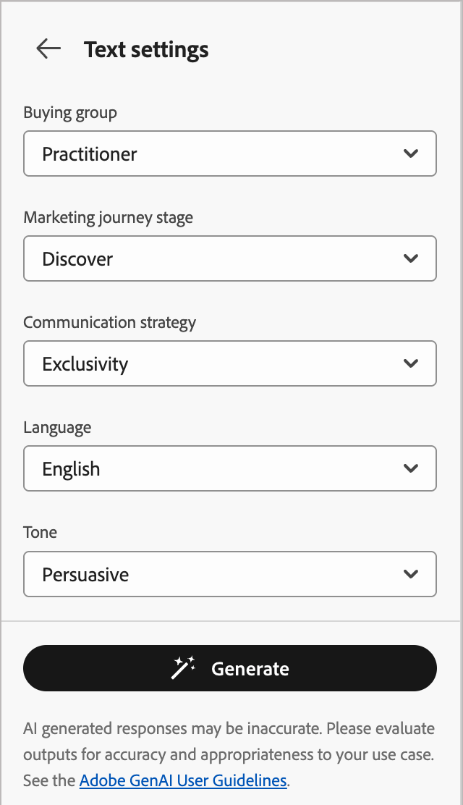
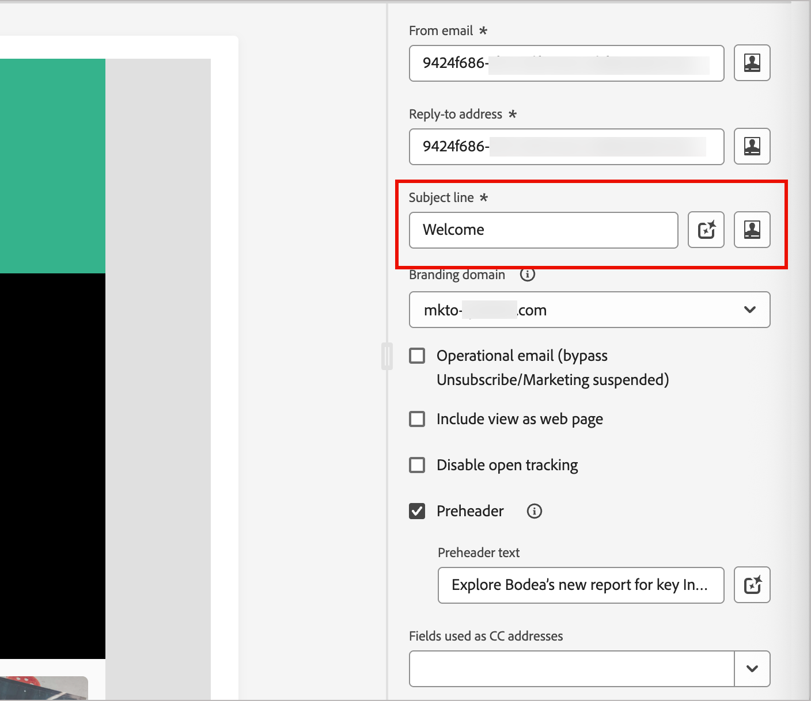
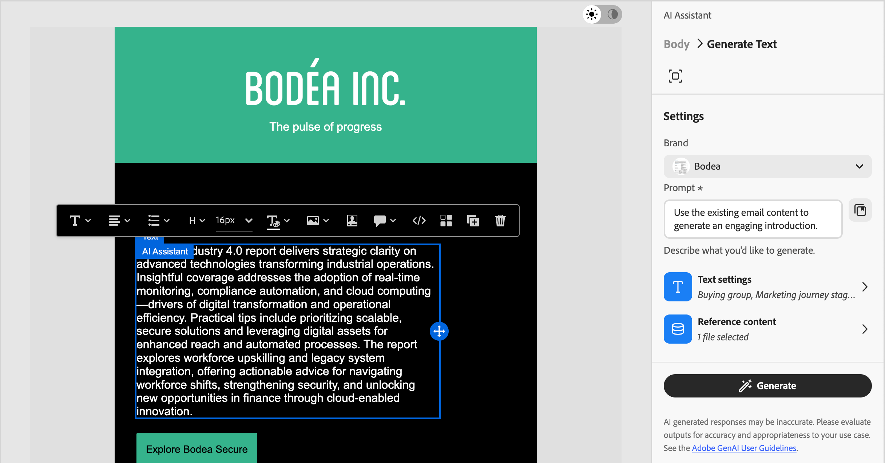
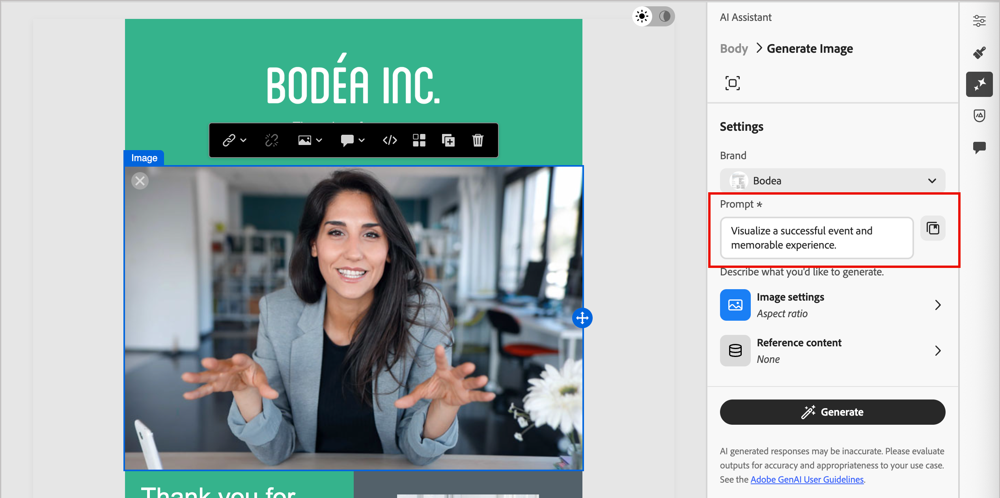

# メールコンテンツ用 AI アシスタント

マーケティング業界の競争力が高まるにつれ、ブランドは効果的なコンテンツを迅速かつ効率的に生成する効率的な方法を模索しています。 [!DNL Adobe Journey Optimizer B2B Edition] のメールオーサリング用 AI アシスタントは、Adobeの AI を活用したコンテンツ生成機能です。この機能は、マーケターがプロフェッショナルでブランドに一貫したメールコンテンツを作成する方法に革命をもたらします。 高度な生成 AI モデルとブランドガイドラインの深い理解により、AI アシスタントはパーソナライズされた魅力的で効果的なコンテンツを自動生成します。 マーケティング目標を使用し、ブランドの概要を示すスタイル、レイアウト、トーンなどに合わせてコンテンツを最適化します。 AI アシスタントを使用すると、メールマーケティングキャンペーンの作成と実行が直感的でシンプルかつ手間のかからない方法で行えます。 この機能をワークフローに追加すると、時間を節約し、効率を向上させ、より良い結果を導くことができます。

この新しい機能は、メールを完全に生成したり、メールの構造コンポーネント内をターゲットにしたりするために、プロンプトベースのコンテンツ生成を提供します。 画像の場合は、新しい画像アセットを生成するか、入力ブランドアセットの画像のカタログ内からレコメンデーションを生成するだけです。 また、この機能を使用して、メールの開封率に影響を与える最適な件名行とプリヘッダーを生成することもできます。

>[!IMPORTANT]
>
>Adobe Journey Optimizer B2B editionのこれらの機能にアクセスするには、_[!UICONTROL AI アシスタント]_/_[!UICONTROL コンテンツを生成]_ 権限が必要です。 製品管理者が機能に対する権限を付与する方法について詳しくは、「製品権限の役割の編集 [&#x200B; を参照してください &#x200B;](../admin/user-management.md#edit-roles-for-product-permissions)。

## ガイドラインと制限事項

この機能の使用を開始する前に、[&#x200B; ガイドラインと制限事項 &#x200B;](../ai-assistant/generative-ai-content.md#general-guidelines-and-limitations) を確認してください。[[!DNL Journey Optimizer B2B Edition] で AI 機能を使用するには &#x200B;](https://www.adobe.com/legal/licenses-terms/adobe-dx-gen-ai-user-guidelines.html){target="_blank"} ユーザーの同意も必要です。 詳しくは、アドビ担当者にお問い合わせください。

Adobeは、メディアの作成にジェネレーティブ AI ツールを使用する際の透明性を高めるためのAdobeの取り組みの一環として、Fireflyで生成されたアセットのダウンロード時や書き出し時に、そのアセットを含むすべてのコンテンツやプロジェクトに [&#x200B; コンテンツ資格情報 &#x200B;](https://helpx.adobe.com/firefly/web/get-started/learn-the-basics/content-credentials-overview.html){target="_blank"} を適用します。

[!DNL Journey Optimizer B2B Edition] でのメールコンテンツ生成に使用される AI アシスタント機能には、次の制限とガイドラインが適用されます。

* サポートされている言語は英語のみです。
* 生成されたコンテンツは正確でない場合があります。フィードバックを共有して、Adobe エンジニアがモデルを調整できるようにします。
* 複数のコンテンツ参照アセットをアップロードできますが、特定の世代に対して 1 つのみを利用できます。
* 完全なメールのコンテンツを生成するには、ブランド固有またはカスタムテンプレートを使用します。 最大 8～10 個の画像を使用するメールテンプレートを推奨します。
* 生成されたバリアントを選択する際は、サムアップ、サムダウンまたはフラグアイコンを使用して、問題のある出力を報告してください。

## コンテンツ生成の入力と設定

メールの完全なコンテンツを生成することも、メール内の選択したコンポーネントの完全なコンテンツを生成することもできます。 AI アシスタント ツールを使用して必要なコンテンツを生成する場合は、プロンプトや参照コンテンツなどの入力、およびテキストや画像の設定を指定します。

### プロンプト

生成 AI モデルに対して明確に定義されたプロンプトを使用し、正確に解釈します。 指定するマーケティングの目的やプロンプトは、生成されるコンテンツの品質に強く影響します。

{width="320"}

効果的なプロンプトの作成について詳しくは、「_[プロンプトのベストプラクティス](../ai-assistant/generative-ai-content.md#generative-ai-prompting-guide)_」を参照してください。

>[!BEGINSHADEBOX]

#### プロンプトライブラリ

可能な限り最高のコンテンツを生成するには、効果的なプロンプトが不可欠です。 プロンプトの作成に関する支援が必要な場合は、「_プロンプトライブラリ_ アイコンをクリックして、目的に応じて整理されたプロンプトのアイデアのライブラリにアクセスします。 検索フィールドにテキストを入力し、キーワード文字列に基づいてプロンプトを検索します。

{width="600" zoomable="no"}

目的を最もよく反映したプロンプトを選択し、「**[!UICONTROL このプロンプトを試す]**」をクリックします。 _[!UICONTROL プロンプト]_ フィールドで、プレースホルダー（`[Key Feature/Information]` など）を、ブランド、オファー、キャンペーンおよびユースケースを指定する必要な値に置き換えます。

>[!ENDSHADEBOX]

### テキスト設定

右側のパネルで **[!UICONTROL テキスト設定]** を展開し、生成テキストのオプションを設定します。

* **[!UICONTROL 購入グループ]** - メッセージのターゲティングに使用する [&#x200B; 購入グループの役割 &#x200B;](../buying-groups/buying-groups-role-templates.md) を選択します。[!DNL Journey Optimizer B2B Edition] は、5 つの標準の B2B 購入グループロールを標準ですぐに利用できます。 各購入グループの役割には、明確なメッセージの焦点があります。

  | 役割 | メッセージングの焦点 |
  | ---- | --------------- |
  | 幹部運営委員会 | 製品情報   価格   技術統合の詳細   製品の特長と機能 |
  | インフルエンサー | 品質実証   導入の容易さ   特定分野の専門知識   競争優位性 |
  | 意思決定者 | ROI  財務価値（RoI））   お客様の事例 |
  | 実務担当者 | 使いやすさ   製品の特長および機能   製品の互換性   製品の統合が容易 |
  | チャンピオン | 教育コンテンツ   ソートリーダーシップコンテンツ   顧客事例 |

* **[!UICONTROL マーケティングジャーニーステージ]** - メッセージのターゲティングに使用する [&#x200B; 購入グループステージ &#x200B;](../buying-groups/buying-group-stages.md) を選択します。
* **[!UICONTROL コミュニケーション戦略]** – 生成テキストに最適なコミュニケーションスタイルを選択します。
* **[!UICONTROL 言語]** – 生成されたコンテンツの言語を選択します。
* **[!UICONTROL トーン]** - トーンはオーディエンスの共感を得る必要があります。 例えば、情報を提供する、遊び心がある、説得力があるようにメッセージを調整できます。

{width="350" zoomable="yes"}

左矢印をクリックして、メインの _[!UICONTROL 設定]_ に戻ります。

### 画像設定

生成するコンテンツに画像を含めるには、右側のパネルで **[!UICONTROL 画像設定]** を展開し、オプションを設定します。

「**[!UICONTROL AI を使用して画像を生成]**」オプションはデフォルトで無効になっています。 この機能を有効にして次のオプションを設定し、生成された画像を提案されるコンテンツのバリエーションに含めます。

<!-- * **[!UICONTROL Generative model]**: Select from available built-in models, custom Firefly models trained on your brand assets, or third-party image generation providers to create images that align with your specific needs and brand requirements. -->
* **[!UICONTROL 縦横比]**：画像コンポーネントを選択した場合、この設定によってアセットの幅と高さが決まります。 16:9、4:3、3:2、1:1 など、一般的な比率から選択することも、カスタムサイズを入力することもできます。
* **[!UICONTROL コンテンツタイプ]**：視覚要素の特性を分類し、写真、グラフィック、アートなどの視覚的表現の様々な形式を区別します。
* **[!UICONTROL 視覚的な強さ]**：画像の強さを調整して、画像の影響を制御します。 設定値を小さくすると（2 など）、見た目が柔らかくなり、制限されます。設定値を大きくすると（10 など）、画像がより鮮やかになり、視覚的に強力になります。
* **[!UICONTROL カラーとトーン]**：画像内の色の全体的な外観とそれが伝えるムードまたは雰囲気。
* **[!UICONTROL 照明]**：画像に使用する照明スタイル。雰囲気を形作り、特定の要素を強調します。
* **[!UICONTROL 構成]**：画像のフレーム内の要素の配置。

{width="350" zoomable="yes"}

左矢印をクリックして、メインの _[!UICONTROL 設定]_ に戻ります。

### 参照コンテンツ

参照コンテンツアセットをアップロードして、正確なオンブランドコンテンツを生成する。 そうでない場合、生成されるコンテンツは、公開されている情報に基づきます。 参照コンテンツは、コンテンツ生成と画像レコメンデーションのソースとして機能します。 ガイドラインとベストプラクティスについては、_[最適化された参照コンテンツ](../ai-assistant/generative-ai-content.md#reference-content)_ を参照してください。

**[!UICONTROL 参照コンテンツ]** 設定で「**[!UICONTROL ファイルをアップロード]**」をクリックして、追加のコンテキストに使用するコンテンツを含むアセットを追加します。

{width="350" zoomable="yes"}

アップロードできるファイル形式は、PDF、JPEG、PNG、ZIP ファイル（サポートされているファイル形式を含む）のいずれかです。 アップロードされるブランドアセットの最大サイズは 50 MB です。 ファイルのサイズが大きい場合や画像の数が多い場合でも動作しますが、処理時間が長くなります。

以前にアップロードしたファイルを選択する場合は、「**[!UICONTROL アップロードされた参照コンテンツ]**」リストを展開し、コンテンツ生成に使用するアセットを有効にします。

{width="350" zoomable="yes"}

## AI アシスタントでメールプロパティを生成

アカウントジャーニーに [&#x200B; メールアクションを追加 &#x200B;](./add-email.md#add-an-email-action-node-in-a-journey) する場合、メールの送信に使用する一連のメールプロパティを定義します。 AI アシスタントは、メール **_件名_** および **_プリヘッダー_** の推奨コンテンツを生成することで、メールのエンゲージメントを向上させるのに役立ちます。

ジャーニーからメールを作成する場合、またはジャーニーノードから既存のメールを開く場合、右側に _[!UICONTROL メールのプロパティ]_ があるメールプレビューページが表示されます。 「_[!UICONTROL 概要]_」タブでは、AI アシタントコンテンツ生成ツールを使用して、件名行、プリヘッダー、またはその両方を生成できます。

>[!BEGINTABS]

>[!TAB  件名の生成 ]

次の手順では、AI アシスタントを使用して最適化された件名をメールに生成するためのタスクシーケンスを説明します。

1. _詳細_ タブを選択した _概要_ パネルで、**[!UICONTROL 件名]** フィールドまで下にスクロールします。

1. フィールドの右側にある AI アシスタントアイコン（{width="30"}）をクリックします。

   {width="600" zoomable="yes"}

   _[!UICONTROL 件名を生成]_ ダイアログが開き、メールの件名の生成設定が表示されます。

1. （必須）「**[!UICONTROL プロンプト]**」フィールドに、生成対象の説明を入力します。

   効果的なプロンプトの作成に関するヘルプが必要な場合は、[&#x200B; プロンプトライブラリ &#x200B;](#prompt-library) を使用します。

1. （任意）コンテンツガイダンスの設定を完了して、プリヘッダーを生成するための追加入力を指定します。

   * [**[!UICONTROL &#x200B; テキスト設定 &#x200B;]**](#text-settings) – 生成されたテキストコンテンツのガイダンスを提供します。
   * [**[!UICONTROL &#x200B; 参照コンテンツ &#x200B;]**](#reference-content) - コンテンツ生成のソースとして機能するコンテンツアセットを指定します。

1. プロンプトと設定の準備ができたら、「**[!UICONTROL 生成]**」をクリックします。

   生成されたバリアントがダイアログに表示されます。

   {width="600" zoomable="yes"}

1. AI アシスタント パネルをスクロールし、生成されたバリエーションを参照して、どれが最適かを判断します。

   生成されたバリアントに対して [&#x200B; フィードバックを送信 &#x200B;](#submit-variation-feedback) するには、_サムズアップ_、_サムズダウン_ または _フラグ_ アイコンをクリックし、フィードバックを最もよく要約する理由を選択します。

1. 「**[!UICONTROL 絞り込み]**」オプションをクリックして、追加のカスタマイズ機能にアクセスします。

   * **[!UICONTROL フレーズ変更]** - メッセージの意味を保持したまま書き換えます。 このオプションを使用すると、コアメッセージを変更せずに別の表現を生成したり、言葉遣いを調整したりできます。

   * **[!UICONTROL よりシンプルな言語の使用]** – 言語を簡素化し、より広いオーディエンスに対して明確でアクセシビリティを確保します。

   * **[!UICONTROL 翻訳]** - テキストを別の言語に翻訳します。 （現在サポートされている言語は英語のみです。 その他の言語は今後のリリースで予定されています）。

   * **[!UICONTROL トーンを変更]** - メッセージのトーンを、よりフレンドリー、プロフェッショナル、緊急、またはインスピレーションを高めるなど、コミュニケーションスタイルに合わせて調整します。

   * **[!UICONTROL コミュニケーション戦略の変更]** – 緊急性の創出や魅力的なアピールの強調など、目標に基づいてメッセージングアプローチを変更します。

   {width="600" zoomable="yes"}

1. 「**[!UICONTROL 選択]**」をクリックして、件名行のテキストを選択したバリアントに置き換え、メールのプロパティに戻ります。

>[!TAB  プリヘッダーの生成 ]

メールのプリヘッダーは、インボックスでメールが表示された際に件名の後に表示される短い概要テキストです。 これはメールのオプション要素ですが、エンゲージメントを向上させる絶好の機会です。 次の手順では、AI アシスタントを使用してメールに最適化されたプリヘッダーを生成するためのタスクシーケンスを説明します。

1. _詳細_ タブが選択された _概要_ パネルで、下にスクロールして **[!UICONTROL プリヘッダー]** チェックボックスを選択します。

   {width="600" zoomable="yes"}

   _[!UICONTROL プリヘッダーを生成]_ ダイアログが開き、メールのプリヘッダーの生成設定が表示されます。

1. （必須）「**[!UICONTROL プロンプト]**」フィールドに、生成対象の説明を入力します。

   効果的なプロンプトの作成に関するヘルプが必要な場合は、[&#x200B; プロンプトライブラリ &#x200B;](#prompt-library) を使用します。

1. （任意）コンテンツガイダンスの設定を完了して、プリヘッダーを生成するための追加入力を指定します。

   * [**[!UICONTROL &#x200B; テキスト設定 &#x200B;]**](#text-settings) – 生成されたテキストコンテンツのガイダンスを提供します。
   * [**[!UICONTROL &#x200B; 参照コンテンツ &#x200B;]**](#reference-content) - コンテンツ生成のソースとして機能するコンテンツアセットを指定します。

1. プロンプトと設定の準備ができたら、「**[!UICONTROL 生成]**」をクリックします。

   生成されたバリアントがダイアログに表示されます。

   {width="600" zoomable="yes"}

1. AI アシスタント パネルをスクロールし、生成されたバリエーションを参照して、どれが最適かを判断します。

   生成されたバリアントに対して [&#x200B; フィードバックを送信 &#x200B;](#submit-variation-feedback) するには、_サムズアップ_、_サムズダウン_ または _フラグ_ アイコンをクリックし、フィードバックを最もよく要約する理由を選択します。

1. 「**[!UICONTROL 絞り込み]**」オプションをクリックして、追加のカスタマイズ機能にアクセスします。

   * **[!UICONTROL フレーズ変更]** - メッセージの意味を保持したまま書き換えます。 このオプションを使用すると、コアメッセージを変更せずに別の表現を生成したり、言葉遣いを調整したりできます。

   * **[!UICONTROL よりシンプルな言語の使用]** – 言語を簡素化し、より広いオーディエンスに対して明確でアクセシビリティを確保します。

   * **[!UICONTROL 翻訳]** - テキストを別の言語に翻訳します。 （現在サポートされている言語は英語のみです。 その他の言語は今後のリリースで予定されています）。

   * **[!UICONTROL トーンを変更]** - メッセージのトーンを、よりフレンドリー、プロフェッショナル、緊急、またはインスピレーションを高めるなど、コミュニケーションスタイルに合わせて調整します。

   * **[!UICONTROL コミュニケーション戦略の変更]** – 緊急性の創出や魅力的なアピールの強調など、目標に基づいてメッセージングアプローチを変更します。

   {width="500" zoomable="yes"}

1. 「**[!UICONTROL 選択]**」をクリックして、プリヘッダーを選択したバリアントに置き換え、メールのプロパティに戻ります。

>[!ENDTABS]

## AI アシスタントでのメール本文コンテンツの生成 {#generative-ai-email-design}

[&#x200B; メールを作成およびパーソナライズ &#x200B;](./email-authoring.md) した後は、ジェネレーティブ AI を活用した [!DNL Journey Optimizer B2B Edition] の AI アシスタントを使用して、メール本文のコンテンツを次のレベルに引き上げます。

メールのデザインスペースでは、AI アシスタントを使用すると、メールの本文全体、ターゲットテキストコンテンツ、オーディエンスの共感を得られる画像を生成することで、配信の影響を最適化するのに役立ちます。 このメールキャンペーンの最適化は、より良いエンゲージメントを生み出すように設計されています。 _AI アシスタント_ （{width="25" zoomable="no"}）を選択して、現在のコンテンツの選択で使用できるコンテンツ生成ツールを表示します。

{width="600" zoomable="yes"}

使用するメールコンテンツ生成のタイプに応じて、次の手順を実行します。

>[!BEGINTABS]

>[!TAB 完全なメールの生成]

既存のメールテンプレートを調整してメールを完全に生成するために AI アシスタントを使用するには、次の手順に従います。

1. [&#x200B; メールの作成 &#x200B;](./add-email.md) 後、「**[!UICONTROL メールコンテンツを編集]**」をクリックします。

1. テンプレートを選択します。

   完全なコンテンツ生成にはテンプレートが必要です。 Adobeが提供する標準テンプレートまたは保存済みのテンプレートにすることができます。 また、「_[!UICONTROL HTMLを読み込み]_ オプションを使用してテンプレートを読み込むこともできます。

   メールテンプレートの使用について詳しくは、_[テンプレートの選択](./email-authoring.md#select-a-template)_ を参照してください。

1. メールデザインスペースで、右側のアイコン（{width="25"}）をクリックして、AI アシスタント メニューにアクセスします。

   右側の AI アシスタントの設定には、「メールを生成 _が反映され_ います。

   {width="600" zoomable="yes"}

1. **[!UICONTROL ブランド]** を選択して、AI で生成されたコンテンツがブランドの仕様に従っていることを確認します。

   公開されたブランドがない場合は、「**[!UICONTROL ブランドを作成]**」をクリックして、[&#x200B; 再利用可能なブランドガイドライン &#x200B;](./brands-overview.md) を定義します。

1. **[!UICONTROL プロンプト]** フィールドに、生成対象の説明を入力します。

   効果的なプロンプトの作成に関するヘルプが必要な場合は、[&#x200B; プロンプトライブラリ &#x200B;](#prompt-library) を使用します。

   >[!TIP]
   >
   >生成されたコンテンツのプロンプトを初めて表示する場合は、_[プロンプトのベストプラクティス](../ai-assistant/generative-ai-content.md#generative-ai-prompting-guide)_ を確認してください。

1. 生成されたコンテンツをカスタマイズするには、コンテンツガイダンスの設定を完了してください。

   * [**[!UICONTROL &#x200B; テキスト設定 &#x200B;]**](#text-settings) – 生成されたテキストコンテンツのガイダンスを提供します。
   * [**[!UICONTROL &#x200B; 画像設定 &#x200B;]**](#image-settings) – 生成されたコンテンツに画像を含める場合は、画像の生成を有効にし、ガイダンスを提供します。
   * [**[!UICONTROL &#x200B; 参照コンテンツ &#x200B;]**](#reference-content) - コンテンツ生成のソースとして機能するコンテンツアセットを指定します。

1. プロンプトと設定の準備ができたら、「**[!UICONTROL 生成]**」をクリックします。

   生成されたバリエーションが右側のパネルに表示されます。

1. 生成されたバリエーションを参照するか、「_フルスクリーン_ （）」アイコンをクリックして _[!UICONTROL メールを生成]_ ダイアログを開きます。

   ダイアログには、バリエーションを比較したり、必要に応じてテキストや参照コンテンツの設定を調整したり、バリエーションを再生成したりするための追加のスペースがあります。

   また、絞り込みアクションを適用してバリエーションを微調整し、生成されたバリエーションに対してフィードバックを送信することもできます。 バリエーションの絞り込みとフィードバックについて詳しくは、_[プレビューとコンテンツの絞り込み](#preview-and-content-refinement)_ を参照してください。

   {width="700" zoomable="yes"}

1. 「**[!UICONTROL 選択]**」をクリックして、テンプレートのコンテンツを選択したバリアントに置き換え、メールデザインスペースに戻ります。

   キャンバスの編集ツールと書式設定ツールを使用して、生成されたコンテンツや、右側の _[!UICONTROL 設定]_ オプションと _[!UICONTROL スタイル]_ オプションを変更できます。

>[!TAB  テキストのみ ]

AI アシスタントを使用して既存のメールのテキストコンテンツを調整または強化するには、次の手順に従います。

1. メールデザインスペースで、特定のコンテンツをターゲットにする _テキスト_ コンポーネントを選択します。

1. 右側のパネルの外側のパネルで、「_AI アシスタント_」（「{width="25"}）アイコンを選択します。

   右側の設定は、テキストコンポーネントのコンテンツ生成設定を反映しています。

1. **[!UICONTROL ブランド]** を選択して、AI で生成されたコンテンツがブランドの仕様に従っていることを確認します。

   公開されたブランドがない場合は、「**[!UICONTROL ブランドを作成]**」をクリックして、[&#x200B; 再利用可能なブランドガイドラインを定義 &#x200B;](./brands-overview.md) します。

1. **[!UICONTROL プロンプト]** フィールドに、生成対象の説明を入力します。

   {width="600" zoomable="yes"}

   効果的なプロンプトの作成に関するヘルプが必要な場合は、[&#x200B; プロンプトライブラリ &#x200B;](#prompt-library) を使用します。

1. 生成されたコンテンツをカスタマイズするには、コンテンツガイダンスの設定を完了してください。

   * [**[!UICONTROL &#x200B; テキスト設定 &#x200B;]**](#text-settings) – 生成されたテキストコンテンツのガイダンスを提供します。

   * [**[!UICONTROL &#x200B; 参照コンテンツ &#x200B;]**](#reference-content) - コンテンツ生成のソースとして機能するコンテンツアセットを指定します。

1. プロンプトと設定の準備ができたら、「**[!UICONTROL 生成]**」をクリックします。

1. 生成されたバリエーションを参照するか、「_フルスクリーン_ （）」アイコンをクリックして _[!UICONTROL テキストを生成]_ ダイアログを開きます。

   ダイアログには、バリエーションを比較したり、必要に応じてテキストや参照コンテンツの設定を調整したり、バリエーションを再生成したりするための追加のスペースがあります。

   また、絞り込みアクションを適用してバリエーションを微調整し、生成されたバリエーションに対してフィードバックを送信することもできます。 バリエーションの絞り込みとフィードバックについて詳しくは、_[プレビューとコンテンツの絞り込み](#preview-and-refine-the-content)_ を参照してください。

   {width="700" zoomable="yes"}

1. 必要なコンテンツが揃ったら、「**[!UICONTROL 選択]**」をクリックして、テキストを選択したバリアントに置き換え、メールデザインスペースに戻ります。

   キャンバスの編集ツールと書式設定ツールを使用して、テキストを変更できます。また、右側の _[!UICONTROL 設定]_ オプションと _[!UICONTROL スタイル]_ オプションも変更できます。

>[!TAB  画像のみ ]

AI アシスタントを使用して既存のメールの画像コンテンツを調整または強化するには、次の手順に従います。

1. メールデザインスペースで、特定のコンテンツをターゲットにする _画像_ コンポーネントを選択します。

1. 右側のパネルの外側のパネルで、「_AI アシスタント_」（「{width="25"}）アイコンを選択します。

   右側の AI アシスタントの設定には、画像コンポーネントの生成設定が反映されます。

1. **[!UICONTROL ブランド]** を選択して、AI で生成されたコンテンツがブランドの仕様に従っていることを確認します。

   公開されたブランドがない場合は、「**[!UICONTROL ブランドを作成]**」をクリックして、[&#x200B; 再利用可能なブランドガイドラインを定義 &#x200B;](./brands-overview.md) します。

1. 必要な内容の説明を「**[!UICONTROL プロンプト]**」フィールドに入力します。

   {width="600" zoomable="yes"}

   効果的なプロンプトの作成に関するヘルプが必要な場合は、[&#x200B; プロンプトライブラリ &#x200B;](#prompt-library) を使用します。

1. 生成されたコンテンツをカスタマイズするには、コンテンツガイダンスの設定を完了してください。

   * [**[!UICONTROL &#x200B; 画像設定 &#x200B;]**](#image-settings) – 生成されたコンテンツに画像を含める場合は、画像生成を有効にし、ガイダンス設定を使用します。

   * [**[!UICONTROL &#x200B; 参照コンテンツ &#x200B;]**](#reference-content) - コンテンツ生成のソースとして機能するコンテンツアセットを指定します。

1. プロンプトと設定に問題がなければ、「**[!UICONTROL 生成]**」をクリックします。

   AI アシスタントが要求を処理し、プロンプトやその他の入力に基づいて、最適な画像を生成します。

   >[!IMPORTANT]
   >
   >参照コンテンツに画像がない場合や、入力プロンプトに関連する画像がない場合、出力は空になります。

1. 生成されたバリエーションを参照するか、「_フルスクリーン_ （）」アイコンをクリックして _[!UICONTROL 画像を生成]_ ダイアログを開きます。

   ダイアログには、バリエーションを比較したり、画像と参照コンテンツの設定を調整したり（必要に応じて）、バリエーションを再生成したりするための追加のスペースがあります。

   バリエーションを選択し、「類似を生成 **[!UICONTROL をクリックして、選択したバリアントに類似した追加の画像を生成できます]**。 または、「Adobe Expressで編集 **[!UICONTROL をクリックして]** 画像に独自の変更を加えます。 Adobe Expressを使用して画像を絞り込む方法について詳しくは、[Adobe Expressのクイックアクション &#x200B;](./image-edit-adobe-express.md#quick-actions-in-adobe-express) を参照してください。

   {width="700" zoomable="yes"}

   生成されたバリエーションに対して [&#x200B; フィードバックを送信 &#x200B;](#submit-variation-feedback) することもできます。

1. 目的の画像をハイライト表示し、「**[!UICONTROL 選択]**」をクリックして、画像またはプレースホルダーを選択した項目に置き換えて、メールデザインスペースに戻ります。

   キャンバスの編集ツールと書式設定ツールを使用して、画像を変更できます。また、右側の _[!UICONTROL 設定]_ オプションと _[!UICONTROL スタイル]_ オプションも使用できます。

>[!ENDTABS]

## コンテンツのプレビューと絞り込み {#refine-finalize}

コンテンツのバリエーションを生成したら、結果を微調整して、正確な要件を満たしていることを確認できます。 ブランドの整合性を確認し、トーンと言語を調整し、表示可能なドラフト用にコンテンツを準備します。 また、AI アシスタントのトレーニングや今後の出力向上に役立つ、バリエーションのフィードバックを送信することもできます。

### フルスクリーン表示を開く

1. 初期コンテンツ生成の後、**[!UICONTROL バリエーション]** を参照します。

1. 目標に最も適したバリエーションを特定し、_フルスクリーン_ （）アイコンをクリックして、選択したバリエーションをさらに詳しく表示します。

   {width="700" zoomable="yes"}

1. 選択したバリエーションに満足したら、「**[!UICONTROL 選択]** をクリックして、キャンバスに適用します。

### バリエーションを調整

「**[!UICONTROL 絞り込み]**」オプションをクリックして、メールとテキストのバリエーションに対する追加のカスタマイズ機能にアクセスします。

* **[!UICONTROL 精巧]** - AI アシスタントは、特定のトピックを展開するのに役立ち、理解とエンゲージメントを深めるために追加の詳細を提供します。

* **[!UICONTROL 要約]** – 長い情報がページビューアを過負荷にする可能性があります。 AI アシスタントを使用して、重要なポイントを明確かつ簡潔な概要に要約し、注意を引いてさらに読むよう促します。

* **[!UICONTROL フレーズ変更]** - メッセージの意味を保持したまま書き換えます。 このオプションを使用すると、コアメッセージを変更せずに、代替表現を生成したり、フローを改善したり、フレーズを調整したりできます。

* **[!UICONTROL よりシンプルな言語の使用]** – 言語を簡素化し、より広いオーディエンスに対して明確でアクセシビリティを確保します。

* **[!UICONTROL 翻訳]** - テキストを別の言語に翻訳します。 （現在サポートされている言語は英語のみです。 その他の言語は今後のリリースで予定されています）。

* **[!UICONTROL トーンを変更]** - メッセージのトーンを、よりフレンドリー、プロフェッショナル、緊急、またはインスピレーションを高めるなど、コミュニケーションスタイルに合わせて調整します。

* **[!UICONTROL コミュニケーション戦略の変更]** – 緊急性の創出や魅力的なアピールの強調など、目標に基づいてメッセージングアプローチを変更します。

<!-- is this option coming back? * **[!UICONTROL Use as reference content]** - Select this option to use the variant as the reference content for generating other results. -->

{width="700" zoomable="yes"}

### バリエーションのフィードバックを送信

_サムズアップ_、_サムズダウン_、または _フラグ_ アイコンをクリックして、生成されたバリアントに関するフィードバックを提供し、フィードバックを最もよく要約する理由を選択します。

{width="700" zoomable="yes"}

### ブランドの整合性の確認（Beta）

<!-- Are we surfacing scoring here in the future, or will it be a separate post-creation task? 1. Click the percentage icon to view your **[!UICONTROL Brand Alignment Score]** and identify any misalignments with your brand. -->

ブランドの整合性評価とスコアリングにより、メールキャンペーン全体でトーン、メッセージ、ビジュアル ID の一貫性を確保できると同時に、コンテンツが公開される前の品質チェックとしても機能します。 メールのコンテンツが完成したら、右側の _ブランドの整合性_ （）アイコンをクリックして、メールデザインスペースの _ブランドの整合性_ 右側のパネルを開きます。

{width="600" zoomable="yes"}

詳しくは、[&#x200B; ブランドの連携の検証 &#x200B;](./brand-alignment.md#validate-your-brand-alignment) を参照してください。
