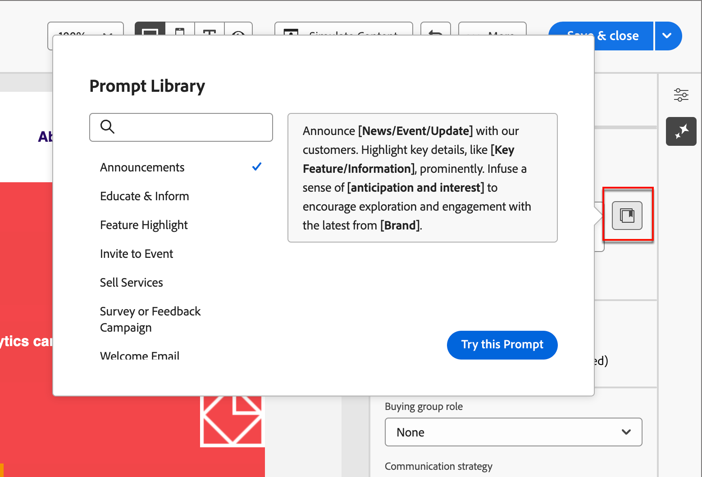
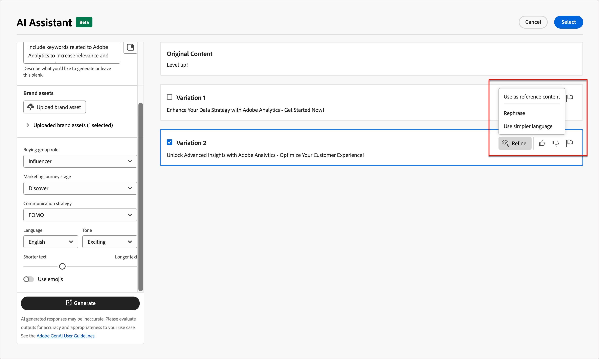
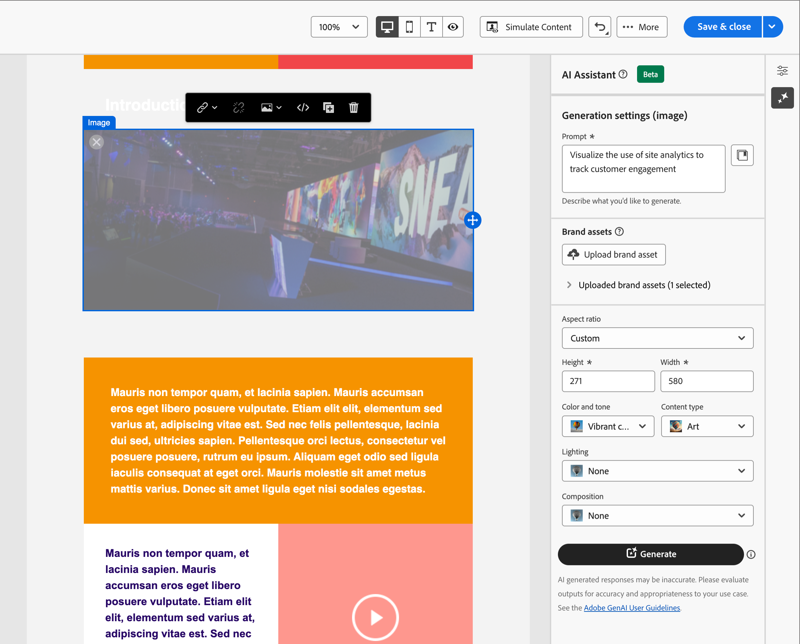

# 電子メールオーサリング用 AI アシスタント

マーケティング業界の競争力が高まるにつれ、ブランドは効果的なコンテンツを迅速かつ効率的に生成する効率的な方法を模索しています。 Adobe Journey Optimizer B2B Edition のメールオーサリング用 AI アシスタントは、Adobeの AI を活用したコンテンツ生成機能で、マーケターがプロフェッショナルでブランドに一貫したメールコンテンツを作成する方法に革命を起こしています。 高度な GenAI モデルとブランドガイドラインの深い理解により、AI アシスタントは、ブランドの概要を示したスタイル、レイアウト、トーンなどに最適化されたコンテンツを使用して、マーケティング目的に基づいてパーソナライズされた魅力的で効果的なコンテンツを自動生成します。 AI アシスタントを使用すると、メールマーケティングキャンペーンの作成と実行が直感的でシンプルかつ手間のかからない方法で行えます。 この機能をワークフローに追加すると、時間を節約し、効率を向上させ、より良い結果を導くことができます。

この新しい機能は、プロンプトベースのテキスト生成、完全なメール生成およびメール構造内のコンテンツ生成を提供します。 画像は生成されませんが、入力ブランドアセット内の画像のカタログ内からモデルに対して推奨されます。 また、この機能を使用して、開封率に影響を与える最適な件名とプリヘッダーを生成することもできます。

>[!NOTE]
>
>この機能は、Beta版で利用でき、予告なく変更される場合があります。

## ガイドラインと制限事項

メールコンテンツ作成用のAdobe Journey Optimizer B2B Edition の AI アシスタントの使用を開始する前に、次のガイドラインを確認してください。

* 定義するマーケティング目的/プロンプトは、生成されるコンテンツの品質を決定する重要な要素です。 GenAI モデルを正確に解釈するには、明確に定義されたプロンプトを使用します。
* 正確な情報を得るには、ブランドコンテンツでブランドアセットをアップロードしてください。 これらのアセットがない場合、コンテンツは、公開されている情報に基づいています。
   * アップロードできるアセットの形式は、PDF、JPEG、PNG、ZIP ファイル（サポートされているファイル形式を含む）のいずれかです。
   * アップロードされるブランドアセットの最大サイズは 50 MB です。 ファイルのサイズが大きい場合や大量の画像を使用する場合は動作しますが、処理時間が長くなります。
* Adobe Journey Optimizer B2B Edition で作成したメールテンプレート（できれば組み込みまたはサンプルテンプレート、ブランド固有のテンプレート、カスタムテンプレートなど）を使用して、メールコンテンツを作成します。 最大 8～10 個の画像を含むメールテンプレートを使用することをお勧めします。
* 生成されたバリアントに対して、サムダウンアイコンまたはフラグアイコンを使用して、問題のある出力を報告してください。
* AI アシスタントの使用は、[Adobe生成 AI ユーザーガイドライン ](https://www.adobe.com/jp/legal/licenses-terms/adobe-gen-ai-user-guidelines.html) の対象となります。

メールコンテンツ生成用のAdobe Journey Optimizer B2B Edition の AI Assistant には、次の制限が適用されます。

* サポートされている言語は英語のみです。
* メールチャネルでのみ使用できます。
* GenAI のコンテンツは正確でない可能性があります。フィードバックを共有して、Adobeエンジニアがモデルを調整できるようにします。
* 複数のブランドアセットをアップロードできますが、特定の世代に利用できるのは 1 つのみです。

>[!BEGINSHADEBOX]

## プロンプトライブラリ

可能な限り最高のコンテンツを生成するには、効果的なプロンプトが不可欠です。 プロンプトの作成に関する支援が必要な場合は、_プロンプトライブラリ_ にアクセスします。 このライブラリは、コンテンツ生成を改善するための様々な迅速なアイデアを提供します。

{width="500" zoomable="no"}

意図した目標を最もよく反映するプロンプトを選択し、ブランド、オファー、キャンペーン、ユースケースを指定する必要な値を追加します。

>[!ENDSHADEBOX]

## 購買グループの役割

Adobe Journey Optimizer B2B Edition には、5 つの標準の B2B 購入グループロールが標準で用意されています。 各購入グループの役割には、明確なメッセージの焦点があります。

| ロール | メッセージングの焦点 |
| ---- | --------------- |
| 幹部運営委員会 | 製品情報   価格   技術統合の詳細   製品の特長と機能 |
| インフルエンサー | 品質実証   導入の容易さ   特定分野の専門知識   競争優位性 |
| 意思決定者 | ROI  財務価値（RoI））   お客様の事例 |
| 実務担当者 | 使いやすさ   製品の特長および機能   製品の互換性   製品の統合が容易 |
| チャンピオン | 教育コンテンツ   ソートリーダーシップコンテンツ   顧客事例 |

これらの購買グループの役割の 1 つを選択すると、これらの役割の特性と関心のあるトピックに基づいて、出力が自動的にカスタマイズされます。

## AI アシスタントでメールプロパティを生成

アカウントジャーニーに [ メールアクションを追加 ](./email-authoring.md#add-an-email-action-in-an-account-journey) する場合、メールの送信に使用する一連のメールプロパティを定義します。 AI アシスタントは、メール **件名** および **プリヘッダー** の推奨コンテンツを生成することで、メールのエンゲージメントを向上させるのに役立ちます。

1. アカウントジャーニーからメールを作成するか、ジャーニーノードから既存のメールを開きます。

   メールのプレビューページが表示され、右側に _[!UICONTROL メールのプロパティ]_ が表示されます。

1. メールプロパティのオーサリングで AI アシスタントを使用する方法については、次のタブのいずれかを選択してください。

>[!BEGINTABS]

>[!TAB  件名の生成 ]

次の手順では、AI アシスタントを使用して最適化された件名をメールに生成するためのタスクシーケンスを説明します。

1. _[!UICONTROL メールのプロパティ]_ で、「**[!UICONTROL 件名]**」フィールドの右側にある AI アシスタントアイコン（{width="30" zoomable="no"}）をクリックします。

   {width="600" zoomable="yes"}

   AI アシスタントのポップアップが開き、メールの件名の生成設定が表示されます。

   メールに関連付けられているメールコンテンツや、目的に合わせて件名を使用する方法に応じて、件名のテキストを生成するオプションがいくつかあります。

   * プロンプトやブランドアセットを表示せずに **[!UICONTROL 生成]** を直ちにクリックすると、既存のメール本文を件名行の生成のコンテキストとして使用できます。

   * （推奨）プロンプト、ブランドアセット、その他の設定値を指定して、ニーズに最も最適な件名テキストを生成するためのコンテキストを提供できます。 （手順 2～7）

1. **[!UICONTROL プロンプト]** フィールドに、生成対象の説明を入力します。

   効果的なプロンプトの作成に関するヘルプが必要な場合は、[ プロンプトライブラリ ](#prompt-library) を使用します。

1. テキスト生成用のソースとして機能するコンテンツを含むブランドアセットを指定します。

   * カタログからアセットを選択します

   * **[!UICONTROL ブランドアセットをアップロード]** をクリックして、ブランドアセットファイルを追加します。

   {width="600" zoomable="yes"}

1. 必要に応じてスクロールし、**[!UICONTROL 購入グループの役割]** を選択して、生成されたテキストのターゲットオーディエンスとして使用します。

1. 必要に応じて、メッセージオプションを使用してコンテンツをカスタマイズします。

   * **[!UICONTROL コミュニケーション戦略]** – 生成テキストに最適なコミュニケーションスタイルを選択します。
   * **[!UICONTROL 言語]** - コンテンツを生成する言語を選択します。
   * **[!UICONTROL トーン]** - オーディエンスの共感を得られるトーンを選択します。 情報を提供する、遊び心を持つ、または説得力を持って聞こえるように指定した場合、AI アシスタントはメッセージを適切に適応させることができます。

1. 必要に応じて、スライダーを使用して、生成するテキストの長さを設定します。

1. 必要に応じて「**[!UICONTROL 絵文字を使用]**」オプションをオンまたはオフに変更します。

1. プロンプトと設定の準備ができたら、「**[!UICONTROL 生成]**」をクリックします。

1. AI アシスタント パネルをスクロールし、生成されたバリエーションを参照して、どれが最適かを判断します。

   * **[!UICONTROL プレビュー]** をクリックして、選択したバリエーションのフルスクリーンバージョンを表示します。

   * _サムズアップ_、_サムズダウン_、または _フラグ_ アイコンをクリックして、生成されたバリアントに関するフィードバックを提供し、フィードバックを最もよく要約する理由を選択します。

1. プレビューウィンドウ内の _絞り込み_ オプションに移動して、追加のカスタマイズ機能にアクセスします。

   * **[!UICONTROL 参照コンテンツとして使用]** – 他の結果を生成するための参照コンテンツとしてバリアントを使用するには、このオプションを選択します。

   * **[!UICONTROL フレーズ変更]** - AI アシスタントは、さまざまな方法でメッセージをフレーズ変更できるので、多様なオーディエンスにとって魅力的で斬新な文章を維持できます。

   * **[!UICONTROL よりシンプルな言語の使用]** - AI アシスタントを活用して言語を簡素化し、より幅広いオーディエンスに対して明確さとアクセシビリティを確保します。

   {width="600" zoomable="yes"}

1. 「**[!UICONTROL 選択]**」をクリックして、件名行のテキストを選択したバリアントに置き換え、メールのプロパティに戻ります。

>[!TAB  プリヘッダーの生成 ]

メールのプリヘッダーは、インボックスでメールが表示された際に件名の後に表示される短い概要テキストです。 これはメールのオプション要素ですが、エンゲージメントを向上させる絶好の機会です。 次の手順では、AI アシスタントを使用してメールに最適化されたプリヘッダーを生成するためのタスクシーケンスを説明します。

1. メールのプロパティで、「**[!UICONTROL プリヘッダー]**」チェックボックスを選択し、右側の AI アシスタント アイコン（{width="30" zoomable="no"}）をクリックします。

   {width="600" zoomable="yes"}

   AI アシスタントのポップアップが開き、メールのプリヘッダーの生成設定が表示されます。

   メールに関連付けられているメールコンテンツやメールのターゲット方法に応じて、プリヘッダーを生成するオプションがいくつか用意されています。

   * プロンプトやブランドアセットを表示せずに **[!UICONTROL 生成]** を直ちにクリックして、既存のメール本文をプリヘッダー生成のコンテキストとして使用できます。

   * （推奨）プロンプト、ブランドアセット、その他の設定値を指定して、ニーズに合わせて最適なプリヘッダーを生成するためのコンテキストを提供できます。 （手順 2～7）

1. **[!UICONTROL プロンプト]** フィールドに、生成対象の説明を入力します。

   効果的なプロンプトの作成に関するヘルプが必要な場合は、[ プロンプトライブラリ ](#prompt-library) を使用します。

1. テキスト生成用のソースとして機能するコンテンツを含むブランドアセットを指定します。

   * カタログからアセットを選択します

   * **[!UICONTROL ブランドアセットをアップロード]** をクリックして、ブランドアセットファイルを追加します。

   {width="600" zoomable="yes"}

1. 必要に応じてスクロールし、**[!UICONTROL 購入グループの役割]** を選択して、生成されたテキストのターゲットオーディエンスとして使用します。

1. 必要に応じて、メッセージオプションを使用してコンテンツをカスタマイズします。

   * **[!UICONTROL コミュニケーション戦略]** – 生成テキストに最適なコミュニケーションスタイルを選択します。
   * **[!UICONTROL 言語]** - コンテンツを生成する言語を選択します。
   * **[!UICONTROL トーン]** - オーディエンスの共感を得られるトーンを選択します。 情報を提供する、遊び心を持つ、または説得力を持って聞こえるように指定した場合、AI アシスタントはメッセージを適切に適応させることができます。

1. 必要に応じて、スライダーを使用して、生成するテキストの長さを設定します。

1. 必要に応じて「**[!UICONTROL 絵文字を使用]**」オプションをオンまたはオフに変更します。

1. プロンプトと設定の準備ができたら、「**[!UICONTROL 生成]**」をクリックします。

1. AI アシスタント パネルをスクロールし、生成されたバリエーションを参照して、どれが最適かを判断します。

   * **[!UICONTROL プレビュー]** をクリックして、選択したバリエーションのフルスクリーンバージョンを表示します。

   * _サムズアップ_、_サムズダウン_、または _フラグ_ アイコンをクリックして、生成されたバリアントに関するフィードバックを提供し、フィードバックを最もよく要約する理由を選択します。

1. プレビューウィンドウ内の _絞り込み_ オプションに移動して、追加のカスタマイズ機能にアクセスします。

   * **[!UICONTROL 参照コンテンツとして使用]** – 他の結果を生成するための参照コンテンツとしてバリアントを使用するには、このオプションを選択します。

   * **[!UICONTROL フレーズ変更]** - AI アシスタントは、さまざまな方法でメッセージをフレーズ変更できるので、多様なオーディエンスにとって魅力的で斬新な文章を維持できます。

   * **[!UICONTROL よりシンプルな言語の使用]** - AI アシスタントを活用して言語を簡素化し、より幅広いオーディエンスに対して明確さとアクセシビリティを確保します。

   {width="600" zoomable="yes"}

1. 「**[!UICONTROL 選択]**」をクリックして、プリヘッダーを選択したバリアントに置き換え、メールのプロパティに戻ります。

>[!ENDTABS]

## AI アシスタントでのメール本文コンテンツの生成

[ メールを作成およびパーソナライズ ](./email-authoring.md#create-the-email-content) した後は、生成 AI を活用したAdobe Journey Optimizer B2B Edition の AI アシスタントを使用して、メール本文のコンテンツを次のレベルに引き上げます。

E メールデザイナーで、AI アシスタントを使用すると、メールの本文すべて、ターゲットテキストコンテンツ、オーディエンスの共感を得られる画像のレコメンデーションを生成することで、配信の影響を最適化できます。 このメールキャンペーンの最適化は、より良いエンゲージメントを生み出すように設計されています。

1. アカウントジャーニーからメールを作成し、**[!UICONTROL メールDesignerを開く]** または **[!UICONTROL メールコンテンツを追加]** をクリックします。

1. ビジュアルメールデザイナーでメールテンプレートを選択して開きます。

1. ジャーニーノードの必要に応じてメールをパーソナライズします。

1. メール本文コンテンツのオーサリングで AI アシスタントを使用する方法については、次のタブのいずれかを選択してください。

>[!BEGINTABS]

>[!TAB 完全なメールの生成]

次の手順では、AI アシスタントを使用して既存の電子メールテンプレートを調整するためのタスクシーケンスを説明します。

1. E メールデザイナーで、右側のアイコン（{width="30" zoomable="no"}）をクリックして、AI アシスタント メニューにアクセスします。

   {width="600" zoomable="yes"}

   右側の AI アシスタントの設定には、_生成設定（完全なメール）_ が反映されています。

1. **[!UICONTROL プロンプト]** フィールドに、生成対象の説明を入力します。

   効果的なプロンプトの作成に関するヘルプが必要な場合は、[ プロンプトライブラリ ](#prompt-library) を使用します。

   {width="600" zoomable="yes"}

1. AI アシスタントの追加コンテキストを提供できるコンテンツを含むブランドアセットを指定します。

   * カタログからアセットを選択します

   * **[!UICONTROL ブランドアセットをアップロード]** をクリックして、ブランドアセットファイルを追加します。

   この入力アセットは、メール内でのコンテンツ生成と画像レコメンデーションのソースとして機能します。

1. メール通信のターゲットオーディエンスとして使用する **[!UICONTROL 購入グループの役割]** を選択します。

1. 必要に応じて、メッセージオプションを使用してコンテンツをカスタマイズします。

   * **[!UICONTROL コミュニケーション戦略]** – 生成テキストに最適なコミュニケーションスタイルを選択します。
   * **[!UICONTROL 言語]** - コンテンツを生成する言語を選択します。
   * **[!UICONTROL トーン]** - オーディエンスの共感を得られるトーンを選択します。 情報を提供する、遊び心を持つ、または説得力を持って聞こえるように指定した場合、AI アシスタントはメッセージを適切に適応させることができます。
   * **コンテンツタイプ** – 視覚要素の特性を反映したオプションを選択します。 この設定により、写真、グラフィック、アートなど、様々な形式の視覚表現が区別されます。

1. プロンプトの準備が整ったら、「**[!UICONTROL 生成]**」をクリックします。

1. AI アシスタント パネルをスクロールし、生成されたバリエーションを参照して、どれが最適かを判断します。

   * **[!UICONTROL プレビュー]** をクリックして、選択したバリエーションのフルスクリーンバージョンを表示します。

   * _サムズアップ_、_サムズダウン_、または _フラグ_ アイコンをクリックして、生成されたバリアントに関するフィードバックを提供し、フィードバックを最もよく要約する理由を選択します。

     {width="600" zoomable="yes"}

1. 「**[!UICONTROL 選択]**」をクリックして、テンプレートのコンテンツを選択したバリアントに置き換え、電子メールデザイナーに戻ります。

   メールデザイナーでは、キャンバスの編集ツールと書式設定ツールを使用して、コンテンツを変更できるほか、右側の _[!UICONTROL 設定]_ および _[!UICONTROL スタイル]_ オプションも使用できます。

>[!TAB  テキストの生成 ]

次の手順では、AI アシスタントを使用して既存の電子メールのテキストコンテンツを調整または拡張するためのタスクシーケンスを説明します。

1. E メールデザイナーで、右側のアイコン（{width="30" zoomable="no"}）をクリックして、AI アシスタント メニューにアクセスします。

   {width="600" zoomable="yes"}

1. 特定のコンテンツをターゲットにする _テキスト_ コンポーネントを選択します。

   右側の AI アシスタントの設定には、_生成設定（テキスト）_ が反映されています。

1. **[!UICONTROL プロンプト]** フィールドに、生成対象の説明を入力します。

   {width="600" zoomable="yes"}

   効果的なプロンプトの作成に関するヘルプが必要な場合は、[ プロンプトライブラリ ](#prompt-library) を使用します。

1. テキスト生成用のソースとして機能するコンテンツを含むブランドアセットを指定します。

   * カタログからアセットを選択します

   * **[!UICONTROL ブランドアセットをアップロード]** をクリックして、ブランドアセットファイルを追加します。

1. 生成されたテキストのターゲットオーディエンスとして使用する **[!UICONTROL 購入グループの役割]** を選択します。

1. 必要に応じて、言語とメッセージのオプションを使用して、コンテンツをカスタマイズします。

   * **[!UICONTROL コミュニケーション戦略]** – 生成テキストに最適なコミュニケーションスタイルを選択します。
   * **[!UICONTROL 言語]** - コンテンツを生成する言語を選択します。
   * **[!UICONTROL トーン]** - オーディエンスの共感を得られるトーンを選択します。 情報を提供する、遊び心を持つ、または説得力を持って聞こえるように指定した場合、AI アシスタントはメッセージを適切に適応させることができます。

1. 必要に応じて、スライダーを使用して、生成するテキストの長さを設定します。

1. プロンプトの準備が整ったら、「**[!UICONTROL 生成]**」をクリックします。

1. 生成された _バリエーション_ を参照し、**[!UICONTROL プレビュー]** をクリックして、選択したバリエーションのフルスクリーンバージョンを表示します。

1. プレビューウィンドウ内の _絞り込み_ オプションに移動して、追加のカスタマイズ機能にアクセスします。

   * **[!UICONTROL 参照コンテンツとして使用]** – 他の結果を生成するための参照コンテンツとしてバリアントを使用するには、このオプションを選択します。

   * **[!UICONTROL 精巧]** - AI アシスタントは、特定のトピックを展開するのに役立ち、理解とエンゲージメントを深めるために追加の詳細を提供します。

   * **[!UICONTROL 要約]** – 情報が長いと、メール受信者が過負荷になる可能性があります。 AI アシスタントを使用して、重要なポイントを明確かつ簡潔な要約に要約し、注意を引いてさらに読むよう促します。

   * **[!UICONTROL フレーズ変更]** - AI アシスタントは、さまざまな方法でメッセージをフレーズ変更できるので、多様なオーディエンスにとって魅力的で斬新な文章を維持できます。

   * **[!UICONTROL よりシンプルな言語の使用]** - AI アシスタントを活用して言語を簡素化し、より幅広いオーディエンスに対して明確さとアクセシビリティを確保します。

   {width="700" zoomable="yes"}

1. 必要なコンテンツが揃ったら、「**[!UICONTROL 選択]**」をクリックして、テキストを選択したバリアントに置き換え、電子メールデザイナーに戻ります。

   メールデザイナーでは、キャンバスの編集ツールと書式設定ツールを使用してテキストを変更でき、右側の _[!UICONTROL 設定]_ オプションと _[!UICONTROL スタイル]_ オプションも使用できます。

>[!TAB  画像の推奨事項 ]

AI アシスタントを使用して、アセットを最適化および改善し、より使いやすいエクスペリエンスを確保できます。 次の手順では、AI アシスタントを使用してメールの画像コンテンツを強化するためのタスクシーケンスを説明します。

1. 右側のアイコン（{width="30" zoomable="no"}）をクリックして、AI アシスタント メニューにアクセスします。

   {width="600" zoomable="yes"}

1. _画像_ コンポーネントを選択して特定のコンテンツをターゲットにし、AI アシスタント メニューにアクセスします。

   右側の設定は _[!UICONTROL 生成設定（画像）]_ を反映しています。

1. アセットを微調整するには、必要な説明を「**[!UICONTROL プロンプト]**」フィールドに入力します。

   {width="600" zoomable="yes"}

   効果的なプロンプトの作成に関するヘルプが必要な場合は、[ プロンプトライブラリ ](#prompt-library) を使用します。

1. **[!UICONTROL ブランドアセットをアップロード]** をクリックして、AI アシスタントの追加コンテキストを提供できるコンテンツを含むブランドアセットを追加します。

   必要なアセットが既に使用可能な場合は、「**[!UICONTROL アップロードされたブランドアセット]**」を展開し、アセットを選択します。

   プロンプトは、常に既存のアセットに関連付ける必要があります。

1. 画像設定を使用してプロンプトを絞り込みます。

   * **[!UICONTROL 縦横比]** – この設定によって、アセットの幅と高さが決まります。 16:9、4:3、3:2、1:1 などの一般的な比率から選択することも、カスタムサイズを入力することもできます。
   * **[!UICONTROL カラーとトーン]** – この設定は、画像内の色の全体的な外観や、伝えるムードや雰囲気に影響を与えます。
   * **[!UICONTROL コンテンツタイプ]** – この設定は、視覚的要素の性質を分類し、写真、グラフィック、アートなど、視覚的表現の様々な形式を区別します。
   * **[!UICONTROL 照明]** – この設定では、イメージ内に存在する稲妻を調整します。この稲妻によって雰囲気が形作られ、特定の要素がハイライトされます。
   * **[!UICONTROL 構成]** – この設定によって、画像のフレーム内の要素の配置が決まります。

1. プロンプトの設定に満足したら、「**[!UICONTROL 生成]**」をクリックします。

   AI アシスタントが要求を処理し、入力ブランドアセット内から、プロンプトやその他の入力に基づいて、最適な画像を推奨します。

   >[!IMPORTANT]
   >
   >入力ブランドアセットに画像がない場合や、入力プロンプトに関連する画像がない場合、出力は空になります。

1. _[!UICONTROL バリエーション]_ を参照して、メールに最適なものを選択します。

   選択したバリエーションの全画面表示バージョンを表示するには、「**[!UICONTROL プレビュー]**」をクリックします。

1. 目的の画像をハイライト表示し、「**[!UICONTROL 選択]**」をクリックして、画像またはプレースホルダーを選択した項目に置き換えて、電子メールデザイナーに戻ります。

   メールデザイナーでは、キャンバスの編集ツールと書式設定ツールを使用して、コンテンツを変更できるほか、右側の _[!UICONTROL 設定]_ および _[!UICONTROL スタイル]_ オプションも使用できます。

>[!ENDTABS]
