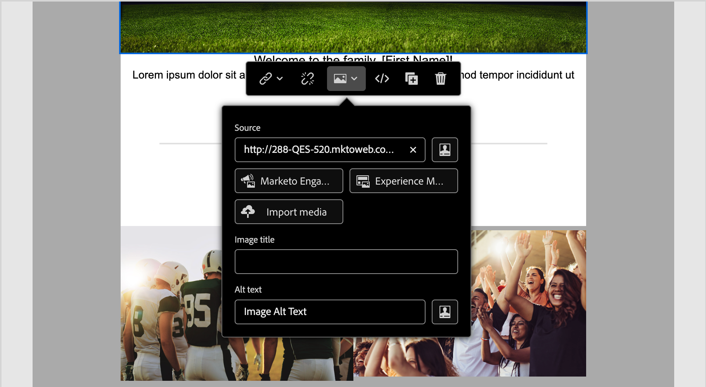

# アセット

Adobe Journey Optimizer B2B Edition では、アセットは通常、アカウントジャーニーをサポートするコンテンツを設計する際に使用される画像です。これらの画像は、アセットセレクターや、ビジュアルコンテンツエディター内のシンプルなドラッグ＆ドロップインターフェイスを通じて、メール、メールテンプレート、フラグメント内で使用できます。

Adobe Journey Optimizer B2B Edition では、マーケターは Adobe Marketo Engage Design Studio と Adobe Experience Manager Assets as a Cloud Service の 2 つのタイプのアセットライブラリにアクセスできます。Adobe Marketo Engage Design Studio のみを使用することも、両方のライブラリを同時に設定して使用することもできます（お使いの AEM Assets ライセンスに基づきます）。

## アセット管理

Adobe Experience Manager as a Cloud Services を使用してプロビジョニングされている場合、ユーザーアカウントに必要な権限があれば、Marketo Engage Design Studio と Adobe Experience Manager Assets as a Cloud Service の両方のリポジトリにアクセスできます。これらのリポジトリは個別に存在し、同期していません。どちらのソースからも画像を使用できます。

### Adobe Marketo Engage アセット

Adobe Marketo Engage Design Studio アセットリポジトリは、すべての Journey Optimizer B2B Edition サブスクリプションにデフォルトで提供されます。つまり、Adobe Marketo Engage（[!UICONTROL Design Studio]／[!UICONTROL 画像とファイル]）に保存されている任意の画像アセットにアクセスできます。このリポジトリは、アセットのアップロードやダウンロード機能を含むローカルアセットライブラリとして使用できます。また、これらのアセットをジャーニーコンテンツ内で使用することもできます。

Journey Optimizer B2B Edition からの Marketo Engage アセットの編集、削除、移動操作を防ぐガードレールが組み込まれています。これらの保護により、ソースアセット（Marketo Engage Design Studio）が維持され、Journey Optimizer B2B Edition でシームレスな読み取りと再利用が可能になります。

サポートされているファイル形式：JPG、JPEG、GIF、PNG、EPS、SVG、RGB

### Adobe Experience Manager Assets as a Cloud Service

Adobe Experience Manager Assets を使用して、マーケティングとクリエイティブのワークフローを統合します。Adobe Journey Optimizer B2B Edition とネイティブに統合されているので、Assets as a Cloud Service に簡単にアクセスして、デジタルアセットを検出および使用できます。メッセージの入力に使用できるアセットの Assets リポジトリへのアクセスを提供します。

Adobe Journey Optimizer B2B Edition は、Adobe Experience Manager Assets as a Cloud Service に接続して、クリエイティブシステムを拡張し、エクスペリエンス配信にデジタルアセットを統合する一元的なアセット管理を行うことができます。Adobe Experience Manager Assets as a Cloud Service は、効率的なデジタルアセット管理と Dynamic Media 操作の使いやすいクラウドソリューションを提供します。人工知能や機械学習などの高度な機能がシームレスに組み込まれています。

詳しくは、[Adobe Experience Manager Assets as a Cloud Service ドキュメント](https://experienceleague.adobe.com/ja/docs/experience-manager-cloud-service/content/assets/overview)を参照してください。

{{aem-assets-licensing-note}}

コンテンツデザインの左側のナビゲーションにある **[!UICONTROL Experience Manager Assets]** 項目から、Journey Optimizer B2B Edition 内で Adobe Experience Manager Assets に直接アクセスします。また、メール、メールテンプレート、ビジュアルフラグメントコンテンツを設計する際に、アセットとフォルダーにアクセスすることもできます。

現在、Adobe Journey Optimizer B2B Edition では、Adobe Experience Manager Assets の画像のみを使用できます。

## コンテンツオーサリングへのアセットの使用

メール、メールテンプレート、ビジュアルフラグメントを作成する際にアセットを使用します。ビジュアルコンテンツエディターを使用すると、接続されたアセットリポジトリ内の画像にアクセスできます。デフォルトの Adobe Marketo Engage Design Studio ト共に Experience Manager Assets as a Cloud Service のサブスクリプションを使用している場合は、どちらのソースからでも画像アセットを選択できます。また、画像アセットをアップロードして、接続された Marketo Engage Design Studio リポジトリの Journey Optimizer B2B Edition ワークスペースに配置することもできます。

画像コンポーネントの設定を編集する際や、キャンバス上で直接、画像ソースを選択できます。

* **_画像コンポーネントの設定_** - ビジュアルデザイナーで画像コンポーネントを選択すると、右側のパネルで設定を表示および編集できます。コンポーネントに表示される画像ファイルを追加または変更するには、ソースタイプを選択し、画像ファイルを選択します。

  {width="350"}

* **_空のコンポーネント_** - ビジュアルデザイナーで画像コンポーネントを追加すると、そのコンポーネントは空になり、ソースを選択して画像ファイルを選択するアクセスが簡単になります。

  {width="500"}

* **_画像コンポーネントツールバー_** - ビジュアルデザイナーで画像コンポーネントを選択すると、ツールバーにより、ソースを選択して画像ファイルを選択するアクセスが簡単になります。

  {width="500"}

画像アセットのソースに応じて、コンテンツを作成する際に画像アセットを追加できます。

>[!BEGINTABS]

>[!TAB Marketo Engage アセット]

「**[!UICONTROL Marketo Engage アセット]**」をクリックするとアセットセレクターが開き、Marketo Engage ワークスペースまたは Journey Optimizer B2B Edition ワークスペースから画像を選択できます。

{width="700" zoomable="yes"}

検索とフィルターを使用して、目的の画像アセットを見つけることができます。アセットを選択し、「**[!UICONTROL 選択]**」をクリックして、画像コンポーネントに使用します。

Marketo Engage 画像アセットの使用について詳しくは、[コンテンツでのアセットの使用](./marketo-engage-design-studio.md#use-assets-in-your-content)を参照してください。

>[!TAB Experience Manager Assets]

「**[!UICONTROL Experience Manager Assets]**」をクリックするとアセットセレクターが開き、Experience Manage Assets リポジトリから画像を選択できます。

{width="700" zoomable="yes"}

検索とフィルターを使用して、目的の画像アセットを見つけることができます。アセットを選択し、「**[!UICONTROL 選択]**」をクリックして、画像コンポーネントに使用します。

Experience Manager Assets の画像ファイルの使用について詳しくは、[AEM Assets 画像へのアクセス](./aem-assets.md#access-aem-assets-images)を参照してください。

>[!TAB メディアを読み込み]

「**[!UICONTROL メディアを読み込み]**」をクリックして画像ファイルを選択し、Journey Optimizer B2B Edition コンテンツに使用できるアセットとして読み込みます。

{width="500" zoomable="yes"}

ファイルをドラッグ＆ドロップするか、ファイルシステムから選択したら、「**[!UICONTROL 読み込み]**」をクリックします。読み込まれたアセットは、Adobe Marketo Engage Design Studio リポジトリの Journey Optimizer B2B Edition ワークスペース内に格納されます。

>[!ENDTABS]
