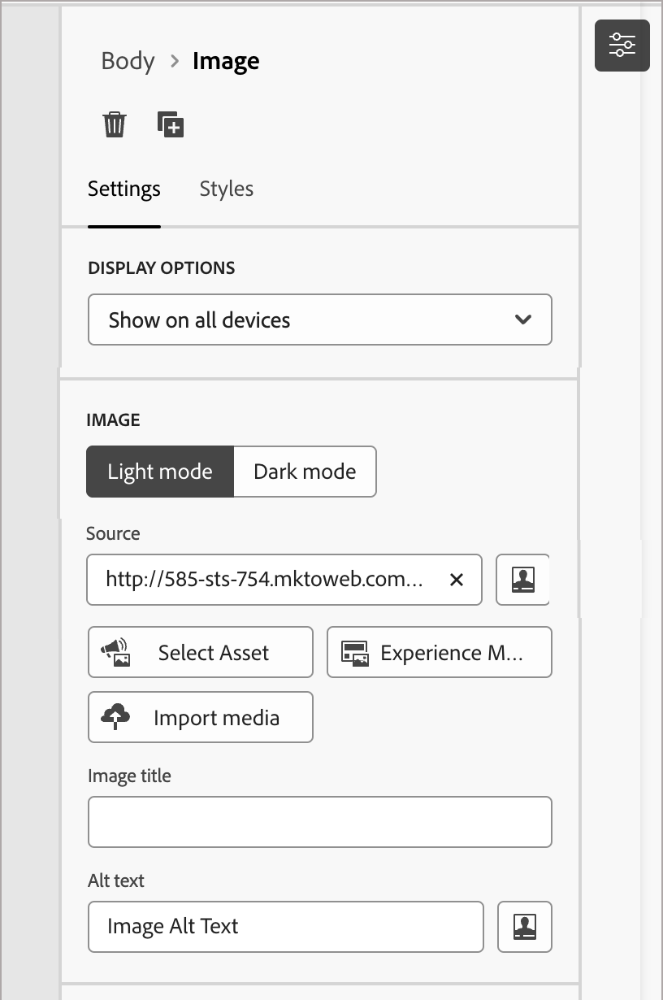
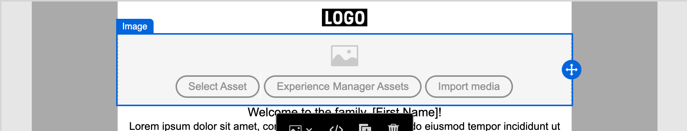
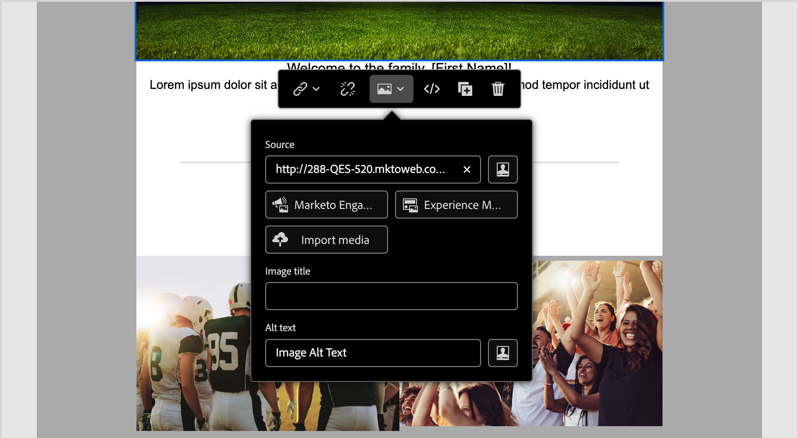
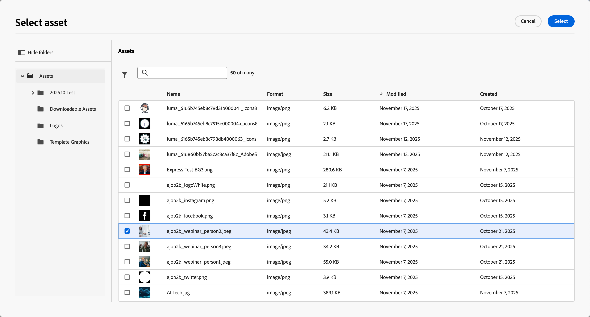
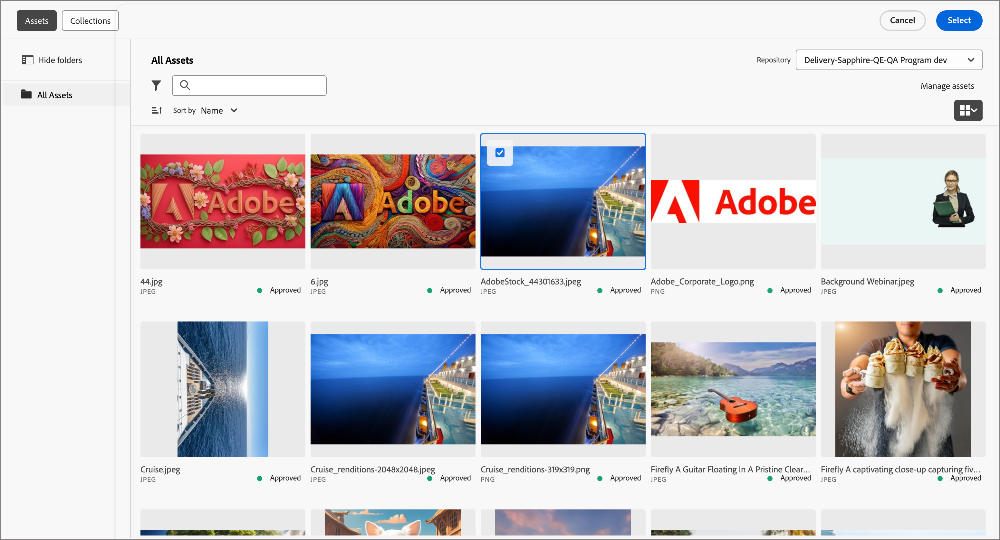
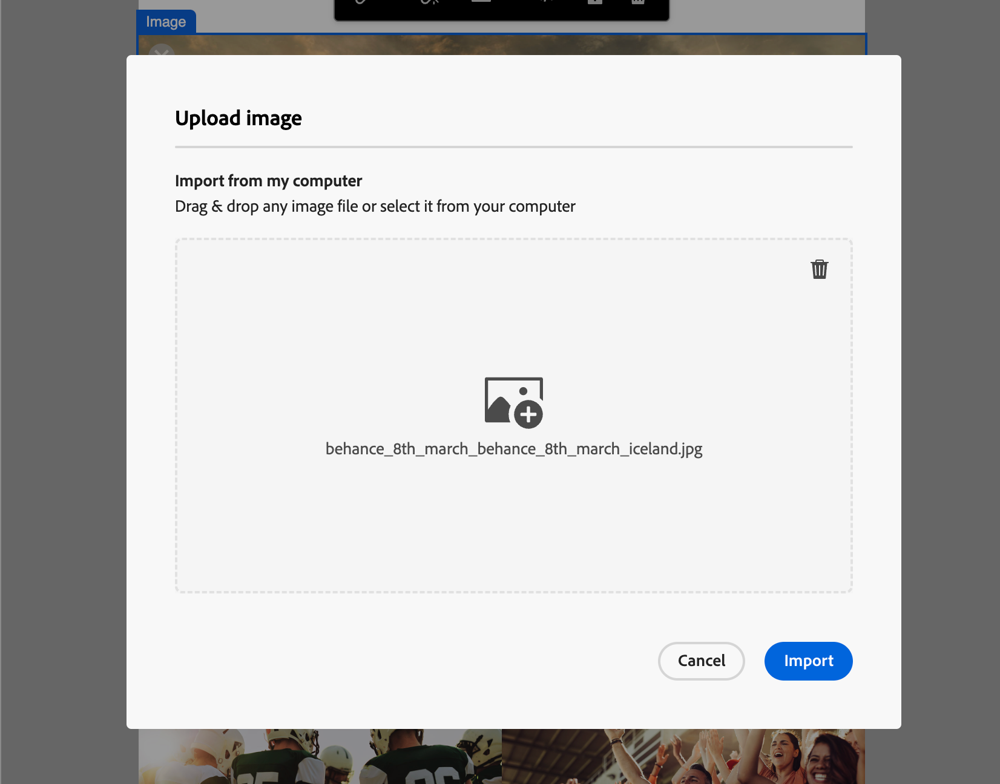

# アセット

[!DNL Adobe Journey Optimizer B2B Edition] では、アセットは通常、アカウントジャーニーをサポートするコンテンツを設計する際に使用される画像です。 これらの画像は、メール、メールテンプレート、アセットセレクターのフラグメント、またはビジュアルデザイン空間でのシンプルなドラッグ&amp;ドロップインターフェイスで使用できます。

[!DNL Journey Optimizer B2B Edition]では、デザイナーとマーケターは、内部[!DNL Journey Optimizer B2B Edition] アセットリポジトリと[!DNL Adobe Experience Manager Assets as a Cloud Service]の2種類のアセットライブラリにアクセスできます。 組み込みリポジトリのみを使用するか、両方のライブラリタイプを同時に使用できます（使用している[!DNL Experience Manager Assets] ライセンスに基づいて）。

## アセット管理

[!DNL Adobe Experience Manager as a Cloud Services]でプロビジョニングされ、[!DNL Journey Optimizer B2B Edition]でアセットソースとして設定されている場合、ユーザーアカウントに必要な権限がある場合、両方のリポジトリタイプにアクセスできます。 これらのリポジトリは個別に存在し、同期していません。 どちらのソースからも画像を使用できます。

### 内部アセット

内部アセットリポジトリは、デフォルトで[!DNL Journey Optimizer B2B Edition] サブスクリプションごとに提供されます。 つまり、接続された[!DNL Adobe Marketo Engage] アセット ファイル システムに保存されているいずれかの画像アセットにアクセスできます。 このリポジトリは、アセットのアップロードやダウンロード機能を含むローカルアセットライブラリとして使用できます。 また、これらのアセットをジャーニーコンテンツ内で使用することもできます。

Adobe Express](./image-edit-adobe-express.md)を使用してこれらのアセットを[編集し、フォルダーに移動して、電子メール、テンプレート、フラグメントで使用できるようにアセットを整理できます。

サポートされているファイル形式：JPG、JPEG、GIF、PNG、EPS、SVG、RGB

### Adobe Experience Manager Assets as a Cloud Service

[!DNL Adobe Experience Manager Assets] を使用してマーケティングワークフローとクリエイティブワークフローを統合します。 [!DNL Journey Optimizer B2B Edition] とネイティブに統合されているので、Assets as a Cloud Service に簡単にアクセスして、デジタルアセットを検出および使用できます。 メッセージの入力に使用できるアセットの Assets リポジトリへのアクセスを提供します。

[!DNL Adobe Journey Optimizer B2B Edition] は、[!DNL Adobe Experience Manager Assets as a Cloud Service] に接続して、クリエイティブシステムを拡張し、エクスペリエンス配信にデジタルアセットを統合する一元的なアセット管理を行うことができます。 [!DNL Adobe Experience Manager Assets as a Cloud Service] は、効率的なデジタルアセット管理と Dynamic Media 操作の使いやすいクラウドソリューションを提供します。 人工知能や機械学習などの高度な機能がシームレスに組み込まれています。

詳しくは、[Adobe Experience Manager Assets as a Cloud Service ドキュメント](https://experienceleague.adobe.com/ja/docs/experience-manager-cloud-service/content/assets/overview){target="_blank"}を参照してください。

{{aem-assets-licensing-note}}

コンテンツデザインの左側のナビゲーションにある **[!UICONTROL Experience Manager Assets]** 項目から、[!DNL Journey Optimizer B2B Edition] 内で [!DNL Adobe Experience Manager Assets] に直接アクセスします。 また、メール、メールテンプレート、ビジュアルフラグメントコンテンツを設計する際に、アセットとフォルダーにアクセスすることもできます。

現在、Adobe Journey Optimizer B2B Edition では、Adobe Experience Manager Assets の画像のみを使用できます。

## コンテンツオーサリングへのアセットの使用

メール、メールテンプレート、ビジュアルフラグメントを作成する際にアセットを使用します。 ビジュアルコンテンツエディターを使用すると、接続されたアセットリポジトリ内の画像にアクセスできます。 Experience Manager Assets as a Cloud Serviceのサブスクリプションをお持ちの場合は、いずれかのソースから画像アセットを選択できます。 画像アセットをアップロードして、内部アセットリポジトリに配置することもできます。

画像コンポーネントの設定を編集する際や、キャンバス上で直接、画像ソースを選択できます。

* **_画像コンポーネント設定_** - キャンバスで画像コンポーネントを選択している場合、右側のパネルで設定を表示および編集できます。 コンポーネントに表示される画像ファイルを追加または変更するには、ソースタイプを選択し、画像ファイルを選択します。

  {width="350"}

* **_空のコンポーネント_** - キャンバスに画像コンポーネントを追加すると、そのコンポーネントは空になり、ソースを選択して画像ファイルを選択するための簡単なアクセスが提供されます。

  {width="500"}

* **_画像コンポーネントツールバー_** - キャンバスで画像コンポーネントを選択している場合、ツールバーから簡単にソースを選択して画像ファイルを選択できます。

  {width="500"}

画像アセットのソースに応じて、コンテンツを作成する際に画像アセットを追加できます。 また、構造コンポーネントの背景設定で画像アセットを選択することもできます。

>[!BEGINTABS]

>[!TAB  アセットを選択]

「**[!UICONTROL アセットを選択]**」をクリックしてアセットセレクターを開き、Journey Optimizer B2B edition アセットリポジトリから画像を選択できます。

{width="700" zoomable="yes"}

検索とフィルターを使用して、目的の画像アセットを見つけることができます。 アセットを選択し、「**[!UICONTROL 選択]**」をクリックして、画像コンポーネントに使用します。

内部画像アセットの使用について詳しくは、[ コンテンツでアセットを使用する](./internal-image-assets.md#use-assets-in-your-content)を参照してください。

>[!TAB Experience Manager Assets]

「**[!UICONTROL Experience Manager Assets]**」をクリックするとアセットセレクターが開き、Experience Manage Assets リポジトリから画像を選択できます。

{width="700" zoomable="yes"}

検索とフィルターを使用して、目的の画像アセットを見つけることができます。 アセットを選択し、「**[!UICONTROL 選択]**」をクリックして、画像コンポーネントに使用します。

[!DNL Experience Manager Assets] の画像ファイルの使用について詳しくは、[AEM Assets 画像へのアクセス](./aem-assets.md#access-aem-assets-images)を参照してください。

>[!TAB メディアを読み込み]

「**[!UICONTROL メディアを読み込み]**」をクリックして画像ファイルを選択し、Journey Optimizer B2B Edition コンテンツに使用できるアセットとして読み込みます。

{width="450" zoomable="yes"}

ファイルをドラッグ＆ドロップするか、ファイルシステムから選択したら、「**[!UICONTROL 読み込み]**」をクリックします。 読み込まれたアセットは、[!DNL Journey Optimizer B2B Edition] アセットリポジトリ内に保存されます。

>[!ENDTABS]
