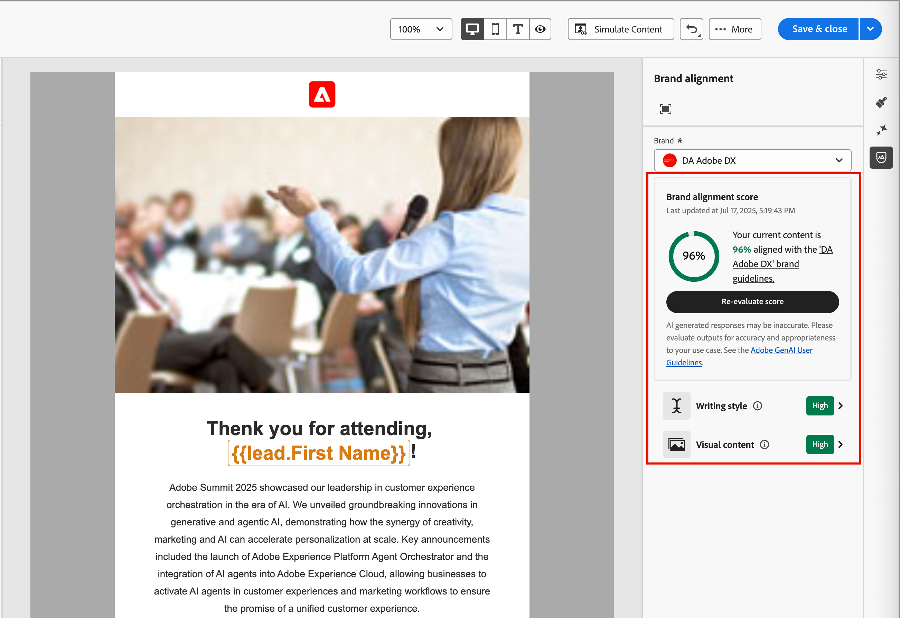

# ブランド整合性スコア付け {#brand-score}

>[!CONTEXTUALHELP]
>id="ajo-b2b_brand_score_overview"
>title="ブランドの選択"
>abstract="ブランドを選択して、一貫性とブランドの整合性を維持しながら、コンテンツが特定のガイドライン、標準、アイデンティティに合わせて作成されるようにします。"

>[!CONTEXTUALHELP]
>id="ajo-b2b_brand_score"
>title="ブランド整合性スコア"
>abstract="ブランド整合性スコアは、コンテンツがブランドのガイドラインにどのくらい良く準拠しているかを測定し、色、フォント、ロゴ、画像、文体の一貫性を確保します。"

>[!CONTEXTUALHELP]
>id="ajo-b2b_brand_colors"
>title="色のスコア"
>abstract="色のスコア"

>[!CONTEXTUALHELP]
>id="ajo-b2b_brand_fonts"
>title="フォントのスコア"
>abstract="フォントのスコア"

>[!CONTEXTUALHELP]
>id="ajo-b2b_brand_logos"
>title="ロゴのスコア"
>abstract="ロゴのスコア"

ブランドの整合性評価およびスコアは、（選択されたブランドで定義された [ ガイドラインに準拠するコンテンツの作成、レビューおよび管理に役立ち ](./brands-manage-create.md#brand-definitions) す。 この機能を使用すると、メールキャンペーン全体のトーン、メッセージ、ビジュアルアイデンティティの一貫性を確保するだけでなく、コンテンツ公開前に品質チェックを行うことができます。

>[!AVAILABILITY]
>
>この機能は現在、プライベートベータ版として利用でき、今後のリリースですべてのお客様に段階的に提供される予定です。
>
>Adobe Journey Optimizer B2B editionで AI を利用した機能を使用するには、[ ユーザー使用許諾契約 ](https://www.adobe.com/legal/licenses-terms/adobe-dx-gen-ai-user-guidelines.html){target="_blank"} が必要です。 詳しくは、アドビ担当者にお問い合わせください。
>
>製品管理者がこれらの機能を有効にする方法については、[ ブランド関連の権限 ](./brands-overview.md#brand-related-permissions) を参照してください。

## ブランドの整合性の検証

ブランドを適切に定義して公開したら、メールデザイン空間内でブランドの整合性スコアを直接評価して、コンテンツがブランドガイドラインに従っていることを確認します。

1. メールコンテンツを作成したら、右側の _ブランド調整_ （）アイコンをクリックして、メールデザインスペースの _ブランド調整_ 右側のパネルを開きます。

   [ デフォルトブランド ](./brands-manage-create.md#default-brand) が自動的に選択されます。

   {width="600" zoomable="yes"}

   パネルの上部にある「_フルスクリーン_」（）アイコンをクリックすると、ブランド調整ツールがフルスクリーンモードで表示されます。

1. 必要に応じて、「**[!UICONTROL ブランド]**」メニュー矢印 ）をクリックして、別の公開済みブランドを選択します。

1. **[!UICONTROL スコアを評価]** をクリックして、選択したブランドに対するコンテンツの整合性にスコアを付けます。

   選択したブランドのガイドラインに対してコンテンツが評価され、結果のスコアが表示されます。

   {width="600" zoomable="yes"}

## 評価のレビュー

スコアは、評価されたメールコンテンツで識別された違反に従って計算されます。

* 100 = Perfect – 違反が見つかりません
* 80-99 =良好 – 軽微な違反のみ
* 60～79 =公正 – 一部の重大な違反
* 60 未満=悪い – 重大な違反には注意が必要

評価結果をより詳細に確認すると、違反を特定し、カテゴリの整合性スコア（_高_、_Medium_、低 __ を向上させ、詳細を確認するのに役立ちます。 **[!UICONTROL 手書きスタイル]** または **[!UICONTROL ビジュアルコンテンツ]** の場合は、_展開_ （）矢印をクリックして、評価の詳細を表示します。

{width="600" zoomable="yes"}

フラグ付けされたガイドラインを選択して、特定のフィードバックと提案を表示します。

コンテンツに変更を加え、「**[!UICONTROL スコアを再評価]**」をクリックして別の評価を実行し、改善された結果を確認できます。
