# メールコンテンツへのブランドテーマの使用 {#email-brand-themes}

>[!CONTEXTUALHELP]
>id="ajo-b2b_email_brand_theme"
>title="メールまたはメールテンプレートへのブランドテーマの適用"
>abstract="メールまたはメールテンプレートのテーマを選択して、ブランドやデザインに合ったスタイル設定を適用します。"

技術的な知識がなくても、特定のブランドやスタイルに合わせて、再利用可能なメールコンテンツのデザインガイドラインを作成できます。 マーケターは、テーマを活用することで、視覚的に魅力的でブランドに即した電子メールをより早く、より少ない労力で利用し、独自のデザインニーズに合わせた高度なカスタマイズオプションを利用できます。

## テーマのガイドラインと制限事項 {#themes-guidelines}

テーマを扱う場合は、次のガイドラインと制限事項に注意してください。

* 空白のキャンバス（_ゼロからデザイン_）からメールまたはメールテンプレートを作成する場合、_テーマモード_&#x200B;を選択して、テーマを使用してコンテンツの作成を開始し、ブランドとデザインに合った特定のスタイルを適用できます。 _手動モード_&#x200B;を選択した場合、電子メールまたは電子メールテンプレートのデザインをリセットしない限り、テーマを適用することはできません。

* [ フラグメント ](./fragments.md)は、メールコンテンツの&#x200B;_テーマモード_&#x200B;と&#x200B;_手動モード_&#x200B;の間で互換性がありません。 テーマが適用されているメールコンテンツでフラグメントを使用するには、フラグメントを&#x200B;_テーマモード_&#x200B;で作成する必要があります。

* カスタムテーマに変更を加えても、既に使用しているすべての電子メールや電子メールテンプレートが自動的にカスケードされるわけではありません。 それぞれのコンテンツを編集して、テーマを更新します。

* テーマを削除しても、既に適用されている電子メールや電子メールテンプレートには影響しません。
<!--
* If using a content created in HTML, you will be in [compatibility mode](existing-content.md) and you cannot apply themes to this content.
-->

## ブランドテーマの作成 {#create-theme}

今後のメールコンテンツで、メールやメールテンプレートコンテンツに適用できる独自のブランドテーマを定義できます。

1. 次のいずれかの方法を使用して、テーマツールにアクセスします。

   * [新しい電子メールテンプレートを作成](./email-templates.md#create-an-email-template)し、**[!UICONTROL 電子メールテンプレートを編集]**&#x200B;をクリックして、_[!UICONTROL テンプレートをデザイン]_ ページを起動します。

   * **[!UICONTROL をクリック…メールコンテンツデザインスペースの右上にある詳細]**&#x200B;を選択し、**[!UICONTROL デザインの変更]**&#x200B;を選択します。

     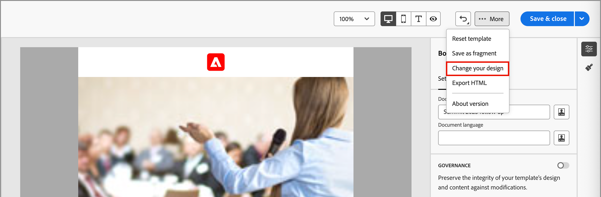{width="700" zoomable="yes"}

     確認ダイアログで、**[!UICONTROL テンプレートの変更]**&#x200B;をクリックしてデザインページを開きます。

1. デザインページで、**[!UICONTROL テーマの作成または編集]**&#x200B;を選択します。

   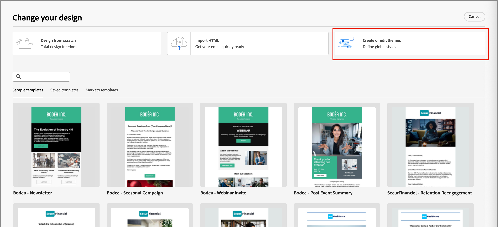{width="800" zoomable="yes"}

1. 初期設定のテーマを選ぶか、Adobeのテーマを使ってスタートを切ります。

   >[!NOTE]
   >
   >カスタムテーマ（_[!UICONTROL マイテーマ]_）のいずれかを出発点として使用する場合は、[複製](#delete-or-duplicate-a-theme)して、テーマを[編集](#edit-a-theme)するときにテーマ名を変更できます。

1. 「**[!UICONTROL 作成]**」をクリックします。

   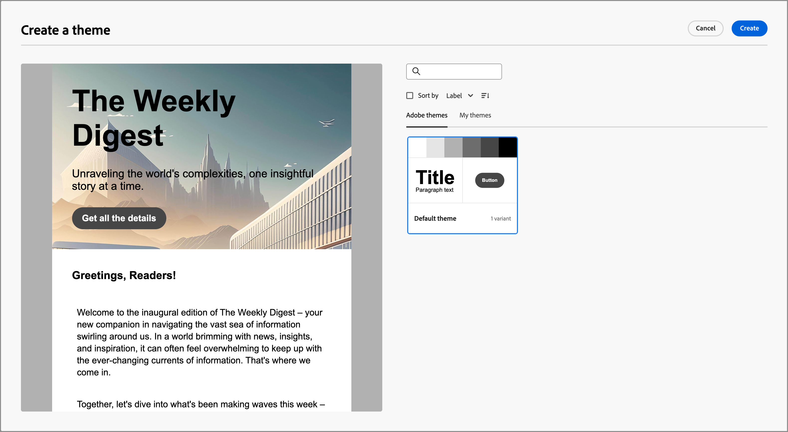{width="750" zoomable="yes"}

   _[!UICONTROL テーマの作成]_ ページには、開始テーマのすべての種類のテキスト、ボタン、コンテナの既存の要素を含むキャンバスが表示されます。

1. 適切なナビゲーションを使用して、様々なテーマスタイルタブにアクセスし、テーマ設定を変更します。

   * [一般設定](#general-settings)
   * [カラー](#colors)
   * [テキスト設定](#text-settings)
   * [間隔と境界線](#spacing-and-border)
   * [ボタン](#button)
   * [ディバイダー](#divider)
   * [グリッド](#grid)

   新しいテーマ設定を定義すると、ビジュアル要素がキャンバス上で変更されます。 結果が望みのものでない場合は、右側のパネルの下部にある「_取り消し_」（{width="16"}）アイコンをクリックします。 _やり直し_ （{width="16"}）アイコンをクリックして、変更を再適用します。

1. テーマの定義が完了したら、**[!UICONTROL 保存]**&#x200B;をクリックします。

1. **[!UICONTROL 閉じる]**&#x200B;をクリックして&#x200B;_[!UICONTROL テーマの作成]_ ページに戻り、次に&#x200B;**[!UICONTROL キャンセル]**&#x200B;をクリックしてデザインページに戻ります。

   次に、**[!UICONTROL ゼロからデザイン]**&#x200B;を選択してビジュアルデザインスペースを開き、[ メールまたはテンプレートにテーマ ](#use-email-theme)を使用できます。

### 一般設定

「**[!UICONTROL 一般設定]**」タブで、テーマの基本的なパラメーターを定義します。

* 一意の&#x200B;**[!UICONTROL テーマ名]**&#x200B;を入力してください。

* 電子メールコンテンツ（本文）の&#x200B;**[!UICONTROL ビューポート幅]**&#x200B;を調整します。 上向き矢印と下向き矢印を使用して、幅を増減するか、値（ピクセル単位）を入力します。

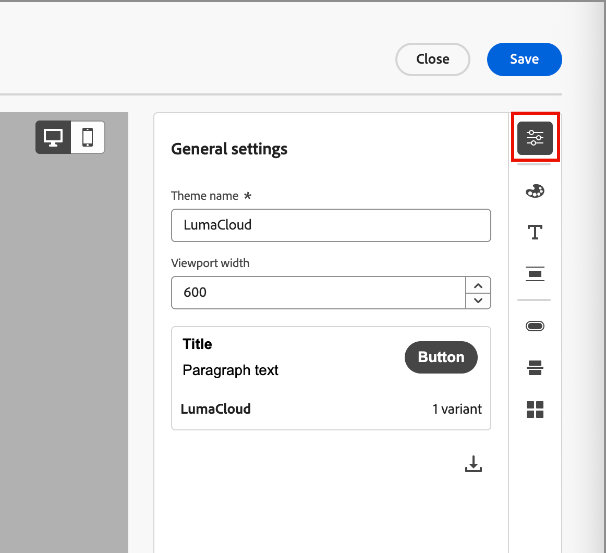{width="450"}
<!--  and also export the current theme to [share it across sandboxes](../configuration/copy-objects-to-sandbox.md).-->

### カラー

「**[!UICONTROL カラー]**」タブを選択し、設定を使用してテーマカラーパレットを定義します。

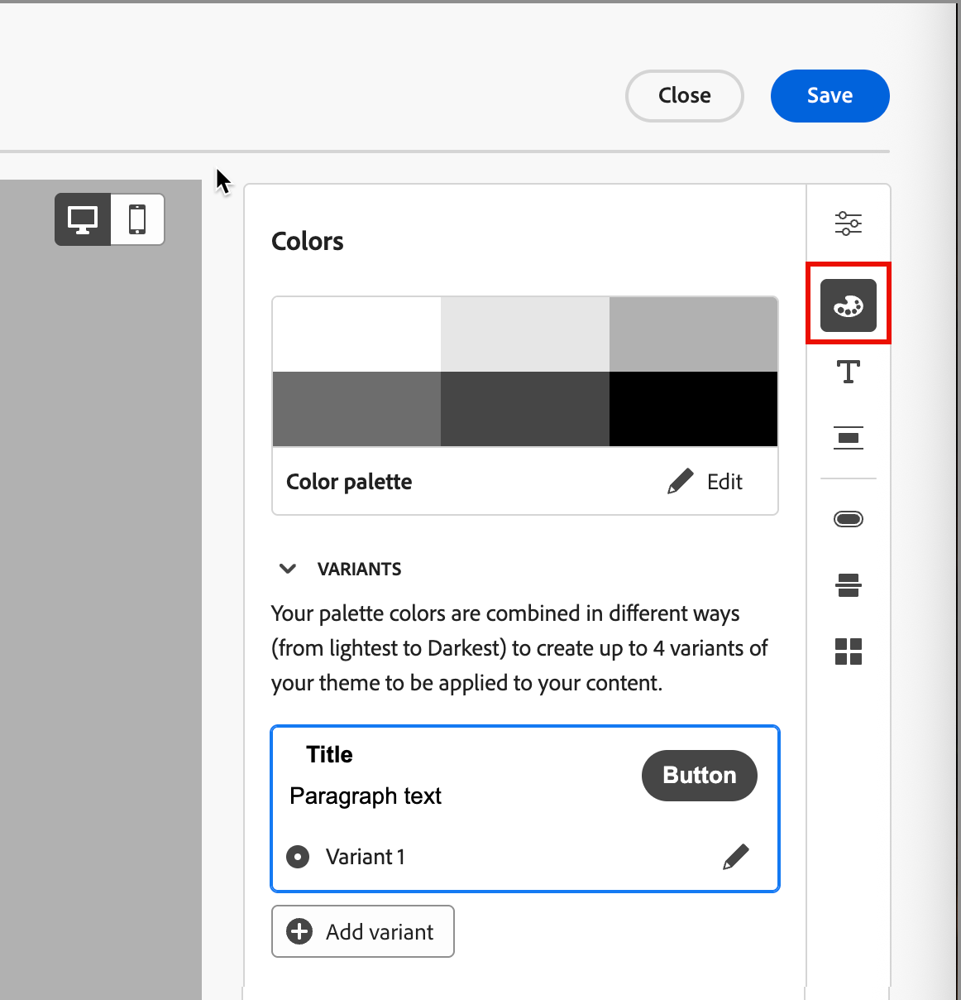{width="450"}

* **[!UICONTROL 編集]**&#x200B;をクリックして、テーマのカラーを含むカラーパレットを表示します。

  テーマに配色を使用するには、**[!UICONTROL プリセット]**&#x200B;を選択するか、セット内の各色を調整します。 また、両方の組み合わせを使用することもできます。

  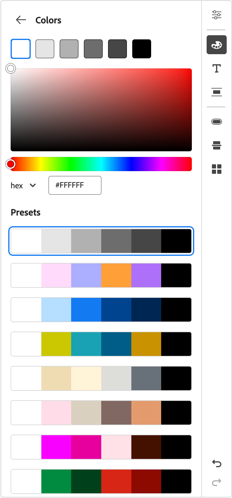{width="350"}

  上部の選択したカラー正方形の場合は、既知のRGB、HSL、HSB、または16進数の値を入力してカラーを設定できます。 または、カラースライダーとカラーフィールドを使用してカラーを選択することもできます。

  _戻る_&#x200B;矢印をクリックして、カラーパレット ツールを閉じます。

* 「**[!UICONTROL バリエーションを追加]**」をクリックして、_light_&#x200B;や&#x200B;_dark_ モードなど、複数のカラーバリエーションを作成します。各バリエーションには独自のカラーパレットとニュアンスのコントロールがあります。

  >[!NOTE]
  >
  >ブランドテーマごとに、最大4つのバリエーションを定義できます。

  バリエーションごとに、_編集_ （）アイコンをクリックします。 デフォルトパレットまたは任意のカスタムカラーを使用できます。

  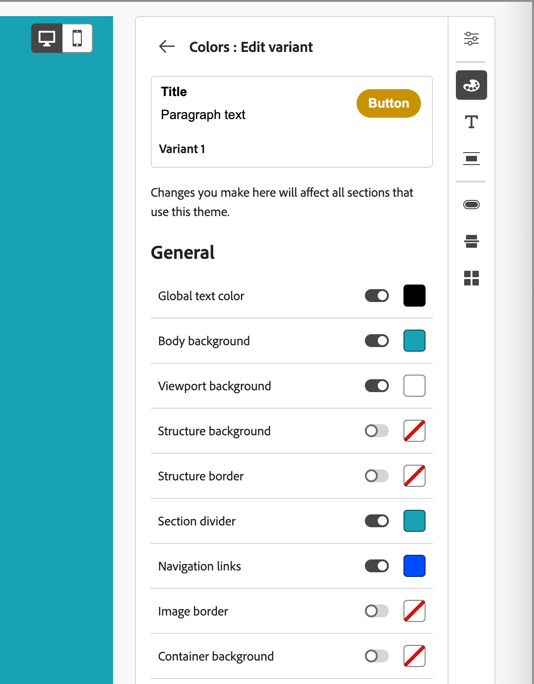{width="450"}

  バリエーションで変更するカラーごとに、トグルを左または右に移動して、バリエーションを無効または有効にします。 有効なカラー設定の場合は、カラーの正方形をクリックしてカラーを選択します。

  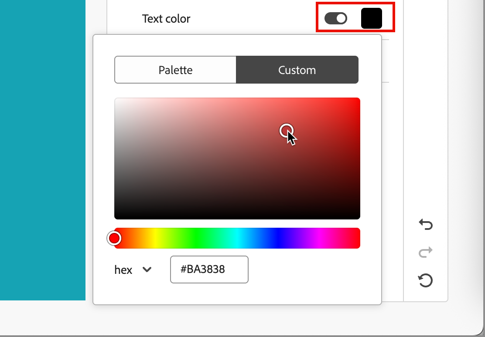{width="450"}

  +++バリエーションのカラー設定

  設定はタイプに応じてグループ化されます。

  | タイプ | 設定 | 説明 |
  | ---- | -------- | ----------- |
  | [!UICONTROL 一般] | 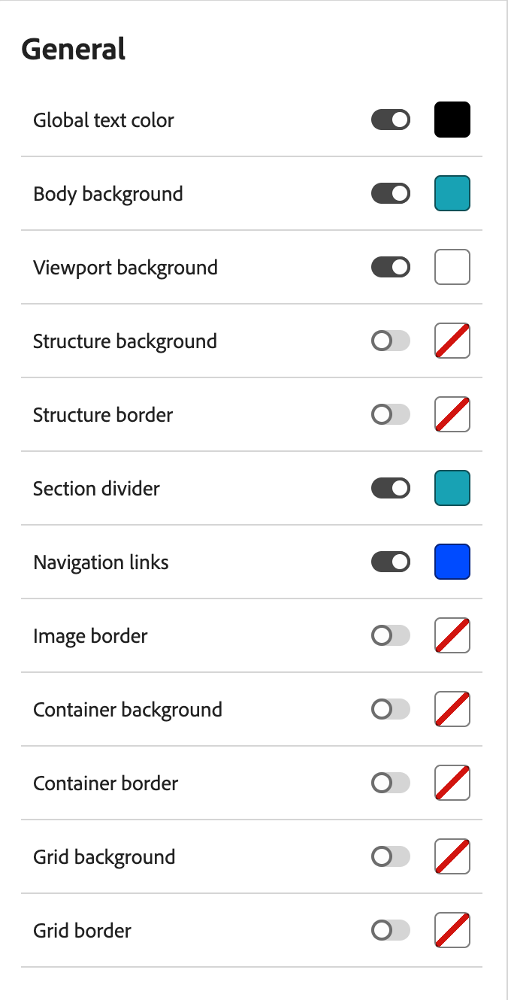{width="300"} | これらの設定によって、本文、構造、コンテナ、背景、リンク、グリッド、境界線の色が決まります。 |
  | [!UICONTROL 見出し] | 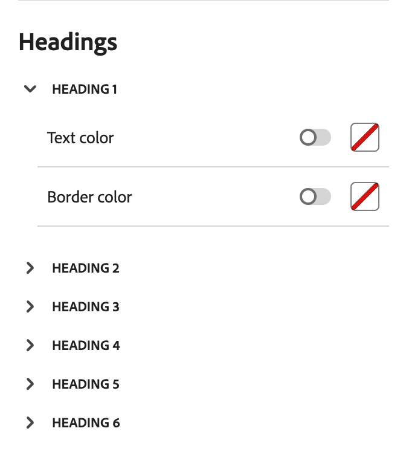{width="300"} | これらの設定は`Heading`要素に適用されます。ここでは、6つの見出しレベルごとにテキストと境界線の色を設定できます。 バリエーションの色を設定する各見出しレベルを展開します。 |
  | [!UICONTROL 段落] | バリアントの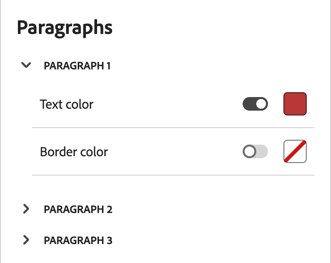{width="300"} | これらの設定は`Paragraph`要素に適用されます。ここでは、3つの段落タイプごとにテキストと境界線の色を設定できます。 バリエーションのカラーを設定する各段落タイプを展開します。 |
  | [!UICONTROL  ボタン ] | バリエーションの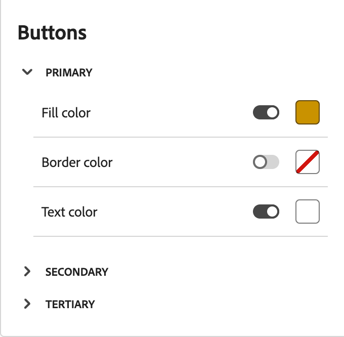{width="300"} | この設定はボタン要素に適用されます。3つのボタンプリセット（_プライマリ_、_セカンダリ_、_第3_）のそれぞれに対して、塗りつぶし色、境界線の色、およびテキストカラーを設定できます。 |

  +++

### テキスト設定

「**[!UICONTROL テキスト設定]**」タブでは、テーマに使用するグローバルなフォントタイプ、スタイル、サイズを設定できます。 より詳細な制御を行うには、見出しタイプと段落タイプのパラメーターを編集することもできます。

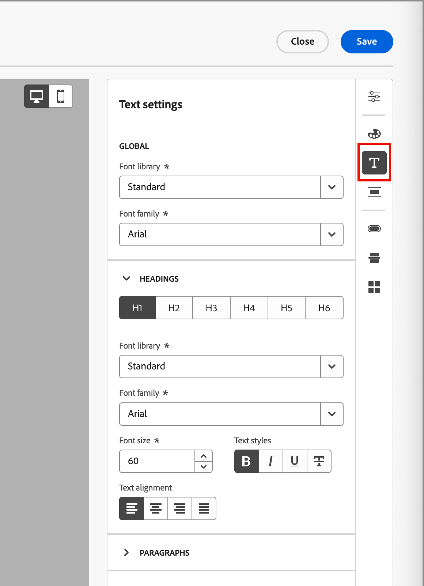{width="450"}

+++テキスト設定（タイプ別）

| タイプ | 設定 | 説明 |
| ---- | -------- | ----------- |
| [!UICONTROL  グローバル ] | 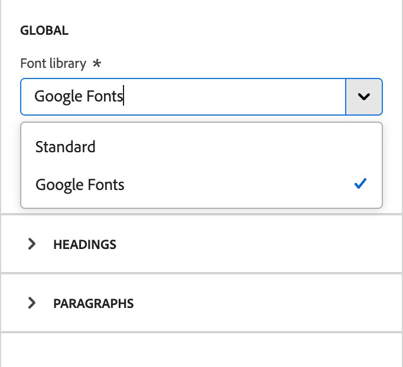{width="300"} | **[!UICONTROL Font library]**&#x200B;を&#x200B;_[!UICONTROL Standard]_&#x200B;または&#x200B;_[!UICONTROL Google Fonts]_&#x200B;に設定します。 次に、使用するフォントファミリーを選択します。 これらのグローバルテキスト設定は、見出しレベルと段落タイプに異なるテキストスタイルを設定しない限り、全体に適用されます。 |
| [!UICONTROL 見出し] | 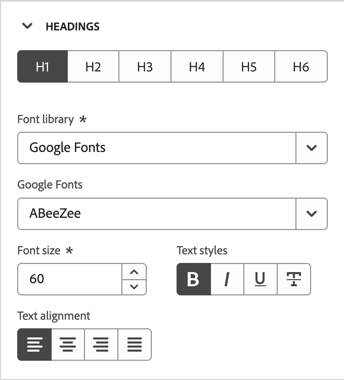{width="300"}の見出しテキストスタイル | 設定する見出しレベルの場合は、**[!UICONTROL H1]**、**[!UICONTROL H2]**&#x200B;などを選択します。 **[!UICONTROL Font library]**&#x200B;を&#x200B;_[!UICONTROL Standard]_&#x200B;または&#x200B;_[!UICONTROL Google Fonts]_&#x200B;に設定します。 次に、フォントファミリー、サイズ、スタイルを選択します。 **[!UICONTROL テキストの配置]**&#x200B;を選択します：_左_、_中央_、_右_、または&#x200B;_正当化_。 |
| [!UICONTROL 段落] | タイプ P1](./assets/email-theme-text-settings-paragraphs.png){width="300"}の![段落テキスト スタイル | 設定する段落タイプに対して、**[!UICONTROL P1]**、**[!UICONTROL P2]**&#x200B;などを選択します。 **[!UICONTROL Font library]**&#x200B;を&#x200B;_[!UICONTROL Standard]_&#x200B;または&#x200B;_[!UICONTROL Google Fonts]_&#x200B;に設定します。 次に、フォントファミリー、サイズ、スタイルを選択します。 必要に応じて&#x200B;**[!UICONTROL 行の高さ]**&#x200B;を調整します。 **[!UICONTROL テキストの配置]**&#x200B;を選択します：_左_、_中央_、_右_、または&#x200B;_正当化_。 |

+++

### 間隔と境界線

「**[!UICONTROL 間隔]**」タブでは、様々なエレメントタイプのパディングとマージンを設定できます。 **[!UICONTROL 種類を選択]**&#x200B;するには、コンテンツの種類を選択します。 次に、そのエレメントタイプに適用されるパディング、余白、コーナー、および境界線を設定します。

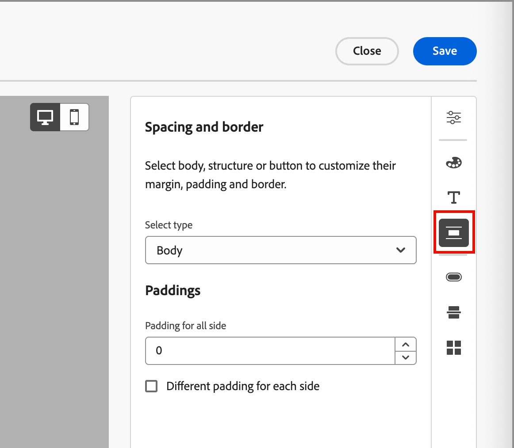{width="450"}

+++間隔の設定

| タイプ | 設定 | 説明 |
| ---- | -------- | ----------- |
| [!UICONTROL 余白] | 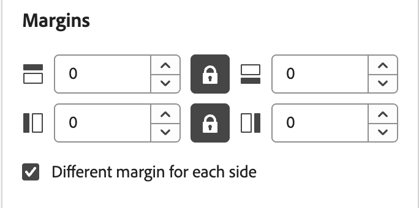{width="300"} | 「_マージン_」アイコンを選択して、CSS `margin` パラメーターを複製する設定を表示します。このパラメーターは、コンポーネントの境界線の外側のスペースを制御し、他のコンポーネントや要素と分離します。 コンポーネントの周囲にギャップを作成して、コンポーネントの位置と周囲のコンテンツのレイアウトに影響を与えます。 デザインのニーズに応じて、余白の値をピクセル単位で設定します。 コンポーネントのすべての辺、上下、左右、または各辺のマージンを個別に設定できます。 _ロック_&#x200B;および&#x200B;_ロック解除_ アイコンをクリックして、上下および左右余白の値を同期または同期を解除します。 |
| [!UICONTROL  パディング ] | 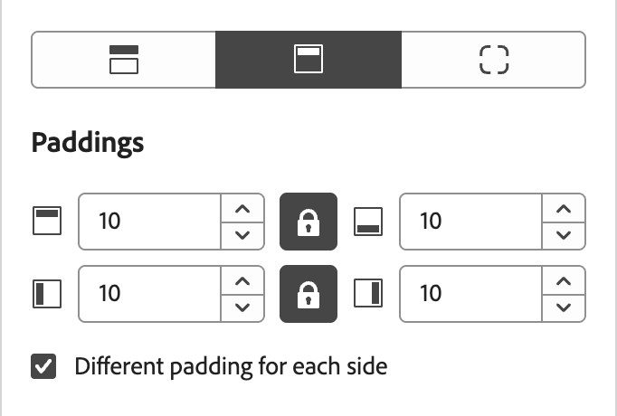{width="300"} | _パディング_ アイコンを選択して、コンポーネント/要素のコンテンツと境界線の間のスペースであるCSS `padding` パラメーターをレプリケートする設定を表示します。 パディングには、コンテンツとコンポーネントの境界線の間の距離を制御するために使用できる内部間隔が用意されています。 デザインのニーズに応じて、パディング値をピクセル単位で設定します。 コンポーネントのすべての辺、上下、左右、または各辺のパディングを個別に設定できます。 _ロック_&#x200B;および&#x200B;_ロック解除_ アイコンをクリックして、上下および左右のパディング値を同期または同期を解除します。 |
| [!UICONTROL 角] | 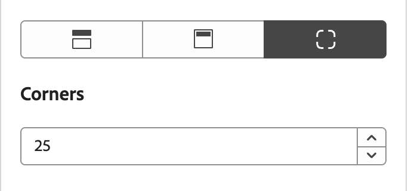{width="300"} | コンポーネントまたは要素の角の半径を定義するCSS `border-radius` パラメーターをレプリケートする設定を表示するには、_角_ アイコンを選択します。 コーナーに対するカーブに応じて数値を設定します。 値が0 （デフォルト）の場合、角は四角形になります。 |

+++

+++ボーダー設定

**[!UICONTROL 境界線]** トグルを右に移動して、境界線の表示オプションを有効にし、デザイン条件に従って設定します。

* **[!UICONTROL 境界線サイズ]** （線幅）を設定するには、上下の矢印アイコンをクリックして、ピクセル数を増減します。

* **[!UICONTROL 境界線スタイル]**&#x200B;を設定するには、_Solid_、_Dotted_、_Dashed_&#x200B;など、標準CSS `border-style`の値のリストから値を選択します。

* 境界線が表示される場所を決めるには、各&#x200B;**[!UICONTROL 境界線の位置]** チェックボックスを選択します。

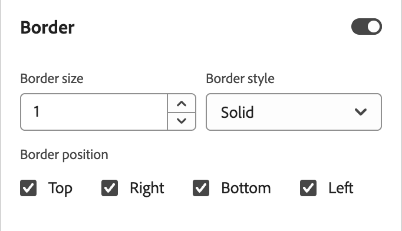{width="250"}

+++

### ボタン

「**[!UICONTROL ボタン]**」タブでは、境界線の半径（シェイプ）、テキスト、サイズなど、ボタン要素に異なる属性（カラー以外）を設定できます。 3つのボタンプリセット（_[!UICONTROL プライマリ]_、_[!UICONTROL セカンダリ]_、_[!UICONTROL 第3段階]_）ごとに設定を変更できます。

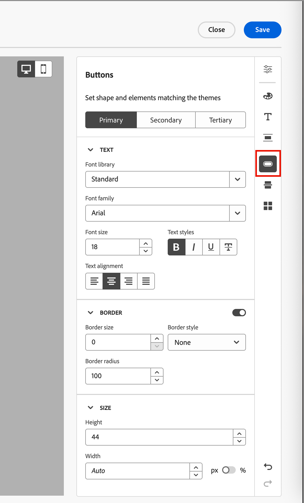{width="450"}

+++ボタン設定

| タイプ | 設定 | 説明 |
| ---- | -------- | ----------- |
| [!UICONTROL テキスト] | 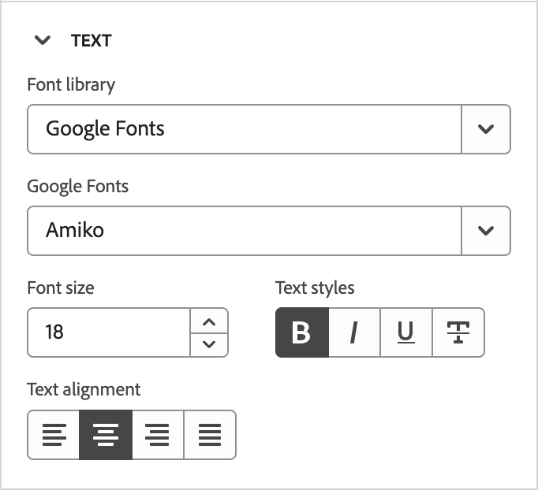{width="300"} | **[!UICONTROL Font library]**&#x200B;を&#x200B;_[!UICONTROL Standard]_&#x200B;または&#x200B;_[!UICONTROL Google Fonts]_&#x200B;に設定します。 次に、フォントファミリー、サイズ、スタイルを選択します。 **[!UICONTROL テキストの配置]**&#x200B;を選択します：_左_、_中央_、_右_、または&#x200B;_正当化_。 |
| [!UICONTROL 境界線] | 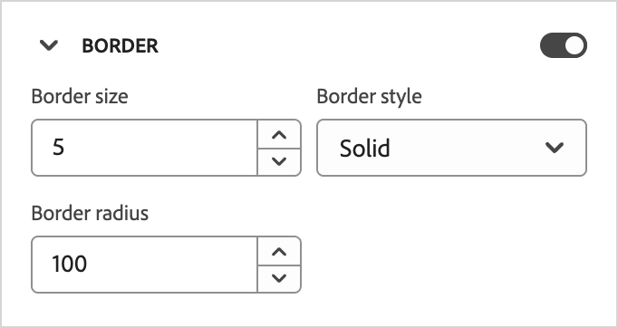{width="300"} | **[!UICONTROL 境界線]** トグルを右に移動して、ボタンの境界線の表示オプションを有効にし、デザイン条件に従って設定します。 ピクセル数を増減して、**[!UICONTROL 境界線サイズ]** （線幅）を設定します。 _Solid_、_Dotted_、_Dashed_&#x200B;など、標準CSS `border-style`値のリストから値を選択して、**[!UICONTROL 境界線スタイル]**&#x200B;を設定します。 |
| [!UICONTROL  サイズ ] | 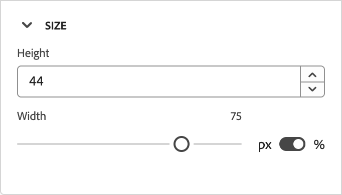{width="300"} | 「**[!UICONTROL 高さ]**」オプションで、上下矢印アイコンをクリックして、ピクセル数を増減します。 空の値（自動）がデフォルトで、ボタンの高さが内容に応じてサイズ調整されます。 **[!UICONTROL 幅]**&#x200B;の場合、切り替えスイッチを使用して幅をピクセルまたはパーセント単位で設定します。 パーセンテージ幅の場合は、スライダーを使用してパーセンテージ値を設定します。 パーセンテージは、含まれるブロックのコンテンツボックスに基づいてボタンサイズを決定します。このボックスには、パディングと境界線は含まれません。 例えば、値が50の場合、ボタンの幅は、ブロックのコンテンツ幅の50%に設定されます。 ピクセルベースの幅の場合は、上下の矢印アイコンをクリックして、ピクセル数を増減します。 空の値（_自動_）がデフォルトで、ボタンの幅はその内容に応じてサイズが設定されます。 |

+++

### ディバイダー

「**[!UICONTROL Divider]**」タブでは、分割コンポーネントの行のスタイル設定とコンテナ設定を設定できます。

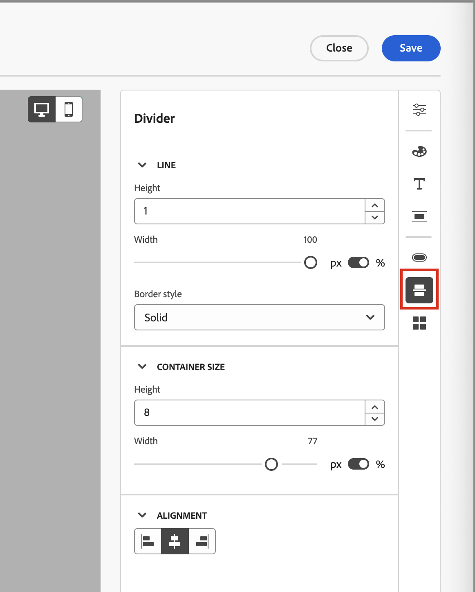{width="450"}

+++ディバイダの設定

| タイプ | 設定 | 説明 |
| ---- | -------- | ----------- |
| [!UICONTROL Line] | 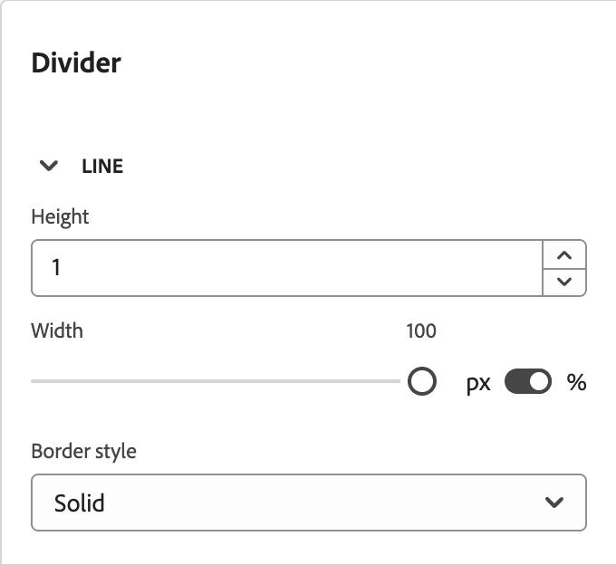{width="300"} | _Solid_、_Dotted_、_Dashed_&#x200B;など、標準CSS `border-style`値のリストから値を選択して、**[!UICONTROL 境界線スタイル]**&#x200B;を設定します。 |
| [!UICONTROL  コンテナサイズ ] | 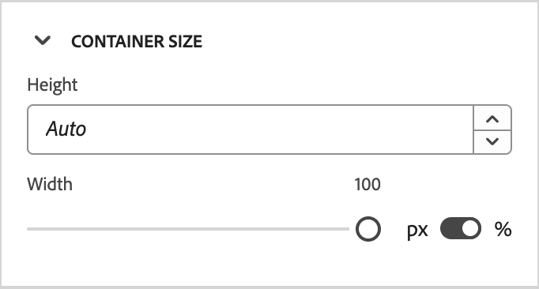{width="300"} | 「**[!UICONTROL 高さ]**」オプションで、上向き矢印アイコンと下向き矢印アイコンをクリックして、コンポーネントまたは要素のピクセル数を増減します。 空の値（自動）がデフォルトで、その内容に応じて高さのサイズが設定されます（行のスタイル設定）。 **[!UICONTROL 幅]**&#x200B;の場合、切り替えスイッチを使用して幅をピクセルまたはパーセント単位で設定します。 パーセンテージ幅の場合は、スライダーを使用してパーセンテージ値を設定します。 パーセンテージは、含まれるブロックのコンテンツボックスに基づいてエレメントの幅を決定します。 例えば、値が50の場合、区切り記号の幅は、含まれるブロックのコンテンツ幅の50%に設定されます。 ピクセルベースの幅の場合は、上下の矢印アイコンをクリックして、ピクセル数を増減します。 空の値（_自動_）がデフォルトで、ディバイダの幅をその内容に応じてサイズ設定します。 |
| [!UICONTROL 配置] | 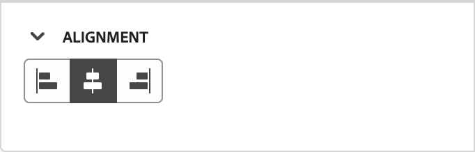{width="300"} | 含むブロック内の水平方向の整列を選択します：_左_、_中央_、または&#x200B;_右_。 |

+++

### グリッド

「**[!UICONTROL グリッド]**」タブでは、グリッド要素の列と行の間隔を制御できます。

* **[!UICONTROL 列の間隔]** - グリッド列間の間隔のピクセル数を増減するには、上下の矢印アイコンをクリックします。 または、フィールドに数値を入力することもできます。

* **[!UICONTROL 行の間隔]** - グリッド行の間隔のピクセル数を増減するには、上下の矢印アイコンをクリックします。 または、フィールドに数値を入力することもできます。

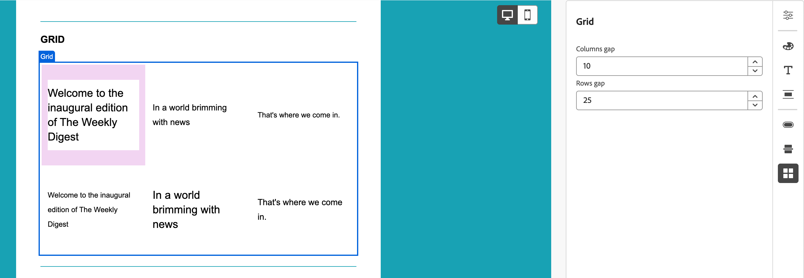{width="700" zoomable="yes"}

## テーマの編集

テーマの作成時に使用するのと同じワークフローとツールを使用して、テーマを編集できます。 違いは、**[!UICONTROL マイテーマ]** タブを選択し、変更するカスタムテーマを選択することです。

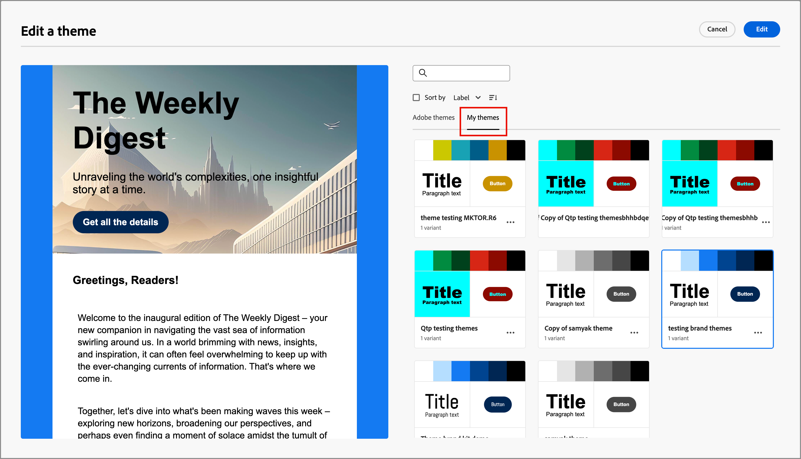{width="750" zoomable="yes"}

右側のパネルを使用して、様々なタブを移動し、テーマ設定を変更します。

* [一般設定](#general-settings)
* [カラー](#colors)
* [テキスト設定](#text-settings)
* [間隔と境界線](#spacing-and-border)
* [ボタン](#button)
* [ディバイダー](#divider)
* [グリッド](#grid)

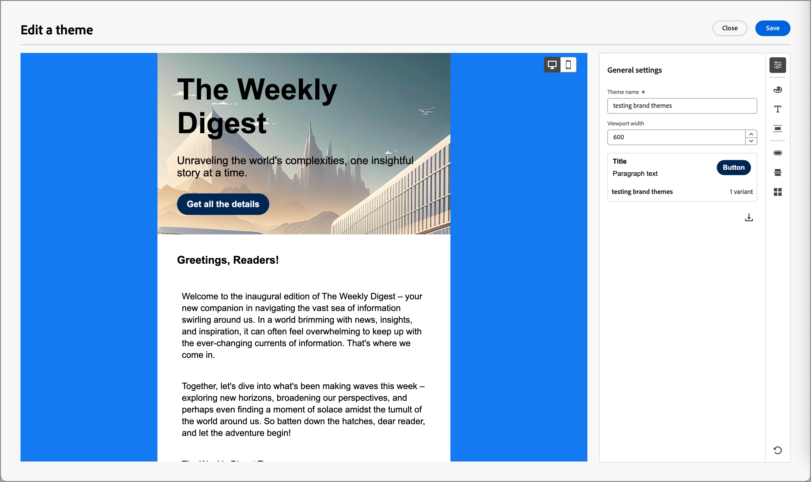{width="800" zoomable="yes"}

設定を変更すると、表示されるビジュアル要素が変更されます。 キャンバスの結果が目的と異なる場合は、右側のパネルの下部にある&#x200B;_取り消し_ （{width="16"}）アイコンをクリックできます。 _やり直し_ （{width="16"}）アイコンをクリックして、変更を再適用します。

テーマの変更が完了したら、**[!UICONTROL 保存]**&#x200B;をクリックします。

>[!NOTE]
>
>保存した変更は、現在テーマを使用しているすべての電子メールまたは電子メールテンプレートに自動的にカスケードされません。 それぞれのコンテンツを編集して、テーマを更新し、更新されたスタイルに一致させます。

## カスタムテーマの管理

テーマの作成時と同じワークフローとツールを使用して、カスタムテーマを管理できます。 違いは、**[!UICONTROL マイテーマ]** タブを選択し、表示されたリスト内でテーマを管理することです。

カスタムテーマのリストが多い場合は、_検索_ フィールドと他のフィルターを使用して、表示されるリストを減らします。 利用可能なテーマのリストを管理しながら、カスタムテーマをいつでも編集、削除、複製できます。

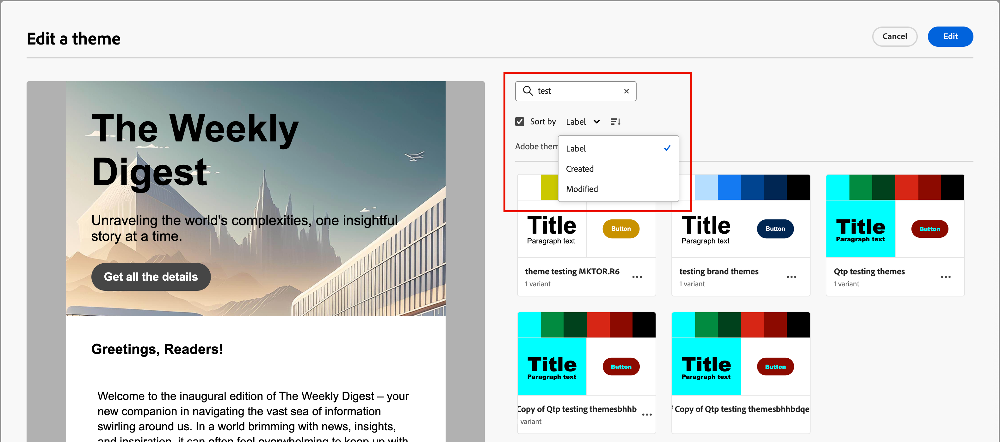{width="750" zoomable="yes"}

### テーマの編集

1. 変更するテーマを選択し、右上の「**[!UICONTROL 編集]**」をクリックします。

   {width="750" zoomable="yes"}

1. 右側のナビゲーションを使用して、様々なスタイル設定タブを使用し、テーマ設定を変更します。

   * [一般設定](#general-settings)
   * [カラー](#colors)
   * [テキスト設定](#text-settings)
   * [間隔と境界線](#spacing-and-border)
   * [ボタン](#button)
   * [ディバイダー](#divider)
   * [グリッド](#grid)

   {width="800" zoomable="yes"}

   設定を変更すると、表示されるビジュアル要素が変更されます。 キャンバスの結果が目的と異なる場合は、右側のパネルの下部にある「_取り消し_」アイコンをクリックします。 _やり直し_ アイコンをクリックして、変更を再適用します。

1. テーマの変更が完了したら、**[!UICONTROL 保存]**&#x200B;をクリックします。

>[!NOTE]
>
>保存したテーマの変更は、現在テーマを使用しているすべての電子メールまたは電子メールテンプレートに自動的にカスケードされません。 それぞれのコンテンツを編集して、テーマを更新し、更新されたスタイルに一致させます。

### テーマの削除または複製

テーマを見つけたら、_詳細メニュー_ （**...**）をクリックします テーマカードの右下にあるアイコンをクリックし、実行するアクションを選択します。

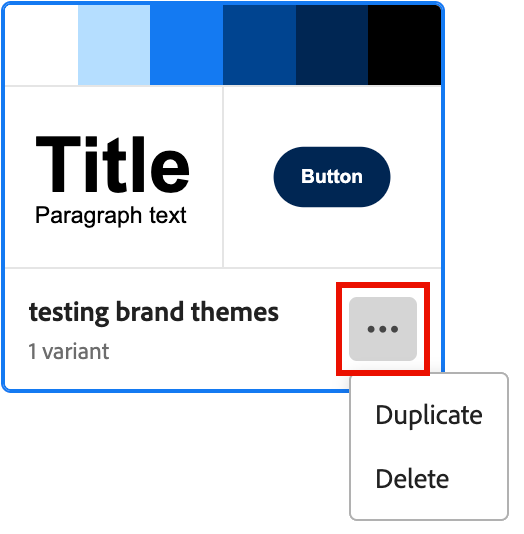{width="220"}

* **[!UICONTROL 複製]** - テーマを複製するには、このアクションを選択します。 新しいテーマは、元のテーマの名前に&#x200B;_の_ コピーが追加されているのと同じです。 テーマを[編集](#edit-a-theme)するときに名前を変更できます。

* **[!UICONTROL 削除]** – このアクションを選択して、カスタムテーマを削除します。 確認ダイアログで、「**[!UICONTROL 削除]**」をクリックします。

  >[!NOTE]
  >
  >テーマを削除しても、既に適用されている電子メールや電子メールテンプレートには影響しません。

## メールコンテンツのオーサリングにテーマを使用する {#use-email-theme}

新しい電子メールやメールテンプレートを作成する際には、コンテンツオーサリングプロセスを合理化し、定義された標準に沿ったデザインを確保できる、ブランドテーマを使用できます。 新しいフラグメントの場合は、フラグメントを保存する前にテーマを適用することもできます。 このフラグメントは、その時点から&#x200B;_テーマモード_&#x200B;のままであり、_テーマモード_&#x200B;にある電子メールや電子メールテンプレートに追加しても互換性があります。

1. 次のいずれかのアクションを選択します。

   * テーマ（_テーマモード_&#x200B;で作成）を組み込んだメールテンプレートを選択します。 各テンプレートに固有のテーマが自動的に適用されます。

   * _[!UICONTROL ゼロからデザイン]_ オプションを使用し、**[!UICONTROL テーマを使用]**&#x200B;を選択して、定義済みのスタイル設定テーマから開始します。

     {width="450"}

     >[!IMPORTANT]
     >
     >_[!UICONTROL 手動スタイル設定]_ モードを選択した場合は、テーマを適用するために電子メールデザインをリセットする必要があります。
     >
     >_[!UICONTROL テーマ]_ モードを選択した場合、_テーマ_ モードで作成された[ フラグメント ](./fragments.md)のみがメールコンテンツに追加できます。

1. メールデザインスペースで、右側の&#x200B;_テーマ_ （）アイコンをクリックします。

   {width="600" zoomable="yes"}

   デフォルトのテーマまたはテンプレートに適用されたテーマが表示されます。 このテーマのカラーバリエーションを切り替えることができます。

1. 表示されているテーマの横にある矢印をクリックして、使用可能なカスタムテーマとAdobe テーマのリストを表示します。

1. 「**[!UICONTROL マイテーマ]**」をクリックし、カスタムテーマを選択します。

   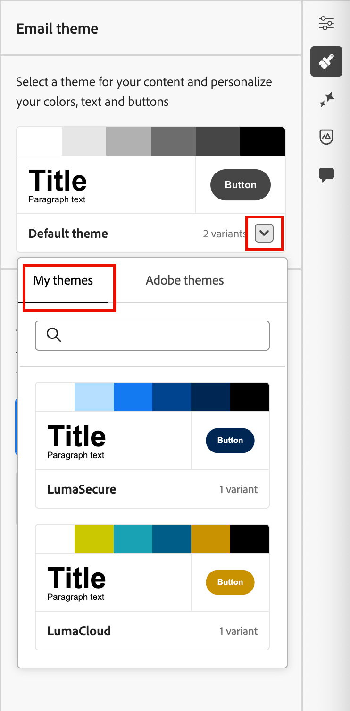{width="325"}

1. リストの外側をクリックします。

   新しく選択したカスタムテーマは、キャンバス内のすべてのメールコンポーネントにスタイルを適用します。 カラーバリエーションを切り替えることができます。

1. 選択したコンポーネントのテーマスタイルを上書きする必要がある場合は、_コンポーネントスタイルのロック解除_ （）アイコンをクリックします。

   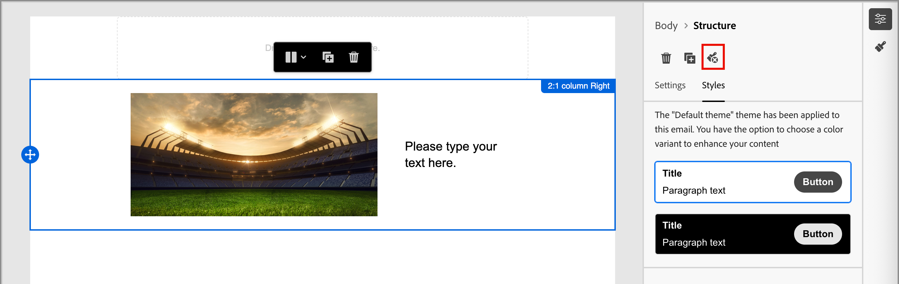{width="600" zoomable="yes"}のテーマスタイルのロックを解除

   確認ダイアログで、**[!UICONTROL ロック解除]**&#x200B;をクリックします。

   右側のパネルで「**[!UICONTROL スタイル]**」タブを選択して、コンポーネントの設定を変更します。

   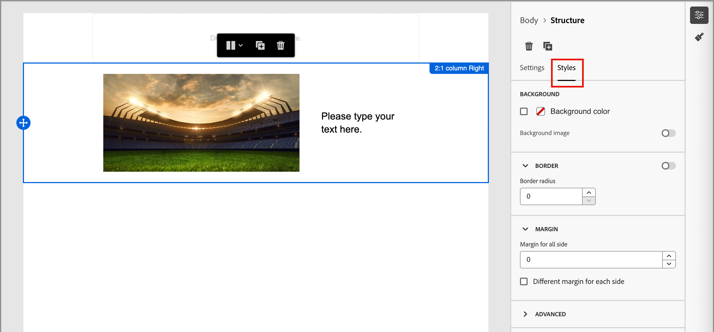{width="600" zoomable="yes"}のテーマスタイルのロックを解除

## メールコンテンツのテーマを変更

_テーマモード_&#x200B;で作成された電子メールまたは電子メールテンプレートの場合、いつでもテーマを変更できます。 メールコンテンツは変更されませんが、スタイルは新しいテーマを反映して更新されます。

1. デザインスペースで電子メールまたは電子メールテンプレートを開きます。

1. 右側の&#x200B;_テーマ_ （）アイコンをクリックします。

   適用されたテーマが右側のパネルに表示されます。

1. 表示されているテーマの横にある矢印をクリックして、使用可能なカスタムテーマとAdobe テーマのリストを表示します。

1. 別のテーマを選択。

1. リストの外側をクリックします。

   選択したテーマは、キャンバス内のすべてのメールコンポーネントにスタイルを適用します。 カラーバリエーションを切り替えることができます。

<!--
>[!NOTE]
> - Themes apply styles globally. Ensure your theme is finalized before applying it to multiple emails.
> - Switching themes may override custom styles applied to individual components.

>[!CAUTION]
> - When using fragments, the email's theme will override the fragment's styles. A warning will be displayed in the editor if there is a conflict.

## Example Use Cases {#example-use-cases}

### 1. Creating a New Theme
- A designer creates a theme with their brand's colors, fonts, and button styles.
- The theme is saved and reused by marketers to author multiple emails.

### 2. Switching Themes
- A marketer applies a holiday-themed design to an existing email by switching to a pre-designed holiday theme.
-->
