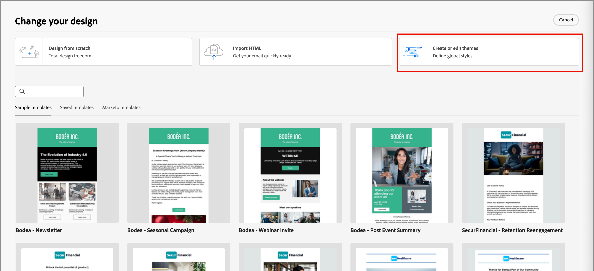
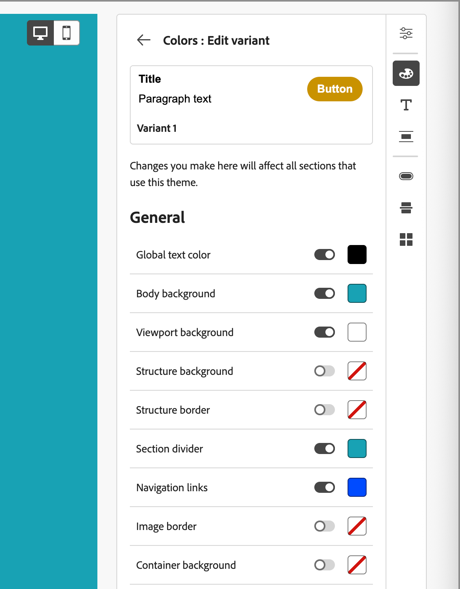
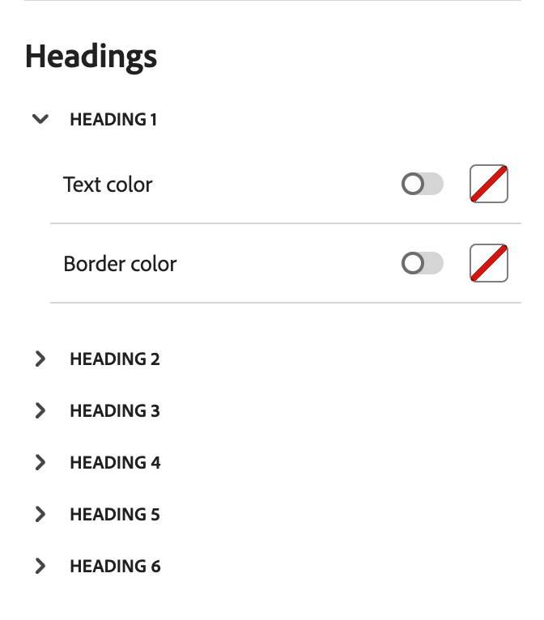
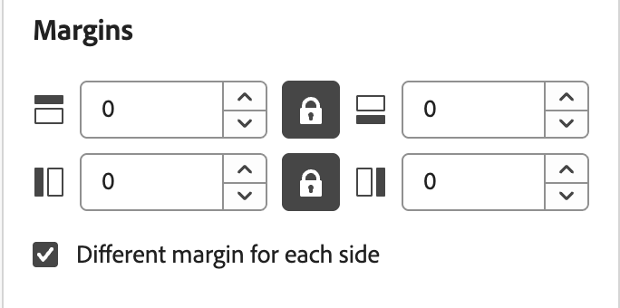
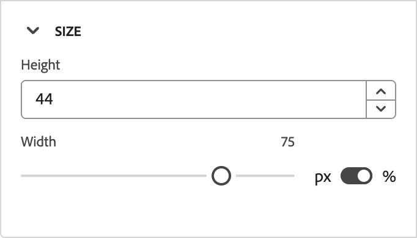

# メールコンテンツへのブランドテーマの使用 {#email-brand-themes}

>[!CONTEXTUALHELP]
>id="ajo-b2b_email_brand_theme"
>title="メールまたはメールテンプレートへのブランドテーマの適用"
>abstract="メールまたはメールテンプレートのテーマを選択して、ブランドやデザインに合ったスタイル設定を適用します。"

テーマを使用すると、非テクニカルデザイナーは、特定のブランドやスタイルに合わせた再利用可能なメールコンテンツデザインガイドラインを作成できます。 テーマを使用すると、マーケターは、視覚的に魅力的でブランドと一貫性のあるメールをより迅速かつ少ない労力で活用し、独自のデザインニーズに合わせて高度なカスタマイズオプションを提供できます。

## テーマのガイドラインと制限 {#themes-guidelines}

テーマを使用する場合は、次のガイドラインと制限事項に注意してください。

* 空のキャンバスからメールまたはメールテンプレートを作成する（_ゼロからデザイン_）場合、_テーマモード_ を選択して、ブランドとデザインに合った特定のスタイル設定を適用するテーマを使用してコンテンツの作成を開始できます。 _手動モード_ を選択した場合、メールまたはメールテンプレートのデザインをリセットしない限り、テーマを適用できません。

* [ フラグメント ](./fragments.md) は、メールコンテンツの _テーマモード_ と _手動モード_ 間で相互互換性がありません。 また、テーマが適用されるメールコンテンツでフラグメントを使用するには、フラグメントを _テーマモード_ で作成する必要があります。

* カスタムテーマに対する変更によって、そのテーマを既に使用しているすべてのメールまたはメールテンプレートに自動的にカスケードされるわけではありません。 それぞれのコンテンツを編集して、テーマを更新します。

* テーマを削除しても、既に適用されているメールまたはメールテンプレートには影響しません。
<!-- 
* If using a content created in HTML, you will be in [compatibility mode](existing-content.md) and you cannot apply themes to this content.
-->

## ブランドテーマの作成 {#create-theme}

今後のメールコンテンツでメールおよびメールテンプレートコンテンツに適用できる、独自のブランドテーマを定義します。

1. 次のいずれかの方法を使用して、テーマツールにアクセスします。

   * [ 新しいメールテンプレートを作成 ](./email-templates.md#create-an-email-template)、「**[!UICONTROL メールテンプレートを編集]**」をクリックして _[!UICONTROL テンプレートのデザイン]_ ページを起動します。

   * 「**[!UICONTROL ...」をクリックします。その他]** メールコンテンツデザインスペースの右上で、「**[!UICONTROL デザインを変更]**」を選択します。

     {width="700" zoomable="yes"}

     確認ダイアログで、「**[!UICONTROL テンプレートを変更]**」をクリックしてデザインページを開きます。

1. デザインページで、「**[!UICONTROL テーマを作成または編集]**」を選択します。

   {width="800" zoomable="yes"}

1. デフォルトのテーマを選択するか、任意のAdobe テーマを使用して、開始点として使用します。

   >[!NOTE]
   >
   >カスタムテーマ（_[!UICONTROL マイテーマ]_）のいずれかを出発点として使用する場合は、[ テーマを複製 ](#delete-or-duplicate-a-theme) できます。また、[ テーマを編集 ](#edit-a-theme) するときにテーマ名を変更できます。

1. 「**[!UICONTROL 作成]**」をクリックします。

   {width="750" zoomable="yes"}

   _[!UICONTROL テーマを作成]_ ページは、開始テーマのすべてのタイプのテキスト、ボタンおよびコンテナの既存の要素を含むキャンバスを提供します。

1. 適切なナビゲーションを使用して、様々なテーマスタイルのタブにアクセスし、テーマの設定を変更します。

   * [一般設定](#general-settings)
   * [色](#colors)
   * [テキスト設定](#text-settings)
   * [間隔と境界線](#spacing-and-border)
   * [ボタン](#button)
   * [ディバイダー](#divider)
   * [グリッド](#grid)

   新しいテーマ設定を定義すると、キャンバス上の視覚要素が変更されます。 結果が期待どおりでない場合は、右側のパネルの下部にある _取り消し_ （{width="16"}）アイコンをクリックします。 _やり直し_ （{width="16"}）アイコンをクリックして、変更を再適用します。

1. テーマの定義が完了したら、「**[!UICONTROL 保存]**」をクリックします。

1. 「**[!UICONTROL 閉じる]**」をクリックして _[!UICONTROL テーマを作成]_ ページに戻り、「**[!UICONTROL キャンセル]**」をクリックしてデザインページに戻ります。

   その後、「**[!UICONTROL ゼロからデザイン]** を選択してビジュアルデザインスペースを開き、メールまたはテンプレートの [ テーマを使用 ](#use-your-theme-for-email-content-authoring) できます。

### 一般設定

**[!UICONTROL 一般設定]** タブで、テーマの基本パラメーターを定義します。

* 一意の **[!UICONTROL テーマ名]** を入力します。

* メールコンテンツ（本文）の **[!UICONTROL ビューポートの幅]** を調整します。 上下の矢印キーを使用して幅を増減するか、値をピクセル単位で入力します。

{width="450"}
<!--  and also export the current theme to [share it across sandboxes](../configuration/copy-objects-to-sandbox.md).-->

### 色

「**[!UICONTROL カラー]**」タブを選択し、設定を使用してテーマのカラーパレットを定義します。

{width="450"}

* **[!UICONTROL 編集]** をクリックして、テーマのカラーを含むカラーパレットを表示します。

  テーマのカラースキームを使用したり、セットの各色を調整したりするには、**[!UICONTROL プリセット]** を選択します。 また、両方の組み合わせを使用することもできます。

  {width="350"}

  上部の選択したカラーの正方形に対して、既知のRGB、HSL、HSB、または 16 進数値を入力してカラーを設定できます。 または、カラースライダーとカラーフィールドを使用して、カラーを選択できます。

  _戻る_ 矢印をクリックして、カラーパレットツールを閉じます。

* 「**[!UICONTROL バリアントを追加]**」をクリックして、_明_ モードや _暗_ モードなど、複数のカラーバリアントを作成します。各バリアントには、独自のカラーパレットとニュアンスのコントロールがあります。 最大 6 つのバリアントを使用できます。

  各バリアントに対して、「_編集_ （）」アイコンをクリックします。 デフォルトパレットまたは任意のカスタムカラーを使用できます。

  {width="450"}

  バリアントに対して変更する色ごとに、切り替えスイッチを左または右に移動して、無効または有効にします。 カラー設定を有効にするには、カラーの四角形をクリックしてカラーを選択します。

  {width="450"}

  +++バリアントのカラー設定

  設定は、タイプに従ってグループ化されます。

  | タイプ | 設定 | 説明 |
  | ---- | -------- | ----------- |
  | [!UICONTROL  一般 ] | {width="300"} | これらの設定は、ボディ、構造物、コンテナ、背景、リンク、グリッド、および境界の色を決定します。 |
  | [!UICONTROL  見出し ] | {width="300"} | これらの設定は `Heading` の要素に適用され、6 つの見出しレベルのそれぞれにテキストと境界線の色を設定できます。 バリアントの色を設定する各見出しレベルを展開します。 |
  | [!UICONTROL  段落 ] | {width="300"} | これらの設定は `Paragraph` 要素に適用され、3 つの段落タイプのそれぞれにテキストと境界線のカラーを設定できます。 バリアントの色を設定する各段落タイプを展開します。 |
  | [!UICONTROL  ボタン ] | {width="300"} | この設定はボタン要素に適用され、_プライマリ_、_セカンダリ_、{3 次 _の 3 つのボタンプリセットのそれぞれに対して、塗りつぶしカラー、境界線のカラー、テキストカラーを_ 定できます。 |

  +++

### テキスト設定

「**[!UICONTROL テキスト設定]**」タブでは、テーマに使用するグローバルなフォントタイプ、スタイル、サイズを設定できます。 より詳細な制御を行うために、これらのパラメーターを見出しおよび段落タイプ用に編集することもできます。

{width="450"}

+++タイプ別テキスト設定

| タイプ | 設定 | 説明 |
| ---- | -------- | ----------- |
| [!UICONTROL  グローバル ] | {width="300"} | **[!UICONTROL フォントライブラリ]** を _[!UICONTROL 標準]_ または _[!UICONTROL Google フォント]_ に設定します。 次に、使用するフォントファミリーを選択します。 見出しレベルと段落タイプに異なるテキストスタイルを設定しない限り、これらのグローバルテキスト設定は全体に適用されます。 |
| [!UICONTROL  見出し ] | {width="300"} | 設定する見出しレベルに対して、**[!UICONTROL H1]**、**[!UICONTROL H2]** などを選択します。 **[!UICONTROL フォントライブラリ]** を _[!UICONTROL 標準]_ または _[!UICONTROL Google フォント]_ に設定します。 次に、フォントファミリー、サイズ、スタイルを選択します。 **[!UICONTROL テキストの配置]** （_左揃え_、_中央揃え_、_右揃え_、_両端揃え_ のいずれかを選択します。 |
| [!UICONTROL  段落 ] | {width="300"} | 設定する見出しレベルに対して、**[!UICONTROL P1]**、**[!UICONTROL HP]** などを選択します。 **[!UICONTROL フォントライブラリ]** を _[!UICONTROL 標準]_ または _[!UICONTROL Google フォント]_ に設定します。 次に、フォントファミリー、サイズ、スタイルを選択します。 必要に応じて **[!UICONTROL 線の高さ]** を調整します。 **[!UICONTROL テキストの配置]** （_左揃え_、_中央揃え_、_右揃え_、_両端揃え_ のいずれかを選択します。 |

+++

### 間隔と境界線

「**[!UICONTROL 間隔]**」タブでは、様々な要素タイプに合わせてパディングと余白を設定できます。 **[!UICONTROL タイプを選択]** には、コンテンツタイプを選択します。 次に、その要素タイプに適用できるパディング、余白、コーナー、境界線を設定します。

{width="450"}

+++間隔の設定

| タイプ | 設定 | 説明 |
| ---- | -------- | ----------- |
| [!UICONTROL  余白 ] | {width="300"} | _マージン_ アイコンを選択すると、CSS `margin` パラメーターを複製した設定が表示されます。このパラメーターは、コンポーネントの境界線の外側のスペースを制御し、他のコンポーネントや要素から分離します。 コンポーネントの周囲に隙間ができ、周囲のコンテンツの配置やレイアウトに影響します。 デザインのニーズに応じて、マージンの値をピクセル単位で設定します。 コンポーネントのすべての辺、上部のボタン、左右または各辺の余白を個別に設定できます。 _ロック_ アイコンと _ロック解除_ アイコンをクリックして、上下と左右のマージン値を同期または非同期にします。 |
| [!UICONTROL  小漕ぎ ] | {width="300"} | _パディング_ アイコンを選択して、コンポーネント/要素のコンテンツとその境界線の間のスペースである CSS `padding` パラメーターをレプリケートする設定を表示します。 パディングには、コンテンツとコンポーネントの境界線との距離を制御するために使用できる内部間隔が用意されています。 デザインのニーズに応じて、パディング値をピクセル単位で設定します。 コンポーネントのすべての辺、上部ボタン、左右または各辺のパディングを個別に設定できます。 _ロック_ アイコンと _ロック解除_ アイコンをクリックして、上下および左右のパディング値を同期または同期解除します。 |
| [!UICONTROL  コーナー ] | {width="300"} | 「_コーナー_」アイコンを選択すると、コンポーネントや要素のコーナーの半径を定義する CSS `border-radius` パラメーターを複製した設定が表示されます。 コーナーに必要なカーブに従って数値を設定します。 値が 0 （デフォルト）の場合、コーナーは 2 乗になります。 |

+++

+++境界線の設定

**[!UICONTROL 境界線]** トグルを右に切り替えて、境界線の表示オプションを有効にし、設計条件に従って設定します。

* **[!UICONTROL 境界線のサイズ]** （線の幅）を設定するには、上向き矢印アイコンと下向き矢印アイコンをクリックしてピクセル数を増減します。

* **[!UICONTROL 境界線スタイル]** を設定するには、標準 CSS `border-style` 値のリストから値（_実線_、_点線_、_破線_ など）を選択します。

* 境界線の表示場所を指定するには、それぞれの **[!UICONTROL 境界線の位置]** チェックボックスを選択します。

{width="250"}

+++

### ボタン

**[!UICONTROL ボタン]** タブでは、境界線の半径（シェイプ）、テキスト、サイズなど、ボタン要素に対して色以外の様々な属性を設定できます。 3 つのボタンプリセット（_[!UICONTROL プライマリ]_、_[!UICONTROL セカンダリ]_、{3 次 _[!UICONTROL ）をそれぞれ変]_ できます。

{width="450"}

+++ボタン設定

| タイプ | 設定 | 説明 |
| ---- | -------- | ----------- |
| [!UICONTROL テキスト] | {width="300"} | **[!UICONTROL フォントライブラリ]** を _[!UICONTROL 標準]_ または _[!UICONTROL Google フォント]_ に設定します。 次に、フォントファミリー、サイズ、スタイルを選択します。 **[!UICONTROL テキストの配置]** （_左揃え_、_中央揃え_、_右揃え_、_両端揃え_ のいずれかを選択します。 |
| [!UICONTROL  境界線 ] | {width="300"} | **[!UICONTROL ボーダー]** トグルを右に切り替えて、ボタンのボーダー表示オプションを有効にし、デザイン条件に従って設定します。 ピクセル数を増減して **[!UICONTROL ボーダーのサイズ]** （ラインの幅）を設定します。 **[!UICONTROL 境界線スタイル]** を設定するには、標準 CSS `border-style` 値のリストから値（_実線_、_点線_、_破線_ を選択します。 |
| [!UICONTROL  サイズ ] | {width="300"} | 「**[!UICONTROL 高さ]**」オプションでは、上向き矢印アイコンと下向き矢印アイコンをクリックしてピクセル数を増減します。 デフォルトは空の値（Auto）で、ボタンの内容に応じてボタンの高さのサイズを指定します。 **[!UICONTROL 幅]** には、切り替えスイッチを使用して幅をピクセルまたはパーセンテージで設定します。 幅のパーセンテージの場合は、スライダーを使用してパーセンテージの値を設定します。 割合は、ボタンを含むブロックのコンテンツボックス（パディングと境界線を除く）に基づいてボタンのサイズを決定します。 例えば、値が 50 の場合、ボタンの幅は、ボタンを含むブロックコンテンツの幅の 50% に設定されます。 ピクセルベースの幅の場合は、上向き矢印アイコンと下向き矢印アイコンをクリックして、ピクセル数を増減します。 デフォルトは空の値（_Auto_）で、ボタンの内容に応じてボタンの幅をサイズ設定します。 |

+++

### ディバイダー

「**[!UICONTROL ディバイダー]**」タブでは、ディバイダーコンポーネントの行のスタイル設定とコンテナ設定を行うことができます。

{width="450"}

+++ディバイダーの設定

| タイプ | 設定 | 説明 |
| ---- | -------- | ----------- |
| [!UICONTROL Line] | {width="300"} | **[!UICONTROL 境界線スタイル]** を設定するには、標準 CSS `border-style` 値のリストから値（_実線_、_点線_、_破線_ を選択します。 |
| [!UICONTROL  コンテナのサイズ ] | {width="300"} | 「**[!UICONTROL 高さ]**」オプションで、上向き矢印アイコンと下向き矢印アイコンをクリックして、コンポーネントまたは要素のピクセル数を増減します。 デフォルトは空の値（自動）で、コンテンツに応じて高さのサイズを設定します（行のスタイル設定）。 **[!UICONTROL 幅]** には、切り替えスイッチを使用して幅をピクセルまたはパーセンテージで設定します。 幅のパーセンテージの場合は、スライダーを使用してパーセンテージの値を設定します。 パーセンテージは、含まれているブロックのコンテンツボックスに基づいて要素の幅を決定します。 例えば、値を 50 に設定すると、ディバイダーの幅は、その値を含むブロックコンテンツの幅の 50% に設定されます。 ピクセルベースの幅の場合は、上向き矢印アイコンと下向き矢印アイコンをクリックして、ピクセル数を増減します。 デフォルトは空の値（_Auto_）で、コンテンツに応じてディバイダーの幅が調整されます。 |
| [!UICONTROL 配置] | {width="300"} | 含まれるブロック内の水平方向の配置を _左_、_中央_、または _右_ から選択します。 |

+++

### グリッド

「**[!UICONTROL グリッド]**」タブでは、グリッド要素の列と行の間隔を制御できます。

* **[!UICONTROL 列の間隔]** – の上向き矢印アイコンと下向き矢印アイコンをクリックして、グリッド列の間隔のピクセル数を増減します。 または、フィールドに数値を入力できます。

* **[!UICONTROL 行のギャップ]** – の上下の矢印アイコンをクリックして、グリッド行のギャップのピクセル数を増減します。 または、フィールドに数値を入力できます。

{width="700" zoomable="yes"}

## テーマの編集

テーマの作成時に使用するのと同じワークフローおよびツールを使用して、テーマを編集できます。 違いは、「**[!UICONTROL マイテーマ]**」タブを選択し、変更するカスタムテーマを選択している点です。

{width="750" zoomable="yes"}

右側のパネルを使用して様々なタブ間を移動し、テーマの設定を変更します。

* [一般設定](#general-settings)
* [色](#colors)
* [テキスト設定](#text-settings)
* [間隔と境界線](#spacing-and-border)
* [ボタン](#button)
* [ディバイダー](#divider)
* [グリッド](#grid)

{width="800" zoomable="yes"}

設定を変更すると、表示される視覚要素が変わります。 キャンバス上の結果が目的どおりでない場合は、右側のパネルの下部にある _取り消し_ （{width="16"}）アイコンをクリックします。 _やり直し_ （{width="16"}）アイコンをクリックして、変更を再適用します。

テーマの変更が完了したら、「**[!UICONTROL 保存]**」をクリックします。

>[!NOTE]
>
>保存した変更は、そのテーマを現在使用しているすべてのメールまたはメールテンプレートに自動的にカスケードされるわけではありません。 テーマを更新し、更新されたスタイルに一致するようにそれぞれのコンテンツを編集します。

## カスタムテーマの管理

テーマを作成する際に使用するのと同じワークフローおよびツールを使用して、カスタムテーマを管理できます。 違いは、「**[!UICONTROL マイテーマ]**」タブを選択し、表示されたリスト内のテーマを管理することです。

カスタムテーマのリストが多数ある場合は、「_検索_」フィールドとその他のフィルターを使用して、表示されるリストを減らします。 使用可能なテーマのリストを管理する際に、カスタムテーマの編集、削除または複製をいつでも行うことができます。

{width="750" zoomable="yes"}

### テーマの編集

1. 変更するテーマを選択し、右上の **[!UICONTROL 編集]** をクリックします。

   {width="750" zoomable="yes"}

1. 右側のナビゲーションを使用して、様々なスタイル設定タブを使用し、テーマの設定を変更します。

   * [一般設定](#general-settings)
   * [色](#colors)
   * [テキスト設定](#text-settings)
   * [間隔と境界線](#spacing-and-border)
   * [ボタン](#button)
   * [ディバイダー](#divider)
   * [グリッド](#grid)

   {width="800" zoomable="yes"}

   設定を変更すると、表示される視覚要素が変わります。 キャンバス上の結果が目的の結果でない場合は、右側のパネルの下部にある _取り消し_ アイコンをクリックできます。 _やり直し_ アイコンをクリックして、変更を再適用します。

1. テーマの変更が完了したら、「**[!UICONTROL 保存]**」をクリックします。

>[!NOTE]
>
>保存したテーマの変更は、そのテーマを現在使用しているすべてのメールまたはメールテンプレートに自動的にカスケードされるわけではありません。 テーマを更新し、更新されたスタイルに一致するようにそれぞれのコンテンツを編集します。

### テーマの削除または複製

テーマを見つけたら、テーマカードの右下にある _その他メニュー_ （**...**）アイコンをクリックし、実行するアクションを選択します。

{width="220"}

* **[!UICONTROL 複製]** - テーマを複製するには、このアクションを選択します。 新しいテーマは、元のテーマの名前に _のコピー_ が追加されたものと同じです。 テーマを編集 [ するときに名前を変更でき ](#edit-a-theme) す。

* **[!UICONTROL 削除]** - カスタムテーマを削除する場合は、このアクションを選択します。 確認ダイアログで、「**[!UICONTROL 削除]**」をクリックします。

  >[!NOTE]
  >
  >テーマを削除しても、既に適用されているメールまたはメールテンプレートには影響しません。

## メールコンテンツのオーサリングにテーマを使用 {#use-email-theme}

新しいメールまたはメールテンプレートを作成する際には、コンテンツオーサリングプロセスを合理化し、デザインが定義済みの標準に従っていることを確認するブランドテーマを使用できます。 新しいフラグメントの場合、フラグメントを保存する前にテーマを適用することもできます。 フラグメントは、その時点から _テーマモード_ のままであり、同じく _テーマモード_ のメールおよびメールテンプレートに追加するための互換性があります。

1. 次のいずれかのアクションを選択します。

   * （_テーマモード_ で作成した）テーマが組み込まれた電子メールテンプレートを選択します。 各テンプレートに固有のテーマが自動的に適用されます。

   * _[!UICONTROL ゼロからデザイン]_ オプションを使用し、**[!UICONTROL テーマを使用]** を選択して、事前定義済みのスタイル設定テーマから始めます。

     {width="450"}

     >[!IMPORTANT]
     >
     >_[!UICONTROL 手動スタイル設定]_ モードを選択した場合、テーマを適用するには、メールデザインをリセットする必要があります。
     >
     >_[!UICONTROL テーマ]_ モードを選択した場合は、[ テーマ ](./fragments.md) モードでも作成された _フラグメント_ のみをメールコンテンツに追加できます。

1. メールデザインスペースで、右側の _テーマ_ （）アイコンをクリックします。

   {width="600" zoomable="yes"}

   デフォルトのテーマ、またはテンプレートに適用されるテーマが表示されます。 このテーマのカラーバリエーションを切り替えることができます。

1. 表示されたテーマの横にある矢印をクリックして、使用可能なカスタムテーマとAdobe テーマのリストを表示します。

1. **[!UICONTROL マイテーマ]** をクリックし、カスタムテーマを選択します。

   {width="325"}

1. リストの外側をクリックします。

   新しく選択したカスタムテーマは、キャンバス内のすべてのメールコンポーネントにスタイルを適用します。 カラーバリエーションを切り替えることができます。

1. 選択したコンポーネントのテーマスタイルを上書きする必要がある場合は、「_コンポーネントスタイルのロックを解除_」アイコン（）をクリックします。

   {width="600" zoomable="yes"}

   確認ダイアログで、「**[!UICONTROL ロック解除]**」をクリックします。

   右パネルの「**[!UICONTROL スタイル]**」タブを選択し、コンポーネントの設定を変更します。

   {width="600" zoomable="yes"}

## メールコンテンツのテーマの変更

_テーマモード_ で作成されたメールまたはメールテンプレートの場合、いつでもテーマを変更できます。 メールコンテンツは変更されませんが、スタイルは新しいテーマを反映して更新されます。

1. デザインスペースでメールまたはメールテンプレートを開きます。

1. 右側の _テーマ_ （）アイコンをクリックします。

   適用されたテーマが右側のパネルに表示されます。

1. 表示されたテーマの横にある矢印をクリックして、使用可能なカスタムテーマとAdobe テーマのリストを表示します。

1. 別のテーマを選択します。

1. リストの外側をクリックします。

   選択したテーマは、キャンバス内のすべてのメールコンポーネントにスタイルを適用します。 カラーバリエーションを切り替えることができます。

<!--
>[!NOTE]
> - Themes apply styles globally. Ensure your theme is finalized before applying it to multiple emails.
> - Switching themes may override custom styles applied to individual components.

>[!CAUTION]
> - When using fragments, the email's theme will override the fragment's styles. A warning will be displayed in the editor if there is a conflict.

## Example Use Cases {#example-use-cases}

### 1. Creating a New Theme
- A designer creates a theme with their brand's colors, fonts, and button styles.
- The theme is saved and reused by marketers to author multiple emails.

### 2. Switching Themes
- A marketer applies a holiday-themed design to an existing email by switching to a pre-designed holiday theme.-->
