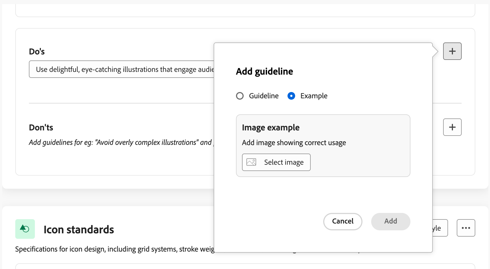

# ブランドの構築と管理 {#brand-library}

ブランドを定義し、視覚的および口頭でのアイデンティティを確立するための詳細なルールと基準を提供します。 これらのガイドラインでは、あらゆるマーケティングプラットフォームとコミュニケーションプラットフォームで一貫したブランド表現を維持するための参考資料を提供します。 明確に定義されたブランドガイドラインを活用することで、あらゆるコンテンツ制作の取り組みが、戦略目標とブランドアイデンティティ全体に沿ったものにすることができます。 この一貫性は、ブランド認知度と信頼性を向上させるだけでなく、あらゆる顧客接点をまたいで、より全体的に一貫性のあるインパクトのある顧客体験を実現するのに役立ちます。

Journey Optimizer B2B editionでは、ブランド定義やアセットを手動で定義して整理したり、ブランドガイドラインドキュメントをアップロードして自動情報やビジュアルアセット抽出を行うことができます。

>[!AVAILABILITY]
>
>この機能は現在、プライベートベータ版として利用可能で、今後のリリースですべてのお客様にプログレッシブな可用性が計画されています。
>
> 
>
>Adobe Journey Optimizer B2B editionでAIを活用した機能を使用するには、事前に[使用許諾契約書](https://www.adobe.com/legal/licenses-terms/adobe-dx-gen-ai-user-guidelines.html){target="_blank"}が必要です。 詳しくは、アドビ担当者にお問い合わせください。
>
> 
>
>製品管理者がこれらの機能を有効にする方法について詳しくは、[&#x200B; ブランド関連の権限](./brands-overview.md#brand-related-permissions)を参照してください。

## ブランドライブラリへのアクセス

Adobe Journey Optimizer B2B editionのブランドキットにアクセスするには、左側のナビゲーションで「**[!UICONTROL コンテンツ管理]**」/「**[!UICONTROL ブランド]**」をクリックします。 このアクションを実行すると、作成したブランドがカードとして表示されるページが開きます。

{width="800" zoomable="yes"}

ブランドがまだ作成されていない場合は、最初のブランドを作成[&#128279;](#create-and-define-a-brand)するためのボタンが付いた1つのグラフィックが表示されます。

### ブランド管理のアクション

各カードについて、_詳細メニュー_ （）アイコンをクリックし、ブランドのアクションを選択できます。

* **[!UICONTROL ブランドを表示]** - ブランドページを開き、定義を表示します。
* **[!UICONTROL 既定のブランドとしてマーク]** （ライブのみ） - [&#x200B; コンテンツの調整と生成のために、既定の](#default-brand)としてブランドをマークします。
* **[!UICONTROL 編集]** - ブランドページを開き、ブランドガイドライン、除外、および例を編集します。
* **[!UICONTROL 複製]** - コピーを新しいドラフトブランドとして作成します。
* **[!UICONTROL 公開]** （ドラフトのみ） - [&#x200B; ブランドを公開](#publish-the-brand)して、コンテンツの調整と生成で使用できるようにします。
* **[!UICONTROL 非公開]** （ライブのみ） – ブランドを非公開にして、コンテンツの調整と生成に使用しないようにします。
* **[!UICONTROL 削除]** - ブランドライブラリからブランドを削除します。

{width="440"}

### Default brand

You can designate a default brand to be automatically applied when generating content and calculating alignment scores during content creation. Only a published (_Live_) brand can be the default.

In the Brands library, the default brand card is displayed with a flag.

{width="200"}

You can set any published (_Live_) brand as the default brand. On the brand card, click the _More menu_ (  ) icon and choose **[!UICONTROL Mark as default brand]**.

{width="350"}

## ブランドの作成と定義 {#create-brand}

>[!CONTEXTUALHELP]
>id="ajo-b2b_brands_create"
>title="ブランドの作成"
>abstract="ブランド名を入力し、ブランドガイドラインファイルをアップロードします。 このツールは重要な詳細を自動的に抽出するので、ブランドのアイデンティティを維持しやすくなります。"

To create and define your brand guidelines, you can either enter the details or upload your brand guideline documents to use for automatic extraction.

### Add the brand

1. At the top-right of the _[!UICONTROL Brands]_ page, click **[!UICONTROL Create brand]**.

1. ブランドの&#x200B;**[!UICONTROL 名前]**&#x200B;を入力します。

1. ファイルをドラッグ＆ドロップまたは選択し、ブランドガイドラインをアップロードして、関連するブランド情報を自動的に抽出します。

   {width="500"}

   >[!NOTE]
   >
   >If you don&#39;t have a document saved in PDF format, you can manually add the guidelines and upload individual visual assets after brand creation.

1. 「**[!UICONTROL ブランドを作成]**」をクリックします。

   If you include one or more files to create the brand, the information extraction process begins. It may take several minutes to complete.

   When the extraction process is complete, your content and visual creation standards are automatically populated.

   {width="700" zoomable="yes"}

### Refine and update the brand guidelines

1. Browse through the different tabs to adapt and define more detailed information as needed.

   * [!UICONTROL 概要]

   * [[!UICONTROL About the brand]](#about-the-brand)

   * [[!UICONTROL Writing style]](#writing-style)

   * [[!UICONTROL Visual content]](#visual-content)

   If you included one or more documents when you created the brand, the information extraction process created definitions for the tabs and sections. The completeness depends on the scope and details included in any documents. As you review the result, you can change or remove any of the information.

   From the  _More menu_ (  ) for each tab or category, you can add documents to extract relevant brand information automatically. You can also clear the existing content.

   {width="500" zoomable="yes"}

   If you want to review the source for the extracted information in a sub-section, click the **[!UICONTROL View source]** link.

   {width="700" zoomable="yes"}

1. In each details tab, review the categories and improve the brand by adding, removing, and changing your definitions.

   A sub-section labeled **[!UICONTROL Do&#39;s]** outlines the guidelines for the category. Use this area to add guideline descriptions and examples of the guidelines.

   {width="500" zoomable="yes"}

   A sub-section labeled **[!UICONTROL Don&#39;ts]** outlines the exclusions. Use this area to add exclusion descriptions and examples of the exclusions.

   {width="500" zoomable="yes"}

   * **Add a guideline or exclusion**.

     In the section where you want to add a guideline, click the _Add_ (  ) icon on the right. In the popup dialog, enter the guideline and select the checkboxes to designate the channels and elements for which the guideline applies. Then, click **[!UICONTROL Add]**.

     {width="600" zoomable="yes"}

   * **Change a guideline or exclusion**.

     In the section where you want to remove a guideline, click the guideline widget. In the popup dialog, change the content for the guideline and the selected checkboxes as needed. Then, click **[!UICONTROL Update]**.

     {width="600" zoomable="yes"}

   * **Remove a guideline or exclusion**.

     In the section where you want to remove a guideline, click the guideline widget. In the popup dialog, click the _Delete_  (  ) icon at the top.

   * **Add or revise examples of your guidelines and exclusions**.

     In the displayed example tile, click the _Edit_ (  ) icon to change the example, or click the _Delete_ (  ) icon to remove it.

1. When you have everything defined, click **[!UICONTROL Save]**.

   You can continue to make changes to the draft brand until you decide it is ready to publish.

### Publish the brand

When your brand includes a complete set of definitions and meets your requirements, click **[!UICONTROL Publish]** to make your brand guidelines available for content alignment and generation.

Published brands are accessible from the **[!UICONTROL Brand]** option in the AI [brand alignment](./brand-alignment.md) and content generation tools. <!-- [Learn more about content generation](gs-generative.md) -->

{width="300"}

## Brand definitions

The brand definitions are organized into three categories, displayed as tabs. Select each tab to complete and update the brand guidelines.

### ブランドについて {#about-brand}

Use the **[!UICONTROL About the brand]** tab to establish the core identity of your brand. This information outlines its purpose, personality, tagline, and other high-level attributes.

1. Add the foundational information for your brand in the **[!UICONTROL Key details]** category:

   * **[!UICONTROL Brand kit name]** - Update the brand name.

   * **[!UICONTROL When to use]** - Specify scenarios or contexts where this brand should be applied.

   * **[!UICONTROL Brand name]** - Enter the official name of the brand.

   * **[!UICONTROL Description of this brand]** - Provide an overview of what this brand represents.

   * **[!UICONTROL Tagline (Default)]** - Add the primary tagline associated with the brand.

   {width="600" zoomable="yes"}

1. **[!UICONTROL 基本原則]**&#x200B;カテゴリで、ブランドのコアとなる方向性と哲学を明確にします。

   * **[!UICONTROL Mission]** - Detail the brand purpose.

   * **[!UICONTROL Vision]** - Describe the long-term goal or desired future state.

   * **[!UICONTROL Market positioning]** - Explain how the brand is positioned in the market.

   {width="600" zoomable="yes"}

   **[!UICONTROL コアブランド値]** カテゴリから、定義されたブランド値を確認し、必要に応じて調整します。

   * 新しいコア値を定義するには、右側の「_追加_」（）アイコンをクリックし、詳細を入力します。

     {width="500" zoomable="yes"}

      * **[!UICONTROL 値]** - コアブランド値の名前を入力します。

      * **[!UICONTROL 説明]** – この値がブランドにとって何を意味するのかを説明します。

      * **[!UICONTROL ビヘイビアー]** – 実際にこの値を反映するアクションまたは態度を概説します。

      * **[!UICONTROL 表示]** – この値が実際のブランディングでどのように表現されるかの例を提供します。

   * コア値を変更または削除するには、_編集_ （）アイコンをクリックして、コアブランド値を更新または削除します。

     {width="500" zoomable="yes"}

     詳細を変更し、**[!UICONTROL 更新]**&#x200B;をクリックします。 または、上部の&#x200B;_削除_ （）アイコンをクリックして、コア値を削除します。

1. 「**[!UICONTROL ブランドガイドライン文書]**」カテゴリで、ブランドガイドラインの生成に使用した文書を確認します。

   その他メニューアイコンをクリックし、アップロードした参照ドキュメントを使用してブランドガイドラインを更新するオプションを選択します。

   * **[!UICONTROL ガイドラインを再抽出]** – 現在のドキュメントを使用して抽出ジョブを実行するには、このアクションを選択します。
   * **[!UICONTROL 抽出用の参照を追加]** – このアクションを選択すると、別の文書をアップロードして抽出ジョブを実行できます。

   {width="600" zoomable="yes"}

[書き方](#writing-style)または[&#x200B; ビジュアルコンテンツ &#x200B;](#visual-content)のガイドライン、除外事項、および例を絞り込むか、[&#x200B; ブランドを公開](#publish-the-brand)できます。

### 文体 {#writing-style}

>[!CONTEXTUALHELP]
>id="ajo_brand_writing_style"
>title="文体整合性スコア"
>abstract="「文体」セクションで、言語、書式設定、構造の標準を定義することで、明確で一貫性のあるコンテンツを保証します。 整合性スコアは高から低までの評価で、コンテンツがこれらのガイドラインにどのくらい適切に準拠しているかを示し、改善が必要な領域を強調します。"

_[!UICONTROL 文体]_&#x200B;の定義は、コンテンツを記述するための標準の概要を示し、すべてのマテリアルで明瞭性、一貫性、一貫性を維持するために、言語、書式設定、構造をどのように使用すべきかを詳しく説明しています。

「**[!UICONTROL 書き方]**」タブを選択し、各カテゴリを確認します。

{width="600" zoomable="yes"}

| カテゴリ | サブカテゴリ | ガイドラインの例 | 除外の例 |
|----------------------------|----------------|-----------------------|-----------------------|
| [!UICONTROL &#x200B; ブランドコミュニケーションスタイル &#x200B;] | [!UICONTROL &#x200B; ブランドパーソナリティ特性] | わかりやすくて、親しみやすい。 | 弱気な印象を与えない。 |
|                            | [!UICONTROL 機械学習の書き込み] | 文章を短く、効果的なものにする。 | 過度に専門用語を使用しない。 |
|                            | [!UICONTROL 状況トーン &#x200B;] | 危機管理コミュニケーションではプロフェッショナルなトーンを維持する。 | サポートコミュニケーションで軽視しない。 |
|                            | [!UICONTROL 単語の選択ガイドライン &#x200B;] | _innovative_&#x200B;や&#x200B;_smart_&#x200B;などの単語を使用します。 | _安い_&#x200B;や&#x200B;_ハック_&#x200B;などの単語は避けます。 |
|                            | [!UICONTROL 言語標準] | 米国英語の慣例に従う。 | 英国と米国のスペルを混在させない。 |
| [!UICONTROL &#x200B; ブランドメッセージ標準] | [!UICONTROL &#x200B; ブランドメッセージ標準] | 革新性と顧客第一のメッセージをハイライト表示する。 | 製品の機能を過度に約束しない。 |
|                            | [!UICONTROL 件名の使用状況] | すべてのデジタルマーケティングアセットのロゴの下にタグラインを配置する。 | タグラインを変更または翻訳しない。 |
|                            | [!UICONTROL &#x200B; コアメッセージ &#x200B;] | 生産性の向上など、主なメリットに関する声明を重視する。 | 無関係なバリューの提案を使用しない。 |
|                            | [!UICONTROL 命名規則] | _ProScheduler_&#x200B;など、わかりやすい名前を使用します。 | 複雑な用語や特殊文字を使用しない。 |
| [!UICONTROL 法的遵守基準] | [!UICONTROL 商標基準] | 常に ™ または ® 記号を使用する。 | 必要な場合は法的記号を省略しない。 |
|                            | [!UICONTROL 著作権基準] | マーケティング資料に著作権通知を含める。 | 権限がない場合は、サードパーティのコンテンツを使用しない。 |
|                            | [!UICONTROL 免責基準] | デジタルアセットに免責事項を読みやすく表示する。 | 免責事項を非表示の領域に配置しない。 |

<!-- #### Preferred and avoided terms

Supplement your work choice guidelines by adding preferred and avoided terms. 

#### Primary tagline and variations

#### Brand names and variations

#### Approved and restricted statements
-->

### 視覚的コンテンツ {#visual-content}

>[!CONTEXTUALHELP]
>id="ajo-b2b_brand_imagery"
>title="視覚的コンテンツ整合性スコア"
>abstract="視覚的コンテンツ整合性スコアは、コンテンツが設定されたブランドガイドラインにどのくらい適切に準拠しているかを示します。 高から低までの評価により、一目で整合性を評価するのに役立ちます。 異なるカテゴリを調べて、改善するべき領域を識別し、ブランドにそぐわない可能性のある要素を特定します。"

_[!UICONTROL ビジュアルコンテンツ]_&#x200B;の定義では、画像とデザインの基準の概要と、統一された一貫性のあるブランドの外観を維持するために必要な仕様を詳しく説明しています。

「**[!UICONTROL ビジュアルコンテンツ]**」タブを選択し、各カテゴリを確認します。

{width="600" zoomable="yes"}

| カテゴリ | ガイドラインの例 | 除外の例 |
|------------------------|---------------------|---------------------|
| [!UICONTROL 写真基準] | 屋外撮影には自然光を使用する。 | 過度に編集された画像やピクセル化された画像を使用しない。 |
| [!UICONTROL &#x200B; イラスト基準] | 無駄のない、ミニマルなスタイルを使用する。 | 過度に複雑なイラストを使用しない。 |
| [!UICONTROL &#x200B; アイコン標準] | 一貫性のある 24 ピクセルのグリッドシステムを使用する。 | アイコンの寸法を混在させたり、異なる太さの線を使用したり、グリッドルールから逸脱したりしない。 |
| [!UICONTROL 使用ガイドライン &#x200B;] | 実際の顧客がプロフェッショナルな環境で製品を使用する様子を反映したライフスタイル画像を選択する。 | ブランドのトーンに矛盾する画像や、コンテキストから外れた画像を使用しない。 |

<!-- #### Styles

To define the overall style for the category, click **[!UICONTROL Add style]**. In the popup dialog, enter the style type and description. 

{width="500" zoomable="yes"}

#### Specifications

-->

#### 画像例

正しいまたは正しくない使用方法を示す画像を追加するには、_[!UICONTROL ガイドラインを追加]_&#x200B;または&#x200B;_[!UICONTROL 除外を追加]_ ポップアップダイアログで&#x200B;**[!UICONTROL 例]**&#x200B;を選択します。 **[!UICONTROL 画像を選択]**&#x200B;をクリックして、システムから画像ファイルを選択します。 **[!UICONTROL 追加]**&#x200B;をクリックして画像をアップロードし、領域のサムネールを表示します。

{width="500" zoomable="yes"}

## 公開ブランドの編集

公開済み（ライブ）ブランドに変更を加えることはできませんが、ドラフトコピーを作成して編集することはできます。 ドラフトを編集内容を含めて公開すると、そのバージョンがライブバージョンに置き換わります。

1. ブランドページを開き、右上の「**[!UICONTROL ブランドを編集]**」をクリックします。

1. 確認ダイアログで、「**[!UICONTROL ブランドを編集]**」をクリックします。

   このアクションは、ブランドのドラフトコピーを作成します。

1. 必要に応じてブランド情報を更新するには、様々なタブを参照します。

   * 概要

   * [ブランドについて](#about-the-brand)

   * [文体](#writing-style)

   * [視覚的コンテンツ](#visual-content)

1. ドラフトの更新を操作する際に&#x200B;**[!UICONTROL 保存]**&#x200B;をクリックし、_ライブ_&#x200B;版を置き換える準備ができたら&#x200B;**[!UICONTROL 公開]**&#x200B;をクリックします。
