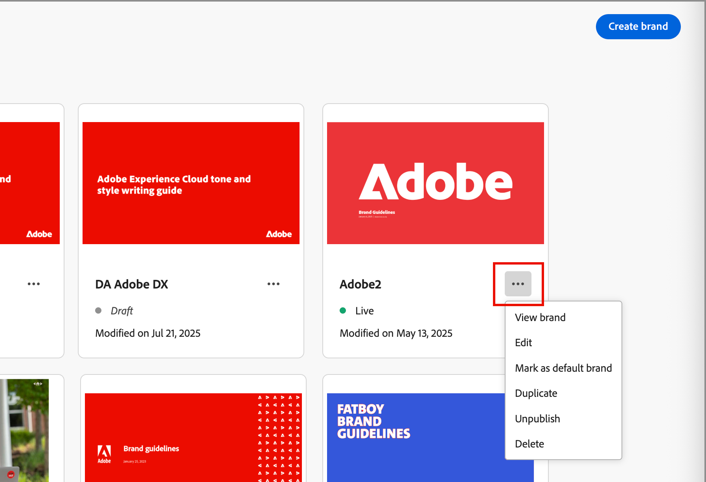

# ブランドの作成と管理 {#brand-library}

ブランドを定義して、視覚的および言語的なアイデンティティを確立する詳細なルールと標準を提供します。 これらのガイドラインは、すべてのマーケティングプラットフォームおよびコミュニケーションプラットフォームで一貫したブランド表現を維持するための参照を提供します。 明確に定義されたブランドガイドラインを活用することで、組織は、すべてのコンテンツ作成作業を戦略的目標と全体的なブランドアイデンティティに関連付けることができます。 この一貫性は、ブランドの認識と信頼を高めるだけでなく、すべてのタッチポイントをまたいで、より包括的で影響力のある顧客体験に貢献します。

Journey Optimizer B2B editionでは、ブランド定義やアセットを手動で定義および整理したり、ブランドのガイドラインに関するドキュメントをアップロードして、情報を自動的に取得したり、視覚的にアセットを抽出したりできます。

>[!AVAILABILITY]
>
>この機能は現在、プライベートベータ版として利用でき、今後のリリースですべてのお客様に段階的に提供される予定です。
>
> 
>
>Adobe Journey Optimizer B2B editionで AI を利用した機能を使用するには、[ ユーザー使用許諾契約 ](https://www.adobe.com/legal/licenses-terms/adobe-dx-gen-ai-user-guidelines.html){target="_blank"} が必要です。 詳しくは、アドビ担当者にお問い合わせください。
>
> 
>
>製品管理者がこれらの機能を有効にする方法については、[ ブランド関連の権限 ](./brands-overview.md#brand-related-permissions) を参照してください。

## ブランドライブラリへのアクセス

Adobe Journey Optimizer B2B editionでブランドキットにアクセスするには、左側のナビゲーションに移動して、**[!UICONTROL コンテンツ管理]**/**[!UICONTROL ブランド]** をクリックします。 このアクションにより、作成されたブランドがカードとして表示されるページが開きます。

{width="800" zoomable="yes"}

まだブランドが作成されていない場合は、「最初のブランドを作成 [ するためのボタンが 1 つのグラフィックに表示され ](#create-and-define-a-brand) す。

### ブランド管理のアクション

各カードについて、_その他メニュー_ （）アイコンをクリックし、ブランドのアクションを選択できます。

* **[!UICONTROL ブランドを表示]** - ブランドページを開いて、定義を表示します。
* **[!UICONTROL デフォルトブランドとしてマーク]** （ライブのみ） – コンテンツの整列と生成では、[ ブランドをデフォルトとしてマーク ](#default-brand) します。
* **[!UICONTROL 編集]** - ブランドページを開き、ブランドガイドライン、除外、例を編集します。
* **[!UICONTROL 複製]** - コピーを新しいドラフトブランドとして作成します。
* **[!UICONTROL 公開]** （ドラフトのみ） – [ ブランドを公開 ](#publish-the-brand) して、コンテンツの整列や生成で使用できるようにします。
* **[!UICONTROL 非公開]** （ライブのみ） – ブランドを非公開にして、コンテンツの整列と生成に使用されないようにします。
* **[!UICONTROL 削除]** - ブランドライブラリからブランドを削除します。

{width="440"}

### デフォルトのブランド

コンテンツの生成時およびコンテンツ作成時の整合性スコアの計算時に自動的に適用されるデフォルトブランドを指定できます。 デフォルト設定できるのは、公開済み（_ライブ_）のブランドのみです。

ブランド ライブラリでは、デフォルトのブランドカードがフラグと共に表示されます。

{width="200"}

公開されている（_ライブ_）ブランドをデフォルトのブランドとして設定できます。 ブランドカードで、「_その他メニュー_ （）」アイコンをクリックし、「**[!UICONTROL デフォルトブランドとしてマーク]**」を選択します。

{width="350"}

## ブランドの作成と定義 {#create-brand}

>[!CONTEXTUALHELP]
>id="ajo-b2b_brands_create"
>title="ブランドの作成"
>abstract="ブランド名を入力し、ブランドガイドラインファイルをアップロードします。このツールは重要な詳細を自動的に抽出するので、ブランドのアイデンティティを維持しやすくなります。"

ブランドガイドラインを作成して定義するには、詳細を入力するか、ブランドガイドラインドキュメントをアップロードして、自動抽出に使用します。

### ブランドを追加

1. _[!UICONTROL ブランド]_ ページの右上にある「**[!UICONTROL ブランドを作成]**」をクリックします。

1. ブランドの&#x200B;**[!UICONTROL 名前]**&#x200B;を入力します。

1. ファイルをドラッグ&amp;ドロップまたは選択してブランドガイドラインをアップロードし、自動的に関連するブランド情報を抽出します。

   {width="500"}

   >[!NOTE]
   >
   >ドキュメントをPDF形式で保存していない場合は、手動でガイドラインを追加し、ブランド作成後に個々のビジュアルアセットをアップロードできます。

1. 「**[!UICONTROL ブランドを作成]**」をクリックします。

   ブランドを作成するために 1 つ以上のファイルを含めると、情報の抽出プロセスが開始されます。 完了するまでに数分かかる場合があります。

   抽出プロセスが完了すると、コンテンツとビジュアル作成標準が自動的に入力されます。

   {width="700" zoomable="yes"}

### ブランドガイドラインの調整と更新

1. 様々なタブを参照して、必要に応じてより詳細な情報を調整および定義します。

   * [!UICONTROL 概要]

   * [[!UICONTROL  ブランドについて ]](#about-the-brand)

   * [[!UICONTROL  ライティングスタイル ]](#writing-style)

   * [[!UICONTROL  ビジュアルコンテンツ ]](#visual-content)

   ブランドの作成時に 1 つ以上のドキュメントを含めた場合、情報抽出プロセスによって、タブとセクションの定義が作成されました。 完全性は、ドキュメントに含まれる範囲と詳細によって異なります。 結果を確認する際に、情報を変更または削除できます。

   各タブまたはカテゴリの _その他メニュー_ （）から、ドキュメントを追加して、関連するブランド情報を自動的に抽出できます。 既存のコンテンツを消去することもできます。

   {width="500" zoomable="yes"}

   サブセクション内の抽出された情報のソースを確認する場合は、「**[!UICONTROL ソースを表示]**」リンクをクリックします。

   {width="700" zoomable="yes"}

1. 各詳細タブで、カテゴリを確認し、定義を追加、削除、変更してブランドを向上させます。

   **[!UICONTROL Do&#39;s]** というラベルの付いたサブセクションは、カテゴリのガイドラインの概要を示します。 この領域を使用して、ガイドラインの説明とガイドラインの例を追加します。

   {width="500" zoomable="yes"}

   **[!UICONTROL 適用しない]** というラベルの付いたサブセクションが除外の概要を示します。 この領域を使用して、除外の説明と除外例を追加します。

   {width="500" zoomable="yes"}

   * **ガイドラインまたは除外を追加** します。

     ガイドラインを追加するセクションで、右側の _追加_ （） アイコンをクリックします。 ポップアップダイアログで、ガイドラインを入力し、チェックボックスを選択して、ガイドラインを適用するチャネルと要素を指定します。 次に、「**[!UICONTROL 追加]** をクリックします。

     {width="600" zoomable="yes"}

   * **ガイドラインまたは除外の変更**。

     ガイドラインを削除するセクションで、ガイドラインウィジェットをクリックします。 ポップアップダイアログで、必要に応じてガイドラインのコンテンツと選択したチェックボックスを変更します。 次に、「**[!UICONTROL 更新]**」をクリックします。

     {width="600" zoomable="yes"}

   * **ガイドラインまたは除外を削除**。

     ガイドラインを削除するセクションで、ガイドラインウィジェットをクリックします。 ポップアップダイアログで、上部の _削除_ （）アイコンをクリックします。

   * **ガイドラインと除外の例を追加または改訂します**。

     表示されたサンプルタイルで、「_編集_ （）」アイコンをクリックしてサンプルを変更するか、「_削除_ （）」アイコンをクリックして削除します。

1. すべてを定義したら、「**[!UICONTROL 保存]**」をクリックします。

   ドラフトブランドを公開する準備が整ったと判断するまで、ドラフトブランドに変更を加え続けることができます。

### ブランドの公開

ブランドが定義の完全なセットを含み、要件を満たしたら、「**[!UICONTROL 公開]**」をクリックして、ブランドガイドラインをコンテンツの調整および生成に使用できるようにします。

公開済みのブランドには、AI **[!UICONTROL ブランドの整合性]** およびコンテンツ生成ツールの [ ブランド ](./brand-alignment.md) オプションからアクセスできます。<!-- [Learn more about content generation](gs-generative.md) -->

{width="300"}

## ブランド定義

ブランド定義は 3 つのカテゴリに分類され、タブとして表示されます。 各タブを選択して、ブランドガイドラインを完成および更新します。

### ブランドについて {#about-brand}

**[!UICONTROL ブランドについて]** タブを使用して、ブランドのコア ID を確立します。 この情報には、その目的、性格、タグライン、その他の高レベルの属性の概要が記載されています。

1. ブランドの基本情報を **[!UICONTROL キーの詳細]** カテゴリに追加します。

   * **[!UICONTROL ブランドキット名]** - ブランド名を更新します。

   * **[!UICONTROL 使用する場合]** – このブランドを適用するシナリオまたはコンテキストを指定します。

   * **[!UICONTROL ブランド名]** - ブランドの正式名称を入力します。

   * **[!UICONTROL このブランドの説明]** – このブランドが表すものの概要を提供します。

   * **[!UICONTROL タグライン （デフォルト）]** - ブランドに関連付けられているメインのタグラインを追加します。

   {width="600" zoomable="yes"}

1. **[!UICONTROL 基本原則]**&#x200B;カテゴリで、ブランドのコアとなる方向性と哲学を明確にします。

   * **[!UICONTROL ミッション]** - ブランドの目的を詳しく説明します。

   * **[!UICONTROL ビジョン]** – 長期目標または望ましい将来の状態を説明します。

   * **[!UICONTROL 市場での位置づけ]** - ブランドが市場でどのように位置づけられているかを説明します。

   {width="600" zoomable="yes"}

   **[!UICONTROL コアブランド値]** カテゴリから、定義されたブランド値を確認し、必要に応じて調整します。

   * 新しいコア値を定義するには、右側の _追加_ （） アイコンをクリックし、詳細を入力します。

     {width="500" zoomable="yes"}

      * **[!UICONTROL 値]** - コアブランド値の名前を入力します。

      * **[!UICONTROL 説明]** – この値がブランドに対して何を意味するかを説明します。

      * **[!UICONTROL 動作]** – 実際にこの値を反映する行動や態度の概要を説明します。

      * **[!UICONTROL 臨床像]** – この値が実際のブランディングでどのように表現されるかの例を示します。

   * コア値を変更または削除するには、_編集_ （） アイコンをクリックして、コアブランド値を更新または削除します。

     {width="500" zoomable="yes"}

     詳細を変更し、「**[!UICONTROL 更新]**」をクリックします。 または、上部の _削除_ （）アイコンをクリックして、コア値を削除します。

1. **[!UICONTROL ブランドガイドラインドキュメント]** カテゴリで、ブランドガイドラインの生成に使用するドキュメントを確認します。

   「詳細」メニューアイコンをクリックし、アップロードされた参照ドキュメントを使用してブランドガイドラインを更新するオプションを選択します。

   * **[!UICONTROL ガイドラインを再抽出]** – 現在のドキュメントを使用して抽出ジョブを実行する場合は、このアクションを選択します。
   * **[!UICONTROL 抽出用に参照を追加]** – 別のドキュメントをアップロードして抽出ジョブを実行する場合は、このアクションを選択します。

   {width="600" zoomable="yes"}

[ ライティングスタイル ](#writing-style) または [ ビジュアルコンテンツ ](#visual-content) ガイドライン、除外および例を絞り込んだり、[ ブランドを公開 ](#publish-the-brand) したりできます。

### 文体 {#writing-style}

>[!CONTEXTUALHELP]
>id="ajo_brand_writing_style"
>title="文体整合性スコア"
>abstract="「文体」セクションで、言語、書式設定、構造の標準を定義することで、明確で一貫性のあるコンテンツを保証します。整合性スコアは高から低までの評価で、コンテンツがこれらのガイドラインにどのくらい適切に準拠しているかを示し、改善が必要な領域を強調します。"

_[!UICONTROL ライティングスタイル]_ の定義は、コンテンツを記述する際の標準を概説し、すべての資料の明確さ、一貫性、一貫性を維持するために言語、書式設定、構造を使用する方法を詳しく説明します。

**[!UICONTROL ライティングスタイル]** タブを選択し、各カテゴリを確認します。

{width="600" zoomable="yes"}

| カテゴリ | サブカテゴリ | ガイドラインの例 | 除外の例 |
|----------------------------|----------------|-----------------------|-----------------------|
| [!UICONTROL  ブランドコミュニケーションスタイル ] | [!UICONTROL  ブランドパーソナリティ特性 ] | わかりやすくて、親しみやすい。 | 弱気な印象を与えない。 |
|                            | [!UICONTROL  ライティングメカニクス ] | 文章を短く、効果的なものにする。 | 過度に専門用語を使用しない。 |
|                            | [!UICONTROL  状況に応じたトーン ] | 危機管理コミュニケーションではプロフェッショナルなトーンを維持する。 | サポートコミュニケーションで軽視しない。 |
|                            | [!UICONTROL  単語選択ガイドライン ] | _革新的_、_スマート_ などの言葉を使用します。 | 「安い _や_ ハック _などの言葉は避け_ ください。 |
|                            | [!UICONTROL  言語基準 ] | 米国英語の慣例に従う。 | 英国と米国のスペルを混在させない。 |
| [!UICONTROL  ブランドメッセージの標準 ] | [!UICONTROL  ブランドメッセージの標準 ] | 革新性と顧客第一のメッセージをハイライト表示する。 | 製品の機能を過度に約束しない。 |
|                            | [!UICONTROL  タグラインの使用状況 ] | すべてのデジタルマーケティングアセットのロゴの下にタグラインを配置する。 | タグラインを変更または翻訳しない。 |
|                            | [!UICONTROL  コアメッセージング ] | 生産性の向上など、主なメリットを強調します。 | 無関係なバリューの提案を使用しない。 |
|                            | [!UICONTROL  命名基準 ] | _ProScheduler_ など、わかりやすい簡単な名前を使用します。 | 複雑な用語や特殊文字を使用しない。 |
| [!UICONTROL  法令等遵守基準 ] | [!UICONTROL  商標基準 ] | 常に ™ または ® 記号を使用する。 | 必要な場合は法的記号を省略しない。 |
|                            | [!UICONTROL  著作権基準 ] | マーケティング資料に著作権通知を含める。 | 権限がない場合は、サードパーティのコンテンツを使用しない。 |
|                            | [!UICONTROL  免責基準 ] | デジタルアセットに免責事項を読みやすく表示する。 | 免責事項を非表示の領域に配置しない。 |

<!-- #### Preferred and avoided terms

Supplement your work choice guidelines by adding preferred and avoided terms. 

#### Primary tagline and variations

#### Brand names and variations

#### Approved and restricted statements
-->

### 視覚的コンテンツ {#visual-content}

>[!CONTEXTUALHELP]
>id="ajo-b2b_brand_imagery"
>title="視覚的コンテンツ整合性スコア"
>abstract="視覚的コンテンツ整合性スコアは、コンテンツが設定されたブランドガイドラインにどのくらい適切に準拠しているかを示します。高から低までの評価により、一目で整合性を評価するのに役立ちます。異なるカテゴリを調べて、改善するべき領域を識別し、ブランドにそぐわない可能性のある要素を特定します。"

_[!UICONTROL 視覚的コンテンツ]_ の定義は、画像とデザインの標準を概説し、統一された一貫性のあるブランドの外観を維持するために必要な仕様を詳細に説明します。

**[!UICONTROL ビジュアルコンテンツ]** タブを選択し、各カテゴリを確認します。

{width="600" zoomable="yes"}

| カテゴリ | ガイドラインの例 | 除外の例 |
|------------------------|---------------------|---------------------|
| [!UICONTROL  写真撮影基準 ] | 屋外撮影には自然光を使用する。 | 過度に編集された画像やピクセル化された画像を使用しない。 |
| [!UICONTROL  図解の規格 ] | 無駄のない、ミニマルなスタイルを使用する。 | 過度に複雑なイラストを使用しない。 |
| [!UICONTROL  アイコン規格 ] | 一貫性のある 24 ピクセルのグリッドシステムを使用する。 | アイコンの寸法を混在させたり、異なる太さの線を使用したり、グリッドルールから逸脱したりしない。 |
| [!UICONTROL  使用ガイドライン ] | 実際の顧客がプロフェッショナルな環境で製品を使用する様子を反映したライフスタイル画像を選択する。 | ブランドのトーンに矛盾する画像や、コンテキストから外れた画像を使用しない。 |

<!-- #### Styles

To define the overall style for the category, click **[!UICONTROL Add style]**. In the popup dialog, enter the style type and description. 

{width="500" zoomable="yes"}

#### Specifications

-->

#### 画像の例

正しい使用方法または間違った使用方法を示す画像を追加するには、「**[!UICONTROL ガイドラインを追加]**」または「_[!UICONTROL 除外を追加]_ ポップアップダイアログで _[!UICONTROL 例]_ を選択します。 **[!UICONTROL 画像を選択]** をクリックして、システムからファイルを選択して画像を作成します。 **[!UICONTROL 追加]** をクリックして、画像をアップロードし、領域のサムネールを表示します。

{width="500" zoomable="yes"}

## 公開済みブランドの編集

公開済み（ライブ）ブランドは変更できませんが、ドラフトコピーを作成して編集できます。 編集内容を含んだドラフトを公開すると、そのバージョンでライブバージョンが置き換えられます。

1. ブランドページを開き、右上の **[!UICONTROL ブランドを編集]** をクリックします。

1. 確認ダイアログで、「**[!UICONTROL ブランドを編集]**」をクリックします。

   ブランドのドラフトコピーを作成します。

1. 必要に応じて、様々なタブを参照してブランド情報を更新します。

   * 概要

   * [ブランドについて](#about-the-brand)

   * [文体](#writing-style)

   * [視覚的コンテンツ](#visual-content)

1. ドラフトの更新を操作する際は「**[!UICONTROL 保存]**」をクリックします。次に、**[!UICONTROL ライブ]** バージョンを置き換える準備が整ったら「_公開_」をクリックします。
