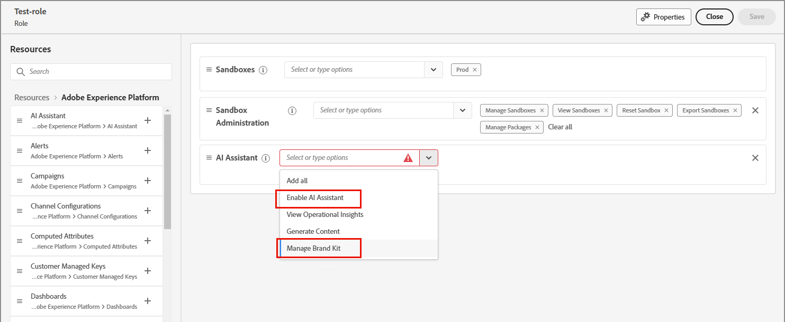

# コンテンツの生成と一貫性に対するブランドの使用 {#brands}

>[!CONTEXTUALHELP]
>id="ajo-b2b_brand_overview"
>title="ブランドの基本を学ぶ"
>abstract="独自のブランドを作成およびカスタマイズして、独自の視覚的および言語的アイデンティティを定義すると同時に、ブランドスタイルやブランドボイスに一致するコンテンツを簡単に生成できるようにします。"

>[!CONTEXTUALHELP]
>id="ajo-b2b_brand_ai_menu"
>title="ブランドの選択"
>abstract="ブランドを選択して、AI で生成されたすべてのコンテンツがブランドの仕様とガイドラインに合わせて調整されるようにします。"

ブランドは、_ブランドアイデンティティ_ を定義するのに役立ち、ブランドアイデンティティ、価値、メッセージを正確に表す、一貫性のある効果的なコンテンツ作成を確実に行うために重要な役割を果たします。 明確に定義されたブランドスタイルに準拠することで、組織はチャネルやタッチポイントをまたいで、凝集して認識可能なブランドプレゼンスを維持し、ターゲットオーディエンス間でのブランド認識、信頼、ロイヤルティを強化できます。

+++ブランドを使用するメリット

組織は、コンテンツを作成および評価する際に、次のようなブランドを使用することで、大きな価値を実現できます。

* **一貫したブランドアイデンティティ** - ブランドガイドラインは、視覚的および言語的なアイデンティティの基本的な設計図として機能します。 ロゴ、カラーパレット、タイポグラフィ、画像スタイル、声のトーンなど、ブランドを認識するコア要素を定義します。 このガイドラインに従うことで、コンテンツ作成者は、web コピー、ソーシャルメディアへの投稿、メールキャンペーンなど、すべてのマーケティング資料に、独自のブランド個性とビジュアルアイデンティティを一貫して反映させることができます。 この一貫性は、ブランド認知度を強化し、ターゲット市場での信頼を構築するのに役立ちます。

* **調整されたメッセージングとポジショニング** - ブランドガイドラインには、通常、ブランド価値の提案、主要なメッセージング柱、ポジショニングステートメントを概説するメッセージングガイドラインが含まれています。 これらのガイドラインに準拠することで、コンテンツ作成者は、コンテンツ内のメッセージがブランドの全体的なポジショニングと価値提案に確実に合致するようにできます。 この一貫したメッセージは、独自のセールスポイントと差別化要因を強化するのに役立ち、顧客がブランド製品を理解して接続しやすくなります。

* **本物のブランドの声とトーン** - ブランドガイドラインには、多くの場合、好ましい声のトーン、コミュニケーションスタイル、言語使用に関する詳細なガイダンスが含まれています。 これらのガイドラインは、コンテンツ作成者がブランドの個性を捉え、フレンドリーで親しみやすい、プロフェッショナルで権威がある、遊び心があり機知に富んでいるかどうかに関係なく、適切なトーンを打つのに役立ちます。 すべてのコンテンツにわたって一貫したブランドの声を維持することは、顧客により本物で魅力的なブランドエクスペリエンスを提供するのに役立ちます。

* **視覚的な統一とブランド認識** - ブランドガイドラインでは、ロゴ、カラーパレット、タイポグラフィ、画像スタイル、レイアウトテンプレートなどの視覚要素について、明確なルールと仕様を提供します。 これらのガイドラインに準拠することで、すべてのビジュアルコンテンツで、統一された認識可能なブランド美学を維持できます。 この視覚的な一貫性は、コンテンツを簡単に識別してブランドに関連付けることができるので、ブランド認識を強化し、顧客との信頼を構築するのに役立ちます。

* **ブランドエクイティと評判の維持** - ブランドガイドラインに一貫して準拠することで、ブランドのエクイティと評判を維持および保護するのに役立ちます。 すべてのコンテンツとマーケティング資料がブランドのアイデンティティ、価値、メッセージを正確に反映することで、ブランドの信頼性が高まり、市場での地位が強化されます。 この公平性と評判は、顧客の忠誠心とアドボカシーの向上につながり、最終的にはブランドの長期的な成功に貢献する可能性があります。

+++

>[!AVAILABILITY]
>
>この機能は現在、プライベートベータ版として利用でき、今後のリリースですべてのお客様に段階的に提供される予定です。
>
>Adobe Journey Optimizer B2B editionで AI を利用した機能を使用するには、[ ユーザー使用許諾契約 ](https://www.adobe.com/legal/licenses-terms/adobe-dx-gen-ai-user-guidelines.html){target="_blank"} が必要です。 詳しくは、アドビ担当者にお問い合わせください。

定義済みのブランドは、クリエイティブチームが視覚的なコンテンツや書き込みコンテンツを作成する際に使用する _真実のソース_ を提供します。 これらのガイドラインがコンパイルされ、ブランドアセットが共有されると、チームメンバーや共同作業者は製品のオンブランドコンテンツを作成できます。 Journey Optimizer B2B editionでオンブランドコンテンツ作成を有効にするには、次のタスクを実行します。

1. ブランド定義を準備します。

   * ブランドの大まかな特徴
   * 文体
   * 視覚的要素

1. この情報を 1 つ以上のPDF ファイルにアセンブリします。

1. PDF ファイルを使用して、Journey Optimizer B2B editionで [ ブランドを作成 ](./brands-manage-create.md#create-and-define-a-brand) します。

1. 使用する準備が整ったら、[ ブランドを公開 ](./brands-manage-create.md#publish-the-brand) します。

1. ブランドを使用して [ メールコンテンツの調整 ](./brand-alignment.md) を行います。
<!-- 
1. Use the brand to generate content. -->

>[!BEGINSHADEBOX]

## ブランド関連の権限

製品管理者は、Adobe Experience Cloudの **[!UICONTROL 権限]** アプリで **[!UICONTROL ブランドキットを管理]** または _AI アシスタントを有効にする_ リソース権限を割り当てることで、ブランド管理およびブランドの連携機能へのアクセスを有効にすることができます。

1. 権限アプリで、「**[!UICONTROL 役割]**」タブに移動し、目的の [ 役割 ](https://experienceleague.adobe.com/ja/docs/experience-platform/access-control/abac/permissions-ui/roles){target="_blank"} を選択します。

1. 「**[!UICONTROL 編集]**」をクリックして、権限を変更します。

1. **[!UICONTROL AI アシスタント]** リソースを追加し、**[!UICONTROL ブランドキットを管理]** または **[!UICONTROL AI アシスタントを有効にする]** を選択します

   >[!NOTE]
   >
   >**[!UICONTROL Ai アシスタントを有効にする]** 権限を持つユーザーは、**[!UICONTROL Brands]** ライブラリに読み取り専用でアクセスできます。

   {width="700" zoomable="yes"}

1. 「**[!UICONTROL 保存]**」をクリックして、変更を適用します。

   役割に既に割り当てられているユーザーの権限は自動的に更新されます。

1. この役割を新しいユーザーに割り当てるには、**[!UICONTROL 役割]** ダッシュボード内の _[!UICONTROL ユーザー]_ タブを選択し、**[!UICONTROL ユーザーを追加]** をクリックします。

   * ユーザー名とメールアドレスを入力するか、リストから既存のユーザーを選択します。

     ユーザーがまだ作成されていない場合は、[Experience Platform ドキュメント ](https://experienceleague.adobe.com/ja/docs/experience-platform/access-control/abac/permissions-ui/users){target="_blank"} を参照してください。

   * 「**[!UICONTROL 保存]**」をクリックして、変更を適用します。

>[!ENDSHADEBOX]
