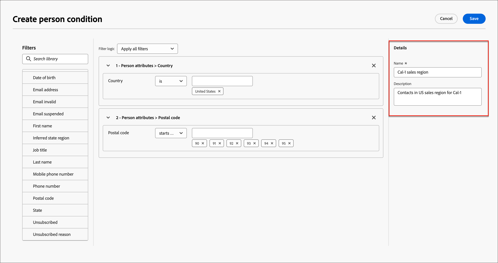

# 条件付きコンテンツ

条件付きコンテンツを使用すると、条件付きルールに基づいてメールコンテンツやフラグメントコンテンツを適応させることができます。 これらのルールは、プロファイル属性またはコンテキストイベントを使用して定義されます。 ルールビルダーで条件付きルールを作成し、アカウントジャーニーをまたいで再利用するのに保存できます。

フラグメントとメールメッセージに条件付きコンテンツを追加するには、Adobe Journey Optimizerで&#x200B;_条件_ ライブラリに保存されている条件付きルールを適用できます。 アカウントジャーニー[&#128279;](./email-authoring.md)または[&#x200B; ビジュアルフラグメント &#x200B;](./fragment-authoring.md)の電子メールコンテンツを作成する際に、ビジュアルデザイン空間内で条件付きルールを適用します。

## 条件付きコンテンツを追加 {#email-fragment-content}

>[!CONTEXTUALHELP]
>id="ajo-b2b_conditional_content"
>title="条件付きコンテンツ"
>abstract="条件付きルールを使用すると、コンテンツコンポーネントのバリアントを複数作成できます。 メッセージの送信時にどの条件も満たされない場合は、デフォルトバリアントのコンテンツが表示されます。"

>[!CONTEXTUALHELP]
>id="ajo-b2b_conditional_rule_select"
>title="条件付きコンテンツ"
>abstract="ライブラリに保存されている条件付きルールを使用するか、新しい条件付きルールを作成します。"

ビジュアルデザイン空間でフラグメントや電子メールを作成する際には、条件付きルールを使用して、コンテンツコンポーネントに複数のバリエーションを定義します。

1. コンテンツコンポーネントを選択し、コンポーネントツールバーの「**[!UICONTROL コンディショナルコンテンツを有効にする]**」アイコンをクリックします。

   コンポーネントは、コンディショナルコンポーネントとしてアクティブ化されていることを示すために、オレンジ色で概略が示されます。 **[!UICONTROL 条件付きコンテンツ]** ペインが左側に表示され、_デフォルトバリアント_&#x200B;と&#x200B;_バリアント - 1_&#x200B;が表示されます。

   {width="700" zoomable="yes"}

   選択してアクティブ化した元のコンテンツはデフォルトであり、定義したバリエーションに対して条件ルールが満たされていない場合に適用されます。

   このペインでは、条件付きルールを使用して、選択したコンテンツコンポーネントに複数のバリエーションを定義できます。

1. 最初のバリアント （_バリアント - 1_）にカーソルを合わせ、_条件を選択_ アイコン （）をクリックします。

   {width="700" zoomable="yes"}

   _[!UICONTROL 条件を選択]_ ダイアログが開き、条件ライブラリが表示されます。

   条件の詳細を表示して目的の条件を確認する場合は、_詳細メニュー_ アイコン （**...**）をクリックします **[!UICONTROL 情報を表示]**&#x200B;を選択します。

   {width="600" zoomable="yes"}

   必要な条件が存在しない場合は、**[!UICONTROL 新規作成]**&#x200B;をクリックして[条件付きルール &#x200B;](#create-condition)を作成します。

1. 条件付きルールを選択し、**[!UICONTROL 選択]**&#x200B;をクリックしてバリアントに関連付けます。

   関連する条件を確認するには、_詳細メニュー_ アイコン （**...**）をクリックします バリエーションを選択し、**[!UICONTROL 条件を表示]**&#x200B;します。

   {width="600" zoomable="yes"}

   右上の「X」をクリックして、ポップアップを閉じます。

   {width="500"}

1. 読みやすくするために、_詳細メニュー_ アイコン （**...**）をクリックして、バリエーションの名前を変更します バリエーションを選択し、**[!UICONTROL 名前を変更]**&#x200B;します。

   バリエーションとその意図を識別するのに役立つ、バリエーションの意味のある名前を入力します。

   {width="600" zoomable="yes"}

1. 左側のペインでバリアントを選択した状態で、条件がtrueの場合にメールメッセージに表示される方法を変更するようにコンポーネントを変更します。

   この例では、テキストコンポーネントのバリアントで、受信者の領域に基づいて異なる説明が使用されています。

   {width="600" zoomable="yes"}

1. 必要に応じて、**[!UICONTROL バリアントを追加]**&#x200B;をクリックして別のバリアントを定義します。

   手順2～5を繰り返して、条件を選択し、バリアントの名前を変更し、バリアントのコンポーネントを変更します。

   コンテンツコンポーネントに必要な数のバリエーションを追加できます。 左側のペインで選択したバリエーションをいつでも変更して、条件に対してコンテンツコンポーネントがどのように表示されるかを確認できます。

   >[!IMPORTANT]
   >
   >条件付きコンテンツは、バリエーションがリストされる順序で、関連するルールに対して評価されます。 trueと評価される条件を持つ最初のバリアントがコンポーネントに使用されます。
   >
   >定義されたバリアント条件のいずれも電子メール送信時にtrueと評価されない場合、コンテンツコンポーネントは&#x200B;**[!UICONTROL デフォルトのバリアント]**&#x200B;に従って表示されます。

1. バリエーションを削除するには、_詳細メニュー_ アイコン （**...**）をクリックします バリエーションを選択し、**[!UICONTROL 削除]**&#x200B;を選択します。

   確認ダイアログで「**[!UICONTROL 削除]**」をクリックします。

## 条件付きルール

条件付きルールは、trueまたはfalseとして評価できる条件式のセットです。 これらのルールを使用して、プロファイル属性やコンテキストイベントなどのさまざまなフィルターにもとづいて、メールメッセージに表示するコンテンツのバリエーションを決定できます。
ルールは条件ライブラリに保存され、メールやフラグメントコンテンツをまたいで組織で再利用できます。
<!--
>[!NOTE]
>
>You need the [Manage Library Items](../administration/ootb-product-profiles.md) permission to save or delete conditional rules. Saved conditions are available for use by all users within an organization.
-->

### 状況フィルター {#condition-filters}

| 状況タイプ | フィルター | 説明 |
| -------------- | ------- | ----------- |
| **アカウント** | アカウント属性 | アカウントプロファイルの属性（以下を含む）: <li>年間売上高</li><li>市町村</li><li>国</li><li>従業員数</li><li>業種</li><li>名前</li><li>SIC コード</li><li>状態</li> |
| | [!UICONTROL 特殊フィルター] > [!UICONTROL 購買グループ &#x200B;]があります | アカウントに購買グループのメンバーが存在しないか、存在しません。 フィルターは、次の1つ以上の基準に対して評価することもできます。 <li>ソリューションへの関心</li><li>購買グループのステータス</li><li>完全性スコア</li><li>エンゲージメントスコア</li> |
| **顧客** | [!UICONTROL &#x200B; アクティビティ履歴] > [!UICONTROL 電子メール &#x200B;] | ジャーニーに関連付けられたメールアクティビティ： <li>[!UICONTROL 電子メール内のリンクをクリック &#x200B;]</li><li>メール開封済み</li><li>メール配信済み</li><li>メールを送信済み</li> これらの条件は、ジャーニーの初期段階で選択したメールメッセージを使用して評価されます。 |
|  | [!UICONTROL 人物の属性] | 人物プロファイルの属性（以下を含む）: <li>市町村</li><li>国</li><li>生年月日</li><li>メールアドレス</li><li>メール無効</li><li>メール中断済み</li><li>名</li><li>推測される都道府県 / 地域</li><li>役職</li><li>姓</li><li>携帯電話番号</li><li>電話番号</li><li>郵便番号</li><li>状態</li><li>購読解除完了</li><li>登録解除の理由</li> |
| | [!UICONTROL 特殊フィルター] > [!UICONTROL 購買グループのメンバー] | 個人が購買グループのメンバーであるか、またはメンバーでない場合は、次の基準の1つ以上に対して評価されます。 <li>ソリューションへの関心</li><li>購買グループのステータス</li><li>完全性スコア</li><li>エンゲージメントスコア</li><li>が削除されました</li><li>役割</li> |

### 条件付きルールの作成 {#create-condition}

>[!CONTEXTUALHELP]
>id="ajo-b2b_conditions_rule_editor"
>title="条件の作成"
>abstract="属性とコンテキストイベントを組み合わせて、メールメッセージに表示するコンテンツバリアントを決定するルールを作成します。"

コンポーネントバリアントの条件を選択する際に、メールデザインスペースから条件付きルールビルダーにアクセスできます。

1. _[!UICONTROL 条件を選択]_ ダイアログで、**[!UICONTROL 新規作成]**&#x200B;をクリックし、条件タイプを選択します。

   * **[!UICONTROL 人物の条件]** – このタイプを選択して、人物の属性とコンテキストイベントを使用して条件ルールを構築します。
   * **[!UICONTROL アカウント条件]** - アカウント属性を使用して条件付きルールを作成するには、このタイプを選択します。

   {width="600" zoomable="yes"}

1. 必要に応じて、条件付きルールを作成します。

   ルールに含める属性またはイベントごとに、アイテムをルールキャンバスにドラッグ&amp;ドロップします。 フィルターを展開し、式を完了します。

   {width="600" zoomable="yes"}

   複数のフィルターを含める場合は、**[!UICONTROL フィルターロジック]**&#x200B;を設定します。

   * **[!UICONTROL すべてのフィルターを適用]** - ルールは、**すべて**&#x200B;のフィルターがtrueの場合にtrueと評価されます。
   * **[!UICONTROL 任意のフィルターを適用]** - フィルターの&#x200B;**any**&#x200B;がtrueの場合、ルールはtrueと評価されます。

1. 右側で、ルールの&#x200B;**[!UICONTROL Name]**&#x200B;と&#x200B;**[!UICONTROL Description]** （オプション）を入力します。

   意味のある名前と便利な説明を使用して、組織内の他のユーザーが別の重複する条件を作成する代わりにそれを再利用できるようにします。

   {width="600" zoomable="yes"}

1. 条件付きルールが完了したら、**[!UICONTROL 保存]**&#x200B;をクリックします。

   コンディショナルルールがライブラリに保存され、現在のバリアントに対して選択できます。 また、アカウントジャーニー全体で他の動的コンテンツのバリエーションで使用するために、ライブラリにも含まれています。

### ルールの複製

ライブラリに保存された条件付きルールは変更できません。 ただし、既存のルールを複製して変更し、新しいルールを作成できます。

1. _詳細メニュー_ アイコン （**...**）をクリックします バリエーションを選択し、**[!UICONTROL 複製]**&#x200B;を選択します。

   ルールの複製がルールビルダーで開きます。 作成するルールの開始点として重複を使用します。

   {width="600" zoomable="yes"}

1. ルールビルダーで、必要に応じて条件を変更、追加、削除します。

1. ルールの目的または項目に一致するように、名前と説明を変更します。

1. 条件付きルールが完了したら、**[!UICONTROL 保存]**&#x200B;をクリックします。
