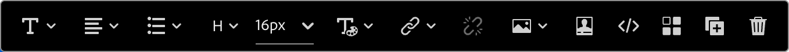

# コンテンツコンポーネント {#content-components}

>[!CONTEXTUALHELP]
>id="ajo-b2b_content_components_email"
>title="コンテンツコンポーネントについて"
>abstract="コンテンツコンポーネントは、メールのデザインに使用できる空のコンテンツプレースホルダーです。"

>[!CONTEXTUALHELP]
>id="ajo-b2b_content_components_landing_page"
>title="コンテンツコンポーネントについて"
>abstract="コンテンツコンポーネントは、ランディングページのデザインに使用できる空のコンテンツプレースホルダーです。"

>[!CONTEXTUALHELP]
>id="ajo-b2b_content_components_fragment"
>title="コンテンツコンポーネントについて"
>abstract="コンテンツコンポーネントは、フラグメントのデザインに使用できる空のコンテンツプレースホルダーです。"

>[!CONTEXTUALHELP]
>id="ajo-b2b_content_components_template"
>title="コンテンツコンポーネントについて"
>abstract="コンテンツコンポーネントは、テンプレートのデザインに使用できる空のコンテンツプレースホルダーです。"

メール、ランディングページ、テンプレートおよびビジュアルフラグメントのコンテンツをデザインする場合は、[!UICONTROL  コンテンツコンポーネント ] を使用して、ビジュアルデザイン要素を追加します。 レイアウトを定義する 1 つ以上の構造コンポーネント内には、必要な数だけコンテンツコンポーネントを追加できます。

## コンテンツライブラリ

コンポーネントライブラリの下部にある **[!UICONTROL コンテンツ]** セクションには、使用可能なコンテンツコンポーネントが表示されます。

| アイコン | コンポーネント | 説明 |
| --------- | ---- | ----------- |
|  | [コンテナ](#container) | このコンポーネントをデザインに追加して、コンポーネントのグループ化や、領域への背景または境界線のスタイル設定に使用できる長方形のコンテナを含めます。 |
|  | [ ボタン ](#button) | このコンポーネントをデザインに追加して、クリック可能なボタン要素を含めます。 |
|  | [テキスト](#text) | このコンポーネントをデザインに追加して、テキスト本文を含めます。 |
|  | [ デバイダ ](#divider) | このコンポーネントをデザインに追加して、コンテンツの別々の領域に水平線を含めます。 |
|  | [HTML](#html) | このコンポーネントをデザインに追加すると、既存のHTMLの別の部分をコピーして貼り付けることができます。 このコンポーネントを使用して、無料のモジュラーHTML ブロックを作成し、一部の外部コンテンツを再利用します。 |
|  | [画像](#image) | このコンポーネントをデザインに追加して、画像ファイルを挿入します。 |
|  | [Social](#social) | このコンポーネントをデザインに追加すると、ソーシャルメディアページへのリンクを挿入できます。 |
|  | [フォーム](#form) | **_ランディングページでのみ使用できます。_** このコンポーネントをデザインに追加すると、作成したフォームを挿入できます。 |

## コンテンツコンポーネントツールバー

各コンテンツコンポーネントタイプは、キャンバスで選択すると、ツールバーを表示します。 使用可能なツールはコンポーネントタイプによって異なり、レンダリングされたコンテンツ内で直接コンポーネントを操作するための簡単な方法を提供します。 コンポーネントタイプに適用できる書式設定機能と機能機能が含まれます。

{width="450"}

### 書式設定ツール

+++テキストスタイルの変更

<table>
    <tr>
        <th style="width: 30%;">ツール</th>
        <th style="width: 50%;">使用方法</th>
        <th style="width: 20%;">コンポーネント</th>
    </tr>
    <tr>
        <td></td>
        <td>選択したテキスト文字列に太字、斜体、下線、取り消し線、上付き文字、または下付き文字を適用します。</td>
        <td><li>ボタン <li>テキスト</td>
    </tr>
</table>

+++

+++水平方向揃え

<table>
    <tr>
        <th style="width: 30%;">ツール</th>
        <th style="width: 50%;">使用方法</th>
        <th style="width: 20%;">コンポーネント</th>
    </tr>
    <tr>
        <td></td>
        <td>コンポーネントのコンテンツに水平方向揃えタイプを適用します。 「左」、「中央」、「右」または「両端揃え」を選択します。 </td>
        <td><li>ボタン <li>テキスト</td>
    </tr>
</table>

+++

+++リストを作成

<table>
    <tr>
        <th style="width: 30%;">ツール</th>
        <th style="width: 50%;">使用方法</th>
        <th style="width: 20%;">コンポーネント</th>
    </tr>
    <tr>
        <td></td>
        <td>コンポーネントのテキストに順序付きリスト形式または順序付けされていないリスト形式を適用します。</td>
        <td><li>テキスト</td>
    </tr>
</table>

+++

+++見出しを設定

<table>
    <tr>
        <th style="width: 20%;">ツール</th>
        <th style="width: 60%;">使用方法</th>
        <th style="width: 20%;">コンポーネント</th>
    </tr>
    <tr>
        <td></td>
        <td>カーソル位置の段落に見出しレベルの書式を適用します。</td>
        <td><li>ボタン <li>テキスト</td>
    </tr>
</table>

+++

+++フォントサイズ

<table>
    <tr>
        <th style="width: 20%;">ツール</th>
        <th style="width: 60%;">使用方法</th>
        <th style="width: 20%;">コンポーネント</th>
    </tr>
    <tr>
        <td></td>
        <td>選択したテキストにフォントサイズを適用します。 ツールをクリックしてサイズを選択するか、px 値を入力します。</td>
        <td><li>ボタン <li>テキスト</td>
    </tr>
</table>

+++

+++フォントカラー

<table>
    <tr>
        <th style="width: 40%;">ツール</th>
        <th style="width: 40%;">使用方法</th>
        <th style="width: 20%;">コンポーネント</th>
    </tr>
    <tr>
        <td></td>
        <td>選択したテキストにフォントカラーを適用します。 ピッカーからカラーを選択し、カラースライダーとカラーフィールドを使用してカラーを選択します。 または、既知のRGB、HSL、HSB、または 16 進数値を入力できます。 </td>
        <td><li>ボタン <li>テキスト</td>
    </tr>
</table>

+++

+++リンクを挿入

<table>
    <tr>
        <th style="width: 40%;">ツール</th>
        <th style="width: 40%;">使用方法</th>
        <th style="width: 20%;">コンポーネント</th>
    </tr>
    <tr>
        <td></td>
        <td>選択したテキストまたは要素にクリック可能なリンク（外部 URL またはランディングページ）を作成します。</td>
        <td><li>ボタン <li>テキスト <li>Image </td>
    </tr>
</table>

+++

+++リンクを削除

<table>
    <tr>
        <th style="width: 15%;">ツール</th>
        <th style="width: 60%;">使用方法</th>
        <th style="width: 25%;">コンポーネント</th>
    </tr>
    <tr>
        <td></td>
        <td> 選択したテキストまたは要素のクリック可能なリンク（外部 URL またはランディングページ）を削除します。</td>
        <td><li>ボタン <li>テキスト <li>Image </td>
    </tr>
</table>

+++

### 機能ツール

| ツール | 名前 | 使用方法 |
| ---- | ---- | ----- |
| {width="40"} | パーソナライゼーションの追加 | パーソナライゼーションエディターを使用して、コンポーネントコンテンツにパーソナライゼーショントークンを挿入します。 [詳細情報](./email-authoring.md#personalize-content) |
| {width="40"} | ソースコードを表示 | 読み取り専用のポップアップにコンポーネントのHTML ソースコードを表示します。  {width="200"} |
| {width="40"} | 条件付きコンテンツを有効にする | コンポーネントの条件付きバリアントを有効にします。 [詳細情報](./conditional-content.md) |
| {width="40"} | 複製 | コンポーネントのコピーを作成して、の直下に追加します。 |
| {width="40"} | 削除 | コンポーネントを削除します。 |

## デザインにコンテンツコンポーネントを追加する

1. ビジュアルデザインスペースで、既存のテンプレートを使用するか、必要な構造コンポーネントを空のキャンバスに追加して、レイアウトを定義します。

1. **[!UICONTROL コンポーネント]** ライブラリで、選択したコンテンツコンポーネントの _ドラッグハンドル_ を取得し、構造コンポーネントにドラッグ&amp;ドロップします。

   単一の構造コンポーネントおよび構造コンポーネントの各列に複数のコンポーネントを追加できます。

   {width="600" zoomable="yes"}

1. 右側の **[!UICONTROL 設定]** タブと **[!UICONTROL スタイル]** タブ、またはキャンバスに表示されるコンテキストツールバーを使用して、コンポーネントの表示を調整します。

   例えば、コンポーネントのテキストスタイル、パディングまたは余白を変更できます。

   {width="600" zoomable="yes"}

デザインを操作する際に、コンポーネントを [ 削除 ](#remove-a-content-component) または [ 複製 ](#duplicate-a-content-component) することもできます。

## コンテンツコンポーネントの設定とスタイル

追加したコンポーネントは、ビジュアルデザインスペースで選択され、右側のパネルにそのプロパティが表示されます。 また、いつでもコンポーネントを選択して、設定やスタイルを変更できます。 多くの設定とスタイルはコンポーネントに固有ですが、選択したコンテンツコンポーネントに適用できる標準設定とスタイルがいくつかあります。

### 表示オプション

このコンポーネントをデスクトップまたはモバイルデバイスの表示から除外する場合は、「**[!UICONTROL 表示オプション]**」設定を変更します。 デフォルトの _[!UICONTROL すべてのデバイスで表示]_ では、すべてのデバイスで表示が有効になります。 別の設定を選択して、デバイスタイプ別にコンポーネントを排他的にします。

* _[!UICONTROL デスクトップデバイスでのみ表示]_ - デスクトップデバイスにコンポーネントを表示し、モバイルデバイスに対して除外する場合、この設定を選択します。
* _[!UICONTROL モバイルデバイスにのみ表示]_ – 電話やタブレットなどのモバイルデバイスにコンポーネントを表示し、デスクトップデバイスには除外する場合、この設定を選択します。

{width="400" zoomable="yes"}

### コンテナ

コンテナを使用して、コンテンツコンポーネントのグループに特定のスタイルを適用します。 [!UICONTROL  コンテナ ] コンポーネントを追加してから、その中に他のコンテンツコンポーネントを追加します。 このコンポーネントは、HTMLで `div` 要素を使用する方法と似ています。 コンテナに含まれるコンテンツコンポーネントに適用されるスタイルとは異なる独自のスタイルをコンテナに適用できます。

例えば、_[!UICONTROL コンテナ]_&#x200B;コンポーネントを追加してから、 _[!UICONTROL ボタン]_&#x200B;コンポーネントをそのコンテナ内に追加します。コンテナに特定の領域スタイルを使用し、必要に応じてボタンとその背景のスタイルを設定できます。

{width="600" zoomable="yes"}

+++背景

{{styles-background}}

+++

+++境界線

{{styles-border}}

+++

+++サイズ

{{styles-size}}

+++

+++余白

{{styles-margin}}

+++

+++パディング

{{styles-padding}}

+++

### ボタン

[!UICONTROL  ボタン ] コンポーネントを使用すると、1 つまたは複数のクリック可能なボタンをコンテンツに挿入できます。 ボタンを使用すると、ページ閲覧者またはメール受信者を、サポート対象コンテンツ（公開済みのランディングページまたは外部リンク）にリダイレクトできます。

#### ボタンのテキストを追加

ボタンコンポーネントをキャンバスに表示すると、ツールバーにテキスト書式設定のオプションと、パーソナライゼーションおよび条件付きバリアントが含まれます。 エディターツールバーオプションについて詳しくは、#を参照してください。

ボタンのラベルのテキストを入力して書式設定を設定すると、ボタンのサイズがコンテンツに合わせて変更されます。

{width="500" zoomable="yes"}

#### リンクオプションを設定

「_[!UICONTROL 設定]_」タブで「**[!UICONTROL リンク]**」オプションを使用して、ボタンのテキスト、リンク先、ターゲットページを読み込むためのブラウザーの動作を定義します。

1. リンクの **[!UICONTROL タイプ]** を設定します。

   * **[!UICONTROL 外部リンク]** – 標準の URL をリンク先として使用する場合は、このタイプを選択します。

     **[!UICONTROL URL]** に、リンク先の URL を入力します。 _パーソナライズ_ アイコン（）をクリックして、パーソナライゼーショントークンを URL のパラメーターとして使用します。

     {width="200"}

   * **ランディングページ** – このタイプを選択して、<!-- Journey Optimizer B2B Edition (_Beta_) or -->connected Marketo Engage インスタンス内の公開済みランディングページを選択します。

     **[!UICONTROL ランディングページ]** オプションで、公開したランディングページを選択します。 _ページを選択_ アイコン（）をクリックし [ 公開されたランディングページを選択 ](./landing-pages.md#link-to-a-landing-page) します。

     {width="200"}

1. **[!UICONTROL ラベル]** には、ボタン内に表示するテキストを入力します。

   ボタンのサイズは、設定されたテキストとスタイルに従って調整されます。

1. **[!UICONTROL  ターゲット**] については、リンクされた宛先をメールまたはページからリダイレクトする方法を選択します。

   * _[!UICONTROL なし]_ - デフォルトのブラウザーまたはクライアントの動作（デフォルト）を使用してリンクを開きます。
   * _[!UICONTROL 空白]_ - リンクを新しいウィンドウまたは新しいタブで開きます。
   * _[!UICONTROL セルフ]_ – 同じフレームでリンクを開きます。
   * _[!UICONTROL 親]_ – 親フレームでリンクを開きます。
   * _[!UICONTROL 上]_ - ウィンドウの全体でリンクを開きます。

#### スタイルの設定

「**[!UICONTROL スタイル]** タブのボタンのスタイル設定をカスタマイズします。

+++背景

{{styles-background}}

+++

+++テキスト

{{styles-text}}

+++

+++境界線

{{styles-border}}

+++

+++サイズ

{{styles-size}}

+++

+++整合性

+++

+++ボタンの余白

+++

+++コンテナの余白

{{styles-margin}}

+++

+++パディング

{{styles-padding}}

+++

+++詳細

{{styles-advanced}}

+++

### テキスト

テキスト コンポーネントを使用すると、コンテンツにテキストブロックを挿入できます。 キャンバスでテキストコンポーネントを選択したら、テキストを入力し、ツールバーオプションを使用して、パーソナライゼーショントークンや条件付きバリアントなど、インラインの書式およびオプションを追加します。 インラインスタイルやオプションを含む、デザインスペースでのテキストの作成について詳しくは、テキストのオーサリングを参照してください。

「**[!UICONTROL スタイル]**」タブでテキストコンポーネントのスタイル設定をカスタマイズします。

+++背景

{{styles-background}}

+++

+++テキスト

これらのスタイルは、テキストブロック全体に適用されます。 選択したテキスト文字列にインラインスタイルを適用できます。

{{styles-text}}

+++

+++境界線

{{styles-border}}

+++

+++サイズ

{{styles-size}}

+++

+++余白

{{styles-margin}}

+++

+++パディング

{{styles-padding}}

+++

+++詳細

{{styles-advanced}}

+++

### ディバイダー

_ディバイダー_ コンポーネントを追加して、コンテンツのセクション間に線形分割を組み込みます。

+++背景

{{styles-background}}

+++

+++ライン

+++

+++サイズ

{{styles-size}}

+++

+++整合性

{{styles-alignment-h}}

+++

+++余白

{{styles-margin}}

+++

+++パディング

{{styles-padding}}

+++

+++詳細

{{styles-advanced}}

+++

### HTML

HTML コンポーネントを使用して、既存のHTMLの一部を追加します。 このコンポーネントを使用すると、外部コンテンツを再利用するモジュール型HTML要素を簡単に作成できます。

1. キャンバスでコンポーネントを選択し、ツールバーの _ソースコードを表示_ アイコンをクリックします。

   [ コードエディターを開いてHTMLを追加する ](./assets/content-components-html-show-code.png){width="450"}

1. テキストボックスにHTMLを貼り付けて、「**[!UICONTROL 保存]**」をクリックします。

   [HTMLを編集ダイアログ ](./assets/content-components-html-edit-dialog.png){width="600" zoomable="yes"}

   HTMLが有効な場合は、キャンバス上に要素がレンダリングされます。 その要素が他のコンテンツコンポーネントの 1 つにマッピングされる要素である場合は、コンポーネントのタイプに応じて、右側のパネルで設定とスタイルを変更できます。 含まれていない場合は、HTML コンポーネントのままとなります。

HTML コンポーネントの場合、右側のパネルでHTML コンポーネント全体に対して次のスタイルを設定できます。

+++背景

{{styles-background}}

+++

+++境界線

{{styles-border}}

+++

+++サイズ

{{styles-size}}

+++

+++整合性

{{styles-alignment-h-v}}

+++

+++余白

{{styles-margin}}

+++

+++パディング

{{styles-padding}}

+++

+++詳細

{{styles-advanced}}

+++

### Image

[!UICONTROL  画像 ] コンポーネントを使用して、コンテンツに画像アセットを挿入します。 キャンバスで _画像_ コンポーネントを選択すると、表示される画像アセットファイルを追加または変更できます。

{width="400" zoomable="yes"}

#### 画像アセットを追加

[ アセットソースタイプ ](./assets-overview.md) を選択し、画像ファイルを選択します。

* **[!UICONTROL Marketo Engage Assets]** – このタイプを選択して、Journey Optimizer B2B edition ライブラリまたは接続された Market Engage インスタンスから画像アセットを参照して選択します。

  {width="700" zoomable="yes"}

  ダイアログで、選択したリポジトリとワークスペースから画像を選択できます。 **[!UICONTROL 選択]** をクリックして、アセットを追加します。

  必要なアセットを見つけるのに役立つツールを利用できます。

   * 左上の _フィルター_ アイコンをクリックし、条件に従って表示される項目をフィルタリングします。

   * 「_検索_」フィールドにテキストを入力し、表示される項目をフィルタリングしてアセット名が一致するかどうかを確認します。

     {width="700" zoomable="yes"}

* **[!UICONTROL Experience Manager Assets]** – このタイプを選択して、（設定済みの Experience Manage Assets リポジトリ [ から画像アセットを参照して選択 ](../admin/configure-aem-repositories.md) ます。

  _[!UICONTROL Assetsを選択]_ ダイアログで、必要なアセットを見つけるために使用可能なツールを使用して画像を選択し、「**[!UICONTROL 選択]**」をクリックします。

   * 右上の **[!UICONTROL リポジトリ]** を変更します。

   * 右上の **[!UICONTROL アセットを管理]** をクリックして、別のブラウザータブでAssets リポジトリを開き、AEM Assets management tools を使用します。

   * 右上の _表示タイプ_ セレクターをクリックして、表示を **[!UICONTROL リスト表示]**、**[!UICONTROL グリッド表示]**、**[!UICONTROL ギャラリー表示]**、**[!UICONTROL ウォーターフォール表示]** に変更します。

   * _並べ替え順序_ アイコンをクリックして、並べ替え順序を昇順と降順の間で変更します。

     {width="700" zoomable="yes"}

   * 「**[!UICONTROL 並べ替え基準]**」メニュー矢印をクリックして、並べ替え条件を **[!UICONTROL 名前]**、**[!UICONTROL サイズ]**、**[!UICONTROL 変更]** に変更します。

   * 左上の _フィルター_ アイコンをクリックし、条件に従って表示される項目をフィルタリングします。

   * 「_検索_」フィールドにテキストを入力し、表示される項目をフィルタリングしてアセット名が一致するかどうかを確認します。

  {width="700" zoomable="yes"}

* **[!UICONTROL メディアを読み込み]** – このタイプを選択すると、システムからファイルを選択してJourney Optimizer B2B edition アセットライブラリに読み込むことができます。

  _[!UICONTROL 画像をアップロード]_ ダイアログで、システムからファイルボックスにファイルをドラッグ&amp;ドロップします。 最大ファイルサイズは 100 MB です。

  {width="450"}

  選択した画像のファイル名がダイアログに表示されます。 アセットファイル名は（フォルダー間で）一意である必要があり、という名前のファイルが既に存在する場合は、メッセージが表示されます。 名前は最大 100 文字まで指定でき、特殊文字（`;`、`:`、`\`、`|` など）を含めることはできません。

  「**[!UICONTROL インポート]**」をクリックします。

右側のパネルに画像のタイトルと代替テキストを追加できます。

{width="250"}

#### リンクオプションを設定

「_[!UICONTROL 設定]_」タブで「**[!UICONTROL リンク]**」オプションを使用して、画像を宛先と、ターゲットページを読み込むためのブラウザーの動作にリンクします。

1. リンクの **[!UICONTROL タイプ]** を設定します。

   * **[!UICONTROL 外部リンク]** – 標準の URL をリンク先として使用する場合は、このタイプを選択します。

     **[!UICONTROL URL]** に、リンク先の URL を入力します。 _パーソナライズ_ アイコン（）をクリックして、パーソナライゼーショントークンを URL のパラメーターとして使用します。

     {width="250"}

   * **ランディングページ** – このタイプを選択して、<!-- Journey Optimizer B2B Edition (_Beta_) or -->connected Marketo Engage インスタンス内の公開済みランディングページを選択します。

     **[!UICONTROL ランディングページ]** オプションで、公開したランディングページを選択します。 _ページを選択_ アイコン（）をクリックし [ 公開されたランディングページを選択 ](./landing-pages.md#link-to-a-landing-page) します。

     {width="250"}

1. **[!UICONTROL ラベル]** には、ボタン内に表示するテキストを入力します。

   ボタンのサイズは、設定されたテキストとスタイルに従って調整されます。

1. **[!UICONTROL  ターゲット**] については、リンクされた宛先をメールまたはページからリダイレクトする方法を選択します。

   * _[!UICONTROL なし]_ - デフォルトのブラウザーまたはクライアントの動作（デフォルト）を使用してリンクを開きます。
   * _[!UICONTROL 空白]_ - リンクを新しいウィンドウまたは新しいタブで開きます。
   * _[!UICONTROL セルフ]_ – 同じフレームでリンクを開きます。
   * _[!UICONTROL 親]_ – 親フレームでリンクを開きます。
   * _[!UICONTROL 上]_ - ウィンドウの全体でリンクを開きます。

#### スタイルの設定

右パネルの画像コンポーネントのスタイルを設定します。

+++背景

{{styles-background}}

+++

+++境界線

{{styles-border}}

+++

+++サイズ

{{styles-size}}

+++

+++整合性

{{styles-alignment-h}}

+++

+++余白

{{styles-margin}}

+++

+++パディング

{{styles-padding}}

+++

+++詳細

{{styles-advanced}}

+++

### ソーシャル

_ソーシャル_ コンポーネントを使用すると、コンテンツにソーシャルメディアページへのリンクを挿入できます。 デフォルトのソーシャルメディアタイプが 3 つ含まれていますが、必要に応じてタイプを追加または削除できます。

{width="600" zoomable="yes"}

* ソーシャルメディアタイプを追加するには、「_追加_ （**+**）」アイコンをクリックし、追加するソーシャルメディアタイプを選択します。

  {width="250"}

* ソーシャルメディアタイプを削除するには、ソーシャルメディアアイコンの横の **X** をクリックします。

ソーシャルメディアタイプを選択した状態で、そのタイプのオプションを設定します。

* **[!UICONTROL URL]** - ソーシャルメディアグラフィックまたはアイコンにリンクするソーシャルメディア URL を入力します。
* **[!UICONTROL Source]** - デフォルトの代わりに独自の画像を使用する場合は、と画像アセットを選択します。 接続されたMarketo Engage アセットリポジトリまたはExperience Manager Assets リポジトリ（設定されている場合）から画像を選択するか、システムから画像ファイルを読み込むことができます。 画像アセットの選択と読み込みについて詳しくは、[ 画像コンポーネント情報 ](#add-the-image-asset) を参照してください。
* **[!UICONTROL 代替テキスト]** – 表示される画像の代替テキストを入力します。

  {width="250"}

すべてのソーシャルメディアグラフィックに対して一貫した表示サイズを定義するには、「**[!UICONTROL 画像のサイズ]**」を設定します。

_ソーシャル_ コンポーネントには、次のスタイルオプションを設定できます。

+++背景

{{styles-background}}

+++

+++境界線

{{styles-border}}

+++

+++サイズ

{{styles-size}}

+++

+++整合性

{{styles-alignment-h}}

+++

+++余白

{{styles-margin}}

+++

+++パディング

{{styles-padding}}

+++

+++詳細

{{styles-advanced}}

+++

### フォーム（ランディングページ）

[!BADGE Beta]{type=Informative url="/help/user/content/forms.md" tooltip="Beta機能"}

_フォーム_ コンポーネントを使用して、公開済みのフォームをランディングページまたはランディングページテンプレートに追加します。 フォームの作成と公開について詳しくは、[Forms](./forms.md) を参照してください。

1. コンポーネントツールバーの _フォーム_ ツールをクリックするか、右側の **[!UICONTROL 埋め込みフォーム]** プロパティを使用して、公開されたフォームを選択します。

   {width="600"}

1. フォームのデフォルトの **[!UICONTROL フォローアップタイプ]** を上書きする場合は、ページまたはテンプレートの要件に応じて設定を変更します。

   このページはフォームの _ありがとうページ_ とも呼ばれ、この設定は訪問者がフォームを送信したときの動作を決定します。

   * **[!UICONTROL ページを維持]** - フォームの送信時に訪問者のページを変えない場合は、このオプションを選択します。

   * **[!UICONTROL ランディングページ]** – フォローアップとしてJourney Optimizer B2B editionまたはMarketo Engage ランディングページを選択する場合は、このオプションを選択します。

   * **[!UICONTROL 外部 URL]** – 任意の URL をフォローアップページとして指定する場合は、このオプションを選択します。 訪問者がフォームを送信すると、ブラウザーは指定された URL を読み込みます。

     >[!TIP]
     >
     >フォームを使用してファイルをダウンロードする場合は、ホストされるファイルの URL を指定できます。 この設定では、送信ボタンはダウンロードボタンとして機能します。

     {width="280"}

必要に応じて、右側のパネルの「**[!UICONTROL スタイル]**」タブを選択して、構造コンポーネント内のフォームの余白を設定します。

{{styles-margin}}
