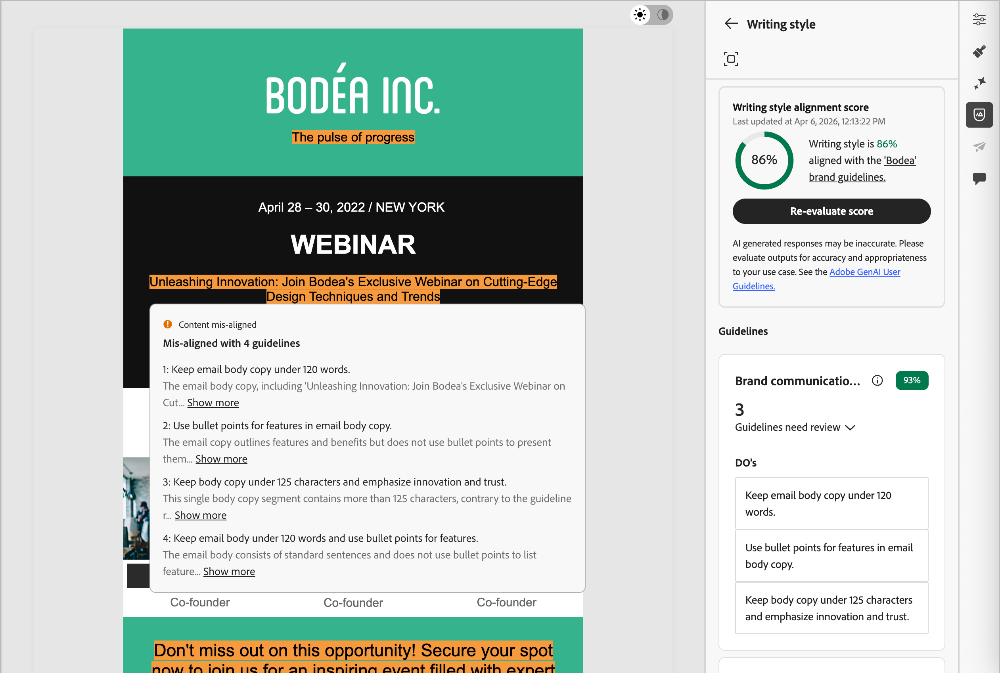

# コンテンツの評価とスコアリング {#content-scoring}

コンテンツの評価とスコアリングは、選択したブランド [&#128279;](./brands-manage-create.md#brand-definitions)および一般的な品質基準で定義されているガイドライン に準拠するコンテンツを作成、レビュー、管理するのに役立ちます。 評価を実施することで、メール施策のトーン、メッセージ、ビジュアルアイデンティティの一貫性を確保し、コンテンツを公開する前に品質チェックを行うことができます。

>[!AVAILABILITY]
>
>Adobe Journey Optimizer B2B editionでAIを活用した機能を使用するには、事前に[使用許諾契約書](https://www.adobe.com/legal/licenses-terms/adobe-dx-gen-ai-user-guidelines.html){target="_blank"}が必要です。 詳しくは、アドビ担当者にお問い合わせください。
>
>製品管理者がこれらの機能を有効にする方法について詳しくは、[&#x200B; ブランド関連の権限](./brands-overview.md#brand-related-permissions)を参照してください。

## 評価の実行

1. メールコンテンツを作成したら、右側の&#x200B;_ブランド調整_ （）アイコンをクリックして、メールデザインスペースの&#x200B;_ブランド調整_&#x200B;右側のパネルを開きます。

   [&#x200B; デフォルトブランド &#x200B;](./brands-manage-create.md#default-brand)が自動的に選択されます。

   {width="600" zoomable="yes"}

   パネルの上部にある&#x200B;_フルスクリーン_ （）アイコンをクリックすると、ブランドの整列ツールをフルスクリーンモードで表示できます。

1. 必要に応じて、**[!UICONTROL ブランド]** メニューの矢印（）をクリックして、別の公開済みブランドを選択します。

1. 「**[!UICONTROL スコアを評価]**」をクリックして、選択したブランドとのコンテンツの整合性をスコアリングします。

   選択したブランドのガイドラインに照らしてコンテンツが評価され、結果のスコアが表示されます。

   {width="600" zoomable="yes"}

## ブランド整合性スコア {#brand-alignment-score}

>[!CONTEXTUALHELP]
>id="ajo-b2b_brand_score_overview"
>title="ブランドの選択"
>abstract="ブランドを選択して、一貫性とブランドの整合性を維持しながら、コンテンツが特定のガイドライン、標準、アイデンティティに合わせて作成されるようにします。"

>[!CONTEXTUALHELP]
>id="ajo-b2b_brand_score"
>title="ブランド整合性スコア"
>abstract="ブランド調整スコアは、コンテンツがブランドガイドラインにどの程度適合しているかを測定し、色、フォント、ロゴ、イメージ、文体の一貫性を確保します。"

>[!CONTEXTUALHELP]
>id="ajo-b2b_brand_colors_score"
>title="色のスコア"
>abstract="色のスコア"

>[!CONTEXTUALHELP]
>id="ajo-b2b_brand_fonts_score"
>title="フォントのスコア"
>abstract="フォントのスコア"

>[!CONTEXTUALHELP]
>id="ajo-b2b_brand_logos_score"
>title="ロゴのスコア"
>abstract="ロゴのスコア"

>[!AVAILABILITY]
>
>この機能は現在、パブリックベータ版として利用可能です。

ブランドが明確に定義され、公開されたら、メールデザイン分野で直接ブランド調整スコアを評価して、コンテンツがブランドガイドラインに準拠していることを確認します。

スコアは、評価されたメールコンテンツ内で特定された違反に従って計算されます。

* 100 = Perfect – 違反が見つかりません
* 80-99 =良好 – 軽微な違反のみ
* 60-79 =公正 – いくつかの重大な違反
* 60未満=不良 – 重大な違反には注意が必要

評価結果をより詳細に確認することで、違反を特定し、カテゴリの整合性スコア （_高_、_Medium_、_低_）を向上させることができます。

**[!UICONTROL 書き込みスタイル]**&#x200B;または&#x200B;**[!UICONTROL ビジュアルコンテンツ]**&#x200B;の場合は、_展開_ （）矢印をクリックして、評価の詳細を表示します。

{width="600" zoomable="yes"}

各スコア insightの詳細を表示するには、_全画面_ （）アイコンをクリックします。

フラグ付けされたガイドラインを選択して、特定のフィードバックと提案を表示します。

{width="700" zoomable="yes"}

コンテンツに変更を加え、「**[!UICONTROL スコアを再評価]**」をクリックして別の評価を実行し、改善された結果を確認できます。

## コンテンツ品質スコア {#quality-score}

>[!CONTEXTUALHELP]
>id="ajo-b2b_quality_score_overview"
>title="コンテンツの品質"
>abstract="一般的なコンテンツの品質を評価して、読みやすさ、コンテンツの包括性、有効性に関する潜在的な問題を特定します。 品質評価は、ブランドガイドラインに依存しません。"

>[!NOTE]
>
>コンテンツの品質評価は、ブランドガイドラインとは独立しています。 ブランドを選択しても、そのガイドラインは品質チェックに適用されません。 ブランド選択は、ブランド調整スコアリングにのみ関連します。

ブランドの整合性に加えて、一般的なコンテンツの品質を評価し、ブランドガイドラインに依存せずに、読みやすさ、コンテンツの一貫性、有効性に関する潜在的な問題を特定できます。

**[!UICONTROL コンテンツ品質]** セクションまでスクロールして、品質に関するインサイトと推奨事項を確認します。

{width="600" zoomable="yes"}

フラグが設定されている項目を選択して、特定のフィードバックと改善に向けた実用的な提案を表示します。 スコアは、次のカテゴリに基づいています。

* **[!UICONTROL CTAの効果]**:call-to-actionが読者に望ましい行動を起こすための動機付けをどの程度行っているかを評価します。
* **[!UICONTROL 件名]**：明確さ、関連性、注目すべき品質を評価して、メールの開封を促進します。
* **[!UICONTROL 読みやすさ]**：コンテンツがどの程度簡単で魅力的であるかを測定して、読者が理解できるようにします。
* **[!UICONTROL スパムチェック]**：配信品質に影響を与える可能性のある一般的なスパムトリガーを特定します。
* **[!UICONTROL コンテンツの一貫性]**：コンテンツがスムーズに流れ、トピックに沿ったものになります。
* **[!UICONTROL 校正]**：スペル、文法、明瞭度の問題をチェックします。

品質スコアの詳細を表示するには、_全画面_ （）アイコンをクリックします。

{width="700" zoomable="yes"}

レコメンデーションにもとづいてコンテンツを編集し、読みやすさ、コンテンツの全体的な品質を高めることができます。 品質スコアを更新するには、変更を加えた後で「**[!UICONTROL スコアを再評価]**」をクリックします。
