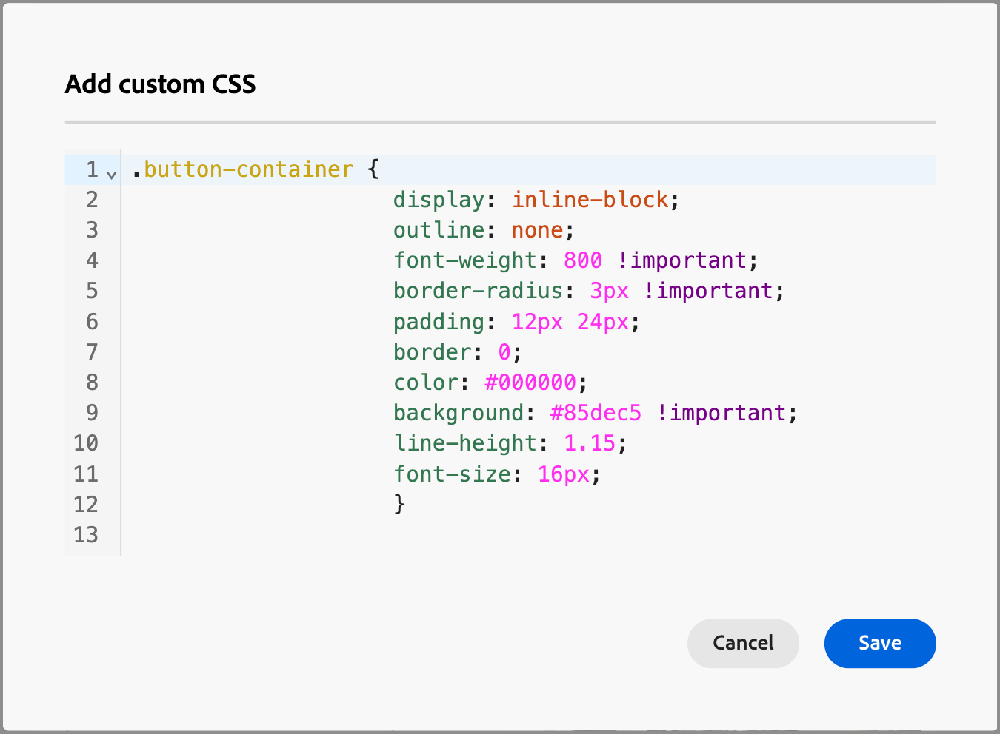

# コンテンツのカスタム CSS の追加

独自のカスタム CSS をメールまたはランディングページのデザインスペース内に直接追加できます。 カスタム CSS を使用して高度な特定のスタイル設定を適用し、コンテンツの外観をより柔軟に制御できます。

カスタム CSS は、`<head>` 属性を使用して、`<style>` タグ内の `data-name="global-custom"` セクションに追加されます。 この構造により、カスタムスタイルがコンテンツにグローバルに適用されます。

+++ 実装例

```html
<!DOCTYPE html>
<html>
  <head>
    <meta charset="utf-8">
    <meta name="content-version" content="3.3.31">
    <meta name="x-apple-disable-message-reformatting">
    <meta name="viewport" content="width=device-width,initial-scale=1.0">
    <style data-name="default" type="text/css">
      td { padding: 0; }
      th { font-weight: normal; }
    </style>
    <style data-name="grid" type="text/css">
      .acr-grid-table { width: 100%; }
    </style>
    <style data-name="acr-theme" type="text/css" data-theme="default" data-variant="0">
      body { margin: 0; font-family: Arial; }
    </style>
    <style data-name="media-default-max-width-500px" type="text/css">
      @media screen and (max-width: 500px) {
        body { width: 100% !important; }
      }
    </style>
    <style data-name="global-custom" type="text/css">
      /* Add you custom CSS here */
    </style>
  </head>
  <body>
    <!-- Minimal content -->
  </body>
</html>
```

+++

>[!NOTE]
>
>選択したコンポーネントの _[!UICONTROL スタイル]_ パネルにカスタム CSS が反映されず、検証もされません。 これは完全に独立しており、本文コンポーネントレベルの「[!UICONTROL &#x200B; カスタム CSS を追加 &#x200B;]」オプションによってのみ変更できます。

## カスタム CSS の追加

1. 1 つ以上のコンテンツコンポーネントをキャンバスに追加した状態で、左側のナビゲーションの **[!UICONTROL 本文]** コンポーネントを選択します。

1. 右側の「_スタイル_」タブを選択し、「**[!UICONTROL カスタム CSS を追加]**」をクリックします。

   {width="800" zoomable="yes"}

   >[!NOTE]
   >
   >「_[!UICONTROL カスタム CSS を追加]_」ボタンは、「_[!UICONTROL Body]_」コンポーネントが選択されている場合にのみ使用できます。 ただし、カスタムの CSS スタイルを、その中のすべてのコンポーネントに適用できます。

   _[!UICONTROL カスタム CSS を追加]_ ポップアップエディターが、プレースホルダーコードのコメントと共に表示されます。

1. エディターに CSS コードを入力します。

   カスタム CSS が有効で、適切な構文に従っていることを確認します。 入力した CSS が無効な場合は、エラーメッセージが表示され、CSS を保存できません。 詳しくは、[CSS の有効性 ](#css-validity) を参照してください。

   {width="450"}

1. 「**[!UICONTROL 保存]**」をクリックして、カスタム CSS を保存します。

   カスタムスタイルシートは、既存のコンテンツに適用されます。 必要に応じて、カスタム CSS が適用されていることを確認できます。 スタイルシートのアプリケーションを変更および調整する方法について詳しくは、[ トラブルシューティング ](#troubleshooting) を参照してください。

   {width="600" zoomable="yes"}

## CSS の有効性

>[!CAUTION]
>
>カスタム CSS のセキュリティについては、ユーザーが責任を負います。CSS によって脆弱性が発生したり、既存のコンテンツと競合したりしていないことを確認します。
>
>意図せずコンテンツのレイアウトや機能を損なう可能性がある CSS の使用は回避します。

+++ 有効な CSS の例

```css
.acr-component[data-component-id="form"] {
  display: flex;
  justify-content: center;
  background: none;
}

.acr-Form {
  width: 100%;
  padding: 20px 100px;
  border-spacing: 0px 8px;
  box-sizing: border-box;
  margin: 0;
}

.acr-Form .spectrum-FieldLabel {
  width: 20%;
}

.acr-Form.spectrum-Form--labelsAbove .spectrum-FieldLabel,
.acr-Form [data-form-item="checkbox"] .spectrum-FieldLabel {
  width: auto;
}

.acr-Form .spectrum-Textfield {
  width: 100%;
}

#acr-form-error,
#acr-form-confirmation {
  width: 100%;
  padding: var(--spectrum-global-dimension-static-size-500);
  display: flex;
  align-items: center;
  flex-direction: column;
  justify-content: center;
  gap: var(--spectrum-global-dimension-static-size-200);
}

.spectrum-Form-item.is-required .spectrum-FieldLabel:after{
  content: '*';
  font-size: 1.25rem;
  margin-left: 5px;
  position: absolute;
}

/* Error field placeholder */
.spectrum-HelpText {
  display: none !important;
}

.spectrum-HelpText.is-invalid,
.is-invalid ~ .spectrum-HelpText {
  display: flex !important;
}
```

```css
@media only screen and (min-width: 600px) {
  .acr-paragraph-1 {
    width: 100% !important;
  }
}
```

+++

+++ 無効な CSS の例

`<style>` タグの使用は許可されていません。

```html
<style type="text/css">
  .acr-Form {
    width: 100%;
    padding: 20px 100px;
    border-spacing: 0px 8px;
    box-sizing: border-box;
    margin: 0;
  }
</style>
```

中括弧の欠落などの無効な構文は許可されていません。

```css
body {
  background: red;
```

+++

## 読み込まれたコンテンツ内の CSS

メールまたはランディングページのデザインスペースにコンテンツを読み込んでカスタム CSS を使用する場合は、次の点を考慮してください。

* CSS を含む外部HTML コンテンツを読み込む場合 <!-- unless converting that content, --> そのコンテンツは [!UICONTROL &#x200B; 互換モードで入力され &#x200B;]、「[!UICONTROL CSS スタイル &#x200B;]」セクションは使用できません。

* 最初にメールページデザインスペースまたはランディングページデザインスペースで「[!UICONTROL &#x200B; カスタム CSS を追加 &#x200B;]」オプションを使用して作成したコンテンツを読み込むと、適用された CSS は同じオプションから表示および編集できます。

## トラブルシューティング

カスタム CSS が期待どおりに適用されない場合は、ブラウザーの開発者ツールを使用してコンテンツを調べ、CSS が正しいセレクターをターゲットにしていることを確認します。 スタイル設定コードを確認する際は、次の点を考慮してください。

* CSS が有効で、構文エラー（中括弧の欠落、プロパティ名の誤りなど）がないことを確認します。

* お使いの CSS が `<style>` 属性を持つ `data-name="global-custom"` タグに追加されていることを確認します。

* `global-custom` のスタイルタグの属性 `data-disabled` が true に設定されているかどうかを確認します。以下に例を示します。

  `<style data-name="global-custom" type="text/css" data-disabled="true"> body: { color: red; } </style>`

* インラインスタイル設定が適用されているなど、CSS がコンテンツ内のどこかで上書きされていないことを確認します。

* 宣言に `!important` を追加して、次のように優先されるようにします。

  ```
  .acr-Form {
  background: red !important;
  }
  ```
