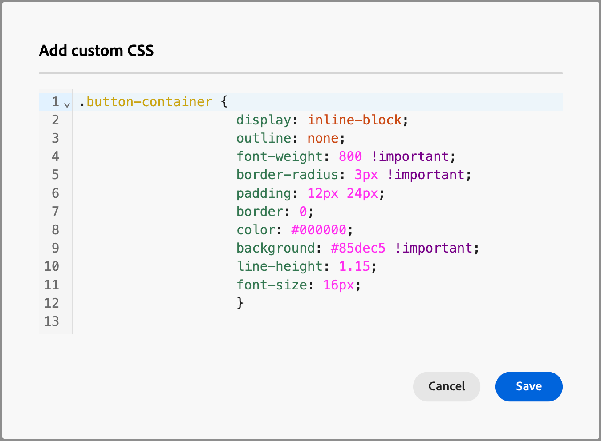

# コンテンツにカスタム CSSを追加する

電子メールやランディングページのデザインスペース内に、独自のカスタム CSSを直接追加できます。 カスタム CSSを使用して、高度で特定のスタイルを適用し、コンテンツの外観をより柔軟に制御できます。

カスタム CSSは、`data-name="global-custom"`属性を使用して`<style>` タグ内の`<head>` セクションに追加されます。 この構造により、カスタムスタイルがグローバルにコンテンツに適用されます。

+++ 実装例

```html
<!DOCTYPE html>
<html>
  <head>
    <meta charset="utf-8">
    <meta name="content-version" content="3.3.31">
    <meta name="x-apple-disable-message-reformatting">
    <meta name="viewport" content="width=device-width,initial-scale=1.0">
    <style data-name="default" type="text/css">
      td { padding: 0; }
      th { font-weight: normal; }
    </style>
    <style data-name="grid" type="text/css">
      .acr-grid-table { width: 100%; }
    </style>
    <style data-name="acr-theme" type="text/css" data-theme="default" data-variant="0">
      body { margin: 0; font-family: Arial; }
    </style>
    <style data-name="media-default-max-width-500px" type="text/css">
      @media screen and (max-width: 500px) {
        body { width: 100% !important; }
      }
    </style>
    <style data-name="global-custom" type="text/css">
      /* Add you custom CSS here */
    </style>
  </head>
  <body>
    <!-- Minimal content -->
  </body>
</html>
```

+++

>[!NOTE]
>
>カスタム CSSは、選択したコンポーネントの&#x200B;_[!UICONTROL スタイル]_ パネルで反映または検証されません。 これは完全に独立しており、Body コンポーネントレベルの[!UICONTROL  カスタム CSS]を追加オプションでのみ変更できます。

## カスタム CSSの追加

1. キャンバスに少なくとも1つのコンテンツコンポーネントが追加されている状態で、左側のナビゲーションで&#x200B;**[!UICONTROL Body]** コンポーネントを選択します。

1. 右側の「_スタイル_」タブを選択し、**[!UICONTROL カスタム CSSを追加]**&#x200B;をクリックします。

   {width="800" zoomable="yes"}

   >[!NOTE]
   >
   >_[!UICONTROL カスタム CSS]_&#x200B;を追加ボタンは、_[!UICONTROL Body]_ コンポーネントが選択されている場合にのみ使用できます。 ただし、その中のすべてのコンポーネントにカスタム CSS スタイルを適用できます。

   _[!UICONTROL カスタム CSSを追加]_ ポップアップエディターが、プレースホルダーコードコメント付きで表示されます。

1. エディターにCSS コードを入力します。

   カスタム CSSが有効であり、適切な構文に従っていることを確認します。 入力したCSSが無効な場合は、エラーメッセージが表示され、CSSを保存できません。 詳しくは、[CSS validity](#css-validity)を参照してください。

   {width="450"}

1. 「**[!UICONTROL 保存]**」をクリックして、カスタム CSSを保存します。

   カスタムスタイルシートが既存のコンテンツに適用されます。 必要に応じてカスタム CSSが適用されていることを確認できます。 スタイルシート アプリケーションを変更および調整する方法について詳しくは、[ トラブルシューティング ](#troubleshooting)を参照してください。

   {width="600" zoomable="yes"}

## CSSの有効性

>[!CAUTION]
>
>カスタム CSS のセキュリティについては、ユーザーが責任を負います。 CSS によって脆弱性が発生したり、既存のコンテンツと競合したりしていないことを確認します。
>
>意図せずコンテンツのレイアウトや機能を損なう可能性がある CSS の使用は回避します。

+++ 有効なCSS例

```css
.acr-component[data-component-id="form"] {
  display: flex;
  justify-content: center;
  background: none;
}

.acr-Form {
  width: 100%;
  padding: 20px 100px;
  border-spacing: 0px 8px;
  box-sizing: border-box;
  margin: 0;
}

.acr-Form .spectrum-FieldLabel {
  width: 20%;
}

.acr-Form.spectrum-Form--labelsAbove .spectrum-FieldLabel,
.acr-Form [data-form-item="checkbox"] .spectrum-FieldLabel {
  width: auto;
}

.acr-Form .spectrum-Textfield {
  width: 100%;
}

#acr-form-error,
#acr-form-confirmation {
  width: 100%;
  padding: var(--spectrum-global-dimension-static-size-500);
  display: flex;
  align-items: center;
  flex-direction: column;
  justify-content: center;
  gap: var(--spectrum-global-dimension-static-size-200);
}

.spectrum-Form-item.is-required .spectrum-FieldLabel:after{
  content: '*';
  font-size: 1.25rem;
  margin-left: 5px;
  position: absolute;
}

/* Error field placeholder */
.spectrum-HelpText {
  display: none !important;
}

.spectrum-HelpText.is-invalid,
.is-invalid ~ .spectrum-HelpText {
  display: flex !important;
}
```

```css
@media only screen and (min-width: 600px) {
  .acr-paragraph-1 {
    width: 100% !important;
  }
}
```

+++

+++ 無効なCSSの例

`<style>` タグの使用は許可されていません。

```html
<style type="text/css">
  .acr-Form {
    width: 100%;
    padding: 20px 100px;
    border-spacing: 0px 8px;
    box-sizing: border-box;
    margin: 0;
  }
</style>
```

中括弧の欠落などの無効な構文は許可されていません。

```css
body {
  background: red;
```

+++

## 読み込んだコンテンツのCSS

メールやランディングページのデザイン空間にコンテンツを読み込んでカスタム CSSを使用する場合は、次の点を考慮してください。

* CSSを含む外部HTML コンテンツを読み込む場合、<!-- unless converting that content, -->互換性モード ]に入力され、[!UICONTROL CSS スタイル ] セクションは使用できません。[!UICONTROL 

* [!UICONTROL  カスタム CSS]を追加オプションを使用して、最初に電子メールまたはランディングページのデザインスペースで作成されたコンテンツを読み込む場合、適用されたCSSは同じオプションから表示され、編集可能になります。

## トラブルシューティング

カスタム CSSが期待どおりに適用されない場合は、ブラウザー開発者ツールを使用してコンテンツを調べ、CSSが正しいセレクターをターゲットにしていることを確認します。 スタイルコードを確認する際には、次の点を考慮してください。

* CSSが有効で、構文エラー（括弧が見つからない、プロパティ名が正しくないなど）がないことを確認します。

* CSSが`data-name="global-custom"`属性を持つ`<style>` タグに追加されたことを確認してください。

* `global-custom` スタイルタグの属性`data-disabled`がtrueに設定されているかどうかを確認します。例：

  `<style data-name="global-custom" type="text/css" data-disabled="true"> body: { color: red; } </style>`

* CSSが、適用されたインラインスタイルなど、コンテンツ内の任意の場所で上書きされていないことを確認します。

* 次のように、宣言に`!important`を追加して、優先されるようにします。

  ```
  .acr-Form {
  background: red !important;
  }
  ```
