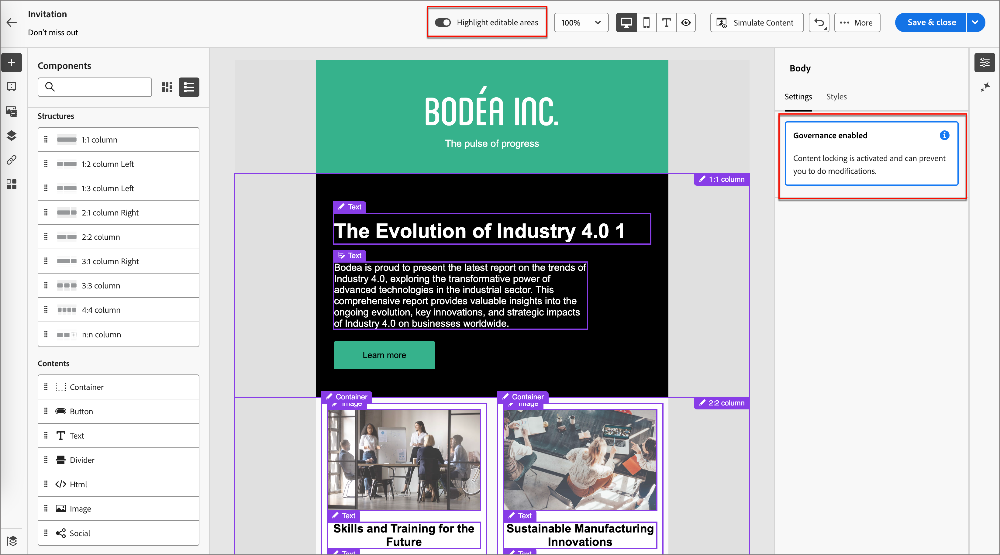

# 管理されたテンプレートからのオーサリング

コンテンツデザイナーは、メールテンプレートの作成時に [&#x200B; ガバナンス（_コンテンツロック_） &#x200B;](./template-content-governance.md) を有効にできます。 ガバナンス機能を使用すると、アカウントジャーニーで使用した場合に変更できないデザインの部分を指定できます。 メールを作成するために [&#x200B; 保存済みのテンプレートを選択 &#x200B;](./email-authoring.md#select-a-template) すると、ビジュアルデザインスペースはテンプレートを読み込み、メールの基礎として使用できます。

テンプレートでガバナンスが有効になっている場合、右側のプロパティパネルにアラートが表示されます。 キャンバスの上部にある **[!UICONTROL 編集可能な領域をハイライト]** をオンにすると、ジャーニーで編集可能なコンポーネントとコンテンツ要素が表示されます。

{width="800" zoomable="yes"}

また、_ナビゲーションツリー_ を使用して、ロックされている要素や編集可能な要素を決定することもできます。 キャンバスの左側にある _ナビゲーションツリー_ アイコン ）をクリックして、ツリーを表示します。

{width="600" zoomable="yes"}

アイコンは、適用されたコンテンツのロック設定を示します。

| アイコン | 名前 | 説明 |
|------|------|-------------|
|  | 読み取り専用 | コンポーネントはロックされており、編集できません。 ルート（_[!UICONTROL 本文]_）レベルで適用すると、すべての子コンポーネントがロックされ、編集できなくなります。 |
|  | コンテンツのロック | コンテンツのロックは、コンポーネントレベルで適用されます。 |
|  | 編集可能 | このコンポーネントは完全に編集可能です。 ただし、要素を削除できない場合があります。 |
|  | 編集可能 – コンテンツのみ | コンポーネントとスタイル設定は静的ですが、コンテンツ（テキストや画像など）を変更できます。 |
