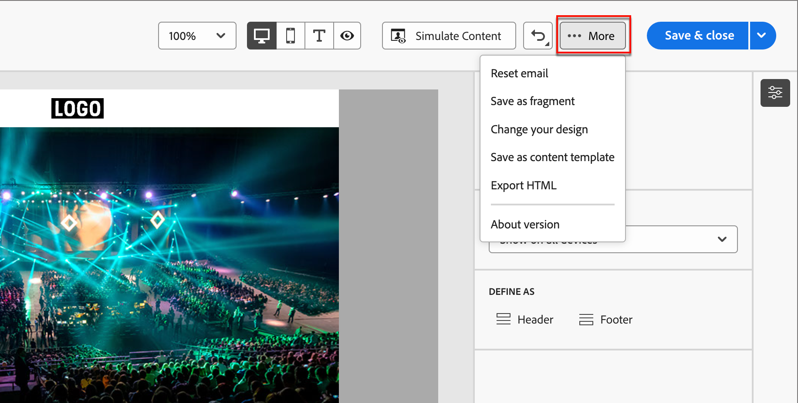

# メールメッセージの作成

ジャーニーアクションノード [&#128279;](./add-email.md)にメールアセットを追加した後、メールメッセージのコンテンツを定義できます。

右側のパネルの「_[!UICONTROL 詳細]_」タブの「**[!UICONTROL メールコンテンツを編集]**」をクリックします。

{width="700" zoomable="yes"}

このアクションにより、電子メールデザインツールが起動し、次のオプションから電子メールのデザイン方法を選択できます。

* ビジュアルデザインインターフェイスを使用して[&#x200B; メールをゼロからデザイン &#x200B;](#design-your-email-from-scratch)。

* ファイルまたは .zip フォルダーから[既存の HTML コンテンツを読み込み](#import-existing-html-content)ます。

* [&#x200B; ビルトインまたはカスタムのメールテンプレートのリストから既存のテンプレート &#x200B;](#select-a-template)を選択します。

メールコンテンツを作成してパーソナライズした後、コンテンツを書き出して検証または後で使用できます。 「**[!UICONTROL HTMLを書き出し]**」をクリックして、コンテンツをHTMLとアセットを含む.zip ファイルとして保存します。

>[!TIP]
>
>生成AIを活用したAdobe Journey Optimizer B2B editionのAI アシスタントを利用して、コンテンツを次のレベルに引き上げましょう。 AI アシスタントを利用すれば、電子メール全体やターゲットを絞ったテキストコンテンツを生成し、オーディエンスの共感を呼ぶ画像に対してAI アシスタントのレコメンデーションを得ることで、配信の効果を最適化することができます。 [詳細情報](./ai-assistant-emails.md)

## メールをゼロからデザイン {#design-from-scratch}

ビジュアルコンテンツデザイン機能を使用して、メールの構造とコンテンツを定義します。 シンプルなドラッグ&amp;ドロップ操作で構造コンポーネントを追加、移動させることで、再利用可能なメールコンテンツの形を数秒でデザインすることができます。

1. _[!UICONTROL テンプレートのデザイン]_ ホームページから、**[!UICONTROL 最初からデザイン]** オプションを選択します。

1. _[!UICONTROL メールを作成]_ ダイアログで、作成するメールコンテンツのタイプを選択します。

   * **[!UICONTROL テーマを使用]** – このオプションを選択すると、_テーマモード_&#x200B;で電子メールを作成できます。 このモードでは、定義済みのブランドテーマを使用して、コンテンツのオーサリングプロセスを効率化し、定義された標準に合わせてデザインを調整できます。

   * **[!UICONTROL 手動スタイル設定]** – このオプションを選択すると、_手動モード_&#x200B;で電子メールを作成できます。 このモードでは、空白のカンバスに追加するすべての構造およびコンテンツコンポーネントのスタイル設定を手動で設定します。

1. [構造とコンテンツ &#x200B;](./email-authoring.md#add-structure-and-content)をテンプレートに追加します。

1. [&#x200B; リンクのレビューと更新](#preview-and-edit-linked-urls)。

1. [電子メールをテスト &#x200B;](#check-and-test-the-email)。

<!--
 If needed, you can further personalize your email by clicking **[!UICONTROL Switch to code editor]** from the advanced menu. The code editor allows you to edit the email source code, such as adding tracking or custom HTML tags.

>[!CAUTION]
>
>You cannot revert back to the visual design space for this email after switching to the code editor. 
-->

コンテンツに問題がなければ、**[!UICONTROL 保存]**&#x200B;をクリックします。

## 既存のHTML コンテンツのインポート

{{$include /help/_includes/content-design-import.md}}

{width="500"}

>[!NOTE]
>
>`<table>` タグを HTML ファイルの最初のレイヤーとして使用すると、上部レイヤータグの背景や幅の設定などのスタイルが失われる可能性があります。

ビジュアルメールエディターツールを使用して、必要に応じてインポートしたコンテンツをパーソナライズできます。

## テンプレートを選択

{{$include /help/_includes/content-design-select-template.md}}

>[!NOTE]
>
> 保存されたテンプレートには、1つ以上のコンポーネントにガバナンス（コンテンツロック）設定が適用されている場合があります。 ビジュアルデザインスペースでは、管理されたテンプレートから電子メールを[作成](./email-authoring-governance.md)する際に、ロックされたコンポーネントに関するガイドラインが表示されます。

## 構造とコンテンツの追加 {#structure-content}

{{$include /help/_includes/content-design-components.md}}

### カスタム CSS を追加

独自のカスタム CSSをメールデザイン内で直接追加できます。 カスタム CSSを使用して、高度で特定のスタイルを適用し、コンテンツの外観をより柔軟に制御できます。 画像、ボタン、テキストなどのコンテンツコンポーネントを含める前に、このレベルの高いスタイル設定を追加することをお勧めします。

キャンバス内に少なくとも1つのコンテンツコンポーネントがある場合は、左側のナビゲーションツリーで&#x200B;**[!UICONTROL Body]** コンポーネントを選択して、カスタム CSS エディターにアクセスします。

>[!NOTE]
>
>メールメッセージがロックされたコンテンツ [&#128279;](./template-content-governance.md)を含む テンプレートを使用してデザインされている場合、コンテンツにカスタム CSSを追加することはできません。 ボタンのラベルが&#x200B;**[!UICONTROL カスタム CSS を表示]**&#x200B;に変わり、コンテンツに既に存在するカスタム CSS は読み取り専用になります。

{width="800" zoomable="yes"}

{{$include /help/_includes/content-design-custom-css.md}}

### フラグメントを追加

>[!NOTE]
>
>フラグメントは、メールコンテンツの&#x200B;_テーマモード_&#x200B;と&#x200B;_手動モード_&#x200B;の間で互換性がありません。 テーマが適用されているメールコンテンツでフラグメントを使用するには、フラグメントを&#x200B;_テーマモード_&#x200B;で作成する必要があります。

{{$include /help/_includes/content-design-use-fragments.md}}

メールが保存されると、要約で「_[!UICONTROL 使用者]_」タブを選択すると、フラグメントの詳細ページに表示されます。

### 画像アセットの追加

{{$include /help/_includes/content-design-assets.md}}

### レイヤー、設定、スタイルの移動

{{$include /help/_includes/content-design-navigation.md}}

### コンテンツのパーソナライズ

{{$include /help/_includes/content-design-personalization-email.md}}

>[!NOTE]
>
>_[!UICONTROL マイトークン]_&#x200B;がアカウントジャーニーに定義されている場合は、メールコンテンツにこれらのジャーニー固有のトークンを使用することもできます。 詳しくは、[電子メールのパーソナライゼーション用カスタムトークン &#x200B;](./personalization-my-tokens.md)を参照してください。

### リンクされたURL トラッキングを編集

{{$include /help/_includes/content-design-links.md}}

### ダークモードのスタイル設定の適用

_ダークモード_&#x200B;を使用して、電子メールクライアントでダークテーマの電子メール表示を確認します。 ダークモードまたはテーマを使用すると、サポートメールクライアントまたはアプリで、テキスト、ボタン、その他のビジュアル要素の背景が暗く、色が明るいメールを表示できます。 デザインキャンバスの右上で、セレクターを&#x200B;_ダークモード_ （）に変更します。 次に、ダークテーマが有効になっている場合に、サポートするメールクライアントが表示に使用する特定のカスタム設定をプレビューして定義します。

{width="700" zoomable="yes"}

ダークモードのスタイル設定とベストプラクティスについて詳しくは、[&#x200B; メールコンテンツのダークモード &#x200B;](./email-dark-mode.md)を参照してください。

### 表示オプション

ビジュアルメールエディターで利用可能な表示およびコンテンツ検証オプションを活用します。

* プリセットのズームオプション全体でコンテンツをズームイン/ズームアウトします。

* デスクトップ、モバイル、またはテキストのみ/プレーンテキストのコンテンツ表示を切り替えます。
   * デバイス間でコンテンツをプレビューするには、_表示_ アイコンをクリックします。
   * すぐに使えるデバイスのいずれかを選択するか、カスタムディメンションを入力してコンテンツをプレビューします。

## 詳細オプション

ビジュアルデザインスペースの上部にある「_[!UICONTROL その他…]_」メニューから、次の操作を実行できます。

{width="500"}

* **[!UICONTROL 電子メールをリセット]** – このオプションをクリックして、電子メールデザインキャンバスを空のスレートにクリアし、コンテンツの作成を再開します。
* **[!UICONTROL フラグメントとして保存]** – 電子メールのすべてまたは一部をフラグメントとして保存し、複数の電子メールまたは電子メールテンプレートで再利用できます。 フラグメントの名前と説明を指定し、使用可能なフラグメントのリストに保存します。
* **[!UICONTROL デザインを変更]** - _メールをデザイン_ ページに戻ります。 そこから、別のテンプレートを選択してデザインプロセスを再起動できます。 また、空白のキャンバス（_クラシックモード_）を使用するか、[&#x200B; ブランドテーマ &#x200B;](./brand-themes.md) （_テーマモード_）を使用して、コンテンツをゼロからデザインすることもできます。
* **[!UICONTROL コンテンツテンプレートとして保存]** – 複数のメールまたはメールテンプレートで再利用するメールテンプレートとしてメール本文を保存します。 テンプレートの名前と説明を入力し、保存したメールテンプレートのリストに保存します。
* **[!UICONTROL HTMLを書き出し]** - ビジュアルキャンバスのコンテンツを、zip ファイルとしてパッケージ化されたHTML形式でローカルシステムにダウンロードします。

## メールを確認およびテスト {#email-testing}

メッセージコンテンツを定義したら、テストプロファイルを使用してプレビューを表示し、プルーフを送信し、デスクトップとモバイルの縦横比でのレンダリングを確認できます。 パーソナライズされたコンテンツを挿入した場合は、テストプロファイルデータを使用して、このコンテンツがメッセージにどのように表示されるかをプレビューできます。

メールコンテンツを[&#x200B; プレビュー](./email-simulate-content.md)するには、**[!UICONTROL コンテンツをシミュレート]**&#x200B;をクリックし、テストプロファイルを選択して、人物プロファイルデータを使用してメッセージを確認します。

{width="700" zoomable="yes"}

その他のツールにアクセスして、メールコンテンツを検証およびレビューできます。

* [プルーフを送信](./email-simulate-content.md#send-proofs)
* [メールクライアントでのレンダリングのテスト](./email-test-rendering.md)
<!-- * Generate a spam report -->
